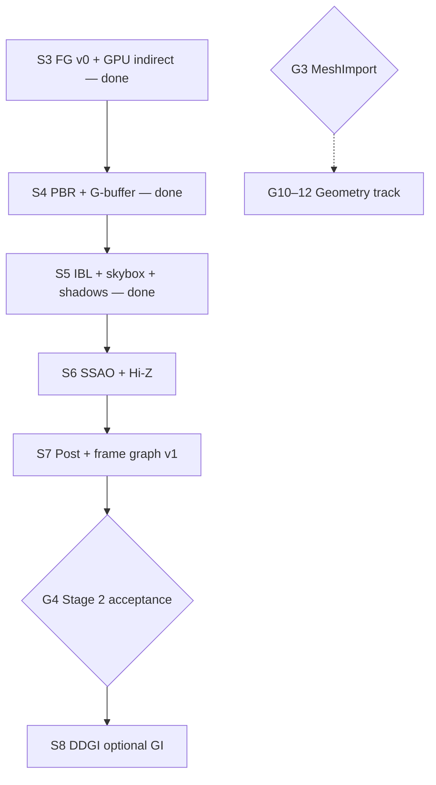

# Active Plan — SiriusEngine / VulkanDesktop

**Only open `[ ]` tasks** — queue, gates, hardening index.  
**Doc map:** `.cursor/rules/docs-roadmap-arch-sync.mdc` · **History:** [`Archived-Plan.md`](Archived-Plan.md) · **Staged S4+:** [`Wishlist.md`](Wishlist.md) · **Policies:** [`EngineArchitecture.md`](EngineArchitecture.md)

Done → move line to Archived-Plan; no `[x]` here.

**Roadmap pivot (2026-06):** S3 FG v0 + GPU indirect are closed. **Defer meshlet / mesh shader / GPU mesh tasks** to Wishlist **§ Geometry track (S10–S12)**. Active queue is **lighting + image-quality** on the existing `HybridDeferred` chain (PBR → shadows/IBL → SSAO/Hi-Z → post → optional DDGI).

---

## Queue

| # | Sprint | Focus | Epic / plan | Blocked by |
|---|--------|--------|-------------|------------|
| 1 | **S6** | SSAO + Hi-Z depth pyramid | Wishlist §S6 | S5 ✓ |
| 2 | **S7** | Post (tonemap/exposure/bloom) + FG builder v1 | hybrid-deferred §A · Wishlist §S7 | S4–S6 |
| 3 | **S8** | DDGI / GI preset (Stage 3) | [`ddgi-lighting-epic_Plan.md`](ddgi-lighting-epic_Plan.md) | **G4** |
| — | **S9** | Simulation | [`Wishlist.md`](Wishlist.md) §S9 | **G2** ✓ (parallel) |
| — | **S10–S12** | Meshlet → mesh shader → GPU mesh *(deferred)* | Wishlist § Geometry track | **G3** (S10 only) |

**Default benchmark scene:** `Data/Scenes/sponza.json` (vendored). CI smoke remains `stress.json`.

---

## Dependency graph (active track)

**Parallel (non-blocking):** S9 simulation · content-pipeline §B material hot reload · RHI WSI (Wishlist §S13).

---

## Gates

| Gate | Criteria | Unlocks |
|------|----------|---------|
| **G0** ✓ | `Verify-CI.ps1` green | M2 merges |
| **G1** ✓ | CPU vs GPU cull parity *(2026-06-10)* | S3 FG v0 |
| **G2** ✓ | P4 complete *(2026-06-11)* | S9 simulation |
| **G3** | [`content-pipeline_Plan.md`](content-pipeline_Plan.md) §A (MeshImport v0) | **S10** meshlets only *(not active queue)* |
| **G4** | Stage 2 acceptance — hybrid opaque **full PBR**, transparent forward, shadow + IBL + AO/post on benchmark scene; `ForwardLit`/`HybridDeferred` parity runbook | **S8** DDGI |

**G4 checklist (summary):** [`hybrid-deferred-epic_Plan.md`](hybrid-deferred-epic_Plan.md) Acceptance + S7 M6-style capture on Sponza.

Pass topology (current): [`EngineArchitecture.md`](EngineArchitecture.md) §7.

---

## Hardening index

| # | Landing | Where | Plan |
|---|---------|-------|------|
| 1 | FG v0 slices 4–6 (transparent, bindless, specular) | S3 ✓ | [`Archived/plans/s3-fg-s6-forward-parity_Plan.md`](Archived/plans/s3-fg-s6-forward-parity_Plan.md) |
| 5 | Vertical slice v0 | P4 ✓ | [`Archived/plans/p4-vertical-slice-v0_Plan.md`](Archived/plans/p4-vertical-slice-v0_Plan.md) |
| 18 | Bindless layout codegen | S7 / Backlog | shader-bindless-policy |
| 19 | MeshImport v0 | **S10** (G3) | content-pipeline §A |
| 24 | Material hot reload | Parallel | content-pipeline §B |
| 26–27 | P0 validation debt | P0 | SprintOutcomeValidation §P0 |
| 29 | Slice = product priority | P4 ✓ | archived P4 plan |
| 41 | WSI maintenance1 | S13 | vulkan-rhi-hardening §RHI-D |

**#2–17, 20–25, 30–40, 42–43 closed** — [`Archived-Plan.md`](Archived-Plan.md).

**Bindless maint (still applies):** [`shader-bindless-policy_Plan.md`](Archived/plans/shader-bindless-policy_Plan.md) §Maintenance contract before changing scene passes / bindless / lit shaders.

**Validation:** [`SprintOutcomeValidation.md`](SprintOutcomeValidation.md) (S4–S13 + G4).

---

## Closed (pointer only)

P0–P4, P1–P2 RHI, S0–S3 → [`Archived-Plan.md`](Archived-Plan.md) · design logs → [`Archived/plans/`](Archived/plans/)
