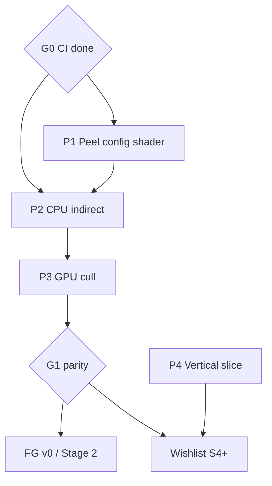

# Active Plan — SiriusEngine / VulkanDesktop

**Executable roadmap only** — open `[ ]` tasks, gates, queue.  
**Architecture (diagrams + locked policies):** [`EngineArchitecture.md`](EngineArchitecture.md) · **History:** [`Archived-Plan.md`](Archived-Plan.md) · **Deferred:** [`Wishlist.md`](Wishlist.md)

**Hygiene:** complete tasks → move line to Archived-Plan; no `[x]` here.

---

## Doc split (avoid duplicate maintenance)

| Owns | Document |
|------|----------|
| Layer diagrams, descriptor/lighting **policy**, anti-patterns | [`EngineArchitecture.md`](EngineArchitecture.md) |
| **Phases P0–P4**, gates, hardening index, `[ ]` checklists | **This file** |
| Stage 1 golden / perf runbook | [`forward-stage1.md`](forward-stage1.md) |
| Stage 2–3 epic breakdown | `hybrid-deferred` / `ddgi` epic plans |
| Implementation steps for large work | `Docs/*_Plan.md` when vibe task starts |

**Sync rule:** new **locked policy** → update Architecture + task here. Task wording / ordering only → this file alone.

---

## How to read

| Need | Section |
|------|---------|
| Next work | [Recommended queue](#recommended-queue) |
| Review item → action | [Hardening index](#hardening-index-32-items) |
| Big design | Linked `*_Plan.md` |
| **Full S3–S8 sprint checklists** | [Wishlist.md](Wishlist.md) — staged until gates open |
| S4+, DDGI, experiments | Wishlist + [gates](#unlock-gates) |

---

## Recommended queue

| Order | Phase | Focus |
|-------|-------|--------|
| 1 | **P1** | Peel, config instance, bindless decision |
| 3 | **P2** | CPU indirect + record/cull hygiene |
| 4 | **P3** | M2 GPU cull + automated parity |
| 5 | **P4** | Vertical slice (objective + restart) |
| *gate* | — | FG v0 / Stage 2 / Wishlist |

---

## Unlock gates

| Gate | Criteria | Unlocks |
|------|----------|---------|
| **G0** | `Scripts/Verify-CI.ps1` green (build + shader drift + GfxTests) — see [`Archived/plans/ci-verification_Plan.md`](Archived/plans/ci-verification_Plan.md) | M2 merges |
| **G1** | Automated CPU vs GPU cull parity | FG v0; [`hybrid-deferred-epic_Plan.md`](hybrid-deferred-epic_Plan.md) §A |
| **G2** | P4 complete | S8 sim — [`Wishlist.md`](Wishlist.md) |
| **G3** | [`content-pipeline_Plan.md`](content-pipeline_Plan.md) § A | S4 meshlets |
| **G4** | Stage 2 acceptance | Stage 3 DDGI |

Lighting pass topology (diagram): [`EngineArchitecture.md`](EngineArchitecture.md) §7.

---

## Hardening index (32 items)

| # | Landing | Phase | Plan |
|---|---------|-------|------|
| 1 | M2 only; FG v0 after G1 | P3 | [`render-m2-prep_Plan.md`](render-m2-prep_Plan.md) |
| 2 | GHA MSBuild + shader compile | P0 ✓ | [`Archived/plans/ci-verification_Plan.md`](Archived/plans/ci-verification_Plan.md) |
| 3 | Scene CPU out of `Vk_Core` | P1 ✓ | [`Archived/plans/vk-core-world-peel_Plan.md`](Archived/plans/vk-core-world-peel_Plan.md) |
| 4 | S4–S8 frozen in Wishlist | — | [`Wishlist.md`](Wishlist.md) |
| 5 | Vertical slice = 3 tasks | P4 | § P4 |
| 6 | ImGui out of `DrawFrame` | P1 ✓ | vk-core-world-peel §2 (archived) |
| 7 | Config instance not globals | P1 | [`config-platform-hardening_Plan.md`](config-platform-hardening_Plan.md) |
| 8 | `Vk_*Context` not `friend` | P1 ✓ | vk-core-world-peel (archived) |
| 9 | `WorldState` in Application | P1 ✓ | vk-core-world-peel §1 (archived) |
| 10 | `demoRotate: false` default | P2 | render-m2-prep § D |
| 11 | No per-draw `std::string` in record | P2 | render-m2-prep § C |
| 12 | `myIndexCount` on mesh | P2 | render-m2-prep § B |
| 13 | CPU `DrawIndexedIndirect` + template SSBO | P2 | render-m2-prep § A |
| 14 | Bindless: dogfood or defer | P1 | [`shader-bindless-policy_Plan.md`](shader-bindless-policy_Plan.md) |
| 15 | One record path semantics | P1 | shader-bindless-policy |
| 16 | Benchmark vsync off | P0 ✓ | ci-verification § D (archived) |
| 17 | Freeze perm until hybrid pass 2 | P1 | shader-bindless-policy |
| 18 | Bindless layout codegen | Wishlist | shader-bindless-policy |
| 19 | MeshImport v0 | Wishlist | [`content-pipeline_Plan.md`](content-pipeline_Plan.md) |
| 20 | Required `assetRoot` | P0 ✓ | ci-verification § B (archived) |
| 21 | `lodEnabled` false default | P2 | render-m2-prep § E |
| 22 | Unit tests SoA + cull | P0 ✓ | ci-verification § E (archived) |
| 23 | AABB + depth bucket fix | P2 | render-m2-prep § F |
| 24 | Material hot reload | Wishlist | content-pipeline § B |
| 25 | CI smoke + tests | P0 ✓ | ci-verification (archived) |
| 26 | Adversarial archived-claim verify | P0 | [`SprintOutcomeValidation.md`](SprintOutcomeValidation.md) § P0 |
| 27 | Peel metrics not checkbox count | P0 | SprintOutcomeValidation § P0 |
| 28 | DDGI etc → Wishlist | — | Wishlist |
| 29 | Slice = product priority | P4 | § P4 |
| 30 | Windows-only explicit | P1 | config-platform-hardening |
| 31 | Recoverable VK errors | P1 | config-platform-hardening § C |
| 32 | `--perf-log` JSONL | P0 ✓ | ci-verification § D (archived) |

---

## P0 — Verify & measure *(closed 2026-06-02)*

Completed — [`Archived-Plan.md`](Archived-Plan.md) § P0 · design log [`Archived/plans/ci-verification_Plan.md`](Archived/plans/ci-verification_Plan.md). **Next queue:** P1 below.

---

## P1 — Engine hygiene

| Track | Plan | Task |
|-------|------|------|
| Config | [`config-platform-hardening_Plan.md`](config-platform-hardening_Plan.md) | Config instance; VK recover |
| Shader | [`shader-bindless-policy_Plan.md`](shader-bindless-policy_Plan.md) | Bindless decision; freeze perm |

**Peel track (closed 2026-06-02):** [`Archived/plans/vk-core-world-peel_Plan.md`](Archived/plans/vk-core-world-peel_Plan.md) — WorldState in App; ImGui out of `DrawFrame`; `Vk_*Context`; 0 `friend`. **Remaining P1 acceptance:** config + shader tracks per their plans.

---

## P2 — Render path prep

**Plan:** [`render-m2-prep_Plan.md`](render-m2-prep_Plan.md)

- [ ] Draw template SSBO + CPU `DrawIndexedIndirect`
- [ ] `Gfx_Mesh::myIndexCount`
- [ ] RenderDoc tags: fixed buffer / `#ifdef`
- [ ] `demoRotate: false`; `lodEnabled: false` defaults
- [ ] Tighter AABB; depth bucket from bounds center

---

## P3 — M2 GPU cull

**Plans:** render-m2-prep (GPU), ci-verification (parity)  
**Not in scope:** FG v0, MT v1, Stage 2 passes

- [ ] AABB + draw template SSBO (sync SoA)
- [ ] Compute cull → indirect buffer
- [ ] GPU indirect record; no per-object CPU `vkCmdDraw*`
- [ ] Optional compaction
- [ ] **Automated parity** — gate G1
- [ ] LOD GPU subset parity when `lodEnabled`

---

## P4 — Vertical slice v0

- [ ] Play/benchmark scene + verified assets
- [ ] One objective with win/lose feedback
- [ ] Restart without process exit

---

## Lighting & epics (reference)

| Stage | Doc | When |
|-------|-----|------|
| 1 Forward | [`forward-stage1.md`](forward-stage1.md) | Closed |
| 2 Hybrid | [`hybrid-deferred-epic_Plan.md`](hybrid-deferred-epic_Plan.md) | After G1 |
| 3 DDGI | [`ddgi-lighting-epic_Plan.md`](ddgi-lighting-epic_Plan.md) | After G4 |

---

## Completed

**S0, S1, S2** → [`Archived-Plan.md`](Archived-Plan.md)

## Related

| Doc | Role |
|-----|------|
| [`EngineArchitecture.md`](EngineArchitecture.md) | Diagrams + locked policies |
| [`Wishlist.md`](Wishlist.md) | **Full S3–S8 + Parallel + Backlog** (staged); promote via gates |
| [`SprintOutcomeValidation.md`](SprintOutcomeValidation.md) | Close-out runbook |
| [`README.md`](README.md) | Docs index |

**Implementation plans:** `ci-verification` (archived), `vk-core-world-peel` (archived), `render-m2-prep`, `shader-bindless-policy`, `config-platform-hardening`, `content-pipeline`.

---

*S3–S8 sprint detail: [`Wishlist.md`](Wishlist.md) (restored from pre-trim Active-Plan). P0–P4 here = near-term execution queue only.*
