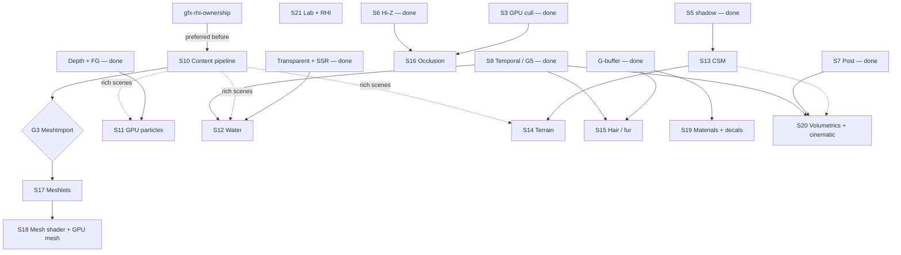

# Active Plan — SiriusEngine / VulkanDesktop

**Only open `[ ]` / queue / gates.** Detail tasks: [`Wishlist.md`](Wishlist.md).  
**Doc map:** `.cursor/rules/docs-roadmap-arch-sync.mdc` · **History:** [`Archived-Plan.md`](Archived-Plan.md) · **Policies:** [`EngineArchitecture.md`](EngineArchitecture.md)

Done → Archived-Plan stub; no `[x]` here.

**Pivot (2026-07):** Render-first. **Next: finish Gfx/Rhi ownership** (retire `Vk_*_Record` + pass Init) before resuming **S10** content pipeline. Then particles → water → CSM → terrain → hair → scale/geometry.

---

## Queue (execution order)

| # | Sprint | Focus | Blocked by | Unlocks |
|---|--------|--------|------------|---------|
| **1** | **gfx-rhi-ownership** | FG Begin/End peel → Rhi create → Init→Gfx → delete facades/`Vk_*Pass` Init | gfx-rhi E0–E5 ✓ | Clean Gfx ownership; unblocks lab peel debt |
| **2** | **S10** | **Content pipeline** (MeshImport + hot reload) | — *(after #1 preferred)* | **G3**; rich test scenes for S11+ |
| **3** | **S11** | **GPU particles** | Depth + FG ✓ | Soft FX / emitters |
| **4** | **S12** | **Water** | Transparent ✓, SSR ✓; S9 ✓ | Reflections / refraction |
| **5** | **S13** | Cascaded shadows | S5 ✓ | Outdoor; **S14** terrain |
| **6** | **S14** | **Terrain** | S13 CSM preferred | Large outdoor scenes |
| **7** | **S15** | **Hair / fur** | G-buffer ✓; S9 ✓ | Strand/card look; early aniso |
| **8** | **S16** | Occlusion cull + compaction | S6 Hi-Z ✓, S3 cull ✓ | Dense scenes |
| **9** | **S17** | Meshlets | **G3** | S18 |
| **10** | **S18** | Mesh shader + GPU mesh | S17 | Full GPU-driven path |
| **11** | **S19** | Advanced materials + decals | G-buffer ✓ | Clearcoat / transmission / decals |
| **12** | **S20** | Volumetrics + cinematic post | S7 ✓, **G5** ✓ | Mood / DOF / MB |
| — | **S21** | Render lab + RHI WSI *(parallel; ownership epic pulled out)* | — | Measurement / WSI |
| — | **P-Sim** | Physics / anim / AI *(parallel)* | **G2** ✓ | Slice interactivity |

**Default benchmark:** `Data/Scenes/sponza.json` until S10 close; then `Data/Scenes/bistro_interior.json` (+ `Config/engine.bistro.json`). **CI smoke:** `stress.json` (unchanged).

---

## Dependency graph

**Why ownership #1 now:** Finish Gfx/Rhi so HybridDeferred does not keep permanent `Vk_*_Record` / Init dual ownership; then resume S10 for rich scenes. Meshlets still wait on **G3** (S17).

**Parallel OK:** S11 ∥ S13 after S10; S16 ∥ S15; S21 lab ∥ anything (ownership epic is **queue #1**, not “later maint”); P-Sim ∥ anything.

---

## Parallel architecture epic

| Epic | Focus | Plan | Blocks S10? |
|------|--------|------|-------------|
| **gfx-rhi-ownership-completion** | O1 FG Begin/End · O2 Rhi create · O3 Init→Gfx · O4 delete `Vk_*_Record` · O5 retire `Vk_*Pass` Init | [`gfx-rhi-ownership-completion_Plan.md`](gfx-rhi-ownership-completion_Plan.md) | **Yes — preferred before S10** |
| ~~**gfx-rhi-pass-migration**~~ | Opaque `Rhi/` + Gfx Records via Rhi | [`Archived/plans/gfx-rhi-pass-migration_Plan.md`](Archived/plans/gfx-rhi-pass-migration_Plan.md) | — closed 2026-07-22 |

**Open `[ ]` (ownership epic):**

- [x] **O1** — Peel `Vk_FrameGraph` GBuffer/hybrid Begin/End into Gfx (former E4.6f)
- [x] **O2** — Rhi create surface (pipeline / image / RP-FB / descriptor update) *(compute path + descriptor image update; graphics RP/FB create still adopt)*
- [ ] **O3** — Move pass Init into `Gfx_*Pass` via Rhi *(DepthPyramid Init uses Rhi from RC; Gfx Init API still pending)*
- [ ] **O4** — Delete `Vk_*_Record.cpp` facades on HybridDeferred path
- [ ] **O5** — Retire empty/`Init`-only `Vk_*Pass.cpp` shells + Architecture migration note

## Gates

| Gate | Criteria | Unlocks |
|------|----------|---------|
| **G0** ✓ | `Verify-CI.ps1` green | Merges |
| **G1** ✓ | CPU vs GPU cull parity | (historical) |
| **G2** ✓ | P4 vertical slice v0 | P-Sim |
| **G3** | [`content-pipeline_Plan.md`](content-pipeline_Plan.md) §A MeshImport v0 + ≥1 rich multi-mesh scene | **S17** meshlets; preferred dogfood for S11–S15 |
| **G4** ✓ | Stage 2 hybrid acceptance | (historical) |
| **G5** ✓ | S9: MV + TAA v0.5; shared temporal consumers; stress smoke green | Prefer before S12 polish / S20 |

Pass topology: [`EngineArchitecture.md`](EngineArchitecture.md) §7.

---

## Hardening index (open only)

| # | Landing | Where | Plan |
|---|---------|-------|------|
| 18 | Bindless layout codegen | S21 | shader-bindless-policy maint |
| 19 | MeshImport v0 | **S10** → **G3** | content-pipeline §A |
| 24 | Material hot reload | **S10** | content-pipeline §B |
| 41 | WSI maintenance1 | **S21** | vulkan-rhi-hardening §RHI-D |

**Bindless maint:** [`shader-bindless-policy_Plan.md`](Archived/plans/shader-bindless-policy_Plan.md) before changing scene passes / bindless / lit shaders.

**Validation:** [`SprintOutcomeValidation.md`](SprintOutcomeValidation.md).

---

## Closed (pointer)

S0–S8, G4, RHI-E4, P0–P4 → [`Archived-Plan.md`](Archived-Plan.md) · [`Archived/plans/`](Archived/plans/)
