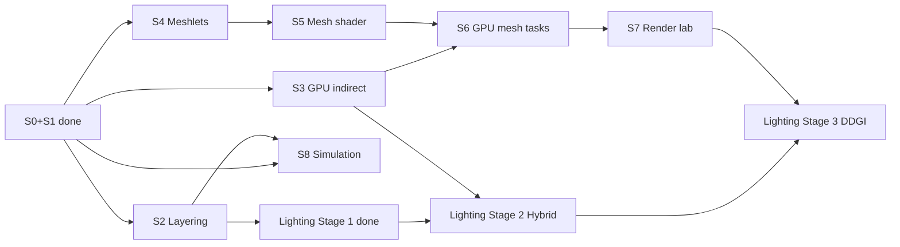
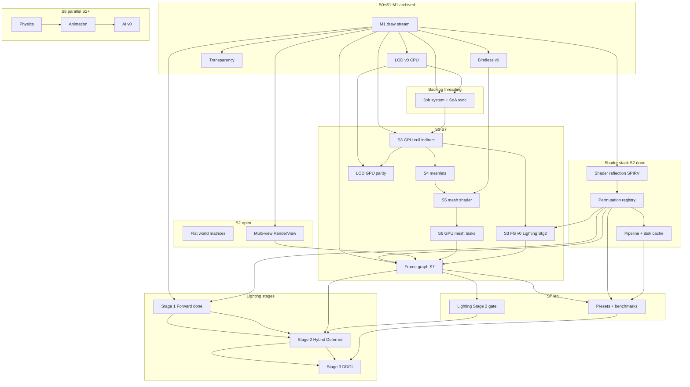

# Active Plan — SiriusEngine / VulkanDesktop

Open sprint work: **[ ] tasks only**. Completed lines: [Archived-Plan.md](Archived-Plan.md). Architecture: [EngineArchitecture.md](EngineArchitecture.md). Index: [README.md](README.md). Task logs: WIP at `Docs/{TaskName}_*`; closed under [Archived/plans/](Archived/plans/).

**Hygiene:** On task complete, **move the line** to [Archived-Plan.md](Archived-Plan.md) (sprint tag + note). No [x] here.

**Scope:** Open sprint sections **S2–S8** only. **S0** / **S1 (M1)** closed — see [Archived-Plan.md](Archived-Plan.md) § S0 / § S1.

---

## How to read this document

### Two axes — do not confuse them

| Axis | Symbol | What it is | Example |
|------|--------|------------|---------|
| **Sprint** | **S0–S8** | Time-boxed engineering milestones (M1–M6). Open **`[ ]`** tasks: **[S2](#s2--engine-layering--hygiene)** … **[S8](#s8--simulation-physics--animation--ai)**. **S0/S1** done → [Archived-Plan](Archived-Plan.md). | **S2** = lifecycle, scene, multi-view — **not** deferred lighting. |
| **Lighting stage** | **Stage 1–3** | Cross-sprint **lighting epics** (forward → hybrid deferred → DDGI). Work is **split across sprints**; see [§ Lighting evolution](#lighting-evolution-cross-sprint). | **Stage 2** = Hybrid Deferred epic — primary window **S3–S7**, **not** “do it all in S2”. |

**Rule:** If a line says **Stage 2**, it means the **lighting epic**, not sprint **S2**. Sprint tags in archives look like `[S2]`; lighting docs say **Stage 2 (Hybrid Deferred)**.

### Open work index *(by sprint — single source for `[ ]`)*

| Sprint | Milestone | Open `[ ]` (summary) | Section |
|--------|-----------|----------------------|---------|
| **S0** | — | *(closed — [Archived-Plan](Archived-Plan.md) § S0)* | — |
| **S1** | M1 | *(closed — [Archived-Plan](Archived-Plan.md) § S1)* | — |
| **S2** | — | Flat world matrices; **multi-view** (4 items) | [S2](#s2--engine-layering--hygiene) |
| **S3** | M2 | GPU cull/indirect (6) + **Lighting Stage 2** FG v0 (1); M2 acceptance | [S3](#s3--gpu-driven-indirect-milestone-m2) |
| **S4** | M3 | Meshlet pipeline (5); M3 acceptance | [S4](#s4--meshlet-geometry-milestone-m3) |
| **S5** | M4 | Mesh shader path (5); M4 acceptance | [S5](#s5--mesh-shader-pipeline-milestone-m4) |
| **S6** | M5 | GPU mesh tasks (5); M5 acceptance | [S6](#s6--gpu-driven-mesh-tasks-milestone-m5) |
| **S7** | M6 | FG, presets/bench, features, docs; **Lighting Stage 2/3 gates** | [S7](#s7--rendering-lab--hardening-milestone-m6) |
| **S8** | — | Physics → Animation → AI (10); S8 acceptance | [S8](#s8--simulation-physics--animation--ai) |
| **Parallel** | — | Vertical slice (gameplay/content) | [Parallel](#parallel--vertical-slice) |
| **Backlog** | — | CI, threading, polish | [Backlog](#backlog-deferred--unscheduled) |

**Lighting epics** do not have their own `[ ]` checklist here — open work is filed under the sprint rows above. Epic breakdown: [§ Lighting evolution](#lighting-evolution-cross-sprint).

### Recommended next *(sprint S2 queue)*

| Priority | Task | Sprint | Why now |
|----------|------|--------|---------|
| 1 | **S3 GPU cull + indexed indirect** (`VkDrawIndexedIndirectCommand`) | **S3** | Primary M2 milestone; geometry path for later meshlets and Stage 2 spikes. |
| 2 | **FG v0 spike** (`GBufferOpaque -> ClusterBuild -> DeferredLighting`) | **S3** | De-risks S7 full frame graph and Stage 2 lighting topology. |
| — | **Lighting Stage 2 (Hybrid Deferred)** | **S3–S7** | Start after S2 multi-view (or in parallel with S3 M2 only for isolated spikes). **Not** an S2 sprint deliverable. |

---

## North star

| Pillar | Done when |
|--------|-----------|
| **Engine** | Deterministic startup; stable shader/asset pipeline; clear module boundaries; config + data on disk. |
| **Data plane** | SoA columns, stable handles, render **extract** → flat draw/meshlet buffers (no hot-path scene-graph walks). |
| **Render target** | **GPU-driven** visibility/draw generation + **mesh shader** raster (Task optional); VS+indirect **fallback** when unsupported. |
| **Lighting path** | **Stage 1** full Forward baseline → **Stage 2** full PBR (**opaque deferred/clustered + transparent forward**) → **Stage 3** optional DDGI on hybrid path. |
| **Product slice** | One playable scene + simple loop + fail-soft logging (no silent black screen). |
| **Rendering lab** | Presets, CPU/GPU timing, optional captures; features toggle without breaking sort keys. |
| **Evidence** | Benchmark scene + runbook; reproducible numbers on a fresh machine. |

---

## Sprint map

| Sprint | Milestone | Primary outcome |
|--------|-----------|-----------------|
| **S0** | — | *(done)* Toolchain + resources — [Archived-Plan](Archived-Plan.md) § S0 |
| **S1** | **M1** | *(done)* CPU draw stream — [Archived-Plan](Archived-Plan.md) § S1 |
| **S2** | — | Layering: lifecycle, config, `Vk_Core` peel; scene JSON; **multi-view**; shader stack. |
| **S3** | **M2** | **GPU-driven** frustum cull → **indexed indirect** (VS/FS); optional **Lighting Stage 2** FG v0 spike. |
| **S4** | **M3** | **Meshlet** offline build + GPU tables + debug viz. |
| **S5** | **M4** | **Mesh shader** pipeline (Mesh + Fragment; Task deferred). |
| **S6** | **M5** | **GPU-driven mesh tasks** + VS/indirect fallback. |
| **S7** | **M6** | Frame graph, presets, benchmarks, feature experiments; **Lighting Stage 2/3** acceptance gates. |
| **S8** | — | Simulation: Physics → Animation → AI (parallel after S2). |

**Parallel tracks** (see [dependency graph](#task-dependency-graph)):

- [Vertical slice](#parallel--vertical-slice) — after S1 M1 *(done)*; does not block render spikes.
- After **S2 scheduler**: [S8 — Simulation](#s8--simulation-physics--animation--ai).
- **Shader stack** (reflection → permutation → cache): completed in **S2** — unblocks **S7** permutations.
- **Multi-view**: primary **S2**; extended FG multi-target in **S7**.
- **Frame graph (full)**: **S7** (optional FG v0 spike in **S3** for Lighting Stage 2).
- **Lighting evolution**: [§ Lighting evolution](#lighting-evolution-cross-sprint) — tasks filed under **S3 / S7** (and completed **S2** groundwork for Stage 1).

---

## Lighting evolution (cross-sprint)

**Not a sprint.** These are **lighting stages** (product/renderer evolution). Every open task still lives under a **Sprint §** above.

| Lighting stage | Epic doc | Status | Sprint home for **open** work |
|----------------|----------|--------|-------------------------------|
| **Stage 1** — Forward baseline | [`forward-rendering-epic_Plan.md`](forward-rendering-epic_Plan.md) | **Closed** 2026-06-02 | — (handoff: [`forward-stage1.md`](forward-stage1.md)) |
| **Stage 2** — Hybrid Deferred + PBR | [`hybrid-deferred-epic_Plan.md`](hybrid-deferred-epic_Plan.md) | Planned | **S3** (FG v0 spike, geometry path) · **S7** (full FG, G-buffer, clustered, PBR, parity gate) |
| **Stage 3** — Optional DDGI | [`ddgi-lighting-epic_Plan.md`](ddgi-lighting-epic_Plan.md) | Planned | **S7+** (after Stage 2 gate) |

**Naming (canonical):**

- **Lighting stage:** `Stage 1 (Forward Baseline)`, `Stage 2 (Hybrid Deferred + PBR)`, `Stage 3 (Optional DDGI)`
- **Preset:** `ForwardLit`, `HybridDeferred`
- **Pass chain (Stage 2+):** `GBufferOpaque -> ClusterBuild -> DeferredLighting -> ForwardTransparent -> Post`

### Stage 2 epic → sprint placement

| Epic work (hybrid-deferred §) | Filed under sprint |
|------------------------------|-------------------|
| A. Frame graph + pass topology (minimal) | [S3](#s3--gpu-driven-indirect-milestone-m2) — FG v0 line |
| A–D. Full FG, G-buffer, clustered, PBR, parity | [S7](#s7--rendering-lab--hardening-milestone-m6) — Frame graph, Stage 2 gate, presets |
| Prerequisites (permutation, Stage 1 contracts, forward path) | **S2** — done → [Archived-Plan.md](Archived-Plan.md) |

**Dependencies:** Stage 1 handoff · **S2** multi-view (recommended before full FG) · **S2** shader permutation/cache (done) · **S3** M2 draw path remains geometry source for Stage 2.

---

## Task dependency graph

*Arrows = **must complete first** (or sign off decision doc). Tasks in a sprint are not strictly serial unless noted.*

| Work stream | Depends on | Unblocks | **Sprint** home |
|-------------|------------|----------|-----------------|
| **S0 / S1 (closed)** | — | All render work | [Archived-Plan](Archived-Plan.md) § S0, § S1 — SoA, extract, batch, transparency, LOD v0, bindless, **M1** |
| **Shader reflection / perm / cache** | S0 SPIR-V | S7 presets | S2 *(done)* → S7 |
| **Flat world matrices** | scene-load | Hierarchy later | **S2** |
| **Multi-view** | M1 *(archived)* | S7 FG per-view | **S2** → S7 |
| **GPU cull / indirect** | M1 buffers | M2, mesh path | **S3** |
| **FG v0 (Lighting Stage 2 entry)** | M1, S2 perm | Full FG in S7 | **S3** |
| **Frame graph (full)** | M1 record, multi-view | Shadows, post, Stage 2 body | **S7** |
| **Lighting Stage 1 (Forward)** | M1, S2 shader | Stage 2 handoff | *(done)* — [Archived-Plan](Archived-Plan.md), [`forward-stage1.md`](forward-stage1.md) |
| **Lighting Stage 2 (Hybrid)** | Stage 1, FG, S3 geometry | Stage 3, production lighting | **S3** spike + **S7** main |
| **Lighting Stage 3 (DDGI)** | Stage 2 gate, S7 bench | GI presets | **S7+** |
| **Physics → Animation → AI** | S2 scheduler, SoA | Vertical slice | **S8** |
| **Multi-threading** | M1 SoA, S2 scheduler | Parallel cull/LOD | Backlog |

**Parallel track:** [Vertical slice](#parallel--vertical-slice) — gameplay; **S8 AI** enhances enemies; does not block S3–S6.

---

## S2 — Engine layering & hygiene

*Lifecycle, config, `Vk_Core` peel, scene JSON, shader stack, **multi-view**. Does **not** include Lighting Stage 2 (hybrid deferred) — see [Lighting evolution](#lighting-evolution-cross-sprint).*
**Validation:** [`SprintOutcomeValidation.md`](./SprintOutcomeValidation.md) (S2 section)

Completed S2 logs: [`Archived/plans/`](Archived/plans/) · [`Archived-Plan.md`](Archived-Plan.md) `[S2]` lines.

### Open tasks — scene

*Design: [`Archived/plans/scene-load_Plan.md`](Archived/plans/scene-load_Plan.md).*

### Open tasks — multi-view

*Deps: M1 draw stream, dynamic viewport (wired 2026-06-01). Unblocks **S7** frame graph. Prior work reverted 2026-06-01 — [`Archived/plans/multi-view_Plan.md`](Archived/plans/multi-view_Plan.md).*

### Cleared in S2 *(no `[ ]` here)*

- `Vk_Core` decomposition phase 2, gfx–vk decoupling, scene-load A–D, shader reflection/permutation/cache, Stage 1 forward epic (Lighting **Stage 1**), input/config/lifecycle — [Archived-Plan.md](Archived-Plan.md).

---

## S3 — GPU-driven indirect (milestone M2)

*Prove GPU visibility before mesh shaders.*
**Validation:** [`SprintOutcomeValidation.md`](./SprintOutcomeValidation.md) (S3 section)

### Open tasks — M2 geometry *(sprint-owned)*

- [ ] Per-instance AABB + draw template in SSBO (sync with SoA).
- [ ] Compute: frustum cull → visible indices + `VkDrawIndexedIndirectCommand` buffer.
- [ ] `vkCmdDrawIndexedIndirect` / multi-draw indirect; CPU record cost ~flat.
- [ ] Optional GPU compaction pass for dense visible list.
- [ ] **Parity test:** GPU path vs CPU cull on fixed camera — `EngineArchitecture.md` §5.5.
- [ ] **LOD GPU:** cull/indirect uses S1 LOD table; subset parity vs CPU — *deps: S1 LOD v0*.

### Open tasks — engineering hygiene & CI *(moved from backlog)*

- [ ] GitHub Actions: `CompileShader_Glslc.bat` CI.
- [ ] CI smoke: init + one frame headless/offscreen.
- [ ] Document or eliminate runtime **working-directory** dependency.
- [ ] `LNK4098` linker warning; safe `size_t`→`uint32_t` casts.
- [ ] **[S1+] Cull/sort depth metric:** opaque `depthBucket` from bounds eye-space Z; tighter world AABB.
- [ ] **Multi-threading v1:** thread model + frame SoA double-buffer — *deps: S1 SoA (archived), S2 scheduler*.

### Open tasks — Lighting Stage 2 entry *(cross-sprint; epic §A spike)*

- [ ] **FG v0:** minimal frame-graph path `GBufferOpaque -> ClusterBuild -> DeferredLighting` on opaque path (no full **S7** infra) — *deps: M1 draw stream, S2 permutation (done)*.

### M2 acceptance

- [ ] Flying camera; GPU decides draw count; CPU does not loop per-object `vkCmdDraw*`.

---

## S4 — Meshlet geometry (milestone M3)

**Validation:** [`SprintOutcomeValidation.md`](./SprintOutcomeValidation.md) (S4 section)

### Open tasks

- [ ] Choose meshlet builder (e.g. meshoptimizer) + documented cluster params.
- [ ] Asset format: meshlet table + vertex/index views + per-meshlet bounds (import or offline step).
- [ ] Optional **meshlet LOD** cluster rules documented — *deps: S1 LOD asset chains*.
- [ ] Upload global vertex/index + meshlet metadata buffers.
- [ ] Debug draw: meshlet bounds (VS or compute viz) on test mesh.

### M3 acceptance

- [ ] At least one production mesh displays correct meshlet segmentation.

---

## S5 — Mesh shader pipeline (milestone M4)

*Vulkan 1.2 + `VK_EXT_mesh_shader`; no Task shader in v1.*
**Validation:** [`SprintOutcomeValidation.md`](./SprintOutcomeValidation.md) (S5 section)

### Open tasks

- [ ] Device capability probe: mesh shader features; log + graceful disable.
- [ ] Enable extensions; mesh + fragment layout aligned with bindless / material tables (S1).
- [ ] Shaders: `Mesh` (+ adapt `TriangleFrag_Lit.frag`) → `Shader_Generated/`; `materialIndex` from tables.
- [ ] `vkCreateGraphicsPipeline` mesh stages; payload reads meshlet + instance from SSBO.
- [ ] RenderDoc / validation capture checklist in docs.

### M4 acceptance

- [ ] Single-object mesh-shader path matches VS path for geometry/pass-contract parity (forward + hybrid G-buffer within agreed tolerance).

---

## S6 — GPU-driven mesh tasks (milestone M5)

**Validation:** [`SprintOutcomeValidation.md`](./SprintOutcomeValidation.md) (S6 section)

### Open tasks

- [ ] Compute: meshlet frustum cull (+ optional backface cone later).
- [ ] Compact visible meshlet list → indirect mesh-task buffer.
- [ ] `vkCmdDrawMeshTasksIndirectEXT`; mesh shader consumes compact list + instance table.
- [ ] **Fallback preset:** S3 VS + indirect when mesh shader unsupported; bindless-off → S1 batch path.
- [ ] Preset enum: `Traditional` / `GpuIndirect` / `MeshShader` / `FullGpuMesh`.
- [ ] **Multi-threading v2:** job system parallel cull/LOD/transform — *deps: MT v1, S1 LOD v0 (archived)*.

### M5 acceptance

- [ ] Multi-object scene; primary submission GPU-driven; CPU record stable across instance count.

---

## S7 — Rendering lab & hardening (milestone M6)

*Frame graph (full), presets, benchmarks, experiments. **Lighting Stage 2** main body and **Stage 2/3 gates** live here — not in sprint S2.*
**Validation:** [`SprintOutcomeValidation.md`](./SprintOutcomeValidation.md) (S7 section)

### Open tasks — Lighting acceptance gates *(Lighting stages, verified in S7)*

- [ ] **Lighting Stage 2 gate:** `GBufferOpaque + DeferredLighting` (clustered) opaque, `ForwardTransparent`, full PBR, `ForwardLit`/`HybridDeferred` parity — [`hybrid-deferred-epic_Plan.md`](hybrid-deferred-epic_Plan.md).
- [ ] **Lighting Stage 3 gate:** DDGI preset on/off parity, fallback, benchmark deltas — [`ddgi-lighting-epic_Plan.md`](ddgi-lighting-epic_Plan.md) — *after Stage 2 gate*.

### Open tasks — frame graph *(sprint S7)*

*Deps: M1 Record, **S2** multi-view, S2 permutation (done).*

- [ ] `framegraph_Plan.md`: pass/resource nodes, transient RT pool, import/export rules.
- [ ] `FrameGraphBuilder`: topological sort + barriers; hybrid chain (`GBufferOpaque`, `DeferredLighting`, `ForwardTransparent`, `Post`) + `ForwardLit` baseline.
- [ ] **Transparent pass** as FG node (reads depth) — *deps: S1 transparency (done)*.
- [ ] Preset toggles FG topology (shadow/post) without breaking sort keys.

### Open tasks — infrastructure

- [ ] Presets `Low / Base / High / Custom` + permutation subset (S2 registry).
- [ ] GPU timestamp queries + CPU p50/p95 logging.
- [ ] Standard benchmark procedure (scene, camera path, warmup, CSV/JSON).
- [ ] Screenshot capture keyed to preset + pose.
- [ ] RenderDoc expectations per preset; preset changelog.
- [ ] Benchmark: cold vs warm pipeline cache load (S2 cache, done).
- [ ] Shader reflection-driven **layout codegen** — follow-up to closed 2b JSON path.
- [ ] `VK_KHR_pipeline_binary` disk cache research — *deps: S2 pipeline cache (done)*.
- [ ] **[Multi-view] Instance slab dynamic partition:** replace static per-view split (`kMaxInstanceSlabEntries / viewCount`) with per-frame pre-count + prefix-sum offsets; keep overlap/overflow guards for each view.

### Open tasks — feature experiments *(prefer after FG)*

- [ ] MSAA vs post AA vs none.
- [ ] Shadow map (single cascade) — *deps: frame graph + shadow permutation*.
- [ ] IBL / environment upgrade.
- [ ] Tonemap / exposure modes.
- [ ] Bloom (optional).
- [ ] Validation-friendly toggles; graceful GPU feature degradation.
- [ ] GPU occlusion / hierarchical Z — *post-M5*.
- [ ] **Task shader** for mesh amplification — *post-M5*.

### Open tasks — documentation

- [ ] Engine overview diagram (modules + data flow).
- [ ] “How to add a rendering experiment” checklist.
- [ ] Troubleshooting matrix (seed: `Docs/Archived/notes-2026-05-22-shader-debug.md`).
- [ ] Third-party / SDK license inventory.
- [ ] Log rotation; domain-split logs; crash summary on failure.
- [ ] DDGI production tuning after **Lighting Stage 3** acceptance.

### M6 acceptance

- [ ] Frame graph drives hybrid path + at least one extra pass (shadow or tonemap) on benchmark scene.
- [ ] Two **RenderView**s or FG multi-target in runbook; `ForwardLit`/`HybridDeferred` switch without validation errors.

---

## S8 — Simulation (Physics → Animation → AI)

*Parallel after **S2** scheduler + M1 SoA. Does not block S3–S6.*
**Validation:** [`SprintOutcomeValidation.md`](./SprintOutcomeValidation.md) (S8 section)

### Open tasks — physics

- [ ] `physics_Plan.md`: library choice + collision layers.
- [ ] `PhysicsWorld::SimStep(fixed_dt)`; entity ↔ body mapping; no Vulkan in sim code.
- [ ] Write back SoA: `transform`, `bounds`.
- [ ] Scene JSON physics components; debug draw AABB.

### Open tasks — animation

- [ ] Skeleton import + clip playback v0.
- [ ] `AnimationSystem` before Extract: skin matrices → deform or CPU skinned path.
- [ ] Plan GPU skinning alignment with S5 (non-blocking for v0).

### Open tasks — AI

- [ ] Agent SoA columns: state, target, perception radius.
- [ ] v0 state machine or minimal BT (Idle / Chase / Flee); one enemy uses player position.
- [ ] Debug: ImGui agent state; optional tie to Parallel objective.

### S8 acceptance

- [ ] Dynamic props (physics); one skinned clip; one agent chases player in play scene.
- [ ] **Multi-threading v3 (optional):** render thread + command stream — *deps: S7 FG*.

---

## Parallel — Vertical slice

*After S1 M1 (done). Does not block S3–S6.*

### Open tasks — scene & content

- [ ] Primary play/benchmark scene in `Data/`.
- [ ] All referenced assets present or substitute with logged warnings.
- [ ] Optional second tiny scene for load smoke tests.

### Open tasks — gameplay

- [ ] One **objective** (reach marker / collect / survive / toggle lights).
- [ ] Win/lose or completion feedback (HUD or log).
- [ ] **Restart** without process exit.

### Open tasks — presentation

- [ ] HUD: FPS, frame time, **active render preset** name.
- [ ] Pause + frame advance (dev).

### Open tasks — engine hooks *(tie to S2)*

- [ ] Player controller contract (move, look, interact).
- [ ] Simple game state / mode stack (Play, Pause, Dev overlay).
- [ ] Event channel gameplay ↔ UI ↔ debug.

### Open tasks — simulation hooks *(tie to S8)*

- [ ] Interact / damage via physics overlap or ray — *deps: S8 Physics*.
- [ ] Enemy chase via **S8 AI** — *deps: S8 AI, Parallel objective*.

---

## Backlog (deferred / unscheduled)

- [ ] Editor, networking, non-Windows — see parking lot.

### Parking lot

- In-engine property editor (post slice; benefits from shader reflection).
- Cross-platform windowing (on product request).
- Navmesh / full behavior trees (post S8 AI v0).

---
