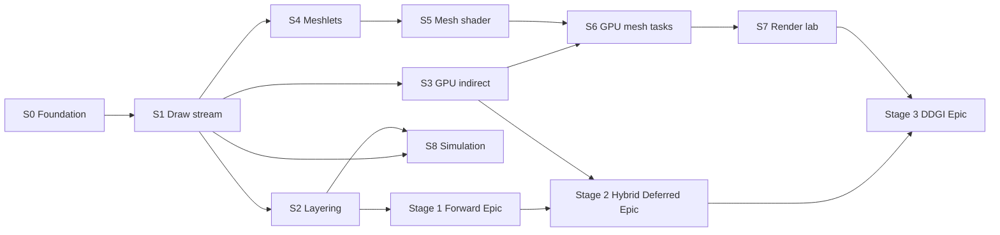
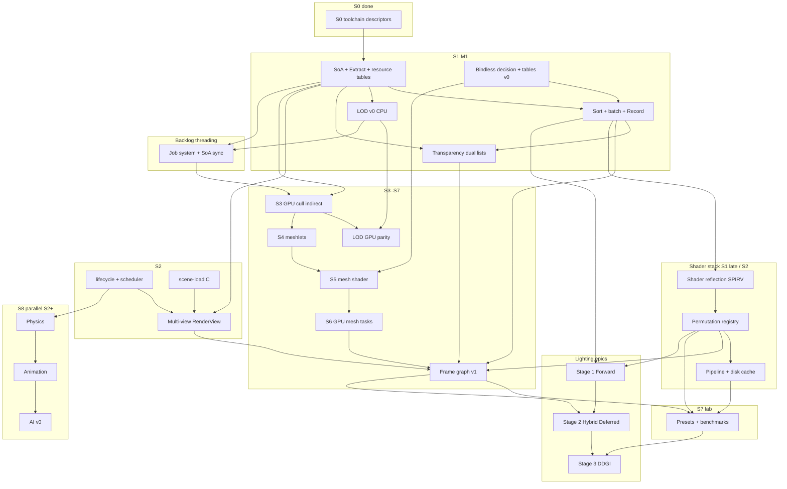

# Active Plan — SiriusEngine / VulkanDesktop

Open sprint work: **[ ] tasks only**. Completed lines: [Archived-Plan.md](Archived-Plan.md). Architecture: [EngineArchitecture.md](EngineArchitecture.md). Index: [README.md](README.md). Task logs: WIP at `Docs/{TaskName}_*`; closed under [Archived/plans/](Archived/plans/).

**Hygiene:** On task complete, **move the line** to [Archived-Plan.md](Archived-Plan.md) (sprint tag + note). No [x] here.

---

## North star

| Pillar | Done when |
|--------|-----------|
| **Engine** | Deterministic startup; stable shader/asset pipeline; clear module boundaries; config + data on disk. |
| **Data plane** | SoA columns, stable handles, render **extract** → flat draw/meshlet buffers (no hot-path scene-graph walks). |
| **Render target** | **GPU-driven** visibility/draw generation + **mesh shader** raster (Task optional); VS+indirect **fallback** when unsupported. |
| **Lighting path** | Stage 1 full Forward baseline → Stage 2 full PBR with **opaque deferred/clustered + transparent forward** → Stage 3 **optional DDGI** on hybrid path. |
| **Product slice** | One playable scene + simple loop + fail-soft logging (no silent black screen). |
| **Rendering lab** | Presets, CPU/GPU timing, optional captures; features toggle without breaking sort keys. |
| **Evidence** | Benchmark scene + runbook; reproducible numbers on a fresh machine. |

---

## Sprint map

| Sprint | Milestone | Primary outcome |
|--------|-----------|-----------------|
| **S0** | — | Toolchain + resources trustworthy (P0 blockers cleared). |
| **S1** | **M1** | CPU **draw stream**: SoA → extract → sort → batch → record (VS/FS). |
| **S2** | — | Layering: lifecycle, config, `Vk_Core` peel; multi-object draw path clean. |
| **S3** | **M2** | **GPU-driven** frustum cull → **indexed indirect** (still VS/FS). |
| **S4** | **M3** | **Meshlet** offline build + GPU tables + debug viz. |
| **S5** | **M4** | **Mesh shader** pipeline (Mesh + Fragment; Task deferred). |
| **S6** | **M5** | **GPU-driven mesh tasks** + VS/indirect fallback. |
| **S7** | **M6** | Frame graph, multi-view, presets, benchmarks, feature experiments. |
| **S8** | — | Simulation: Physics → Animation → AI (parallel after S2). |

**Parallel tracks** (see [dependency graph](#task-dependency-graph)):

- After **M1**: [Vertical slice](#parallel-vertical-slice) — does not block render spikes.
- After **S2 scheduler**: [S8 — Simulation](#s8--simulation-physics--animation--ai) (Physics → Animation → AI).
- **Shader stack** (reflection → permutation → cache): [S1](#s1--cpu-draw-stream-milestone-m1) late / [S2](#s2--engine-layering--hygiene) — blocks heavy S7 feature permutations.
- **Frame graph + multi-view**: [S7](#s7--rendering-lab--hardening-milestone-m6) — after M1 sort/batch; shadow pass benefits from FG.
- **Lighting evolution epics** (cross-sprint): [`forward-rendering-epic_Plan.md`](forward-rendering-epic_Plan.md) → [`hybrid-deferred-epic_Plan.md`](hybrid-deferred-epic_Plan.md) → [`ddgi-lighting-epic_Plan.md`](ddgi-lighting-epic_Plan.md).

### Rendering evolution epics (cross-sprint)

**Naming (canonical):**

- **Stage:** `Stage 1 (Forward Baseline)`, `Stage 2 (Hybrid Deferred + PBR)`, `Stage 3 (Optional DDGI)`
- **Preset:** `ForwardLit`, `HybridDeferred`
- **Pass chain (Stage 2+):** `GBufferOpaque -> ClusterBuild -> DeferredLighting -> ForwardTransparent -> Post`

| Stage | Epic doc | Intent | Depends on | Primary sprint windows |
|------|----------|--------|------------|------------------------|
| **1** | [`forward-rendering-epic_Plan.md`](forward-rendering-epic_Plan.md) | Complete forward baseline (opaque + transparent), prepare migration contracts | S1 M1 done, S2 shader/permutation groundwork | S2–S3 |
| **2** | [`hybrid-deferred-epic_Plan.md`](hybrid-deferred-epic_Plan.md) | Full PBR with `GBufferOpaque + DeferredLighting` (clustered) for opaque + `ForwardTransparent` | Stage 1 handoff, S2/S7 frame graph and permutation path | S3–S7 |
| **3** | [`ddgi-lighting-epic_Plan.md`](ddgi-lighting-epic_Plan.md) | Optional DDGI on top of hybrid renderer | Stage 2 accepted hybrid renderer, S7 benchmark/preset infra | S7+ |

---

## Task dependency graph

*Epics added 2026-05-25. Arrows = **must complete first** (or sign off decision doc). Tasks in a sprint are not strictly serial unless noted.*

| Epic | Depends on | Unblocks | Primary home |
|------|------------|----------|--------------|
| **SoA / Extract / batch** | S0, scene-load B/C | Everything render + sim | S1 |
| **LOD v0 (CPU)** | SoA, resource tables, cull | GPU LOD, meshlet LOD | S1, S3, S4 |
| **Transparency** | Extract, sort key policy | FG transparent pass, alpha perm | S1, S7 |
| **Bindless** | M1 Set 1 path, decision doc | Mesh shader materials, S6 fallback | S1, S5, S6 |
| **Shader reflection** | SPIR-V pipeline (S0), Set layout policy | Permutation, layout codegen, bindless debug | S1 late / S2 |
| **Shader permutation** | Reflection, material flags | S7 presets, shadows/IBL variants | S2, S7 |
| **Shader / pipeline cache** | Permutation registry, `VkDevice` | Fast restarts, CI benchmarks | S2, S7 |
| **Multi-camera** | M1 extract, S2 lifecycle | FG per-view, debug minimap | S2, S7 |
| **Frame graph** | M1 record path, ≥2 passes worth | Shadows, post, multi-view RT | S7 (spike after M2 optional) |
| **GPU cull / mesh** | M1 buffers | GPU LOD, M5 | S3–S6 |
| **Lighting Stage 1 (Forward)** | M1 draw stream, S2 shader systems | Hybrid deferred migration with parity baseline | S2–S3 |
| **Lighting Stage 2 (Hybrid Deferred + PBR)** | Stage 1 handoff, Frame graph + permutation path | Optional DDGI, hybrid production lighting path | S3–S7 |
| **Lighting Stage 3 (DDGI optional)** | Stage 2 accepted, S7 presets/bench infra | Optional GI enhancement presets | S7+ |
| **Multi-threading** | M1 SoA columns, S2 scheduler | Parallel cull/LOD/anim | Backlog → promote after M2 |
| **Physics → Animation → AI** | S2 scheduler, SoA writes | Vertical slice enemies, moving props | S8 |

**Parallel track** (any time after S1): [Vertical slice](#parallel-vertical-slice) — gameplay hooks; **S8 AI** enhances enemies but does not block S3–S6.

---

## S0 — Foundation & tooling

*Blocks all experiments. Maps to old §1 P0/P1.*
**Validation plan:** [`SprintOutcomeValidation.md` (see S0 validation section)](./SprintOutcomeValidation.md)

### Must complete

*(none — S0 must-complete queue cleared 2026-05-22.)*

### Should complete in S0

*(none — S0 should-complete queue cleared 2026-05-23.)*

---

## S1 — CPU draw stream (milestone M1)

*Traditional VS/FS; architecture matches end-state data flow. Old §2 SoA extract + §4 draw stream. **Retrospective (中文):** [`Archived/S1-回顾总结.md`](Archived/S1-回顾总结.md).*
**Validation plan:** [`SprintOutcomeValidation.md` (see S1 validation section)](./SprintOutcomeValidation.md)

### S1 — implementation notes *(living; trim rows when follow-up tasks close)*

| Topic | State | Next / owner task |
|-------|--------|-------------------|
| Resource tables | Done — `Gfx_ResourceManifest`, `Vk_ResourceTables`, `RecordScenePass` resolves mesh/material ids | `scene-load` Phase C replaces demo manifest |
| Per-draw `model` | **Set 2** `UNIFORM_BUFFER_DYNAMIC` + `dynamicOffset` into instance slab (2026-05-26) | — |
| Record ↔ transforms | **Done** — SoA updated before extract (`demo-transform-sync`); slab copies SoA matrix; Set 2 per draw | — |
| Instance slab | **Done** — overflow fail-closed — [`instance-slab-overflow_Plan.md`](Archived/plans/instance-slab-overflow_Plan.md) | — |
| Set 0 / Set 1 | **Done** — batch path + bindless path (indexing probe, material SSBO table, `materialIndex` in Set 2) — [`bindless-v0_Plan.md`](Archived/plans/bindless-v0_Plan.md) | S7 preset toggle |
| Draw submission | **Done** — batch runs; set 0 once per pass; set 1 per batch; set 2 per draw | — |
| Transparency | **Done** — opaque + transparent lists; `myTransparentPipeline` (blend, depth write off) — [`transparency_Plan.md`](Archived/plans/transparency_Plan.md) | — |
| LOD v0 (CPU) | **Done** — logical mesh + `Gfx_LodTable`; distance + hysteresis → resolved `meshId` — [`lod-v0_Plan.md`](Archived/plans/lod-v0_Plan.md) | GPU LOD parity (S3) |

**Pitfall (2026-05-26):** Do not patch `model` in a shared per-frame camera UBO between draws on the same descriptor set — use push constants or dynamic offsets (`.cursor/rules/vulkan-descriptor-per-draw.mdc`, `EngineArchitecture.md` §5.3).

### Submission

*(descriptor policy verification queue cleared 2026-05-26 — see [Archived-Plan.md](Archived-Plan.md).)*

### LOD v0 (CPU)

*(cleared 2026-05-26 — see [Archived-Plan.md](Archived-Plan.md); unblocks S3 GPU LOD.)*

### Transparency

*(cleared 2026-05-26 — see [Archived-Plan.md](Archived-Plan.md); unblocks S7 FG transparent pass.)*

### Bindless v0

*(cleared 2026-05-26 — see [Archived-Plan.md](Archived-Plan.md); unblocks S5/S6 materials.)*

### Milestone M1 acceptance

*(cleared 2026-05-26 — see [Archived-Plan.md](Archived-Plan.md); S1 M1 complete.)*

---

## S2 — Engine layering & hygiene

*Parallel with late S1 / early S3. Old §2 core runtime + §7 structure.*
**Validation plan:** [`SprintOutcomeValidation.md` (see S2 validation section)](./SprintOutcomeValidation.md)

**Next recommended vibe task:** pick first open S2 line below (e.g. temp init hacks or shader reflection). Completed S2 task logs: [`Archived/plans/`](Archived/plans/) (see [`README.md`](README.md) → Active now).

- [ ] Remove temp init hacks (`CreateMaterial`, `InitScene`, env buffer) or finish wiring.
- [ ] **Image queue sharing** when transfer ≠ graphics family.
- [ ] Wire or remove dynamic pipeline state in `Vk_PipelineBuilder`.

### `Vk_Core` decomposition — phase 2 (RHI modules)

*After [`Archived/plans/vk-core-decomposition_Plan.md`](Archived/plans/vk-core-decomposition_Plan.md) M1–M3 (2026-05-27). Code anchors: `TODO(vk-core-peel)` in `Vk_Core.*`, `Vk_ResourceContext.h`. One module per milestone; build + smoke after each.*

*Doc convention:* phase 2 design/progress consolidated in [`Archived/plans/vk-core-decomposition_Plan.md`](Archived/plans/vk-core-decomposition_Plan.md) + `_Progress.md` (closeout).

*(phase-2 queue cleared 2026-05-28 — see [Archived-Plan.md](Archived-Plan.md) `[S2]` vk-core lines.)*

### Gfx -> Vk boundary hardening (decoupling follow-up)

*Goal: enforce direction `Gfx prepares packets -> Vk consumes backend-ready contracts`, and remove direct `Gfx_*` semantic ownership from `Vk_*` modules.*

*(queue cleared 2026-05-28 — `gfx-vk-decoupling` completed; see [Archived-Plan.md](Archived-Plan.md) and `Archived/plans/gfx-vk-decoupling_*`.)*

### Scene (minimal for M1+)

*Design and phased rollout: [`Archived/plans/scene-load_Plan.md`](Archived/plans/scene-load_Plan.md). Replaces hard-coded `Util_DemoAssets` / `UtilStartupChecks` list with scene-derived `AssetManifest`.*

- [ ] Flat world matrices (v1 flat `transform` only); hierarchy deferred — documented in [`SceneJSON.md`](SceneJSON.md) §3.8 and `Archived/plans/scene-load_Plan.md` non-goals.

### Shader systems — *deps: S0 SPIR-V, M1 layout; unblocks S7 permutations*

- [ ] **Shader reflection:** offline SPIRV-Reflect (or equivalent) → JSON bindings (`set`/`binding`/types); validate against `Vk_DescriptorPolicy.h` — plan `shader-reflection_Plan.md`.
- [ ] **Permutation registry:** feature key bits (`SHADOWS`, `IBL`, `ALPHA_CLIP`, …) + offline glslc variants → `Shader_Generated/`; sort key carries `pipelinePermutationId`.
- [ ] **Pipeline cache:** `VkPipelineCache` + disk `Cache/pipeline_*.bin` (versioned); invalidate on shader timestamp / driver change.
- [ ] Stage 1 gate: finish forward baseline contracts from [`forward-rendering-epic_Plan.md`](forward-rendering-epic_Plan.md) (material/permutation/preset parity handoff).

### Multi-view — *deps: M1 Extract, lifecycle; unblocks S7 FG*

- [ ] `RenderView`: camera id, viewport, layer/cull masks, optional render target — plan `multi-view_Plan.md`.
- [ ] Extract per view (or shared visible set + per-view filter); per-view Set 0 (view/proj).
- [ ] Record loop: foreach active view; scene JSON `cameras[]` + default active.
- [ ] Debug: second view (minimap / picture-in-picture) or ImGui view switch.

---

## S3 — GPU-driven indirect (milestone M2)

*Prove GPU visibility before mesh shaders. Old §4 “GPU culling / indirect”.*
**Validation plan:** [`SprintOutcomeValidation.md` (see S3 validation section)](./SprintOutcomeValidation.md)

- [ ] Per-instance AABB + draw template in SSBO (sync with SoA).
- [ ] Compute: frustum cull → visible indices + `VkDrawIndexedIndirectCommand` buffer.
- [ ] `vkCmdDrawIndexedIndirect` / multi-draw indirect; CPU record cost ~flat.
- [ ] Optional GPU compaction pass for dense visible list.
- [ ] **Parity test**: GPU path vs CPU cull on fixed camera (golden or statistical) per `EngineArchitecture.md` §5.5.
- [ ] **LOD GPU:** cull/indirect uses same LOD table as S1; subset parity vs CPU on fixed camera — *deps: S1 LOD v0*.
- [ ] **FG v0 for Stage 2 start:** minimal frame-graph path for `GBufferOpaque -> ClusterBuild -> DeferredLighting` on opaque path (no full S7 infra yet) — *deps: M1 draw stream + S2 permutation scaffold*.

### M2 acceptance

- [ ] Flying camera; GPU decides draw count; CPU does not loop per-object `vkCmdDraw*`.

---

## S4 — Meshlet geometry (milestone M3)

*Data prerequisite for mesh shaders.*
**Validation plan:** [`SprintOutcomeValidation.md` (see S4 validation section)](./SprintOutcomeValidation.md)

- [ ] Choose meshlet builder (e.g. meshoptimizer) + documented cluster params.
- [ ] Asset format: meshlet table + vertex/index views + per-meshlet bounds (import or offline step).
- [ ] Optional **meshlet LOD** cluster rules documented — *deps: S1 LOD asset chains*.
- [ ] Upload global vertex/index + meshlet metadata buffers.
- [ ] Debug draw: meshlet bounds (VS or compute viz) on test mesh.

### M3 acceptance

- [ ] At least one production mesh displays correct meshlet segmentation.

---

## S5 — Mesh shader pipeline (milestone M4)

*Raster path switch. Vulkan 1.2 + `VK_EXT_mesh_shader`; **no Task shader** in v1.*
**Validation plan:** [`SprintOutcomeValidation.md` (see S5 validation section)](./SprintOutcomeValidation.md)

- [ ] Device capability probe: mesh shader features; log + graceful disable.
- [ ] Enable extensions; mesh + fragment pipeline layout aligned with **bindless / material tables** (S1) — *deps: bindless v0 or documented fallback*.
- [ ] Shaders: `Mesh` (+ reuse/adapt `TriangleFrag_Lit.frag`) → `Shader_Generated/`; `materialIndex` from tables.
- [ ] `vkCreateGraphicsPipeline` mesh stages; payload reads meshlet + instance from SSBO.
- [ ] RenderDoc / validation capture checklist in docs.

### M4 acceptance

- [ ] Single-object mesh-shader path matches VS path for geometry/pass-contract parity (forward baseline and hybrid G-buffer path within agreed tolerance).

---

## S6 — GPU-driven mesh tasks (milestone M5)

*End-state core: GPU cull **meshlets** + `vkCmdDrawMeshTasksIndirectEXT`.*
**Validation plan:** [`SprintOutcomeValidation.md` (see S6 validation section)](./SprintOutcomeValidation.md)

- [ ] Compute: meshlet frustum cull (+ optional backface cone later).
- [ ] Compact visible meshlet list → indirect mesh-task buffer.
- [ ] `vkCmdDrawMeshTasksIndirectEXT`; mesh shader consumes compact list + instance table.
- [ ] **Fallback preset**: S3 VS + indirect when mesh shader unsupported; **bindless-off** uses Set 1 batch path (S1).
- [ ] Preset enum: `Traditional` / `GpuIndirect` / `MeshShader` / `FullGpuMesh`.

### M5 acceptance

- [ ] Multi-object scene; primary submission GPU-driven; CPU record stable across instance count.

---

## S7 — Rendering lab & hardening (milestone M6)

*Old §4 experiments + §5 measurement + §6 docs — on top of S6 path. Frame graph + multi-view land here after M1/M2 draw path is stable.*
**Validation plan:** [`SprintOutcomeValidation.md` (see S7 validation section)](./SprintOutcomeValidation.md)

### Stage gates

- [ ] **Stage 2 gate (Hybrid Deferred + PBR):** land milestone from [`hybrid-deferred-epic_Plan.md`](hybrid-deferred-epic_Plan.md) (`GBufferOpaque + DeferredLighting` clustered for opaque, `ForwardTransparent`, full PBR, `ForwardLit`/`HybridDeferred` parity preset validation).
- [ ] **Stage 3 gate (Optional DDGI):** enter DDGI rollout only after Stage 2 gate passes; demonstrate DDGI preset on/off parity baseline, fallback stability, and benchmark deltas documented per [`ddgi-lighting-epic_Plan.md`](ddgi-lighting-epic_Plan.md).

### Frame graph — *deps: M1 Record, S2 multi-view optional, S2 permutation; unblocks shadow/post passes*

- [ ] `framegraph_Plan.md`: pass/resource nodes, transient RT pool, import/export rules.
- [ ] `FrameGraphBuilder`: topological sort + barrier emission; land hybrid-capable pass chain (`GBufferOpaque`, `DeferredLighting`, `ForwardTransparent`, `Post`) while keeping `ForwardLit` baseline preset.
- [ ] **Transparent pass** as FG node (reads depth) — *deps: S1 transparency*.
- [ ] Preset toggles FG topology (enable/disable shadow, post) without breaking sort keys.

### Infrastructure

- [ ] Presets `Low / Base / High / Custom` wired to concrete flags **and permutation subset** (S2 registry).
- [ ] GPU timestamp queries + CPU p50/p95 logging.
- [ ] Standard benchmark procedure (scene, camera path, warmup, CSV/JSON).
- [ ] Screenshot capture keyed to preset + pose.
- [ ] RenderDoc expectations per preset; preset changelog.
- [ ] Benchmark: cold vs warm **pipeline cache** load (S2 cache task).

### Feature experiments (order flexible; prefer after FG-2)

- [ ] MSAA vs post AA vs none.
- [ ] Shadow map (single cascade) — *deps: frame graph v1 + shadow permutation*.
- [ ] IBL / environment upgrade.
- [ ] Tonemap / exposure modes.
- [ ] Bloom (optional).
- [ ] Validation-friendly toggles; graceful GPU feature degradation.

### Documentation

- [ ] Engine overview diagram (modules + data flow) in `README.md` or `Docs/`.
- [ ] “How to add a rendering experiment” checklist.
- [ ] Troubleshooting matrix (seed: `Docs/Archived/notes-2026-05-22-shader-debug.md`).
- [ ] Third-party / SDK license inventory.

### M6 acceptance

- [ ] Frame graph drives hybrid-capable path (opaque deferred/clustered + transparent forward) plus at least one extra pass (e.g. shadow or tonemap) on benchmark scene.
- [ ] Two **RenderView**s or FG multi-target documented in runbook; `ForwardLit`/`HybridDeferred` presets switch permutations without validation errors.

---

## S8 — Simulation (Physics → Animation → AI)

*Parallel after **S2 scheduler** + M1 SoA. Does not block S3–S6. Writes simulation columns only; Extract reads results.*
**Validation plan:** [`SprintOutcomeValidation.md` (see S8 validation section)](./SprintOutcomeValidation.md)

### Physics — *deps: S2 scheduler, SoA transform/bounds; unblocks gameplay + anim*

- [ ] `physics_Plan.md`: library choice (built-in AABB vs Jolt/PhysX) + collision layers.
- [ ] `PhysicsWorld::SimStep(fixed_dt)`; entity handle ↔ body mapping; no Vulkan includes in sim code.
- [ ] Write back SoA: `transform`, `bounds` (Extract uses for cull).
- [ ] Scene JSON physics components; debug draw AABB (debug pass or ImGui).

### Animation — *deps: Physics optional, resource tables, S4+ for GPU path later*

- [ ] Skeleton asset import (glTF or custom) + clip playback v0 (single clip).
- [ ] `AnimationSystem` before Extract: skin matrices → deform buffer or CPU skinned mesh path.
- [ ] Plan mesh-shader / GPU skinning alignment with S5 (non-blocking for v0 CPU path).

### AI — *deps: Animation optional, Parallel player controller*

- [ ] Agent SoA columns: state, target, perception radius.
- [ ] v0 state machine or minimal behavior tree (Idle / Chase / Flee); one enemy uses player position.
- [ ] Debug: ImGui agent state; optional tie to Parallel objective.

### S8 acceptance

- [ ] Dynamic props fall/settle (physics); one skinned mesh plays clip; one agent chases player in play scene.

---

## Parallel — Vertical slice

*Prove “for games” without blocking S3–S6. Start after **M1** recommended.*

### Scene & content

- [ ] Primary play/benchmark scene in `Data/` (layout, lighting, camera spawn).
- [ ] All referenced assets present or substitute with logged warnings — manifest strict at boot, optional runtime warn (`Archived/plans/scene-load_Plan.md` Phase D2).
- [ ] Optional second tiny scene for load smoke tests.

### Gameplay

- [ ] One **objective** (reach marker / collect / survive / toggle lights).
- [ ] Win/lose or completion feedback (HUD or log).
- [ ] **Restart** without process exit.

### Presentation

- [ ] HUD: FPS, frame time, **active render preset** name.
- [ ] Pause + frame advance (dev).

### Engine hooks (tie to S2)

- [ ] Player controller contract (move, look, interact hook).
- [ ] Simple game state / mode stack (Play, Pause, Dev overlay).
- [ ] Event channel gameplay ↔ UI ↔ debug.

### Simulation hooks (tie to S8, after S8-Physics)

- [ ] Interact / damage hooks read physics overlap or ray — *deps: S8 Physics*.
- [ ] Enemy uses **S8 AI** for chase objective — *deps: S8 AI, Parallel objective*.

---

## Backlog (deferred / unscheduled)

- [ ] GitHub Actions: `CompileShader_Glslc.bat` CI (deferred; local VS build sufficient).
- [ ] CI smoke: init + one frame headless/offscreen.
- [ ] Document or eliminate runtime **working-directory** dependency.
- [ ] Log rotation; domain-split logs; crash summary on failure.
- [ ] `LNK4098` linker warning; safe `size_t`→`uint32_t` casts.
- [ ] **Task shader** for mesh amplification (post-M5).
- [ ] GPU occlusion / hierarchical Z (post-M5).
- [ ] DDGI production tuning and quality tiers after Stage 3 acceptance (`ddgi-lighting-epic_Plan.md`).
- [ ] **Multi-threading v1:** thread model doc + frame SoA double-buffer — *deps: M1 SoA, S2 scheduler*.
- [ ] **Multi-threading v2:** job system parallel cull/LOD/transform — *deps: MT v1, S1 LOD*; unblocks faster M2 record prep.
- [ ] **Multi-threading v3 (optional):** render thread + command stream — *deps: S7 frame graph stable*.
- [ ] **[S1+] Cull/sort depth metric:** opaque `depthBucket` from bounds center **eye-space Z** (not entity-origin NDC); tighten world AABB for rotated transforms.
- [ ] Shader reflection-driven **layout codegen** (full auto `VkPipelineLayout`) — *deps: S2 reflection JSON*.
- [ ] `VK_KHR_pipeline_binary` disk cache research — *deps: S2 pipeline cache*.
- [ ] Editor, networking, non-Windows — see parking lot.

### Parking lot

- In-engine property editor (post slice; benefits from shader reflection).
- Cross-platform windowing (on product request).
- Navmesh / full behavior trees (post S8 AI v0).

---
