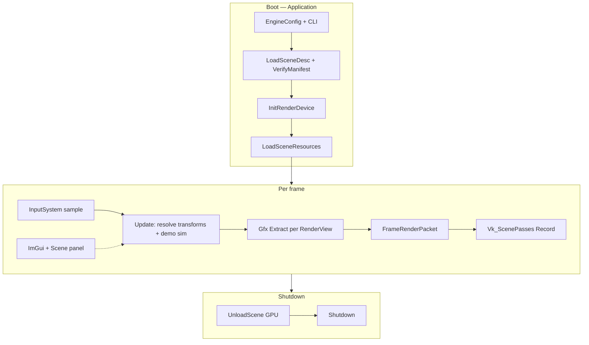

# S2 回顾总结 — 引擎分层与 Stage 1 收口

> **时间：** 2026-05-26 ~ 2026-06-02（与 S0 收尾、S1 并行/衔接）  
> **状态：** ✅ S2 已完成（详见 [`Archived-Plan.md`](../Archived-Plan.md) S2 段）  
> **细节任务：** 各 [`Archived/plans/`](plans/) 下 20+ 个 `*_Plan.md` / `*_Progress.md`  
> **Lighting：** S2 内关闭了 **Lighting Stage 1（Forward Baseline）**；**Stage 2 Hybrid Deferred** 仍待 S3+ / 门控后启动

---

## 一句话

S2 把引擎从「**M1 能画、但 Init 里塞满 demo 与 Vulkan**」推进到「**Application 管生命周期、JSON 场景驱动、Vk_Core 拆块、Shader 可反射校验、Forward Stage 1 可签收**」，为 **P0 验证、M2 GPU 剔除、Hybrid Deferred** 打工程地基。

---

## 🎯 要解决什么问题？为什么要做？

S1 证明了 CPU 绘制数据流，但 demo 仍绑死在 `Vk_Core::InitVulkan` 里，Shader/Pass 也缺少可维护的契约：

| 痛点 | 后果 |
|------|------|
| 🏗️ 启动顺序写死在 `main` / `InitVulkan` | 换场景、热重载、Unload 困难 |
| 📁 资产列表硬编码 | 无法 JSON 场景、无法 CI smoke 换场景 |
| 🧱 `Vk_Core` god object | 窗口、设备、场景、录制、ImGui 全搅在一起 |
| 🔀 Gfx 与 Vulkan 边界模糊 | 换后端、单测、Job 化都难 |
| 🎨 Shader binding 靠手工对齐 | 改 uniform 易 silent break |
| 🚦 无 Stage 1「签收物」 | Forward → Deferred 迁移无 golden / handoff |
| 📷 单相机 | 多 View / PiP 无法验证 Extract 参数化 |

**S2 的目标** 不是立刻上 PBR / 帧图，而是：

```text
配置 + 生命周期 + 模块边界 + Shader 工具链 + Stage 1 文档化签收
         ↓
仍用 S1 的 draw 列表，但「谁初始化、谁加载、谁录制」清晰可测
```

---

## 🛠️ 做了什么？（按工程主题说明）

### 1️⃣ 配置与 CLI — 一处读盘、多处覆盖

- **做了什么：** `Util_EngineConfig` + `Config/engine.json`（窗口、vsync、assetRoot、scene、validation、demoRotate 等）；`--asset-root` / `--config` / `--scene` CLI；旧 `Util_AssetConfig` 等收敛为委托。
- **为什么：** 新机器、CI、benchmark 必须 **不依赖 cwd 猜路径**；行为可复现。
- **你现在能看到：** 启动日志 `[CONFIG]`、`Docs/CLI.md` 全量说明。

📎 任务：[`central-config_Plan.md`](plans/central-config_Plan.md)、[`asset-root_Plan.md`](plans/asset-root_Plan.md)（S0 基础，S2 接场景）

---

### 2️⃣ Application 生命周期 — Init → Loop → Unload

- **做了什么：** `App/Application` 编排 `InitApp` → 场景 verify → `InitRenderDevice` → `LoadSceneResources` → `Update`/`Render` → `UnloadScene` → `Shutdown`；场景 load **移出** `InitVulkan`。
- **为什么：** 游戏/工具都需要 **可重复** 的加载/卸载；RenderCore 不应知道「第几步该读 JSON」。
- **你现在能看到：** 日志 `[APP]`、`[SCENE] LoadSceneResources completed` / `UnloadScene: GPU scene resources released`；`--smoke-frames`  dev 退出。

📎 任务：[`application-lifecycle_Plan.md`](plans/application-lifecycle_Plan.md)

---

### 3️⃣ Scene JSON — 从硬编码 demo 到磁盘场景

- **做了什么（Phase A→D）：**
  - **A：** `Data/Scenes/demo.json`、`Gfx_LoadSceneDesc`、依赖收集、`--scene` 解析；
  - **B：** `Util_VerifyManifest` 替代固定 `kRequiredFiles` 列表；
  - **C：** 场景驱动 SoA / LOD / manifest → `Vk_ResourceTables::LoadFromManifest`；
  - **D：** `UnloadScene`、strict/warn `assetVerify`、`smoke.json`、`--smoke-frames`；
  - **+：** ImGui Scene 面板、进程内热重载场景。
- **为什么：** S1 的 Kenney demo 逻辑进 JSON；内容迭代 **不改 C++ 资产表**。
- **你现在能看到：** `demo.json` 8 opaque + 1 transparent；Scene 面板换场景；[`SceneJSON.md`](../SceneJSON.md) 作者指南。

📎 任务：[`scene-load_Plan.md`](plans/scene-load_Plan.md)

---

### 4️⃣ `Vk_Core` 渐进剥离 — 从 monolith 到上下文链

- **做了什么：** 多里程碑 peel（非一次大爆炸）：
  - `Vk_ResourceContext` — 资源 upload / image 创建；
  - `Vk_RenderDevice` / `Vk_SwapchainHost` — 设备与 swapchain 初始化；
  - `Vk_DescriptorSystem` / `Vk_GfxPipelineCache` — 描述符与 pipeline；
  - `Vk_SceneHost` — CPU 场景状态（SoA / LOD / id 表）；
  - `Vk_ScenePasses` — Pass 录制；
  - `Vk_FrameUniformUploader` — 每帧 UBO；
  - `Vk_PlatformFrame` — GLFW + ImGui 平台帧；
  - `Gfx_FrameDrawStream` / `Vk_FrameDrawPrep` / `Gfx_DemoSceneSim` — 帧内 draw 准备与 demo 旋转。
- **为什么：** 每个块有 **单一职责**，Swapchain 重建、场景 reload 只触相关子系统。
- **你现在能看到：** `DrawFrame` 仍协调 acquire/prep/record/present，但大块逻辑已委托；文件树 `Vk_*Context` / `Vk_*Host`。

📎 任务：[`vk-core-decomposition_Plan.md`](plans/vk-core-decomposition_Plan.md)

---

### 5️⃣ Gfx ↔ Vulkan 解耦 — Render Packet

- **做了什么：** `Gfx_FrameRenderPacket` 契约 + `Vk_RenderBackend` 边界；RenderCore 消费 packet，**不再**直接依赖 `Gfx_ExtractResult` 细节类型。
- **为什么：** 以后 GPU cull 换输出形状、或换录制后端，Gfx 热路径保持稳定。
- **你现在能看到：** Extract → packet → `RecordFramePasses` 单向数据流。

📎 任务：[`gfx-vk-decoupling_Plan.md`](plans/gfx-vk-decoupling_Plan.md)

---

### 6️⃣ 输入与相机 — 采样离开 RenderCore

- **做了什么：** `App/InputSystem` 拥有采样与 `Util_InputState`；Application 驱动 platform → input → `ApplyCameraInput` → render；FPS fly camera 文档化。
- **为什么：** S1 复盘已指出 input 在 `BeginFrame` 是分层债；S2 先迁采样，**WorldState 完整 peel 留 P1**。
- **你现在能看到：** WASD + 鼠标环顾；ImGui 捕获时相机不动。

📎 任务：[`input-abstraction_Plan.md`](plans/input-abstraction_Plan.md)、[`fps-camera_Plan.md`](plans/fps-camera_Plan.md)

---

### 7️⃣ 世界矩阵 — Flat resolve 再 Extract

- **做了什么：** Gfx 侧 flat transform 源 + resolve；Extract 前显式 `ResolveWorldTransforms`；RenderCore 不再拥有 base-transform 语义。
- **为什么：** 层级变换、多 View、以后动画写回 SoA 都需要 **单一真相**。
- **你现在能看到：** 旋转 demo 仍正确；multi-view 每 View 独立 eye/target。

📎 任务：[`flat-world-matrices_Plan.md`](plans/flat-world-matrices_Plan.md)

---

### 8️⃣ Shader 工具链 — 反射、布局、变体、缓存

| 阶段 | 做了什么 | 为什么 |
|------|----------|--------|
| **2a 反射** | SPIRV-Reflect → `reflection_lit.json`；MSBuild 对照 `DescriptorContract_LitBatch.json` | 绑定点 drift 在编译期抓 |
| **2b 布局** | `ShaderEffectMeta` + layout hash；lit batch `vkCreateDescriptorSetLayout` | 描述符布局可 codegen 化 |
| **2d Bindless 校验** | `reflection_lit_bindless.json` + 运行时 contract verify | 双路径（batch/bindless）都受约束 |
| **Permutation** | `PermutationRegistry.json`、`lit_alpha_clip`、sort-key perm 槽 | Stage 2+ shadow/IBL 预留位 |
| **Pipeline cache** | `Cache/pipeline_cache_v1.bin`（GPU UUID + driver + SPIR-V mtime） | 冷启动与 CI 迭代加速 |

📎 任务：[`shader-reflection_Plan.md`](plans/shader-reflection_Plan.md)、[`shader-layout-from-reflection_Plan.md`](plans/shader-layout-from-reflection_Plan.md)、[`shader-reflection-bindless-verify_Plan.md`](plans/shader-reflection-bindless-verify_Plan.md)、[`permutation-registry_Plan.md`](plans/permutation-registry_Plan.md)、[`pipeline-cache-disk_Plan.md`](plans/pipeline-cache-disk_Plan.md)

---

### 9️⃣ Descriptor 布局签收 — Policy 与代码一致

- **做了什么：** batch/bindless `VkPipelineLayout` Set 0/1/2 对照 `Vk_DescriptorPolicy.h`；`LogLayoutContract`；material rebuild 契约写入 Architecture §6.1。
- **为什么：** S1 验证了 Set 1/2 **行为**；S2 把 **布局** 也锁进文档 + 日志。

📎 任务：[`descriptor-layout-verify_Plan.md`](plans/descriptor-layout-verify_Plan.md)、[`descriptor-strategy_Plan.md`](plans/descriptor-strategy_Plan.md)（S0 策略，S2 审计）

---

### 🔟 Lighting Stage 1 — Forward 基线收口（Epic §A–C）

- **§A 契约：** `GpuMaterialParams` / PBR 字段、`ForwardLit` preset、Scene JSON 可选字段、perm 位预留。
- **§B 硬化：** `Vk_ScenePasses` opaque/transparent CONTRACT；Stage 2 depth 导入策略文档化；`Util_RenderDebugPanel`（skip pass、depth/normal）；`alphaMode` mask。
- **§C 签收：** [`forward-stage1.md`](../forward-stage1.md) runbook、golden PNG、`engine.benchmark.json`；`[PERF] frameMs≈16.6 fps≈60 visibleDraws=9`。

📎 任务：[`forward-stage1-contracts_Plan.md`](plans/forward-stage1-contracts_Plan.md)、[`forward-pass-hardening_Plan.md`](plans/forward-pass-hardening_Plan.md)、[`forward-stage1-validation_Plan.md`](plans/forward-stage1-validation_Plan.md)

**诚实说明：** 着色仍是 **Blinn-Phong**；`roughness`/`metallic` **已上传未消费** — Stage 2 工作，不是 S2 欠债。

---

### 1️⃣1️⃣ Multi-view v1 — 双相机 Extract + Record

- **做了什么：** `Gfx_RenderView`；scene `cameras[]`；主 View + PiP overview；每 View 独立 extract/record/viewport/scissor；ImGui Multi-view 面板；PiP 闪烁修复（instance slab 分区 + 主 View LOD 状态隔离）。
- **为什么：** S7 帧图多 target 的前置；证明 Extract **参数化** 可行。
- **你现在能看到：** `[PERF] drawCalls=18`（2 views × 9 draws）；PiP 右下角小窗。

📎 任务：[`multi-view_Plan.md`](plans/multi-view_Plan.md)

**v1 限制：** 仅 swapchain viewport 分屏；**共享 depth**；无 offscreen RT — debug 级，非产品级分屏。

---

### 1️⃣2️⃣ 调试与管线卫生

| 项 | 说明 |
|----|------|
| **RenderDoc** | `--renderdoc`、F12 capture、Pass/Draw 标签；注入时 Batch fallback 保稳定 |
| **Dynamic state** | viewport/scissor/lineWidth 运行时设置；清理 dangling `pDynamicStates` |
| **Image queue sharing** | transfer ≠ graphics 时 `VkSharingMode` + 启动日志 |
| **Init hygiene** | 删 `Gfx_BuildDemo*` / `Util_DemoAssets`；`Vk_SceneHost::InitScenePresentation` |

📎 任务：[`renderdoc-drawcall-tags_Plan.md`](plans/renderdoc-drawcall-tags_Plan.md)、[`pipeline-dynamic-state-wire_Plan.md`](plans/pipeline-dynamic-state-wire_Plan.md)、[`image-queue-sharing_Plan.md`](plans/image-queue-sharing_Plan.md)、[`s2-init-hygiene_Plan.md`](plans/s2-init-hygiene_Plan.md)

---

## 🔁 启动与帧循环（一图流）



---

## ✅ S2 里程碑验收了什么？

| 验收项 | 结果 |
|--------|------|
| Application 生命周期 smoke | ✅ init → loop → unload → shutdown（[`SprintOutcomeValidation.md`](../SprintOutcomeValidation.md) § S2） |
| JSON 场景驱动 demo | ✅ `demo.json` + manifest verify + reload |
| `Vk_Core` peel 无行为回归 | ✅ 分解后 MSBuild + smoke exit 0 |
| Shader 反射 MSBuild gate | ✅ lit batch + bindless contract |
| **Lighting Stage 1** 签收 | ✅ golden + benchmark config + handoff § [`forward-stage1.md`](../forward-stage1.md) |
| Multi-view | ✅ 2 views / 18 drawCalls 日志 |
| RenderDoc 标签 | ✅ pass/draw 可检索 |

---

## 💡 还能做得更好的地方（诚实复盘）

### 架构 / 分层

| 现状 | 可改进 |
|------|--------|
| 🔧 Peel 是 **文件级** 拆分，`DrawFrame` 仍 ~千行级协调者 | **P1** [`vk-core-world-peel_Plan.md`](../Archived/plans/vk-core-world-peel_Plan.md)（2026-06-02 已关）：WorldState、ImGui 出 hot path、context 注入替代 `friend` |
| 🔧 `Util_EngineConfig` 仍偏全局 singleton 味道 | **P1** config instance + 测试注入 |
| 🔧 ImGui Scene / Render Debug 仍在录制路径附近 | 迁到 App 层 debug UI |

### 场景与内容

| 现状 | 可改进 |
|------|--------|
| 📁 Phase D 已有 unload/reload，但 **Application lifecycle** 文档里仍有「D1 理想态」欠账 | 热换场景时 GPU 同步策略写进 runbook |
| 🎬 `demoRotate` 仍影响 benchmark 可重复性 | **P2** 默认 `false`（已在 render-m2-prep 计划） |

### 渲染与 Shader

| 现状 | 可改进 |
|------|--------|
| 🎨 PBR 字段 uploaded-not-consumed | **Stage 2** hybrid deferred（Wishlist S7 / gate G1 后 FG v0） |
| 🧩 Permutation 仅 `lit` + `lit_alpha_clip` 落地 | **P1** freeze + bindless dogfood/defer 决策 |
| 📦 Layout codegen 仍 follow-up | Wishlist S7 infra 行 |
| 🖥️ Golden 非 pixel CI | **P0** CI + 固定相机统计 parity |

### Multi-view

| 现状 | 可改进 |
|------|--------|
| 📷 PiP 共享 depth、静态 slab 分区 | Wishlist S7：**instance slab dynamic partition** |
| 🪟 v1 无 offscreen RT | S7 FG multi-target |

### 验证

| 现状 | 可改进 |
|------|--------|
| ✅ smoke + 日志 + 单次 `[PERF]` | **P0** GHA、单元测试（SoA/cull）、`--perf-log` JSONL |
| 📋 20+ 归档 plan，读者难一眼扫 | 本文 + S1 回顾 + `EngineArchitecture.md` 三角阅读 |

---

## ➡️ S2 之后建议往哪走？

S2 的价值：**工程形状**（生命周期、场景、Shader 契约、Stage 1 签收）已对齐终局；下一步是 **可测量地** 换剔除/提交方式，而不是再拆 Init。

```text
P0  CI + assetRoot + tests + perf JSONL          ← 先证明「能重复验证」
P1  WorldState peel + config instance + bindless 决策
P2  CPU indirect 模板 + AABB/depth 卫生
P3  M2 GPU cull + automated parity (gate G1)
P4  Vertical slice v0 (objective + restart)
     ↓ G1
Wishlist S3 FG v0 → S7 Hybrid Deferred (Stage 2)
     ↓ G2/G3/G4
Wishlist S4–S8 meshlet / mesh shader / sim …
```

| 文档 | 角色 |
|------|------|
| [`Active-Plan.md`](../Active-Plan.md) | **近期执行队列** P0–P4 |
| [`Wishlist.md`](../Wishlist.md) | **完整 S3–S8** sprint 清单（从旧 Active-Plan 恢复） |
| [`hybrid-deferred-epic_Plan.md`](../hybrid-deferred-epic_Plan.md) | Stage 2 光照 epic（gate G1 后） |
| [`ci-verification_Plan.md`](plans/ci-verification_Plan.md) | P0 落地步骤 |

**与 S1 回顾的衔接：** S1 定了 **数据形状**；S2 定了 **谁拥有生命周期与 Shader 契约**；S3/P3 起换 **GPU 可见性**，数据结构不必推倒。

---

## 📎 相关文档索引

- 路线图：[`Active-Plan.md`](../Active-Plan.md) · [`Wishlist.md`](../Wishlist.md) · [`Archived-Plan.md`](../Archived-Plan.md)
- S1 回顾：[`S1-回顾总结.md`](S1-回顾总结.md)
- 架构意图：[`EngineArchitecture.md`](../EngineArchitecture.md)
- Stage 1 签收：[`forward-stage1.md`](../forward-stage1.md)
- 文档索引：[`README.md`](../README.md)
