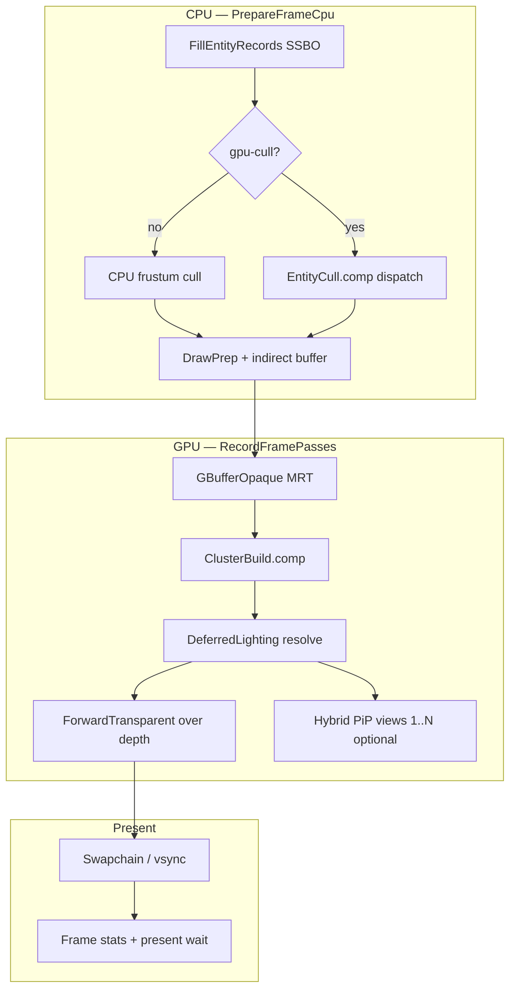

# S3 回顾总结 — GPU 间接绘制与 Hybrid Deferred FG v0

> **时间：** 2026-06-02 ~ 2026-06-12（承接 S2 收口；含 P0–P4 桥接与 S3 分支收尾）  
> **状态：** ✅ S3 已完成（详见 [`Archived-Plan.md`](../Archived-Plan.md) P2–P4、S3 段及 frame-pacing / present-wait 行）  
> **细节任务：** 各 [`Archived/plans/`](plans/) 下 40+ 个 `*_Plan.md` / `*_Progress.md`  
> **Lighting：** S3 内落地 **Stage 2 入口（FG v0）** — `HybridDeferred` 不透明链 + 透明 forward；**完整 PBR / IBL / 阴影 / Post** 归入 **S4–S7** 光照轨道

---

## 一句话

S3 把引擎从「**S2 的 Forward Stage 1 + CPU 间接模板**」推进到「**GPU 视锥剔除 → slot indirect 录制、G1 自动 parity、HybridDeferred 六切片 FG v0、Sponza 基准场景、可测帧节奏**」，并解锁 **G1（FG v0）** 与 **G2（垂直切片）**；路线图在收尾时 **pivot** 到 **S4–S8 光照质量**，meshlet 轨道延后至 **S10–S12**。

---

## 🎯 要解决什么问题？为什么要做？

S2 签收的是 **生命周期 + Shader 契约 + Forward 基线**，但绘制提交仍是 **CPU 权威剔除 + 逐 draw 或早期 indirect 模板**，且 **Deferred 仅存在于 epic 文档**：

| 痛点 | 后果 |
|------|------|
| 🐌 CPU 剔除随实体数线性涨 | M2 目标（GPU 填 indirect）无法签收 |
| 📋 无 G1 自动 parity | GPU cull 回归只能靠肉眼 |
| 🧱 `Vk_Core` 仍协调过多 | WorldState / debug UI 未完全出 hot path（S2 欠账） |
| 🎨 Stage 2 无代码落点 | PBR 字段 uploaded-not-consumed，缺 G-buffer 壳 |
| 🧪 无「可玩」签收物 | 模拟/玩法无法挂接真实场景循环 |
| 📊 帧时 / present 不可信 | vsync 默认、2-frame-in-flight 与统计 ring 有洞 |
| 🏛️ Kenney/stress 太简单 | 光照与性能基准缺乏行业标准场景 |

**S3 的目标** 不是一次做完 Stage 2 光照，而是：

```text
P0–P2：可重复验证 + CPU indirect 模板 + RHI 硬化
P3 + M2 签收：GPU cull → slot indirect（G1）
P4：垂直切片 v0（G2）
S3 FG v0：GBuffer → Cluster → Deferred → Transparent（batch + bindless）
收尾：Hybrid 默认、Sponza、PiP、帧节奏、文档 pivot → S4 PBR
```

---

## 🛠️ 做了什么？（按工程主题说明）

### 1️⃣ P0 — 验证与度量基建（S2 尾声承诺落地）

- **做了什么：** GHA `vulkan-desktop.yml` + `Verify-CI.ps1`（MSBuild、shader drift、GfxTests）；`Verify-Smoke.ps1` + `Assert-SmokeLog.ps1`；`--perf-log` JSONL + `Perf-JsonlSummary.ps1`；`engine.benchmark.json` vsync off；`--asset-root` 契约写入 `CLI.md` / `bootstrap.md`。
- **为什么：** S2 回顾已写「先证明能重复验证」；M2/GPU 路径必须有 **CI 狗食** 而非单次 smoke。
- **你现在能看到：** PR 绿勾、本地 `Verify-CI.ps1` exit 0、§P0 adversarial 签收流程。

📎 任务：[`ci-verification_Plan.md`](plans/ci-verification_Plan.md)

---

### 2️⃣ P1 — 分层硬化（WorldState、Config、Bindless、RHI-A/B1）

| 块 | 做了什么 | 为什么 |
|----|----------|--------|
| **World peel** | `WorldState` / debug UI 归 Application；`BuildActiveRenderViews`；`Vk_*Context` 注入；`Vk_Core` **0 friend** | S2 复盘 #1 欠账 |
| **Config instance** | `Util_EngineConfig` 实例化；`Vk_FrameResult` 可恢复 acquire/submit/present | 测试注入 + 设备丢失优雅退出 |
| **Bindless Option A** | `BINDLESS_RENDERDOC_OK`、统一 `RecordPassDrawsFromPacket`、M7 perm freeze | 双路径 dogfood，为 hybrid bindless 切片铺路 |
| **RHI-A1/A2** | slab overflow fail-closed；camera UBO 与 env UBO 上传拆分 | 多 View 不再互相踩 UBO |
| **RHI-B1** | swapchain create 卫生（compositeAlpha、triple-buffer、precheck） | resize / 平台差异前置兜底 |

📎 任务：[`vk-core-world-peel_Plan.md`](plans/vk-core-world-peel_Plan.md)、[`shader-bindless-policy_Plan.md`](plans/shader-bindless-policy_Plan.md)、[`rhi-slab-overflow_Plan.md`](plans/rhi-slab-overflow_Plan.md)、[`rhi-camera-ubo_Plan.md`](plans/rhi-camera-ubo_Plan.md)、[`rhi-swapchain-create_Plan.md`](plans/rhi-swapchain-create_Plan.md)

---

### 3️⃣ P2 — RHI-B2–C + CPU indirect 模板（M2 §A）

- **做了什么：**
  - **RHI-B2–C：** swapchain **三层 Recreate**；`SURFACE_LOST` 恢复；`Vk_ResourceContext` 单 owner；`BeginSceneUploadBatch`；descriptor pool 按 manifest 定容；`Verify-ResizeSmoke.ps1`；
  - **render-m2-prep：** `Gfx_DrawTemplate` + per-frame SSBO；`vkCmdDrawIndexedIndirect`；`--legacy-direct-draw` 回退；mesh `myIndexCount`；栈上 RenderDoc draw tag；**`demoRotate` / `lodEnabled` 默认 false**；世界 AABB × transform + depthBucket / 透明 eye-Z 排序。
- **为什么：** GPU cull 必须写入 **与 CPU 同形状的 indirect 槽位**；索引数、AABB、排序键错误会在 G1 parity 立刻暴露。
- **你现在能看到：** 日志 `FillDrawTemplates`、`vkCmdDrawIndexedIndirect`；`stress.json` 河谷场景 ~108 实体。

📎 任务：[`vulkan-rhi-p2_Progress.md`](plans/vulkan-rhi-p2_Progress.md)、[`render-m2-prep_Plan.md`](plans/render-m2-prep_Plan.md)

---

### 4️⃣ P3 — GPU 视锥剔除全链路（M2 §B–D + **G1**）

- **做了什么（四段闭环）：**
  1. **P3-a：** per-slot `Gfx_EntityGpuRecord` SSBO（world AABB + indirect 模板字段），`FillEntityRecords` 每帧同步 SoA；
  2. **P3-b：** `EntityCull.comp` + `Vk_GpuCull` → `myGpuCullIndirectBuffer`；
  3. **P3-c：** `--gpu-cull` 录制走 slot indirect，CPU frustum cull 跳过；
  4. **P3-close：** `lodEnabled` 时 entity-record 解析 LOD `indexCount`；
  5. **G1：** `Gfx_GpuCull.cpp` reference + GfxTests 固定相机 CPU/GPU slot-set parity（demo overview、tight FOV、layer mask）。
- **为什么：** **数据结构不变、换剔除执行端** —— S1/S2 的 Extract 列表形状保留，M2 只换「谁填 indirect」。
- **你现在能看到：** `--gpu-cull` → `[CULL] … (gpu-deferred)`、`GPU cull dispatch`、`Scene record using GPU-filled slot indirect`；CI GfxTests G1 用例。

📎 任务：[`render-m2-p3-a_Plan.md`](plans/render-m2-p3-a_Plan.md) … [`render-m2-p3-g1_Plan.md`](plans/render-m2-p3-g1_Plan.md)

---

### 5️⃣ P4 — 垂直切片 v0（**G2**）

- **做了什么：** `Data/Scenes/slice.json` 可玩场景；到达篝火 **胜利** / 120s **失败**（HUD + log）；**R** / Scene 面板 **进程内重启**（`UnloadScene` → reload，不退出 exe）。
- **为什么：** 证明 Application 生命周期 + 场景 JSON 足以承载 **玩法循环**，模拟轨（S9）有真实挂点。
- **你现在能看到：** `[SLICE] Objective won/lost`；`Config/engine.slice.json` 一键试玩。

📎 任务：[`p4-vertical-slice-v0_Plan.md`](plans/p4-vertical-slice-v0_Plan.md)

---

### 6️⃣ S3 M2 签收 — 自动化狗食

- **做了什么：** `Verify-Smoke.ps1` **双遍**：pass 1 CPU indirect（`engine.stress.json` + `stress.json`）；pass 2 同场景 `--gpu-cull`；`Assert-SmokeLog.ps1 -Profile GpuCull` 断言 M2 token；[`SprintOutcomeValidation.md`](../SprintOutcomeValidation.md) §S3 证据块。
- **为什么：** 「GPU 路径能跑」≠「可签收」；必须 **固定场景 + 固定日志契约** 进 CI。
- **你现在能看到：** smoke ~23s 双遍 exit 0；`Vk_ScenePasses` gpu 路径仅 `vkCmdDrawIndexedIndirect`（非 `--legacy-direct-draw`）。

📎 任务：[`s3-m2-acceptance_Plan.md`](plans/s3-m2-acceptance_Plan.md)

---

### 7️⃣ S3 FG v0 — HybridDeferred 六切片（**G1 → Stage 2 入口**）

| 切片 | 做了什么 | 关键模块 |
|------|----------|----------|
| **1** | `HybridDeferred` preset + `GBufferOpaque` MRT shell | `Vk_GBufferPass`、preset hook |
| **2** | `ClusterBuild.comp` stub + per-cluster light index SSBO | `Vk_ClusterBuildPass` |
| **3** | `DeferredLighting` 替换 CompositeAlbedo（clustered diffuse + ambient） | `Vk_DeferredLightingPass` |
| **4** | G-buffer depth copy + `ForwardTransparent` over deferred depth | hybrid resolve RP |
| **5** | `GBufferFrag_Bindless` + bindless hybrid 录制 | 默认 bindless 路径 |
| **6** | deferred specular v0（Blinn-Phong + depth reconstruct） | forward parity checklist 起点 |

- **为什么：** 按 epic **小步可 smoke** —— 每切片 CI 仍绿（`ForwardLit` 默认），手动 dogfood `HybridDeferred`。
- **你现在能看到：** 默认 `engine.json` → `renderPreset: HybridDeferred`；日志 FG 链；batch + bindless 双路径。

📎 任务：[`s3-fg-v0_Plan.md`](../s3-fg-v0_Plan.md)、[`s3-fg-s1-preset-gbuffer_Plan.md`](plans/s3-fg-s1-preset-gbuffer_Plan.md) … [`s3-fg-s6-forward-parity_Plan.md`](plans/s3-fg-s6-forward-parity_Plan.md)

**诚实说明：** FG v0 是 **手写 pass 链**，不是 S7 的 `FrameGraphBuilder`；`roughness`/`metallic` **仍未进 BRDF** —— 这是 **S4** 工作，不是 S3 欠债。

---

### 8️⃣ Hybrid 默认化与生命周期修复

- **做了什么：** `HybridDeferred` 升为 `Config/engine.json` 默认；G-buffer / hybrid resolve **resize & swapchain recreate** 生命周期修复；fly camera 输入与 scene `spawn` 相机对齐（避免 PiP `overview` 误作 fly 起点）。
- **为什么：**  dogfood 若仍 opt-in，FG v0 回归易被忽略；RHI-B2 recreate 与 offscreen RT 组合是常见闪退源。
- **你现在能看到：** 无 `--render-preset` 即 hybrid；窗口缩放后 G-buffer 不黑屏；Sponza 内庭 spawn 视角合理。

📎 提交：`b5b5e72`、`199ad45` 等（见 git log 2026-06-11~12）

---

### 9️⃣ 帧节奏与可观测性

- **做了什么：**
  - **frame-pacing-fix：** `MAX_FRAMES_IN_FLIGHT = 3`（`Vk_FrameLimits.h`）；帧统计 ring-buffer 修 Avg/1% Low；fence-wait overlay；
  - **present-wait-stats：** Present wait ms + Work ms 分解；vsync overlay 曲线；
  - 默认 **vsync off**（`engine.json` / benchmark 一致）。
- **为什么：** 2-frame-in-flight + 错误统计曾导致 **FPS 波形虚假 dense、1% Low 断崖**；没有 present 分解无法区分 GPU bound vs 显示阻塞。
- **你现在能看到：** ImGui Stats 页 Present/Work 区段；`[PERF]` 与 overlay 波形更稳定。

📎 任务：[`frame-pacing-fix_Plan.md`](plans/frame-pacing-fix_Plan.md)、[`present-wait-stats_Plan.md`](plans/present-wait-stats_Plan.md)

---

### 🔟 基准场景生态 — stress（CI）+ Sponza（开发默认）

| 场景 | 角色 | 说明 |
|------|------|------|
| **`stress.json`** | CI / `Verify-Smoke.ps1` | 河谷聚落 ~108 实体、Poly Haven 纹理、`lodEnabled`；**不**随默认 config 变 |
| **`sponza.json`** | 开发 / 光照基准 | McGuire Crytek Sponza，25 材质子网格；`Fetch-SponzaMcGuire.ps1` + `Generate-SponzaScene.ps1`；Y-up→Z-up、scale 0.01 |
| **`demo.json`** | Stage 1 golden | forward-stage1 签收不变 |

- **为什么：** Kenney 营地无法压测剔除与室内光照；Sponza 是行业通用对照。
- **你现在能看到：** 默认启动 `sponza.json`；CI 仍 stress 双遍；[`Data/ASSETS.md`](../../Data/ASSETS.md)。

📎 脚本：`Scripts/Fetch-SponzaMcGuire.ps1`、`Scripts/Generate-SponzaScene.ps1`

---

### 1️⃣1️⃣ Multi-view / Hybrid PiP 修复

- **做了什么：** 移除 `PrepareFrameCpu` 在 GBuffer 活跃时把 `activeViewCount` 钳到 1；`Vk_ScenePasses::RecordHybridPiPViews` 在 hybrid resolve RP 内绘制 views 1..N-1；`overview` 相机解析修正；**PiP 默认关闭**（`myEnablePiP = false`）。
- **为什么：** S2 multi-view 在 **forward** 路径验证过；FG v0 默认化后 PiP 不显示是 **回归**，需 hybrid 专用 forward-lit overlay 路径。
- **你现在能看到：** ImGui 打开 PiP 后右下角 secondary 相机；主 View 仍为 spawn 全屏。

📎 任务：S2 [`multi-view_Plan.md`](plans/multi-view_Plan.md) 延伸；提交 `f004dd3`

---

### 1️⃣2️⃣ 调试 UI 与文档收口

- **做了什么：** ImGui debug 面板 **Tab 布局**（scheme A）；路线图 **pivot**：`Wishlist.md` S4–S8 光照、`S10–S12` 几何延后；[`SprintOutcomeValidation.md`](../SprintOutcomeValidation.md) §S4–S13 + G4 重对齐；`CLI.md` / `SceneJSON.md` 默认 Sponza 说明。
- **为什么：** Sprint 编号与验收节错位会阻塞 S4 kickoff；读者需要一份 **S3 全景回顾**（本文）。

📎 任务：[`imgui-layout_Plan.md`](plans/imgui-layout_Plan.md)；提交 `c90ec58`、`89f6961`

---

## 🔁 HybridDeferred 帧链（一图流）



---

## ✅ S3 里程碑验收了什么？

| 验收项 | 结果 |
|--------|------|
| **G0** CI + GfxTests + smoke | ✅ `Verify-CI.ps1` / `Verify-Smoke.ps1` exit 0 |
| **G1** CPU vs GPU cull parity | ✅ GfxTests 固定相机；gpu-cull smoke 第二遍 |
| **M2** slot indirect 录制路径 | ✅ 无 legacy direct draw（gpu 路径） |
| **G2** 垂直切片 v0 | ✅ slice 胜负 + 进程内 restart |
| **FG v0** hybrid 不透明链 | ✅ 切片 1–6 + batch/bindless |
| **ForwardLit 回退** | ✅ CI 默认路径仍绿 |
| **基准场景** | ✅ stress CI + Sponza 默认（fetch） |
| **帧节奏 / present 统计** | ✅ 3-frame-in-flight + overlay |
| **Hybrid PiP** | ✅ opt-in 可显示 secondary view |
| **文档** | ✅ Validation §S3 + 路线图 pivot |

**推荐复现命令：**

```powershell
pwsh -File Scripts/Verify-CI.ps1
pwsh -File Scripts/Verify-Smoke.ps1
powershell -File Scripts/Fetch-SponzaMcGuire.ps1   # 本地 Sponza
.\x64\Debug\VulkanDesktop.exe --asset-root <repo> --no-validation --smoke-seconds 6
```

---

## 💡 还能做得更好的地方（诚实复盘）

### 渲染 / 光照

| 现状 | 可改进 |
|------|--------|
| 🎨 G-buffer 有壳、BRDF 仍 Blinn-Phong v0 | **S4** MR encode + Cook-Torrance |
| ☀️ ClusterBuild 仅 stub 光源列表 | **S5** 真阴影 + IBL |
| 🖼️ 无 SSAO / Hi-Z / Post | **S6–S7** |
| 📐 deferred specular parity 仅 v0 | **G4** Stage 2 签收清单 |

### 几何 / 内容

| 现状 | 可改进 |
|------|--------|
| 📦 仍 OBJ + 手编 JSON | **G3 → S10** MeshImport v0 |
| 🏛️ Sponza ~80MB fetch-on-demand | CI 不依赖 Sponza；可选 LFS / 子集 |
| 🔀 meshlet / mesh shader 整轨延后 | 有意 pivot；G4 后再并行 S10 |

### Multi-view / FG

| 现状 | 可改进 |
|------|--------|
| 📷 PiP hybrid 走 forward overlay，共享 depth | S7 offscreen RT + FG builder |
| 🧱 FG v0 手写插入 `Vk_ScenePasses` | S7 `FrameGraphBuilder` + transient pool |
| 📊 PiP 默认关 | 避免误用 overview 当 fly 相机；文档已说明 |

### 性能 / 可观测性

| 现状 | 可改进 |
|------|--------|
| ⏱️ `[PERF]` + JSONL 有 p50，无硬阈值 | S7 benchmark runbook + p95 门禁 |
| 🎮 3-frame-in-flight 缓解 fence beat | 平台矩阵 + GPU timestamp |
| 🧪 stress 108 实体 vs Sponza 25 draw | 二者分工明确，可加第三「中等」场景 |

### 工程

| 现状 | 可改进 |
|------|--------|
| 📋 40+ 归档 plan，读者难扫 | 本文 + S2 回顾 + Architecture 三角读 |
| 🔧 `DrawFrame` 仍是大协调者 | 随 S7 FG 再瘦录制编排 |

---

## ➡️ S3 之后建议往哪走？

S3 的价值：**提交路径**（GPU indirect + G1）与 **光照容器**（FG v0 hybrid）已就绪；下一步是 **在同一链上叠光照质量**，而不是先上 meshlet。

```text
S4  PBR + G-buffer MR 合同（Sponza parity）
S5  IBL + skybox + directional shadows
S6  SSAO + Hi-Z
S7  Post + FrameGraphBuilder v1
     ↓ G4 Stage 2 acceptance
S8  DDGI（可选 Stage 3）
     ‖
S9  Simulation（G2 已解锁，可与 S4–S7 并行）
     ‖
S10–S12  Geometry track（G3 后，有意延后）
```

| 文档 | 角色 |
|------|------|
| [`Active-Plan.md`](../Active-Plan.md) | **执行队列** S4–S8 |
| [`Wishlist.md`](../Wishlist.md) | 分 sprint 任务清单 |
| [`SprintOutcomeValidation.md`](../SprintOutcomeValidation.md) | §S4 起 close-out runbook |
| [`hybrid-deferred-epic_Plan.md`](../hybrid-deferred-epic_Plan.md) | Stage 2 光照 epic |
| [`content-pipeline_Plan.md`](../content-pipeline_Plan.md) | G3 MeshImport（仅 S10） |

**与 S2 回顾的衔接：** S2 定了 **谁拥有生命周期与 Forward 签收**；S3 定了 **GPU 可见性 + Hybrid 不透明链 + 可测基准**；S4 起换 **材质与光照方程**，数据结构仍不必推倒。

---

## 📎 相关文档索引

- 路线图：[`Active-Plan.md`](../Active-Plan.md) · [`Wishlist.md`](../Wishlist.md) · [`Archived-Plan.md`](../Archived-Plan.md)
- 前序回顾：[`S1-回顾总结.md`](S1-回顾总结.md) · [`S2-回顾总结.md`](S2-回顾总结.md)
- 后续回顾：[`S4-S5-回顾总结.md`](S4-S5-回顾总结.md)
- 架构意图：[`EngineArchitecture.md`](../EngineArchitecture.md)
- Stage 1 签收：[`forward-stage1.md`](../forward-stage1.md)
- S3 验收：[`SprintOutcomeValidation.md`](../SprintOutcomeValidation.md) §S3
- FG v0 计划：[`s3-fg-v0_Plan.md`](../s3-fg-v0_Plan.md)
- 资产与场景：[`Data/ASSETS.md`](../../Data/ASSETS.md) · [`CLI.md`](../CLI.md)
- 文档索引：[`README.md`](../README.md)
