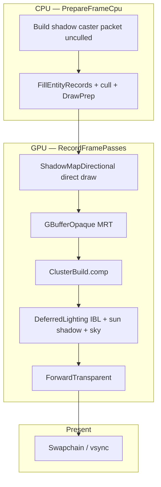

# S4–S5 回顾总结 — PBR G-buffer 与 IBL / 阴影

> **时间：** 2026-06-12 ~ 2026-06-13（承接 S3 FG v0；S5 含 lighting-shadow-refactor 收口）  
> **状态：** ✅ S4、S5 均已完成（详见 [`Archived-Plan.md`](../Archived-Plan.md) S4/S5 段）  
> **细节任务：** [`s4-pbr-gbuffer_*`](plans/s4-pbr-gbuffer_Plan.md) · [`s5-ibl-shadows_*`](plans/s5-ibl-shadows_Plan.md) · [`lighting-shadow-refactor_*`](plans/lighting-shadow-refactor_Plan.md)  
> **前序：** S3 交付 HybridDeferred 链 + Blinn-Phong v0；MR 字段已上传但未消费

---

## 一句话

S4 把 **G-buffer MR 编码 + Cook-Torrance 直射太阳** 落到 deferred/forward 双路径，并以 **McGuire Sponza** 作为光照基准场景；S5 在同一链上叠加 **split-sum IBL、天空盒、2048² 方向光阴影**，随后通过 **lighting-shadow-refactor** 修正阴影剔除/UBO 重复/IBL 能量与可见性债务，使 Sponza 上 **Lit 路径阴影稳定可辨**。

---

## 🎯 要解决什么问题？为什么要做？

S3 签收的是 **FG v0 容器 + GPU indirect**，但光照仍是 Stage 2 入口级别：

| 痛点 | 后果 |
|------|------|
| 🎨 G-buffer 有壳、BRDF 仍 Blinn-Phong | `roughness`/`metallic` 在 UBO 里但画面无材质差异 |
| 🌑 无 IBL / 天空 / 阴影 | Sponza 内庭 flat ambient；开口处黑底；太阳无接触阴影 |
| 📐 Forward vs Deferred 方程分叉风险 | 两套 ambient hack，难做 G4 parity |
| 🏛️ 基准场景不足 | Kenney/stress 无法验 PBR 与室内光照 |
| 🐛 S5 初版集成债务 | 阴影复用视锥剔除列表、prefilter 单 mip、Lit 里 IBL 洗淡阴影 |

**S4 的目标** 不是换 G-buffer 格式或加 permutation，而是：

```text
G-buffer MR encode（RT0.a / RT1.w）
PbrDirect.glsl — Cook-Torrance 金属工作流
Deferred + Forward 直射 parity
Sponza 资产 + 材质 MR 多样性
ambient 仍 flat hack（IBL 留给 S5）
```

**S5 的目标：**

```text
Data/Environments/default + Generate-DefaultIblAssets.ps1
split-sum IBL + sky + Vk_ShadowMapPass
GpuLightingGlobals runtime toggles（无新 permutation）
Hybrid + ForwardLit 同 eval 路径
```

**Refactor（2026-06-13）：** S5 scaffold 视觉/架构不对 —— caster pass、单次 UBO、shader 分层、prefilter mips、Lit 阴影可见性。

---

## 🛠️ 做了什么？（按工程主题说明）

### 1️⃣ S4 — G-buffer MR 合同 + Cook-Torrance

| 块 | 做了什么 | 为什么 |
|----|----------|--------|
| **MR encode** | RT0.a = metallic，RT1.w = roughness；batch + bindless G-buffer frag | S4 lock：不增第三 RT |
| **`PbrDirect.glsl`** | GGX + Schlick + Smith；`Pbr_EvalDirect` 金属工作流 | deferred/forward 共用直射方程 |
| **Deferred** | `DeferredLighting.frag` 读 G-buffer MR，替换 Blinn-Phong | hybrid 主路径 dogfood |
| **Forward** | `TriangleFrag_Lit*.frag` 同样 BRDF | ForwardLit parity 起点 |
| **Sponza 资产** | `Fetch-SponzaMcGuire.ps1` + `Generate-SponzaScene.ps1`；材质 roughness/metallic | 场景级 MR 多样性 |
| **ImGui** | spec/shininess 滑条标记为 PBR 下忽略 | 避免误导调试 |

- **你现在能看到：** Sponza 上金属/布料/石材高光宽度随 roughness 变化；G-buffer debug 可读 MR 通道。
- **为什么：** S3 诚实说明 MR **未进 BRDF** —— S4 在同一链上 **消费已有 Stage 1 合同**。

📎 任务：[`s4-pbr-gbuffer_Plan.md`](plans/s4-pbr-gbuffer_Plan.md) · 提交 `8454bce`、`258cf30`、`773cea2`

**诚实说明：** S4 仍用 `ambientColor * albedo` 占位 ambient —— **IBL 是 S5 工作**，不是 S4 欠债。

---

### 2️⃣ S5 — 环境资产 + IBL + Shadow pass scaffold

| 块 | 做了什么 | 关键模块 |
|----|----------|----------|
| **Step 0 资产** | `Data/Environments/default/` + `Generate-DefaultIblAssets.ps1` | CI 无网络；stress 默认关 IBL/阴影 |
| **`PbrIbl.glsl` v0** | split-sum：irradiance + prefilter + BRDF LUT | 替换 flat ambient |
| **`Vk_IblResources`** | cubemap 加载/上传；Set 0 绑定 2–6 | `Vk_DescriptorSystem` |
| **`Vk_ShadowMapPass`** | 2048² D32 depth；Khronos reversed-Z；PCF | shadow pass 插在 G-buffer 前 |
| **`GpuLightingGlobals` UBO** | lightViewProj、shadow/IBL toggles | **无新 shader permutation** |
| **Deferred + Forward 接线** | `LightingBindings.glsl`；sky depth ≥ 0.999 | 天空 + 阴影 + IBL 同路径 |
| **Config / ImGui** | `engine.json` `lighting.*`；Lighting 面板 toggle | A/B 与 CI 分离 |

- **为什么：** Wishlist §S5 / epic §C 要求 **环境光 + 可见天空 + 方向阴影** 先于 SSAO/post（S6–S7）与 G4。
- **你现在能看到：** 默认 `engine.json` 开 shadows/IBL；stress 配置关；日志 `[FG] HybridDeferred: ShadowMapDirectional → …`。

📎 任务：[`s5-ibl-shadows_Plan.md`](plans/s5-ibl-shadows_Plan.md) · 提交 `e5041e9` … `09ff769`

---

### 3️⃣ S5 Refactor — 阴影正确性 + Shader 分层 + IBL 质量

| 问题 | 修复 |
|------|------|
| 阴影随相机消失 | **`myShadowCasterPass`**：未剔除 opaque；shadow 用直接 `vkCmdDrawIndexed` |
| UBO 重复/竞态 | 去掉 `PatchLightViewProj`；shadow pass 后 **单次** `UpdateLightingGlobals` |
| ForwardLit 无阴影 | `RecordForwardLit` 同样录 shadow pass + barrier |
| 所有 cluster 光吃阴影 | deferred **仅 sun（index 0）** 乘 visibility |
| prefilter 单 mip | **5 级 mipgen**；`iblParams.z` = max mip |
| IBL 能量 leak | diffuse 用 `(1-F)*(1-metallic)`，与 direct 一致 |
| Lit 阴影看不见 | **`Pbr_ModulateAmbientForSunShadow`**（`PBR_SHADOWED_IBL_SCALE=0.25`）；debug 改 compare visibility |
| 模块混乱 | 新建 **`PbrShadow.glsl`**；`PbrIbl` 纯 IBL；删 `Pbr_LitWithSunAndAmbient` |

- **为什么：** S5 初 close 后 Sponza 阴影仍错 —— 根因是 **集成债务**（剔除列表、单 mip、IBL 洗淡），非 Khronos 矩阵本身。
- **你现在能看到：** 飞相机不抹掉 off-screen caster；Lit 与 debug visibility 一致；粗表面 IBL 更柔。

📎 任务：[`lighting-shadow-refactor_Plan.md`](plans/lighting-shadow-refactor_Plan.md) · [`khronos-shadow-map_Plan.md`](plans/khronos-shadow-map_Plan.md) · 提交 `39f6ace`

---

### 4️⃣ Shader 库最终形态（S4 → S5 refactor 后）

| 文件 | 职责 |
|------|------|
| `PbrDirect.glsl` | Cook-Torrance 直射 |
| `PbrIbl.glsl` | split-sum IBL；prefilter LOD 来自 uniform |
| `PbrShadow.glsl` | compare、visibility、`Pbr_ModulateAmbientForSunShadow` |
| `LightingBindings.glsl` | `Pbr_EvalSceneAmbient` / `Pbr_EvalSceneSunRadiance` / `Pbr_SceneSunShadow` |

Forward batch/bindless 与 deferred 共用上述 eval —— 维护面收敛到 **三个 PBR 模块 + 一个 binding 入口**。

---

## 🔁 HybridDeferred 帧链（S5 refactor 后）



ForwardLit：`ShadowMap` → opaque lit draws（同 shadow/IBL 绑定）。

---

## ✅ S4–S5 里程碑验收了什么？

| 验收项 | S4 | S5 (+ refactor) |
|--------|----|-------------------|
| **G0** `Verify-CI.ps1` | ✅ | ✅（含 shader drift + GfxTests） |
| **Smoke** `Verify-Smoke.ps1` | ✅ stress | ✅ stress（IBL/阴影关） |
| **G-buffer MR** | ✅ RT0.a / RT1.w | 不变 |
| **Cook-Torrance 直射** | ✅ deferred + forward | 不变 |
| **IBL split-sum** | — | ✅ irradiance + prefilter mips + BRDF LUT |
| **方向光阴影** | — | ✅ Sponza 接触阴影稳定 |
| **Runtime toggles** | — | ✅ config + ImGui |
| **ForwardLit parity** | 直射 BRDF | ✅ shadow pass + 同 eval |
| **基准场景** | ✅ Sponza 默认 | ✅ 手动签收 |

**推荐复现命令：**

```powershell
powershell -File Scripts/Verify-CI.ps1
powershell -File Scripts/Verify-Smoke.ps1
powershell -File Scripts/Fetch-SponzaMcGuire.ps1   # 本地 Sponza 首次
.\x64\Debug\VulkanDesktop.exe --asset-root <repo> --config Config\engine.json --no-validation --smoke-seconds 6
```

---

## 💡 还能做得更好的地方（诚实复盘）

### 渲染 / 光照

| 现状 | 可改进 |
|------|--------|
| 单 cascade 2048² 阴影 | CSM / atlas（Wishlist backlog） |
| `PBR_SHADOWED_IBL_SCALE=0.25` 是观感旋钮 | 更物理的 skylight bounce 或 AO 配合（**S6**） |
| placeholder IBL 资产 | HDRI bake 管线 / 可选 fetch 脚本 |
| ClusterBuild 仍 stub 列表 | 真 clustered 光源扩展 |
| 无 SSAO / Post | **S6–S7** → **G4** |

### 工程

| 现状 | 可改进 |
|------|--------|
| S5 先 close 再 refactor | 大 feature 建议「视觉签收后再归档」 |
| FG 仍手写 `Vk_ScenePasses` | **S7** `FrameGraphBuilder` |
| `GpuLightingGlobals` binding 11 depth 保留给 tooling | 可文档化或 dev-only |

### 与 S3 的衔接

| S3 交付 | S4–S5 叠加 |
|---------|------------|
| FG v0 六切片 + GPU indirect | **不换** 提交路径与 G-buffer 格式 |
| Blinn-Phong + flat ambient | **换方程与 ambient 来源**，数据结构不动 |
| Sponza 引入 | 成为 **默认光照基准** + MR/IBL/阴影 dogfood |

---

## ➡️ S4–S5 之后建议往哪走？

光照容器与 **Stage 2 核心方程**（PBR + IBL + 方向阴影）已就绪；队列进入 **屏幕空间 + 后期 + FG v1**，再冲 **G4**。

```text
S6  SSAO + Hi-Z depth pyramid
S7  Post（tonemap/exposure/bloom）+ FrameGraphBuilder v1
     ↓ G4 Stage 2 acceptance（full PBR + shadow + IBL + AO/post on Sponza）
S8  DDGI（可选 Stage 3）
     ‖
S9  Simulation（G2 已解锁，可与 S6–S7 并行）
     ‖
S10–S12  Geometry track（G3 后，有意延后）
```

| 文档 | 角色 |
|------|------|
| [`Active-Plan.md`](../Active-Plan.md) | **执行队列** S6 起 |
| [`Wishlist.md`](../Wishlist.md) | S6–S8 任务清单 |
| [`SprintOutcomeValidation.md`](../SprintOutcomeValidation.md) | §S6 起 close-out runbook |
| [`hybrid-deferred-epic_Plan.md`](../hybrid-deferred-epic_Plan.md) | G4 签收 epic |

**与 S3 回顾的衔接：** S3 = **提交路径 + Hybrid 链**；S4–S5 = **同一链上的材质与环境光**；不必推倒 SoA/indirect/G-buffer 布局。

---

## 📎 相关文档索引

- 路线图：[`Active-Plan.md`](../Active-Plan.md) · [`Wishlist.md`](../Wishlist.md) · [`Archived-Plan.md`](../Archived-Plan.md)
- 前序回顾：[`S1-回顾总结.md`](S1-回顾总结.md) · [`S2-回顾总结.md`](S2-回顾总结.md) · [`S3-回顾总结.md`](S3-回顾总结.md)
- 架构意图：[`EngineArchitecture.md`](../EngineArchitecture.md)
- S4/S5 验收：[`SprintOutcomeValidation.md`](../SprintOutcomeValidation.md) §S4 · §S5
- S4 Plan：[`s4-pbr-gbuffer_Plan.md`](plans/s4-pbr-gbuffer_Plan.md)
- S5 Plan：[`s5-ibl-shadows_Plan.md`](plans/s5-ibl-shadows_Plan.md)
- Refactor：[`lighting-shadow-refactor_Plan.md`](plans/lighting-shadow-refactor_Plan.md)
- 资产与场景：[`Data/ASSETS.md`](../../Data/ASSETS.md) · [`CLI.md`](../CLI.md)
- 文档索引：[`README.md`](../README.md)
