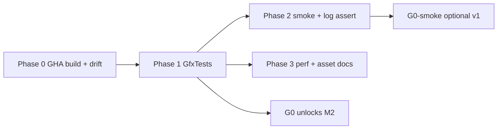

# Plan: ci-verification

**Status:** Closed (2026-06-02) — log: [`ci-verification_Progress.md`](ci-verification_Progress.md)  
**Parent:** [`Active-Plan.md`](Active-Plan.md) **P0** (completed → [`Archived-Plan.md`](Archived-Plan.md))  
**Covers hardening:** #2, #16, #20, #22, #25, #32  
**Process (not CI code):** #26, #27 → [`SprintOutcomeValidation.md`](SprintOutcomeValidation.md) § P0 closeout

## Goal

Replace “6s smoke = done” with **reproducible build + correctness + optional perf signals** before M2 and Stage 2 work lands.

## Non-goals

- Full pixel golden CI (manual PNG stays until S7 harness)
- Cross-platform CI matrix
- **Release\|x64** CI (Debug only until product asks)
- Duplicating MSBuild Custom Build and a standalone shader bat on the same PR without a single “shader truth” step (see § A)

---

## Gates (resolve G0 vs smoke)

| Gate | Blocks M2 merge? | Criteria |
|------|------------------|----------|
| **G0** | **Yes** | Phase **0 + 1** green on `windows-latest` for every PR that touches `VulkanDesktop/`, `Config/`, `Scripts/`, or `.github/` |
| **G0-smoke** | No (v1) | Phase **2** green on GPU-capable runner **or** documented manual run before release tags |
| **P0 done** | — | G0 + Phase 1 + Phase 3 D1 + closeout in SprintOutcomeValidation § P0 |

**Policy:** Do **not** defer compile/tests to “nightly” and still call G0 satisfied. GPU smoke may be `continue-on-error` on default GitHub runners in v1; M2 merge still requires **G0** only.



---

## Implementation order

| Order | Section | Rationale |
|-------|---------|-----------|
| 1 | **A** | No artifact without build + shader contract |
| 2 | **E** | CPU tests unblock G0 without GPU |
| 3 | **B** | Document automation contract before tightening init |
| 4 | **D1** | `engine.benchmark.json` vsync + forward-stage1 note |
| 5 | **C** + scripts | GPU-dependent; extend `Verify-Bootstrap.ps1` |
| 6 | **D2** | Instrumentation; not required for G0 |

**Cross-plan:** [`config-platform-hardening_Plan.md`](config-platform-hardening_Plan.md) § A (`EngineConfig` instance) is **P1** — P0 uses a **standalone `GfxTests` exe**, not `VulkanDesktop.exe --run-tests`, to avoid blocking on config refactor.

---

## Phase 0 — GitHub Actions: build + shader (#2)

### Workflow sketch

**File:** `.github/workflows/vulkan-desktop.yml`

| Setting | Value |
|---------|--------|
| `on` | `push` / `pull_request` to default branch |
| `paths` | `VulkanDesktop/**`, `Config/**`, `Scripts/**`, `.github/**`, `VulkanDesktop.sln` |
| `runs-on` | `windows-latest` |
| MSBuild | `vswhere` → `MSBuild.exe`; `VulkanDesktop.sln` **Debug\|x64** `/v:m` |
| Shader | See **drift policy** below (not a second conflicting path) |

**Entry point v1:** Invoke [`Scripts/Verify-CI.ps1`](../Scripts/Verify-CI.ps1) from repo root (wraps MSBuild + drift + GfxTests). Keeps YAML thin; local `pwsh -File Scripts/Verify-CI.ps1` mirrors CI.

### Drift policy (pick one — **locked: B**)

| Option | Behavior | Use |
|--------|----------|-----|
| A | MSBuild only; trust Custom Build on `TriangleVertex.vert` | Too weak — committed `.spv` can drift from bat-only regen |
| **B** | After MSBuild, run `VulkanDesktop\Shader\CompileShader_Glslc.bat`, then `git diff --exit-code` on paths below | **v1 default** |
| C | Skip bat; fail if MSBuild shader step ≠ committed tree | Hard to debug on CI |

**Drift paths** (must be clean after bat):

- `VulkanDesktop/Shader_Generated/*.spv`
- `VulkanDesktop/Shader_Generated/DescriptorContract_LitBatch.json`
- `VulkanDesktop/Shader_Generated/DescriptorContract_LitBindless.json`

`reflection_*.json` is regenerated with the bat but **excluded** from drift check (absolute `.spv` paths are machine-specific).

**Prerequisites on runner:** Repo-bundled `lib/VulkanSDK/.../glslc.exe` (bat already uses it). If `ReflectShaders_*.bat` fails, run `Tools/ShaderReflect/BuildShaderReflect.bat` once and commit `ShaderReflect.exe` — document in workflow comment.

**Cache v1:** None required. Shader outputs regenerated every run.

| Step | Done when |
|------|-----------|
| Add workflow + `Scripts/Verify-CI.ps1` | Green on clean checkout |
| Path filter skips Docs-only PRs | Confirmed with empty run or `paths-ignore` |

---

## Phase 1 — GfxTests v0 (#22)

### Decision

| Approach | P0 |
|----------|-----|
| `GfxTests.exe` (new console project, links **Gfx only**, no Vulkan/GLFW) | **Yes** |
| `VulkanDesktop.exe --run-tests` | **Deferred** to config-platform-hardening § A |

**CI:** `x64\Debug\GfxTests.exe` exit 0 after MSBuild (add project to solution).

### Fixtures

**Directory:** `VulkanDesktop/TestFixtures/Gfx/` (checked in, tiny JSON/binary as needed).

| Test | Input | Expect |
|------|-------|--------|
| SoA generation | In-memory: alloc → free → alloc same slot | Stale `Gfx_StableEntityId` → `IsAlive` **false**; new id generation **≠** stale |
| CPU cull count | `cull_demo_soa.json` + `cull_demo_view.json` | `visibleDraws == 9` (demo scene, fixed view — document eye/proj in fixture README) |
| Sort/batch | Embedded demo SoA (see `TestFixtures/Gfx/README.md`) | `batchRuns == 8` (7 opaque + 1 transparent; two trees share batch key) |

**Out of P0 scope:** GPU cull parity → [`render-m2-prep_Plan.md`](render-m2-prep_Plan.md) / G1 (#25 extension).

| Step | Done when |
|------|-----------|
| `GfxTests.vcxproj` + fixtures | CI Phase 1 job green |
| Tests run &lt; 5s total | No GPU, no window |

---

## Phase 2 — Smoke + log assert (#25)

### CI command (canonical)

From repo root after build (`$env:GITHUB_WORKSPACE` or local `$Repo`):

```powershell
$exe = Join-Path $Repo "x64\Debug\VulkanDesktop.exe"
& $exe `
  --asset-root $Repo `
  --config (Join-Path $Repo "Config\engine.benchmark.json") `
  --scene Data/Scenes/smoke.json `
  --no-validation `
  --smoke-frames 120 `
  --smoke-seconds 6
```

**Notes:**

- **Both** frame and second thresholds apply (existing CLI contract) — ensures unload path without relying on wall clock alone on slow runners.
- Prefer **`smoke.json`** over `demo.json` for CI (minimal scene).
- **`engine.benchmark.json`** required after D1 (`vsync: false`).

### Log assertion

**Script:** [`Scripts/Assert-SmokeLog.ps1`](../Scripts/Assert-SmokeLog.ps1) — grep `Logs/engine_runtime_log.txt` for required substrings (from [`vulkan-smoke-test.mdc`](../.cursor/rules/vulkan-smoke-test.mdc)):

- `[CONFIG] assetRoot=` (path under repo)
- `[SCENE] LoadSceneResources completed`
- `[APP] Smoke dwell reached`
- `[SCENE] UnloadScene`
- `[APP] Engine exited run loop normally`
- Exit code **0**; no new `[ERROR]` on init

**Extend** [`Scripts/Verify-Bootstrap.ps1`](../Scripts/Verify-Bootstrap.ps1): replace “Start-Process + Stop-Process” with graceful smoke + `Assert-SmokeLog.ps1` + `--asset-root`.

### Runner strategy (G0-smoke)

| Job | `runs-on` | When |
|-----|-----------|------|
| `build-and-test` | `windows-latest` | Every PR (G0) |
| `smoke-gpu` | `windows-latest` with `continue-on-error: true` v1 | Log artifact uploaded; fix or self-hosted runner later |
| `smoke-gpu` required | Self-hosted or known-good GPU label | Target for P0 “done” |

**Follow-up (non-blocking):** headless GLFW / one offscreen frame — separate plan if `smoke-gpu` stays red.

| Step | Done when |
|------|-----------|
| `Assert-SmokeLog.ps1` | Fails on missing token; used locally |
| Workflow `smoke-gpu` job | Artifact: `Logs/engine_runtime_log.txt` |
| `Verify-Bootstrap.ps1` | Uses same command as CI |

---

## Phase 3 — Asset root contract (#20)

**Not a breaking change to S0 in v1.** Keep [`FindRepoRoot()`](VulkanDesktop/Util/Util_EngineConfig.cpp) for local dev from `x64\Debug`; tighten **automation contract** first.

| Audience | Rule |
|----------|------|
| CI / agents / bootstrap | **Must** pass `--asset-root <repo>`; smoke fails if log `assetRoot` not under repo |
| Local dev | `FindRepoRoot()` remains; **deprecated** in `Docs/CLI.md` — prefer explicit `--asset-root` |
| Future (optional P0.5) | Env `SIRIUS_STRICT_ASSET_ROOT=1` → exit **1** with `[CONFIG] assetRoot unresolved` if no CLI/config non-empty root |

**Remove from scope:** “exe-adjacent marker” (undefined; no v1 implementation).

| Step | Touch |
|------|-------|
| `Docs/CLI.md`, `bootstrap.md` | Automation vs local discovery table |
| `Assert-SmokeLog.ps1` | Optional: assert `assetRoot` canonical path starts with repo root |

---

## Phase 3 — Perf (#16, #32)

### D1 — Benchmark config (G0-adjacent, do with P0)

| File | Change |
|------|--------|
| `Config/engine.benchmark.json` | `"vsync": false` |
| `Docs/forward-stage1.md` §1 | Note: benchmark row is **uncapped** FPS; default `engine.json` stays `vsync: true` (display cap) |

### D2 — JSONL (P0 done, not G0)

| Item | Spec |
|------|------|
| CLI | `--perf-log <path.jsonl>` |
| Schema | One JSON object per line; fields: `schemaVersion` (1), `frameIndex`, `frameMs`, `drawCalls`, `visibleDraws`, `activeViews`, `materialPath` |
| Human | Keep first `[PERF]` line after warmup in log |
| CI | **Not** required in G0; optional artifact on manual/nightly smoke |
| Regression v1 | [`Scripts/Perf-JsonlSummary.ps1`](../Scripts/Perf-JsonlSummary.ps1): 300 frames → print p50 `frameMs` (no threshold file until baseline stored) |

**Local perf check:**

```powershell
Set-Location x64\Debug
.\VulkanDesktop.exe --asset-root <repo> --config <repo>\Config\engine.benchmark.json `
  --no-validation --perf-log <repo>\Logs\perf_ci.jsonl --smoke-frames 300
pwsh -File <repo>\Scripts\Perf-JsonlSummary.ps1 -Path <repo>\Logs\perf_ci.jsonl
```

---

## Verification (task close)

| Check | Command / signal |
|-------|------------------|
| CI G0 | `Verify-CI.ps1` green on PR |
| Local mirror | `pwsh -File Scripts/Verify-CI.ps1` |
| Smoke | Command in Phase 2 + `Assert-SmokeLog.ps1` |
| Perf D1 | `engine.benchmark.json` vsync false; forward-stage1 note |
| Perf D2 | JSONL + summary script (optional before P0 archive) |

---

## Active-Plan mapping

| Active-Plan `[ ]` | Plan section |
|-------------------|--------------|
| GHA MSBuild + shader | Phase 0 |
| Tests SoA + cull | Phase 1 (batch in same GfxTests) |
| CI smoke + asset-root | Phase 2 + 3 asset table |
| benchmark vsync + perf-log | Phase 3 D1 / D2 |
| Adversarial + peel metrics | [`SprintOutcomeValidation.md`](SprintOutcomeValidation.md) § P0 |

---

## Risks

| Risk | Mitigation |
|------|------------|
| GitHub runner has no usable GPU | G0 = build + GfxTests only; smoke job `continue-on-error` + artifact |
| glslc/Reflect output differs by machine | Pin bundled SDK; drift check on committed paths only |
| Strict asset root breaks dev habit | Phased: automation first, `SIRIUS_STRICT_ASSET_ROOT` optional later |
| GfxTests links RenderCore by mistake | vcxproj review: only `Gfx/` + `Util/` if needed for logger |

---

## Touch list (implementation)

| Area | Files |
|------|-------|
| CI | `.github/workflows/vulkan-desktop.yml`, `Scripts/Verify-CI.ps1`, `Scripts/Verify-Smoke.ps1`, `Scripts/Assert-SmokeLog.ps1`, `Scripts/Assert-ShaderDrift.ps1` |
| Tests | `VulkanDesktop/GfxTests/*`, `VulkanDesktop/TestFixtures/Gfx/*`, `VulkanDesktop.sln`, `Util_ResolvePath.*` |
| Config | `Config/engine.benchmark.json` |
| Docs | `Docs/CLI.md`, `Docs/bootstrap.md`, `Docs/forward-stage1.md` (D1 note) |
| Bootstrap | `Scripts/Verify-Bootstrap.ps1` |
| Perf | `Util_*` frame stats hook, `Scripts/Perf-JsonlSummary.ps1` |

**Process only:** `Docs/SprintOutcomeValidation.md` § P0 — not in CI YAML.
