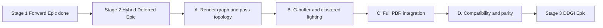

# Epic Plan: hybrid-deferred

**Status:** Closed (S4–S7 shipped 2026-06-15/16; **G4 Stage 2 accepted** 2026-06-16)  
**Scope:** Stage 2 of lighting evolution  
**Related:** [`forward-rendering-epic_Plan.md`](forward-rendering-epic_Plan.md), [`ddgi-lighting-epic_Plan.md`](ddgi-lighting-epic_Plan.md), [`../../Active-Plan.md`](../../Active-Plan.md), [`../../EngineArchitecture.md`](../../EngineArchitecture.md)

## Naming conventions

- **Stage:** `Stage 1 (Forward Baseline)`, `Stage 2 (Hybrid Deferred + PBR)`, `Stage 3 (Optional DDGI)`.
- **Preset:** `ForwardLit`, `HybridDeferred`.
- **Pass chain target:** `GBufferOpaque -> ClusterBuild -> DeferredLighting -> ForwardTransparent -> Post`.

## Goal

Evolve from full forward baseline to a hybrid renderer:

- **Opaque:** deferred + clustered deferred lighting.
- **Transparent:** forward path (depth-aware, sorted).
- **PBR:** complete material/light model on top of the hybrid pipeline.

## Non-goals

- Replacing transparent forward with deferred transparency tricks.
- Shipping DDGI in this stage (only dependency hooks).
- Removing mesh-shader / GPU-driven geometry pipeline work.

## Deliverables

- G-buffer geometry pass for opaque.
- Clustered deferred lighting pass for opaque shading.
- Transparent forward pass integrated as a separate pass in frame graph.
- Full PBR opaque path with direct + environment lighting support.
- Stable fallback and parity preset (`ForwardLit` vs `HybridDeferred`).

## Dependency graph

## Work breakdown

### A. Render graph and pass topology

**Deps:** Stage 1 handoff ([`../../forward-stage1.md`](../../forward-stage1.md) §2), S2 permutation/cache (done), **G1** (met). **S3:** [`s3-fg-v0_Plan.md`](s3-fg-v0_Plan.md).

- [ ] Promote frame graph implementation to required infra for hybrid path.
- [ ] Add explicit pass chain: `GBufferOpaque -> ClusterBuild -> DeferredLighting -> TransparentForward -> Post`.
- [ ] Define resource lifetime and barriers for G-buffer/depth/HDR targets.

### B. G-buffer and clustered lighting

**Deps:** A complete; requires S1/S3 draw-stream and GPU submission path to remain geometry source.

- [ ] Lock G-buffer format/packing policy and document memory/bandwidth tradeoffs.
- [ ] Implement opaque geometry pass writing G-buffer.
- [ ] Implement clustered light list build (compute) and lighting resolve pass.
- [ ] Ensure draw-stream and GPU-driven cull remain geometry submission source.

### C. Full PBR integration

**Deps:** B complete; depends on material contract from Stage 1 and shader feature bits carried over.

- [ ] Implement full PBR BRDF path for opaque deferred lighting.
- [ ] Complete IBL/environment integration for PBR consistency.
- [ ] Keep transparent forward shading policy compatible with global lighting inputs.

### D. Compatibility and parity

**Deps:** A/B/C complete; uses **S7** benchmark/preset tooling for A/B validation; **G4** Stage 2 acceptance (see [`SprintOutcomeValidation.md`](SprintOutcomeValidation.md) §G4).

- [ ] Keep `ForwardLit` preset as debug/fallback path.
- [ ] Add parity checklist (visual + perf) between forward baseline and hybrid path on fixed scenes.
- [ ] Update mesh-shader parity target to G-buffer/lighting compatibility (not forward-only parity).

## Acceptance

- [x] Opaque renders through `GBufferOpaque + DeferredLighting` (clustered) passes with full PBR support.
- [x] Transparent renders through forward pass with correct compositing over deferred opaque.
- [x] Presets allow deterministic switching between forward baseline and hybrid deferred.

## Exit criteria for Stage 3

Hybrid renderer exposes stable lighting inputs/outputs and frame-graph hooks required for optional DDGI integration.

