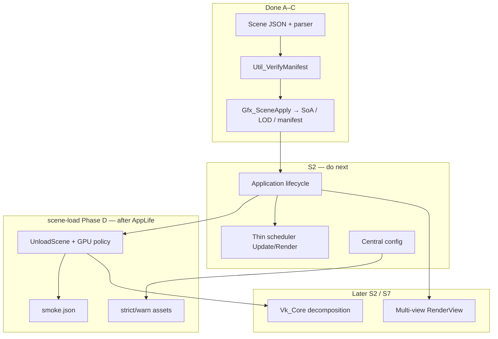

# Plan: scene-load

**Sprint:** S2 — Engine layering & hygiene (scene + lifecycle); ties to S1 resource tables  
**Status:** Closed (2026-05-29). Phases A–D shipped including GPU `UnloadScene`, `assetVerify`, `smoke.json`, ImGui in-process scene reload, and `Docs/CLI.md`.  
**Related:** [`../../EngineArchitecture.md`](../../EngineArchitecture.md) §3–4, [`../../SceneJSON.md`](../../SceneJSON.md), [`asset-root_Plan.md`](asset-root_Plan.md), [`startup-checks_Plan.md`](startup-checks_Plan.md), [`../../Active-Plan.md`](../../Active-Plan.md) § S2

## Problem

Today the demo path is **hard-coded**: `Util_DemoAssets.h` lists SPIR-V / mesh / texture paths; `UtilStartupChecks` verifies that fixed list before Vulkan init; `Vk_Core::InitVulkan` calls `CreateMesh` / `CreateTexture` with global strings. That was intentional **S0 bootstrap** but does not scale to multiple scenes, editor content, or a reproducible vertical slice.

**Goal:** Scene file on disk becomes the **single source of truth** for which assets exist; startup checks and GPU upload both derive from a **dependency manifest** collected from the scene—not from a C++ constant array.

## Goals

1. **Scene description on disk** (`Data/Scenes/…`) — meshes, textures, shader pairs, entities (transform + mesh + material refs).
2. **Parse without Vulkan** — scene load is a CPU-only phase in application lifecycle.
3. **`AssetManifest`** — deduplicated repo-relative paths from the scene closure (shaders + referenced content).
4. **Startup checks from manifest** — replace `UtilDemoAssets::kRequiredFiles` with `VerifyManifest(CollectDependencies(scene))`; still run **after** `UtilAssetConfig::Initialize`, **before** `vkCreateInstance`.
5. **Resource tables** — load paths once into `MeshTable` / `TextureTable` / material → pipeline; hot path uses integer ids only (aligns with S1 draw stream).
6. **CLI** — `--scene <logical-path>` (default e.g. `Data/Scenes/demo.json` during transition).

## Non-goals (this plan)

- Full gameplay / objective loop (parallel vertical slice).
- Async IO / background mesh decode (v1 may stay synchronous; reserve interfaces).
- Scene graph hierarchy (document flat matrices first; parent indices later).
- Bindless / GPU-driven path changes (S3–S6); scene format should not block those.
- Validating SPIR-V magic or OBJ topology at manifest stage (optional later; load-time fail-fast is enough for v1).

## Target architecture

Dependency direction matches `EngineArchitecture.md`:

```text
磁盘场景文件 (Data/Scenes/…)
    ↓ 解析（无 Vulkan）
SceneDesc / World（SoA + 资源引用：meshId, materialId, textureId…）
    ↓ CollectDependencies
AssetManifest（去重逻辑路径）
    ↓ VerifyManifest（存在性，仍在 Vulkan 之前）
    ↓ LoadSceneResources（同步 v1）
ResourceTables → GPU 句柄 / 描述符索引
    ↓ Extract（S1，无 Vulkan）
Draw stream → Vk_Core 只录制/提交
```

**Rule:** `Vk_Core` must not own scene JSON parsing or repo-relative path strings long-term.

## Migration from today

| Today (S0) | Target (scene-load) |
|------------|---------------------|
| `Util_DemoAssets.h` five constants | Paths in `Data/Scenes/demo.json` (or scene-specific file) |
| `UtilStartupChecks::VerifyRequiredAssets()` | `VerifyManifest(CollectDependencies(sceneDesc))` |
| Check in `VulkanDesktop.cpp` before `Run()` | After `LoadSceneDesc`, before `InitVulkan` |
| `Vk_Core` globals `vertShaderPath`, `CreateMesh(…)` in `InitVulkan` | `SceneResourceLoader` in lifecycle **load resources**; `Vk_Core` consumes tables |
| `UtilLoader::ResolvePath` | **Unchanged** — scene stores repo-relative paths under `assetRoot` |

Keep `Util_DemoAssets` only until the first scene file drives the same demo; then delete or reduce to a one-line default scene path constant.

## Design decisions

| Item | Decision |
|------|----------|
| Scene format (v1) | **JSON** under `Data/Scenes/` with `"version": 1`; parse via vendored **nlohmann/json** (`lib/nlohmann/json.hpp`) |
| Canonical vs runtime | Disk **AoS** `Gfx_SceneDesc` (string ids + paths); hydrate to `Gfx_SceneSoA` + table ids in Phase C only |
| Path strings | Repo-relative (`Data/…`, `VulkanDesktop/Shader_Generated/…`); resolve via `UtilLoader::ResolvePath` |
| Manifest | `CollectDependencies(SceneDesc)` returns `std::vector<std::string>` or small `AssetManifest` struct (paths + optional kind enum) |
| Startup policy | **Strict** at boot for manifest (missing file → throw, log `[STARTUP]`); runtime optional assets → warn + placeholder (parallel slice; config later) |
| Default scene | `Data/Scenes/demo.json` equivalent to current demo content |
| Lifecycle order (target) | `InitApp` → `LoadSceneDesc` → `VerifyManifest` → `InitWindow` → `InitRenderDevice` → **`LoadSceneResources`** → loop → **`UnloadScene`** → shutdown |
| Lifecycle order (today) | `main`: parse/verify/`SetLoadedScene` → `Run()` → `InitWindow` → `InitVulkan` (**still loads SoA + GPU tables inside InitVulkan**) → loop → `Clear()` |
| Scene authoring | [`SceneJSON.en.md`](SceneJSON.en.md), [`SceneJSON.md`](SceneJSON.md) |
| Modules (today) | `Gfx_SceneLoader`, `Gfx_SceneApply`, `Util_AssetManifest`; coordinator still `VulkanDesktop.cpp` + `Vk_Core` (no `Application` type yet) |

### Example scene sketch (v1)

```json
{
  "shaders": {
    "lit": {
      "vert": "VulkanDesktop/Shader_Generated/TriangleVert.spv",
      "frag": "VulkanDesktop/Shader_Generated/TrianglePix.spv"
    }
  },
  "meshes": [
    { "id": "viking_room", "path": "Data/Models/viking_room.obj" },
    { "id": "monkey", "path": "Data/Models/monkey_smooth.obj" }
  ],
  "textures": [
    { "id": "viking_albedo", "path": "Data/Textures/viking_room.png" }
  ],
  "materials": [
    { "id": "lit_viking", "shader": "lit", "texture": "viking_albedo" }
  ],
  "entities": [
    { "mesh": "viking_room", "material": "lit_viking", "transform": [ ... ] },
    { "mesh": "monkey", "material": "lit_viking", "transform": [ ... ] }
  ]
}
```

Exact schema is an implementation detail; plan steps below lock order, not every field.

## Implementation phases

### Phase A — Scene description (no GPU behavior change)

- [x] **A1** — Add `Data/Scenes/demo.json` mirroring current `Util_DemoAssets` set.
- [x] **A2** — `LoadSceneDesc(path)` → in-memory `SceneDesc` (paths + entity refs only).
- [x] **A3** — `CollectDependencies(SceneDesc)` → `AssetManifest`.
- [x] **A4** — Wire `--scene`; default `Data/Scenes/demo.json`.

### Phase B — Manifest-driven startup (replaces hard-coded checks)

- [x] **B1** — `VerifyManifest(manifest)` (same semantics as current `[STARTUP] OK/ERROR`).
- [x] **B2** — `VulkanDesktop`: `LoadSceneDesc` → `VerifyManifest` → `Run()` / Vulkan.
- [x] **B3** — Remove `Util_DemoAssets::kRequiredFiles`; keep demo paths only inside JSON until `Vk_Core` migrated.
- [x] **B4** — Document in `startup-checks_Plan.md` archived note: superseded by manifest path.

### Phase C — Lifecycle + resource load (S2 + S1)

- [x] **C1** — Boot order: load scene desc → verify → `SetLoadedScene` → `Run()` / Vulkan bootstrap → load resources. *(Does **not** close SprintPlan **Application lifecycle** — see [Handoff](#handoff--2026-05-27-pause).)*
- [x] **C2** — `Gfx_BuildResourceManifestFromSceneDesc` + `Vk_ResourceTables::LoadFromManifest` (one load per path).
- [x] **C3** — Removed `InitDemoSceneEntities` / `Gfx_BuildDemoResourceManifest` from `Vk_Core::InitVulkan`; shader paths from scene `shaders.lit`.
- [x] **C4** — `Gfx_PopulateSceneSoAFromSceneDesc` + `Gfx_BuildLodTableFromSceneDesc` (`logicalMeshes` in JSON).

### Legacy retained after Phase C

| Symbol | Why keep (for now) | Remove when |
|--------|-------------------|-------------|
| `Gfx_BuildDemoResourceManifest` | Reference manifest with the same dense ids as `Data/Scenes/demo.json`; compare/debug against `Gfx_BuildResourceManifestFromSceneDesc` without loading JSON; optional headless tests. | `Gfx_BuildDemoLodTable` is scene-driven and no code/docs depend on the C++ builder. |
| `Gfx_BuildDemoLodTable` | Still uses `UtilDemoAssets` logical/physical ids; not wired from `logicalMeshes` in JSON yet (runtime LOD **is** scene-driven via `Gfx_BuildLodTableFromSceneDesc`). | Delete demo LOD builder or make it a thin wrapper over scene tables. |
| `UtilDemoAssets` | Id constants for the two legacy builders above. | Both builders removed or scene-only. |

Runtime path (Phase C): `Gfx_LoadSceneDesc` → `SetLoadedScene` → `Gfx_BuildResourceManifestFromSceneDesc` → `Vk_ResourceTables::LoadFromManifest`.

### Phase D — Scene change & policy (complete)

**Gate:** satisfied (Application lifecycle, `LoadSceneResources` / `UnloadScene`).

#### D1 — GPU unload + reload-safe scene scope

- [x] **D1.1** — `mySceneDeletionQueue`: meshes/textures, sampler, descriptor pool, material param buffers, bindless table buffer register here (not device `myDeletionQueue`).
- [x] **D1.2** — Remove duplicate `CreateDescriptorPool` from `InitRenderDevice` (pool is scene-scoped; created in `InitSceneDescriptors` only).
- [x] **D1.3** — `Vk_GfxPipelineCache::DestroyScenePipelines` — immediate destroy + null handles; call from `UnloadScene` and `Vk_SwapchainHost::Recreate` when `myHasLoadedScene` (no pipeline lambdas on swapchain queue).
- [x] **D1.4** — `UnloadScene`: `vkDeviceWaitIdle`, `ShutdownImGui`, destroy pipelines, flush `mySceneDeletionQueue`, `myResourceTables.Clear()`, reset scene Vulkan handles (pool, sampler, material sets, frame descriptor set handles).
- [x] **D1.5** — `LoadSceneResources` requires prior unload (fail-closed if scene already loaded).

#### D2 — Strict vs warn manifest verify

- [x] **D2.1** — `Util_AssetVerifyPolicy` + `Util_VerifyManifest(manifest, policy)`; missing paths log `[STARTUP] WARN` and continue when `Warn`.
- [x] **D2.2** — `Config/engine.json` key `"assetVerify": "strict" | "warn"` (default `strict`); `UtilEngineConfig::GetAssetVerifyPolicy()`.

#### D3 — Smoke scene

- [x] **D3.1** — `Data/Scenes/smoke.json` (single entity, minimal mesh/texture/shader closure).
- [x] **D3.2** — `Data/Scenes/README.md` note + smoke-run with `--scene Data/Scenes/smoke.json`.

#### D4 — Runtime scene switch (follow-up to D1)

- [x] **D4.1** — ImGui **Scene** panel (`Util_ScenePanel`): list `Data/Scenes/*.json`, **Load selected scene**.
- [x] **D4.2** — `Application::TryProcessSceneReload`: `UnloadScene` → parse → `Util_VerifyManifest` → `LoadSceneResources`; restore previous scene on failure.
- [x] **D4.3** — `Docs/CLI.md` + `.cursor/rules/vulkan-smoke-test.mdc` (agent smoke CLI).

**Dev smoke:** `--smoke-frames N` + `--no-validation` for graceful `UnloadScene` → `Shutdown` (see `vulkan-smoke-test.mdc`).

#### Phase D verification

```powershell
# Build
& "<MSBuild.exe>" VulkanDesktop.sln /p:Configuration=Debug /p:Platform=x64 /v:m
Set-Location x64\Debug
.\VulkanDesktop.exe --no-validation --smoke-frames 2 --scene Data/Scenes/smoke.json
.\VulkanDesktop.exe --no-validation --smoke-frames 2 --scene Data/Scenes/demo.json
```

Log: `[SCENE] UnloadScene: GPU scene resources released`, `[RESOURCE-TABLE]` on load, `[APP] Engine exited run loop normally`, exit code 0.

## Handoff — 2026-05-29 closeout

### What is done (Phases A–D)

| Phase | Summary | Key symbols |
|-------|---------|-------------|
| **A** | JSON parse, `--scene`, dependency collect | `Gfx_LoadSceneDesc`, `Util_CollectDependencies`, `Data/Scenes/demo.json` |
| **B** | Manifest startup verify | `Util_VerifyManifest`; removed `Util_StartupChecks` |
| **C** | Scene drives SoA, LOD, resource tables | `Gfx_SceneApply`, `Gfx_BuildResourceManifestFromSceneDesc`, `LoadSceneResources` |
| **D** | GPU unload, verify policy, smoke scene, ImGui reload | `mySceneDeletionQueue`, `assetVerify`, `smoke.json`, `Util_ScenePanel`, `TryProcessSceneReload` |

### Remaining (out of scene-load scope)

| Item | Notes |
|------|--------|
| Scene graph / parent transforms | Non-goal v1 — `SceneJSON.md` §3.8 |
| Runtime warn for optional assets without restart | `assetVerify=warn` at boot only; per-entity optional assets deferred |
| CLI reload without ImGui | Use `--scene` at startup or Scene panel at runtime |

### Runtime flow today

```text
Application::Run
  UtilEngineConfig::Initialize
  Gfx_LoadSceneDesc + Util_VerifyManifest
  InitWindow → InitRenderDevice → LoadSceneResources
  loop: Update / Render / TryProcessSceneReload (ImGui Scene panel)
  UnloadScene (GPU + CPU) → Shutdown
```

### Dependency graph (what blocks what)



| If you work on… | Depends on | Unblocks |
|-----------------|------------|----------|
| **Application lifecycle** | Phase C (done) | Phase D1, multi-view, clean reload, moving load out of `InitVulkan` |
| **Phase D1 UnloadScene** | Application lifecycle | Scene hot-swap, D3 smoke |
| **Phase D2 warn policy** | Optional; central config helps | Vertical slice optional assets |
| **Phase D3 smoke.json** | D1 ideal; can author file earlier using [`SceneJSON.md`](SceneJSON.md) | CI / manual load tests |
| **Multi-view** | Lifecycle + Extract (S1 done) | S7 frame graph experiments |

### Recommended next (post closeout)

See `Docs/Active-Plan.md` S2 open items: descriptor layout verify, S2 hygiene (init hacks, queue sharing), shader reflection.

### Doc index for scene JSON

Authoring: **[`SceneJSON.en.md`](SceneJSON.en.md)** / [`SceneJSON.md`](SceneJSON.md). LOD: [`Data/LOD.md`](../Data/LOD.md). Example: [`Data/Scenes/demo.json`](../Data/Scenes/demo.json).

## Files (expected touch list)

| Area | Paths |
|------|--------|
| Data | `Data/Scenes/demo.json`, optional `smoke.json` |
| Util / Gfx | `Gfx_SceneDesc.h`, `Gfx_SceneLoader.{h,cpp}`, `Util_AssetManifest.{h,cpp}` |
| Third-party | `lib/nlohmann/json.hpp` (v3.11.3, header-only) |
| App | `VulkanDesktop.cpp`, future `Application.{h,cpp}` |
| RenderCore | `Vk_Core.cpp` (peel init hacks), resource table headers |
| Docs | `scene-load_Progress.md` (this folder), `../../Active-Plan.md`, repo `README.md` (run with `--scene`) |
| Deprecate | `Util_DemoAssets.h` after Phase B/C |

## Anti-patterns

- Parsing scene JSON inside `Vk_Core`.
- Per-frame `LoadMesh(path)` — paths only at load time; hot path uses ids.
- Global hard-coded asset list in C++ for multi-scene builds.
- Skipping manifest verify before `vkCreateInstance`.

## Verification

1. Build Debug\|x64 after each phase that changes compile surface.
2. Run with default scene: same visual as today; log shows manifest paths then `[VULKAN]`.
3. Run with `--scene Data/Scenes/demo.json` from `x64\Debug` and from repo root via `--asset-root`.
4. Delete one manifest entry file: fail before Vulkan instance; clear `[STARTUP]` error with logical + resolved path.
5. Grep: no `UtilDemoAssets::kRequiredFiles` after Phase B; no demo mesh paths in `InitVulkan` after Phase C.

## Risks

- Hand-rolled JSON parser limits schema evolution — document fields or adopt a tiny library when schema grows.
- Descriptor/pipeline rebuild when materials change — must align with `Vk_DescriptorPolicy.h` (S2 layout task).
- Transition period: duplicate paths in JSON and `Vk_Core` until Phase C complete — keep phases short.

## Rollback

- Revert to `Util_DemoAssets` + `VerifyRequiredAssets` if scene loader blocks S1; manifest API can remain while demo JSON is optional.
