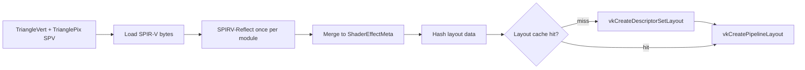

# Plan: shader-layout-from-reflection (2b) — DRAFT

**Sprint:** S2 — Shader systems (phase **2b**)  
**Status:** **Closed (2026-06-01)**  
**Prerequisite:** [shader-reflection (2a)](Archived/plans/shader-reflection_Plan.md) — **done 2026-06-01**  
**Roadmap:** [`Active-Plan.md`](Active-Plan.md) — *Shader layout from reflection (2b)*

---

## When to start this task

Start **2b** when you are ready to **change runtime descriptor layout creation** (not merely validate shaders). Good triggers:

- Adding **permutation variants** that would multiply hand-written `VkDescriptorSetLayout` code.
- A sprint focus on **Shader systems / Stage 1 forward** with new lit passes.
- **Defer** if the next work is scene-only, multi-view, or S3 GPU cull — **2a** (`reflection_lit.json` + MSBuild contract) is sufficient until then.

**On start:** run vibe **Phase 1** (confirm landing details) → copy/rename is optional; create `Docs/shader-layout-from-reflection_Progress.md` → set Status to **Open**.

---

## Problem

**2a** guarantees SPIR-V matches `DescriptorContract_LitBatch.json` at **compile time**, but `Vk_DescriptorSystem::CreateDescriptorSetLayout` still **hand-writes** `VkDescriptorSetLayoutBinding` from `Vk_Enum.h`. Duplication remains; permutations and new effects will not scale.

**2b** introduces **data-driven layouts**: reflect → in-engine `ShaderEffectMeta` → `vkCreateDescriptorSetLayout` + **hash cache**, eliminating handwritten layout for the **lit batch path** first.

---

## Goals

1. **`ShaderEffectMeta`** (or equivalent) built from SPIR-V at **shader load** / pipeline create time — **no SPIRV-Reflect in the render loop**.
2. **Stage merge** across vert+frag in one effect: `stageFlags |=` per `(set, binding)`.
3. **`DescriptorLayoutCache`**: `hash(layoutData)` → reuse `VkDescriptorSetLayout`.
4. Replace **`Vk_DescriptorSystem::CreateDescriptorSetLayout`** lit-batch path with meta-driven creation; **behavior parity** with today (batch Set 0/1/2).
5. **Milestone validation:** intentional wrong descriptor bind → Validation layer reports layout/type mismatch (proves Vulkan consumes reflected layout).
6. **Keep 2a** MSBuild guard (`ShaderReflect` + contract JSON) as compile-time safety net.

---

## Non-goals (2b)

- Full bindless layout auto-gen (optional follow-up or **2d**); batch lit first.
- `VkPipelineCache` / disk pipeline blob (**2c** — different cache).
- Permutation registry implementation (**separate** Active-Plan line; design should share `ShaderEffectMeta`).
- Runtime SPIRV-Reflect each frame.
- Removing `Vk_Enum.h` entirely in one step (migrate incrementally).

---

## Prerequisites (from 2a — already in tree)

| Artifact | Path |
|----------|------|
| Reflect tool | `VulkanDesktop/Tools/ShaderReflect/` |
| Lit reflection JSON | `VulkanDesktop/Shader_Generated/reflection_lit.json` |
| Contract | `VulkanDesktop/Shader/DescriptorContract_LitBatch.json` |
| Policy | `Vk_DescriptorPolicy.h`, `EngineArchitecture.md` §5.3 |

**Landing (confirmed):** runtime load `VulkanDesktop/Shader_Generated/reflection_lit.json` via `UtilLoader::ResolvePath`; Set 2 `UNIFORM_BUFFER` → `UNIFORM_BUFFER_DYNAMIC` in `ApplyLitBatchLayoutOverrides` (not in SPIR-V/contract JSON).

---

## Data structures (engine — target)

```cpp
struct ShaderResource {
    uint32_t           myBinding;
    VkDescriptorType   myType;
    uint32_t           myCount;
    VkShaderStageFlags myStageFlags;
    std::string        myName;  // debug / future material UI
};

struct DescriptorSetLayoutData {
    uint32_t mySetNumber;
    std::unordered_map<uint32_t, ShaderResource> myBindings;
};

struct ShaderEffectMeta {
    std::unordered_map<uint32_t, DescriptorSetLayoutData> mySets;
    std::vector<VkPushConstantRange> myPushConstants;  // empty for current lit demo
};
```

**Hash:** combine per-binding `(binding, type, count, stageFlags)` for all sets → `size_t` key into `std::unordered_map<size_t, VkDescriptorSetLayout>`.

---

## Execution pipeline (runtime — shader load / pipeline create)



1. **Parse** each SPIR-V module (same rules as `ShaderReflect` merge).
2. **Merge** stages (`stageFlags |=`).
3. **Convert** to `VkDescriptorSetLayoutBinding[]` sorted by `binding`.
4. **Lookup** hash cache; create on miss; store handle.
5. **Build** `VkPipelineLayout` with ordered set layouts `0,1,2` (batch path).

**Dynamic UBO policy:** SPIR-V type remains `UNIFORM_BUFFER`; set `VK_DESCRIPTOR_TYPE_UNIFORM_BUFFER` with **dynamic** flag only at pool/descriptor allocation (unchanged policy).

---

## Touch list (expected)

| Area | Change |
|------|--------|
| `VulkanDesktop/RenderCore/Vk_ShaderEffectMeta.h` (new) | Meta + hash + cache types |
| `VulkanDesktop/RenderCore/Vk_ShaderEffectMeta.cpp` (new) | Reflect/load, merge, create layouts |
| `VulkanDesktop/RenderCore/Vk_DescriptorSystem.cpp` | Lit path delegates to meta; shrink hand-written bindings |
| `VulkanDesktop/RenderCore/Vk_GfxPipelineCache.cpp` | Obtain layout from effect meta / cache |
| `VulkanDesktop/Tools/ShaderReflect/` | Optional: shared library or duplicated merge logic (DRY) |
| `Docs/EngineArchitecture.md` | §5.7: 2b policy, cache semantics |
| `Docs/Active-Plan.md` | Close 2b line on done |

**Untouched initially:** bindless layout path (`myBindlessMaterialSetLayout`), Gfx/, shaders (unless layout parity fix).

---

## Implementation plan (ordered — check on start)

### M1 — Meta + reflect at load (no Vulkan swap yet)

- [x] Add `ShaderEffectMeta` types + unit-style log dump from existing SPV (console or dev command).
- [x] Reuse merge logic from `ShaderReflect` (extract shared `.cpp` or read `reflection_lit.json` for parity).
- [x] **Exit:** Meta dump matches `reflection_lit.json` / contract.

### M2 — Layout cache + create descriptors

- [x] Implement hash + `DescriptorLayoutCache`.
- [x] `CreateDescriptorSetLayoutsFromMeta(ShaderEffectMeta)` → vector of `VkDescriptorSetLayout`.
- [ ] Feature flag or `#ifdef` to compare handles against legacy creation (dev only) — deferred; smoke parity sufficient for v1.

### M3 — Wire lit batch path

- [x] `Vk_DescriptorSystem::InitDeviceLayouts` — lit batch uses meta path.
- [x] Remove duplicated binding tables for Set 0/1/2 **when parity proven**.
- [x] Swapchain recreate / material rebuild contracts unchanged (`Vk_DescriptorPolicy.h`).

### M4 — Validation milestone

- [x] Dev-only wrong-type or wrong-set bind test; capture Validation message (`--descriptor-layout-mismatch-test` + `--validation`).
- [x] Document in Progress closeout.

### M5 — Docs + close

- [x] Architecture §5.7 / §5.3 note dynamic vs reflected types.
- [x] Build + smoke; archive task; Active-Plan 2b → Archived-Plan.

---

## Verification

```powershell
& "<MSBuild.exe>" VulkanDesktop.sln /p:Configuration=Debug /p:Platform=x64 /v:m
Set-Location x64\Debug
.\VulkanDesktop.exe --no-validation --smoke-seconds 6
```

**Success:**

- Exit 0; demo scene unchanged visually.
- `[DESCRIPTOR]` / layout logs show cache hit on second material sharing same layout.
- 2a still runs on shader compile (`[SHADER-REFLECT] lit_batch OK`).
- Optional: Validation layer catches intentional mismatch test.

---

## Risks

| Risk | Mitigation |
|------|------------|
| Behavior regression vs hand layout | Side-by-side compare in M2; smoke + RenderDoc |
| Cache key collision | Use stable sorted binding serialization for hash |
| Dual maintenance Reflect tool vs engine | Shared merge module or JSON-only runtime load |
| Bindless path drift | Keep hand layout for bindless until **2d** |

---

## Relation to 2c / 2d

| Phase | Task |
|-------|------|
| **2c** | Permutation registry + **VkPipelineCache** (graphics pipelines) |
| **2d** | Bindless SPV contract + optional material bind validation |

**2b** should define **layout groups** so permutations sharing bindings reuse the same cache entry.

---

*Draft 2026-06-01. Author before implementation; confirm Phase 1 landing when starting vibe task.*
