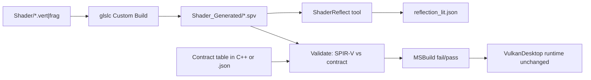

# Plan: shader-reflection

**Sprint:** S2 — Shader systems  
**Status:** Closed (2026-06-01) — Phase 2a only; 2b/2d tracked in Active-Plan  
**Roadmap:** [`Active-Plan.md`](Active-Plan.md) — *Shader reflection: offline SPIRV-Reflect → JSON bindings; validate against `Vk_DescriptorPolicy.h`*  
**Related:** S0 descriptor policy — [`Archived/plans/descriptor-strategy_Plan.md`](Archived/plans/descriptor-strategy_Plan.md); S2 layout audit — [`Archived/plans/descriptor-layout-verify_Plan.md`](Archived/plans/descriptor-layout-verify_Plan.md)

---

## 1. Why this task exists

Today the **source of truth for descriptor bindings is split across four places**:

| Layer | What it defines |
|-------|-----------------|
| GLSL | `layout(set = N, binding = M)` in `TriangleVertex.vert`, `TriangleFrag_Lit.frag`, … |
| SPIR-V | Compiled binding layout in `Shader_Generated/*.spv` |
| C++ enums | `Vk_Enum.h` (`eVk_CameraBinding`, …) |
| C++ create | `Vk_DescriptorSystem::CreateDescriptorSetLayout` — `VkDescriptorSetLayoutBinding` from those enums |

`descriptor-layout-verify` (2026-05-29) **audited and logged** the batch vs bindless contract at runtime. It did **not** add a machine check that SPIR-V and C++ still agree after every shader edit.

**Shader reflection** closes that gap: after each glslc compile, read the **actual SPIR-V layout** and compare it to the **locked engine contract**. When someone changes `binding = 2` in a `.frag` but forgets `Vk_Enum.h`, the **build fails** instead of a black screen or validation spam at runtime.

This task is **foundational for S2/S7**, not cosmetic:

- **Permutation registry** (next Active-Plan line) needs stable binding metadata per variant.
- **Pipeline cache / presets** assume layout groups do not drift silently.
- Future **layout codegen** can consume the same JSON (or replace it with generated headers); JSON is the human-readable v1 artifact.

---

## 2. Why output JSON? (default scheme)

JSON is **not required by Vulkan**. It is the default **intermediate artifact** for this repo because:

1. **Offline & CI-friendly** — Validate without launching `VulkanDesktop.exe` or linking SPIRV-Reflect into the game.
2. **Reviewable** — PRs can show binding changes in a text diff (`reflection_lit.json`).
3. **Decoupled** — A small `ShaderReflect` host tool links SPIRV-Reflect once; the engine only runs a thin validator (or the tool validates in the same MSBuild step).
4. **Reusable** — Permutation tables, docs, and later codegen read one schema; avoid N ad-hoc parsers.
5. **Debuggable** — When validation fails, open JSON + contract table side by side.

**Alternatives deferred:** runtime-only reflect (heavier engine); pure codegen with no JSON (v2); warn-only without fail (too weak for a locked policy).

---

## 3. Scope

### 3.1 In scope (v1 — default)

| Item | Detail |
|------|--------|
| SPIR-V inputs | `Shader_Generated/TriangleVert.spv`, `TrianglePix.spv` (batch lit path) |
| Tool | Offline reflect + JSON emit + contract validate |
| Contract | Batch path: Set 0 frame (camera + env), Set 1 material (sampler + alpha UBO), Set 2 object (`GpuObjectData` dynamic UBO) |
| Integration | Run **after** `CompileShader_Glslc.bat` in the same Custom Build chain |
| Failure mode | **Non-zero exit** → MSBuild fails (strict) |
| Docs | This plan; `EngineArchitecture.md` §5.7 bullet; log tag `[SHADER-REFLECT]` |

### 3.2 Phase 1.5 (same task, optional milestone — bindless)

| Item | Detail |
|------|--------|
| SPIR-V | `TrianglePix_Bindless.spv` |
| JSON | `reflection_lit_bindless.json` or merged manifest with `"pipeline": "batch"|"bindless"` |
| Contract | Set 1 = texture array + material SSBO (`eVk_BindlessMaterialBinding`) |

*Recommendation:* implement **batch lit first**, land build+smoke, then add bindless in a second Progress checkpoint (same Plan, avoids blocking on bindless descriptor flags).

### 3.3 Out of scope

- Generating `vkCreateDescriptorSetLayout` calls from JSON (backlog: layout codegen).
- Permutation / `#define` variant compilation.
- Reflecting push constant blocks (none on demo lit layout today).
- Changing GLSL binding layout unless reflection proves current shaders wrong.
- Hot-reload or runtime SPIRV-Reflect inside `VulkanDesktop.exe`.

---

## 4. Architecture (data flow)



**Principle:** Reflection reads **SPIR-V**; validation compares to **engine contract** (`Vk_Enum` + policy set indices). Runtime continues to use hand-written `Vk_DescriptorSystem` until a future task generates it.

---

## 5. Locked contract (batch lit v1)

This table is what the validator enforces. It must match `Vk_Enum.h`, `Vk_DescriptorSystem.cpp`, and current GLSL.

### Set 0 — Frame (`eVk_SetFrame = 0`)

| Binding | Enum | SPIR-V type (expected) | Stages | GLSL block / resource |
|---------|------|------------------------|--------|------------------------|
| 0 | `eVk_CameraBinding` | `VK_DESCRIPTOR_TYPE_UNIFORM_BUFFER` | VERTEX | `CameraData` in `TriangleVertex.vert` |
| 1 | `eVk_EnvBinding` | `VK_DESCRIPTOR_TYPE_UNIFORM_BUFFER` | FRAGMENT | `EnvironmentData` in `TriangleFrag_Lit.frag` |

*Note:* Camera UBO appears only in vert SPIR-V; env only in frag SPIR-V. Validator must **merge** bindings per set across all shaders in the **pipeline group** (see §6.2).

### Set 1 — Material (`eVk_SetMaterial = 1`)

| Binding | Enum | Type | Stages | GLSL |
|---------|------|------|--------|------|
| 0 | `eVk_MaterialTextureBinding` | `COMBINED_IMAGE_SAMPLER` | FRAGMENT | `sampler2D texSampler` |
| 1 | `eVk_MaterialAlphaBinding` | `UNIFORM_BUFFER` | FRAGMENT | `MaterialData` |

### Set 2 — Object (`eVk_SetObject = 2`)

| Binding | Enum | Type | Stages | GLSL |
|---------|------|------|--------|------|
| 0 | `eVk_ObjectModelBinding` | `UNIFORM_BUFFER` | VERTEX | `ObjectData` in `TriangleVertex.vert` |

**Policy:** Set 2 uses `UNIFORM_BUFFER_DYNAMIC` at **allocate/bind** time (`VkDescriptorPolicy::kUseDynamicUniformForInstanceSlab`). SPIR-V reports `UniformBuffer`; reflect type maps to `UNIFORM_BUFFER` (dynamic is a pool/descriptor flag, not a separate SPIR-V resource type). Validator documents this rule explicitly to avoid false failures.

### Pipeline layout order

`VkPipelineLayout` set order: **0 = frame, 1 = material, 2 = object** (`VkDescriptorPolicy::kSetFrame/Material/Object`).

---

## 6. JSON artifact design

### 6.1 File location

| File | Purpose |
|------|---------|
| `VulkanDesktop/Shader_Generated/reflection_lit.json` | Batch lit merged manifest (committed or generated — see §6.4) |

*Do not* write JSON into the first MSBuild `Outputs` `.spv` path (see `shader-build.mdc` — stdout corruption risk). Emit via dedicated tool to a **separate** output file listed in Custom Build `Outputs` if MSBuild tracks it.

### 6.2 Schema (v1)

```json
{
  "schemaVersion": 1,
  "pipelineGroup": "lit_batch",
  "generatedUtc": "2026-06-01T12:00:00Z",
  "shaders": [
    {
      "spv": "Shader_Generated/TriangleVert.spv",
      "stage": "vertex",
      "entryPoint": "main"
    },
    {
      "spv": "Shader_Generated/TrianglePix.spv",
      "stage": "fragment",
      "entryPoint": "main"
    }
  ],
  "sets": [
    {
      "set": 0,
      "bindings": [
        {
          "binding": 0,
          "name": "CameraData",
          "descriptorType": "UNIFORM_BUFFER",
          "stages": ["VERTEX"],
          "seenIn": ["TriangleVert.spv"]
        },
        {
          "binding": 1,
          "name": "EnvironmentData",
          "descriptorType": "UNIFORM_BUFFER",
          "stages": ["FRAGMENT"],
          "seenIn": ["TrianglePix.spv"]
        }
      ]
    }
  ]
}
```

**Merge rules:**

- Union bindings per `set` across all SPIR-V in the group.
- Same `(set, binding)` must agree on `descriptorType` and compatible `stages` union; conflict → validate error.
- `name` from SPIR-V debug / block name (informational; not used for strict match in v1).

### 6.3 Contract file (validator input)

**Option A (recommended v1):** `VulkanDesktop/Shader/DescriptorContract_LitBatch.json` — same binding table as §5, checked into git. Validator: `reflect(spv*)` merged vs contract JSON.

**Option B:** Contract embedded in `ShaderReflect` C++ as a static table mirroring `Vk_Enum` — single source risk if enum changes without updating tool.

**Decision for implement:** **Option A** for reviewability; `Vk_Enum` and contract JSON updated together in the same PR when bindings change (document in plan step P4).

### 6.4 Git policy for generated JSON

| Approach | Pros | Cons |
|----------|------|------|
| **Commit `reflection_lit.json`** | CI without SDK tool; diff visible | Occasional merge noise |
| **Gitignore, generate only on build** | Clean tree | Fresh clone must build shaders first |

**Default:** **Commit** `reflection_lit.json` + contract JSON; Custom Build regenerates on shader compile; PR updates JSON when GLSL changes.

---

## 7. Tooling: `ShaderReflect`

### 7.1 Location & build

| Piece | Path |
|-------|------|
| Sources | `VulkanDesktop/Tools/ShaderReflect/` — `main.cpp`, link `lib/VulkanSDK/.../SPIRV-Reflect/spirv_reflect.c` |
| Output exe | `VulkanDesktop/Tools/ShaderReflect/bin/ShaderReflect.exe` (or `x64/ShaderReflect.exe` under repo) |
| SDK | Bundled `SPIRV-Reflect` in `lib/VulkanSDK/1.2.182.0/Source/SPIRV-Reflect/` (no network fetch) |

**CLI sketch:**

```text
ShaderReflect.exe --group lit_batch ^
  --spv ..\Shader_Generated\TriangleVert.spv@vertex ^
  --spv ..\Shader_Generated\TrianglePix.spv@fragment ^
  --contract ..\Shader\DescriptorContract_LitBatch.json ^
  --out ..\Shader_Generated\reflection_lit.json
```

Exit codes: `0` = reflect + validate OK; `1` = SPIR-V read error; `2` = contract mismatch (print human-readable diff).

### 7.2 SPIRV-Reflect usage (implementation notes)

1. `spvReflectCreateShaderModule` / `spvReflectGetShaderModule` on each `.spv` file.
2. Enumerate `SpvReflectDescriptorBinding` — map `descriptor_type` → string (`UNIFORM_BUFFER`, `COMBINED_IMAGE_SAMPLER`, …).
3. Map `shader_stage` → `VERTEX` / `FRAGMENT`.
4. Group by `set` + `binding`.
5. Write JSON (minimal dep: hand-rolled or nlohmann if already in repo — prefer **hand-rolled** for one file to avoid new dep).
6. Load contract JSON; compare set count, binding count, types, stage masks per binding.
7. `spvReflectDestroyShaderModule` cleanup.

**Logging:** stderr + append to `Logs/shader_compile_log.txt` via `ShaderBuild_Common.bat` wrapper (same as glslc).

### 7.3 Type mapping table (SPIRV-Reflect → contract strings)

| SpvReflectDescriptorType | contract `descriptorType` |
|--------------------------|----------------------------|
| `SPV_REFLECT_DESCRIPTOR_TYPE_UNIFORM_BUFFER` | `UNIFORM_BUFFER` |
| `SPV_REFLECT_DESCRIPTOR_TYPE_COMBINED_IMAGE_SAMPLER` | `COMBINED_IMAGE_SAMPLER` |
| `SPV_REFLECT_DESCRIPTOR_TYPE_STORAGE_BUFFER` | `STORAGE_BUFFER` |
| … | Extend when bindless phase adds SSBO array |

---

## 8. Build integration

### 8.1 Script chain

Extend shader compile flow (do **not** echo to stdout in compile bat):

```
CompileShader.bat
  → CompileShader_Glslc.bat   (existing)
  → ReflectShaders_Lit.bat    (new: build ShaderReflect if stale, run CLI, fail on validate)
```

`ReflectShaders_Lit.bat`:

1. Resolve paths relative to `Shader/`.
2. If `ShaderReflect.exe` missing or older than sources → MSBuild project or `cl` one-off (document in Progress).
3. Run reflect + validate.
4. `exit /b` non-zero on failure.

### 8.2 vcxproj Custom Build

Update `VulkanDesktop.vcxproj` `TriangleVertex.vert` Custom Build:

| Field | Change |
|-------|--------|
| `Command` | Still `call CompileShader.bat` (batch calls reflect at end) |
| `Outputs` | Add `Shader_Generated\reflection_lit.json` **after** spv outputs (order matters for MSBuild) |
| `AdditionalInputs` | Add `TriangleFrag_Lit_Bindless.frag` (already), `DescriptorContract_LitBatch.json`, `ReflectShaders_Lit.bat`, ShaderReflect sources/exe |

Reference: `.cursor/rules/shader-build.mdc` — no stdout to first output file.

### 8.3 Solution build

Full `VulkanDesktop.sln` Debug|x64 must fail if:

- Contract expects binding 1 = UBO but SPIR-V has sampler at binding 1.
- Set 2 missing from vert SPIR-V.

Optional dev test (local only, not committed): temporarily break GLSL binding → confirm MSBuild error message cites set/binding.

---

## 9. Runtime engine (minimal touch)

| Component | v1 change |
|-----------|-----------|
| `VulkanDesktop.exe` | **No** SPIRV-Reflect link |
| `Util_StartupChecks` | Optional: verify `reflection_lit.json` exists next to `.spv` (warn if missing — **secondary** to MSBuild gate) |
| `Vk_DescriptorSystem` | **No** behavior change |

Optional one-line at scene load (informational):

`[SHADER-REFLECT] lit_batch contract OK (build-time validated)` — only if we add a cheap JSON timestamp read; **skip in v1** to keep scope small.

---

## 10. Implementation plan (ordered, checkable)

### Milestone M0 — Scaffold & contract

- [x] **P0.1** Add this Plan + `shader-reflection_Progress.md`; update `Docs/README.md` **Active now**.
- [x] **P0.2** Add `VulkanDesktop/Shader/DescriptorContract_LitBatch.json` from §5 table (with comments in README snippet in Shader folder optional).
- [x] **P0.3** Document merge rules + dynamic UBO note in contract file header comment.

**Exit:** Contract file reviewed; no tool yet.

---

### Milestone M1 — ShaderReflect tool (reflect only)

- [x] **P1.1** Create `VulkanDesktop/Tools/ShaderReflect/` project (Console, x64) or documented `cl` line; link SPIRV-Reflect C API.
- [x] **P1.2** Implement SPIR-V load + per-module descriptor enumeration.
- [x] **P1.3** Implement merge across SPV list → in-memory graph.
- [x] **P1.4** Emit `reflection_lit.json` per §6.2 schema (`schemaVersion`, `sets[]`).
- [x] **P1.5** Manual run against current `TriangleVert.spv` / `TrianglePix.spv`; eyeball JSON vs §5.

**Exit:** `ShaderReflect.exe --out only` produces sensible JSON; no validate yet.

---

### Milestone M2 — Validator (contract compare)

- [x] **P2.1** Load `DescriptorContract_LitBatch.json`.
- [x] **P2.2** Compare merged reflect result: missing/extra sets; missing/extra bindings; type mismatch; stage mask mismatch (binding must appear in at least the stages contract requires).
- [x] **P2.3** Print actionable errors: `Set 1 binding 0: expected COMBINED_IMAGE_SAMPLER, got UNIFORM_BUFFER (TrianglePix.spv)`.
- [x] **P2.4** Wire `--contract` CLI flag; exit code 2 on mismatch.
- [x] **P2.5** Negative test: local contract tweak → tool fails.

**Exit:** Validator catches intentional drift.

---

### Milestone M3 — Build chain

- [x] **P3.1** Add `ReflectShaders_Lit.bat`; log via `ShaderBuild_Common.bat`.
- [x] **P3.2** Append call at end of `CompileShader_Glslc.bat` or `CompileShader.bat` (after all spv succeed).
- [x] **P3.3** Update `VulkanDesktop.vcxproj` Custom Build outputs/inputs.
- [x] **P3.4** Add `ShaderReflect` to solution or pre-build step to build exe (avoid stale tool).
- [x] **P3.5** Full MSBuild Debug|x64 — pass with current shaders.

**Exit:** Clean build produces/updates JSON; shader edit without contract update breaks build.

---

### Milestone M4 — Docs & architecture sync

- [x] **P4.1** `EngineArchitecture.md` §5.7 — note JSON path, MSBuild validation, pointer to contract file.
- [x] **P4.2** `shader-build.mdc` — reflect step documented.
- [ ] **P4.3** `cpp-comments.mdc` cross-ref: when changing `eVk_*`, update contract JSON + GLSL in same change set *(deferred — optional hygiene)*.

**Exit:** docs-roadmap-arch-sync satisfied.

---

### Milestone M5 — Verification & task close

- [x] **P5.1** MSBuild `Debug|x64` exit 0.
- [x] **P5.2** Smoke: `.\VulkanDesktop.exe --no-validation --smoke-seconds 6` exit 0.
- [x] **P5.3** Log check: `shader_compile_log.txt` contains `[SHADER-REFLECT]` OK line; `engine_runtime_log.txt` unchanged behavior (no new ERROR).
- [x] **P5.4** Close Plan; Progress → Closeout; move to `Archived/plans/`; Active-Plan **2a** line → Archived-Plan.

**Exit:** vibe-coding task close criteria met.

---

### Milestone M6 — Bindless extension (optional, same sprint or follow-up)

- [ ] **P6.1** `DescriptorContract_LitBindless.json` for `TrianglePix_Bindless.spv` + shared vert/object sets.
- [ ] **P6.2** Extend tool or second group `lit_bindless` → `reflection_lit_bindless.json`.
- [ ] **P6.3** Hook into same Custom Build after bindless spv compile.
- [ ] **P6.4** Build + smoke again.

---

## 11. Build / smoke-run (task close)

```powershell
& "${env:ProgramFiles(x86)}\Microsoft Visual Studio\Installer\vswhere.exe" -latest -requires Microsoft.Component.MSBuild -find MSBuild\**\Bin\MSBuild.exe
& "<MSBuild.exe>" VulkanDesktop.sln /p:Configuration=Debug /p:Platform=x64 /v:m
Set-Location x64\Debug
.\VulkanDesktop.exe --no-validation --smoke-seconds 6
```

**Success signals:**

- MSBuild fails when contract JSON disagrees with SPIR-V (manual negative test).
- MSBuild passes on clean tree; `Shader_Generated/reflection_lit.json` updated.
- `Logs/shader_compile_log.txt`: `[SHADER-REFLECT] lit_batch OK`.
- Runtime smoke exit 0; `[SCENE] LoadSceneResources completed`.

---

## 12. Risks and mitigations

| Risk | Mitigation |
|------|------------|
| MSBuild corrupts `.spv` if bat echoes to stdout | Reflect only in separate bat; log to stderr/file (`shader-build.mdc`) |
| Vert/frag expose different subsets of set 0 | Merge per set across group; contract lists full set |
| `UNIFORM_BUFFER` vs `UNIFORM_BUFFER_DYNAMIC` in SPIR-V | Document: reflect sees UBO; policy dynamic at alloc |
| ShaderReflect exe not built on clean machine | Add to solution build dependency or build in Reflect bat |
| JSON merge conflicts | Small file; document regen in PR template |
| SPIRV-Reflect version vs glslc SPIR-V | Pin both to bundled Vulkan SDK 1.2.182.0 |

**Rollback:** Remove reflect call from `CompileShader.bat`; delete Custom Build output for JSON; keep contract file for later.

---

## 13. Acceptance criteria (summary)

- [x] Offline tool reflects batch lit SPV → `reflection_lit.json`.
- [x] Contract validation **fails the build** on mismatch.
- [x] No SPIRV-Reflect inside `VulkanDesktop` runtime.
- [x] `Vk_DescriptorSystem` behavior unchanged; smoke unchanged.
- [x] Architecture §5.7 and shader-build docs updated.
- [ ] Optional M6: bindless group validated *(moved to Active-Plan 2d)*.

---

## 14. What comes after this task

| Follow-up | Depends on reflection |
|-----------|------------------------|
| Permutation registry | Variant SPIR-V + binding stability per perm key |
| Layout codegen | Consume JSON → C++ layout helpers |
| Pipeline cache (S2) | Stable layout groups across shader versions |
| In-engine material editor | Inspect JSON / generated tables |

---

## 15. Phase 2b / 2c 与 Active-Plan 对齐表

本任务（**Phase 2a**）与路线图终态（数据驱动 `ShaderEffectMeta` + 自动 Layout + 哈希缓存）的关系：

| 阶段 | 名称 | 交付物 | Active-Plan 对应 | 你的方案对应 |
|------|------|--------|------------------|--------------|
| **2a** | **本 Plan（进行中）** | JSON + contract + MSBuild 校验；`Vk_DescriptorSystem` 不变 | `[ ]` **Shader reflection**（本条） | M1：离线解析 + 合并规则验证 |
| **2b** | Layout from reflection | `ShaderEffectMeta`、替换 `CreateDescriptorSetLayout`、`DescriptorLayoutCache`（hash） | 建议新增 `[ ]` **shader-layout-from-reflection**（见 §16） | M2–M3：反射驱动 Layout + Validation 测试 |
| **2c** | Perm + graphics cache | Permutation registry、`VkPipelineCache` + disk | `[ ]` Permutation、`[ ]` Pipeline cache | 多变体 + pipeline 缓存（非 descriptor layout cache） |
| **2d** | Bindless reflect verify | 反射 name/type vs 全局 bindless 表 | 建议新增 `[ ]` **shader-reflection-bindless-verify**（见 §16）；M6 可选并入 | Bindless 绑定合法性校验 |

**不会自动发生的跳跃：** 完成 2a **≠** 消灭手写 Layout；必须把 **2b** 从 Backlog 升格为 Sprint `[ ]` 并单独 vibe 任务。

**命名区分（避免与 S2 Pipeline cache 混淆）：**

| 术语 | 含义 |
|------|------|
| **Descriptor layout cache** | `hash(ShaderEffectMeta)` → `VkDescriptorSetLayout`（2b） |
| **Pipeline cache（路线图）** | `VkPipelineCache` + `Cache/pipeline_*.bin`（2c） |

---

## 16. 建议粘贴进 `Active-Plan.md` 的文案

在 **§ S2 → Shader systems** 中，将现有 reflection 行保留，并 **追加** 以下两条（Backlog 中「layout codegen」可保留作索引或删除以免重复）：

```markdown
- [ ] **Shader reflection (2a):** offline SPIRV-Reflect → `Shader_Generated/reflection_lit.json`; validate vs `Shader/DescriptorContract_LitBatch.json` on MSBuild — `shader-reflection_Plan.md`.
- [ ] **Shader layout from reflection (2b):** `ShaderEffectMeta` + descriptor layout hash cache; replace hand-written `Vk_DescriptorSystem::CreateDescriptorSetLayout` for lit path — plan `shader-layout-from-reflection_Plan.md` (after 2a).
- [ ] **Shader reflection bindless verify (2d):** reflect `TrianglePix_Bindless.spv` vs bindless contract; optional runtime name/type checks — after 2a (may merge with 2b).
```

*实施 2a 时可将第一条改 `[x]` 并归档；2b/2d 保持 `[ ]` 直至立项。*

---

*Plan authored 2026-06-01. Default scheme: JSON artifact + strict MSBuild validation + batch lit v1, bindless in M6. §15–§16 added for 2b/2c roadmap alignment.*
