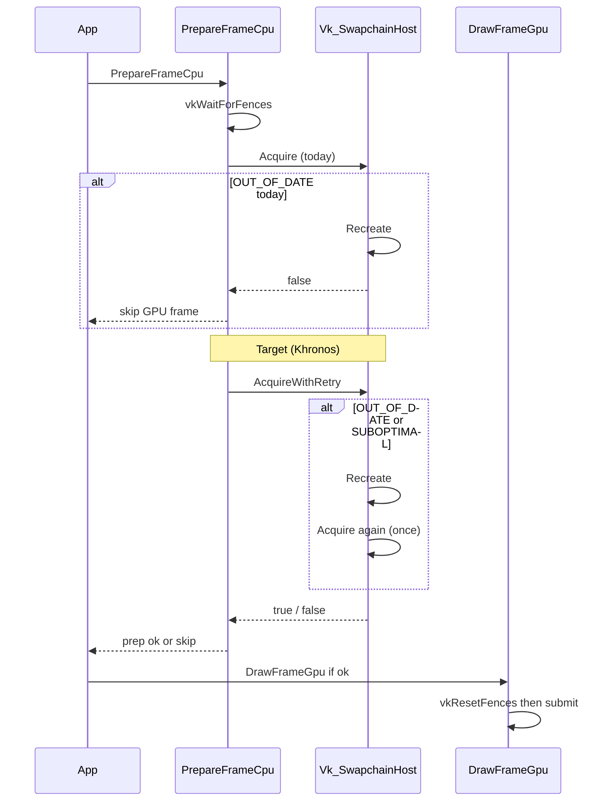

# Plan: swapchain-recreation (Khronos acquire-retry)

**Sprint:** S2 hardening follow-up (post `config-platform-hardening`)  
**Status:** Closed (2026-06-08)  
**Reference:** [Khronos Vulkan-Samples — swapchain_recreation](https://docs.vulkan.org/samples/latest/samples/api/swapchain_recreation/README.html) · [Vulkan Tutorial — Swap chain recreation](https://vulkan-tutorial.com/Drawing_a_triangle/Swap_chain_recreation)

## Problem

`Vk_SwapchainHost` already recreates swapchain on `OUT_OF_DATE` / `SUBOPTIMAL` / `myFramebufferResized`, and **correctly** delays `vkResetFences` until submit (no fence deadlock). Two gaps vs Khronos sample:

1. **Acquire `OUT_OF_DATE`** — `Recreate()` then **return false**; next main-loop iteration retries. User sees an extra skipped frame during resize.
2. **Acquire `SUBOPTIMAL`** — render full CPU/GPU path, recreate only at **present**. Khronos recreates (and retries acquire) at acquire time too.

S1 review noted: *「resize 当帧不录制、先 recreate 再 draw」* — this plan lands that behavior without changing the locked `Vk_FrameResult` error contract from `config-platform-hardening`.

## Goals

1. **Khronos frame loop (L2):** on acquire `VK_ERROR_OUT_OF_DATE_KHR` **or** `VK_SUBOPTIMAL_KHR` → `Recreate()` → **one** immediate acquire retry in the **same** `PrepareFrameCpu` call.
2. **Preserve fence contract:** `vkWaitForFences` → acquire (+ retry) → only then `vkResetFences` in `DrawFrameGpu` when submit is certain. Early return after failed retry must **not** reset fence or advance `myCurrentFrame`.
3. **Keep present-time checks:** `OUT_OF_DATE` / `SUBOPTIMAL` / `myFramebufferResized` after `vkQueuePresentKHR` still call `Recreate()` and return `Vk_FrameResult::SkipFrame` (semaphore consistency per tutorial).
4. **Keep minimize handling:** `Recreate()` zero-size `glfwWaitEvents` loop unchanged.
5. **Observability:** one log line when acquire-retry path runs (avoid per-frame spam).

## Non-goals

| Item | Reason |
|------|--------|
| `VK_EXT_swapchain_maintenance1` | Extension probe + present-fence plumbing — separate future task |
| Deferred old-swapchain / semaphore garbage queues | Khronos L4; needs fence pools — out of scope |
| `oldSwapchain` in `VkSwapchainCreateInfoKHR` | Optional perf follow-up (P2b below); not required for acquire-retry |
| ImGui-style acquire-before-`vkWaitForFences` reorder | Current late-reset pattern is already correct |
| `EngineArchitecture.md` policy edit | Frame-error contract unchanged; implementation note only |
| Automated resize CI script | `Verify-ResizeSmoke.ps1` remains optional; manual soak for closeout |

## Current vs target (acquire path)



## Touch list

| Area | Paths |
|------|--------|
| Swapchain host | `VulkanDesktop/RenderCore/Vk_SwapchainHost.{h,cpp}` |
| Frame CPU prep | `VulkanDesktop/RenderCore/Vk_Core.cpp` (`PrepareFrameCpu` — call site only if API rename) |
| Context (optional) | `VulkanDesktop/RenderCore/Vk_SwapchainContext.h` — only if adding retry counter / flag for tests |
| Docs (closeout) | `Docs/Archived-Plan.md` § S1 note; `Docs/README.md` Active now |

**No shader / descriptor / Gfx / Application loop changes** unless acquire API signature changes force a one-line include update.

## Implementation steps

### P1 — Acquire helper with Khronos retry (core)

- [x] **P1.1** Add private/static helper in `Vk_SwapchainHost.cpp`, e.g. `TryAcquireOnce(...) → VkResult`, wrapping existing `vkAcquireNextImageKHR` call (reuse `aFrameData.myPresentSemaphore`).
- [x] **P1.2** Replace `AcquireNextImage` body (or rename to `AcquireNextImageWithRetry`) with:
  1. `result = TryAcquireOnce(...)`
  2. If `result == VK_ERROR_OUT_OF_DATE_KHR || result == VK_SUBOPTIMAL_KHR`:
     - Log once per recreate burst: `[SWAPCHAIN] Acquire outdated/suboptimal; recreating and retrying acquire.`
     - `Recreate(aCore)`
     - `result = TryAcquireOnce(...)` **once** (no infinite loop)
  3. If `result == VK_ERROR_OUT_OF_DATE_KHR` after retry → `return false` (skip frame; fence untouched)
  4. If `result != VK_SUCCESS && result != VK_SUBOPTIMAL_KHR` → existing `ClassifyQueueResult` + `return false`
  5. Else → `return true` (SUBOPTIMAL after retry is **success**, same as Khronos)
- [x] **P1.3** `PrepareFrameCpu` keeps order: `vkWaitForFences` → `AcquireNextImage*` → rest unchanged.
- [x] **P1.4** Header comment on `AcquireNextImage`: documents Khronos retry + fence contract (English, short).

**Acceptance P1:**

| ID | Criterion |
|----|-----------|
| P1-A1 | `rg "AcquireNextImage" VulkanDesktop/RenderCore/Vk_Core.cpp` — still single call from `PrepareFrameCpu` |
| P1-A2 | `rg "vkResetFences" VulkanDesktop/RenderCore/Vk_Core.cpp` — still only inside `DrawFrameGpu` (after acquire success path) |
| P1-A3 | No new `throw` on acquire retry failure paths |

### P2 — Present path parity (verify, minimal diff)

- [x] **P2.1** Confirm `SubmitAndPresent` still recreates on `OUT_OF_DATE || SUBOPTIMAL || myFramebufferResized` **after** present (no behavioral change expected).
- [x] **P2.2** Confirm `myFramebufferResized` is cleared only in present branch (not on acquire retry) — avoids double-recreate race with GLFW callback.
- [x] **P2.3** If acquire retry already recreated for resize, present may still return `SUBOPTIMAL` once — acceptable; log at `Warn` only (existing).

**Acceptance P2:** code review + P3 manual resize soak.

### P2b — Optional `oldSwapchain` (only if P1–P3 green, same PR or follow-up)

- [x] Before `mySwapChainDeletionQueue.flush()` in `Recreate`, save `VkSwapchainKHR old = mySwapChain`.
- [x] Set `createInfo.oldSwapchain = old` in `CreateSwapChain`; destroy `old` after successful `vkCreateSwapchainKHR` (ImGui pattern).
- [x] Keep `vkDeviceWaitIdle` in `Recreate` for this task (safe baseline); note in Progress if measured stall unchanged.

### P3 — Verification

| ID | Command / action | Pass |
|----|------------------|------|
| P3-G0 | `powershell -File Scripts/Verify-CI.ps1` | exit **0** |
| P3-G0s | `powershell -File Scripts/Verify-Smoke.ps1` | exit **0** |
| P3-V1 | Manual resize soak ≥ **10 s** while dragging edges; load `demo.json` or default scene; no crash/hang | process exits 0 on close |
| P3-V2 | Log tail contains `[SWAPCHAIN] Acquire outdated/suboptimal; recreating and retrying acquire.` **or** present recreate warnings during soak | at least one recreate path fired |
| P3-V3 | Grep gate: no `vkResetFences` before successful acquire in `PrepareFrameCpu` | P1-A2 |

**Manual resize command (from repo root):**

```powershell
.\x64\Debug\VulkanDesktop.exe --asset-root (Get-Location) --no-validation --scene Data/Scenes/demo.json
```

Drag window edges continuously ≥ 10 s, then close normally.

## Risks and mitigations

| Risk | Mitigation |
|------|------------|
| Retry acquire after `Recreate` still `OUT_OF_DATE` (extreme resize / minimize) | Single retry only; return `false`; next frame retries; minimize loop in `Recreate` unchanged |
| Double `Recreate` same frame (acquire retry + present) | Acceptable; second recreate is idempotent after `vkDeviceWaitIdle` |
| SUBOPTIMAL at acquire causes more recreates → more pipeline rebuild | Matches Khronos; scene pipeline rebuild already in `Recreate`; watch log volume |
| Semaphore reuse after inline `Recreate` before submit | No submit yet this frame; `vkDeviceWaitIdle` drains prior uses of **this** frame slot’s semaphores from **previous** cycle — same as today when recreate runs at present |
| Fence deadlock regression | P1-A2 grep + code review: reset only in `DrawFrameGpu` |

## Rollback

Revert `Vk_SwapchainHost.cpp` acquire helper + header comment; `PrepareFrameCpu` unchanged if only call-site name restored. No data/schema migration.

## Task close (vibe workflow)

When implementation starts:

1. Add `Docs/swapchain-recreation_Progress.md`; set `Docs/README.md` **Active now**.
2. On close: `Status: Closed (YYYY-MM-DD)` here; Progress closeout ≤ 30 lines.
3. Move Plan + Progress → `Docs/Archived/plans/`.
4. Add § S1 line to `Archived-Plan.md` (no new Active-Plan `[ ]` unless promoted separately).
5. `EngineArchitecture.md` — **skip** unless frame-error policy narrative changes (it should not).

## Suggested kickoff checklist

- [ ] User confirms kickoff → `_Progress.md`, README **Active now**
- [ ] Execute P1 → P2 → P3 (P2b optional)
- [ ] Closeout with G0 + G0-smoke + P3-V1 manual steps pasted in Progress
