# Engine Architecture

**What this is:** layer boundaries, data-flow shape, and **locked policies** (invariants that code must obey).

**What this is not:** sprint tasks, milestones, or implementation changelogs — those live elsewhere.

| Question | Read |
|----------|------|
| What to build next (`[ ]` tasks, gates) | [`Active-Plan.md`](Active-Plan.md) |
| What's done (sprint history) | [`Archived-Plan.md`](Archived-Plan.md) |
| Stage 1 baseline / golden / handoff | [`forward-stage1.md`](forward-stage1.md) |
| Descriptor / UBO field layout (code) | `VulkanDesktop/RenderCore/Vk_DescriptorPolicy.h`, `Vk_Types.h` |
| Lighting epics (Stage 2–3 detail) | [`hybrid-deferred-epic_Plan.md`](hybrid-deferred-epic_Plan.md), [`ddgi-lighting-epic_Plan.md`](ddgi-lighting-epic_Plan.md) |

**Sync rule:** change **locked policy** here → add/adjust a task in Active-Plan. Change **tasks only** → Active-Plan alone is enough.

---

## 1. Module map (disk ↔ role)

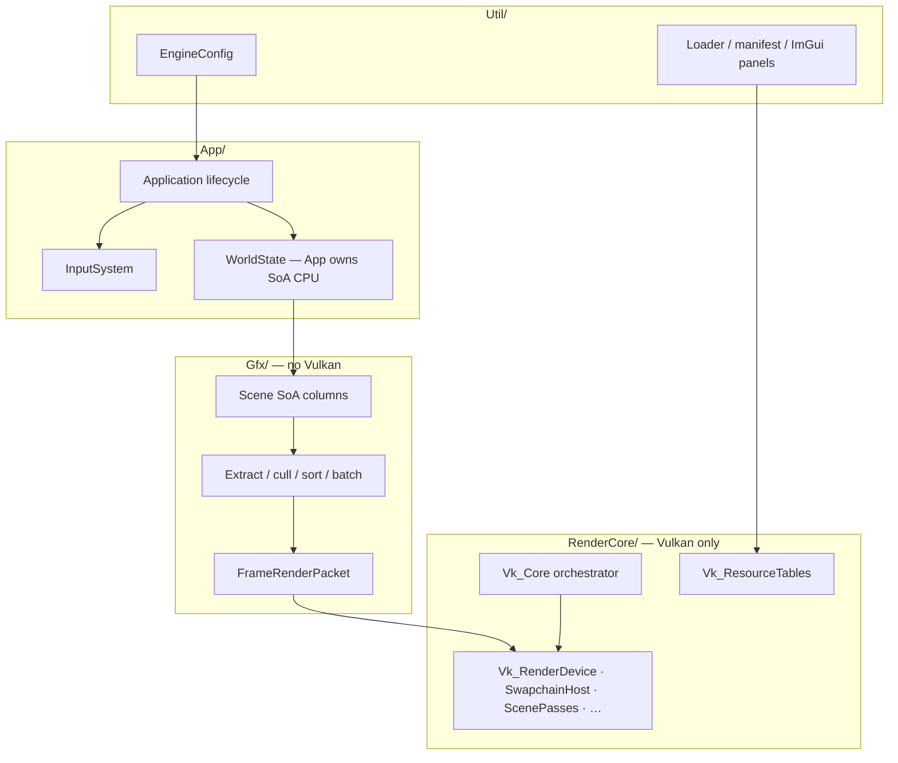

| Folder | Must not |
|--------|----------|
| **Gfx/** | `#include` Vulkan headers; call `vk*` |
| **RenderCore/** | Own gameplay rules; mutate SoA simulation columns from record path |
| **App/** | Create pipelines or descriptor layouts |
| **Util/** | Own per-frame draw ordering (only config/load/UI helpers) |

**App ↔ RenderCore (locked):** `WorldState` + debug UI in **App**; **`Util_EngineConfig`** owned by `Application` (passed into Util/Gfx/RenderCore, bound on `Vk_Core`). Per frame App builds active views, runs CPU prep (`PrepareFrameCpu`), then GPU draw. Recoverable swapchain/submit/present errors return `Vk_FrameResult` (skip frame or request shutdown) — no `throw` on those paths. Design logs: [`Archived/plans/vk-core-world-peel_Plan.md`](Archived/plans/vk-core-world-peel_Plan.md), [`Archived/plans/config-platform-hardening_Plan.md`](Archived/plans/config-platform-hardening_Plan.md).

---

## 2. Layer dependency (allowed direction)

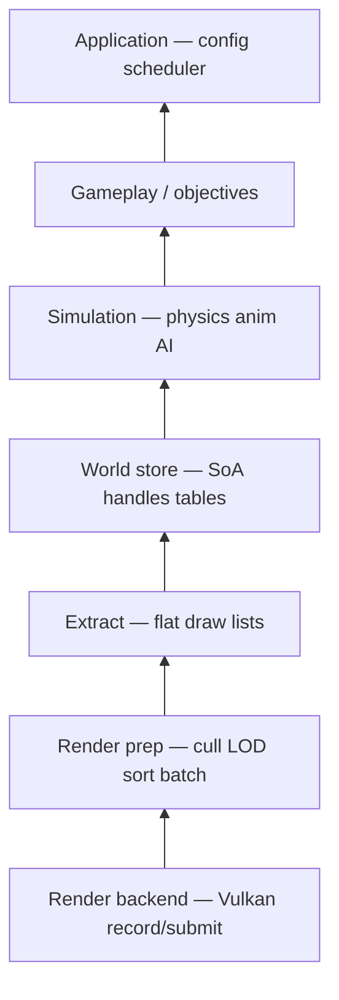

**Forbidden (anti-coupling):**

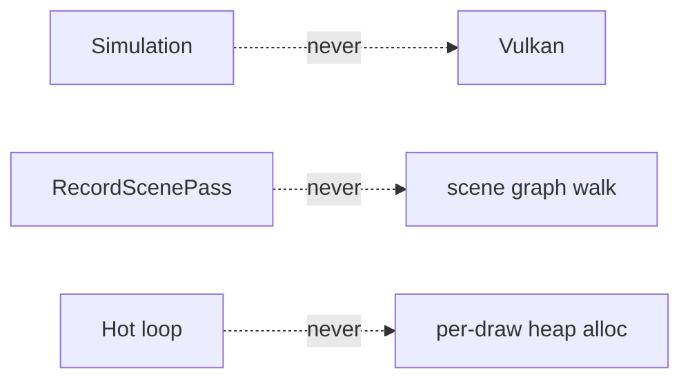

---

## 3. Frame loop

### 3.1 Boot (once)

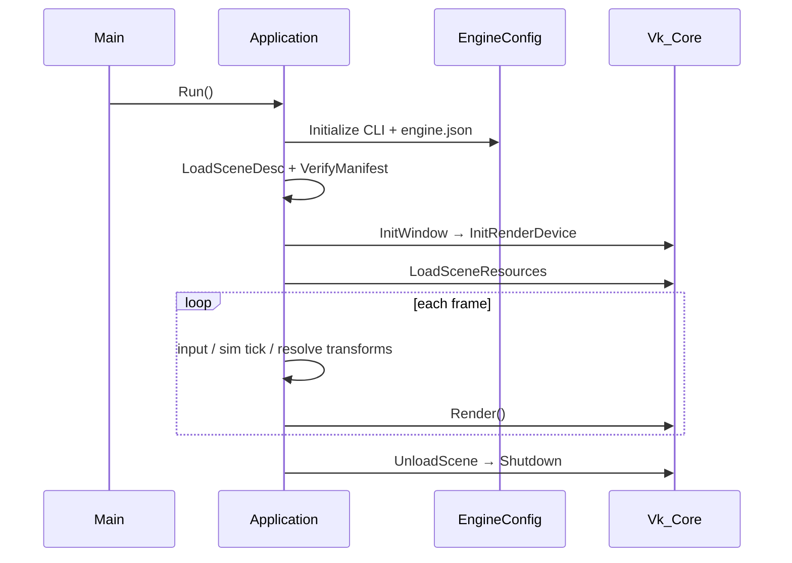

### 3.2 Per frame (CPU)

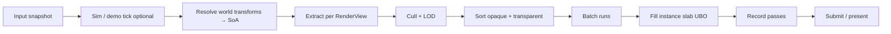

**Invariant:** extract through batch **must not** call Vulkan. Cull/sort see the **same** transforms written to the instance slab.

---

## 4. Data plane

### 4.1 Column store (SoA)

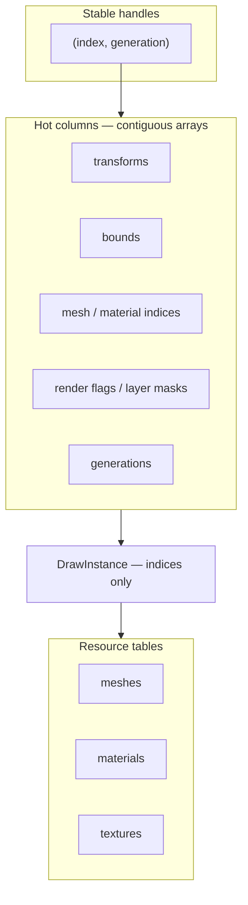

**Mechanical rules:**

- Hot path: **column scans**, not pointer graphs or per-entity virtual `Update()`.
- Draw records hold **indices + sort keys**; resolve to GPU handles at **batch/record** boundaries.
- GPU upload: **slab / ring buffers**, sequential writes; layouts match std140/std430 (see code headers).

**Simulation (future):** physics / animation / AI write SoA columns only; **no Vulkan** in sim modules. Order: `Input → Sim → Transform resolve → Extract → …`

---

## 5. Render path

### 5.1 Today → near target

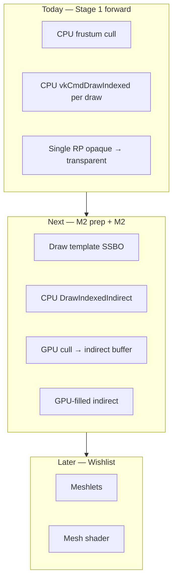

**Policy:** CPU extract remains **source of truth** until **automated parity** proves GPU cull equivalent (fixed camera). Details: [`render-m2-prep_Plan.md`](render-m2-prep_Plan.md), Active-Plan **P2–P3**.

### 5.2 Opaque vs transparent

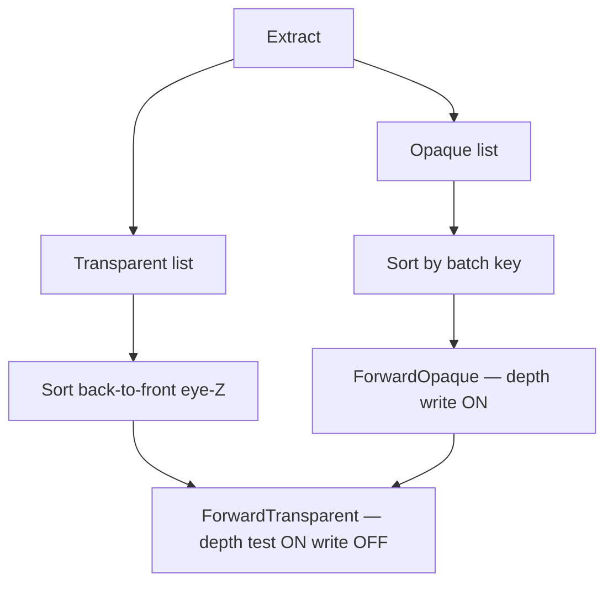

**Stage 2 contract:** transparent pass **imports depth** from opaque (forward depth or G-buffer depth); same compare/write policy as above. Full handoff: [`forward-stage1.md`](forward-stage1.md) §2.

### 5.3 Multi-view (v1)

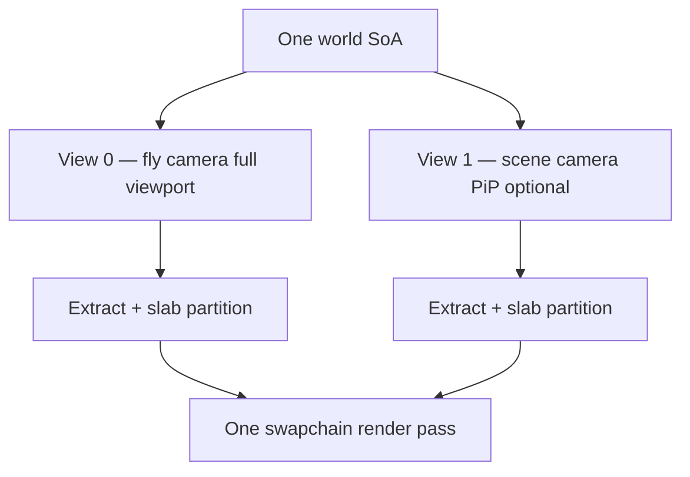

One render pass; per-view viewport/scissor + frame UBO. Offscreen RTs = frame-graph / Wishlist work.

---

## 6. Locked render policies

*Code truth wins on field layout; this section states intent.*

### 6.1 Descriptor sets (S0 lock)

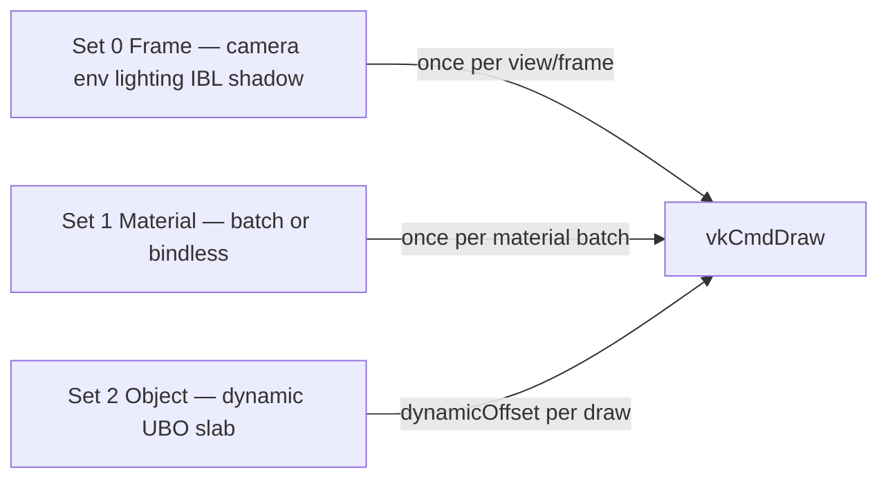

| Set | Update frequency | Type |
|-----|------------------|------|
| **0** | Per frame / view | `UNIFORM_BUFFER` (camera, env, **`GpuLightingGlobals`**) + **`COMBINED_IMAGE_SAMPLER`** (shadow compare, irradiance/prefilter/sky cubemaps, BRDF LUT) — bindings 0–7 per `Vk_Enum.h` / `DescriptorContract_LitBatch.json` |
| **1** | Per material batch **or** one bindless set | `COMBINED_IMAGE_SAMPLER` / indexing |
| **2** | Per draw via **`dynamicOffset`** into instance slab | `UNIFORM_BUFFER_DYNAMIC` |

**Hard rules:**

- Never patch a **shared** frame UBO between draws (e.g. do not reuse `GpuCameraData.model` per draw).
- **S5 (2026-06-12):** lighting resources live on Set 0 (no new shader permutations). Runtime **shadow / IBL / intensity** toggles via **`GpuLightingGlobals`** UBO + config / ImGui — not `#ifdef` branches. Deferred resolve uses a **separate Set 0 layout** (G-buffer + cluster SSBOs + same lighting bindings 5–10). Directional shadow: single **2048²** depth map, stable ortho fit (`Gfx_LightingMath`), PCF in `PbrIbl.glsl`.
- Per-draw `mat4` → Set 2 dynamic slice or push constants (policy allows both; demo uses Set 2).
- Material count / texture set changes → full scene GPU reload today (see `Vk_DescriptorPolicy.h`).

**Bindless (Option A):** **primary dev path** when `VK_EXT_descriptor_indexing` + runtime array + non-uniform indexing available; **batch fallback always supported** (no indexing, `FORCE_MATERIAL_BATCH`, tests). Dual record paths must stay visually in parity — maint rules: [`Archived/plans/shader-bindless-policy_Plan.md`](Archived/plans/shader-bindless-policy_Plan.md) §Maintenance contract.

### 6.2 Shader / permutations (principle)

- Variants via **offline permutations + frame-graph passes**, not per-object runtime branches.
- Reflection validates SPIR-V vs JSON contract at build time — see `.cursor/rules/shader-build.mdc`.

### 6.3 Sort key (opaque)

Conceptual tuple: `(pipelinePermutation, materialId, meshId, depthBucket)` with documented tie-break. `depthBucket` should use **bounds-based** eye-space Z (quality fix tracked in Active-Plan **P2**).

---

## 7. Lighting topology (stages)

**Naming:** Stage 1 Forward → Stage 2 Hybrid → Stage 3 DDGI optional.  
**Presets:** `ForwardLit`, `HybridDeferred`.

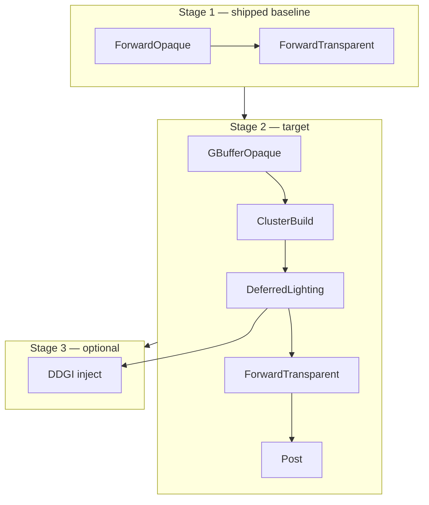

| Stage | Opaque | Transparent | Shading note |
|-------|--------|-------------|--------------|
| **1** | Forward lit | Forward sorted | Blinn-Phong baseline; PBR fields uploaded not yet consumed — [`forward-stage1.md`](forward-stage1.md) |
| **2** | G-buffer + clustered deferred | Forward over imported depth | Full PBR |
| **3** | Hybrid + optional DDGI | Unchanged policy | Preset-gated GI |

**Compatibility:** geometry milestones (indirect, meshlets, mesh shader) change **submission**; lighting changes **pass topology** — do not couple sim code to renderer internals.

**When to implement:** Active-Plan gates (**G1** → FG v0 / Stage 2). Epic checklists stay in hybrid/deferred docs, not here.

---

## 8. Long-term raster target

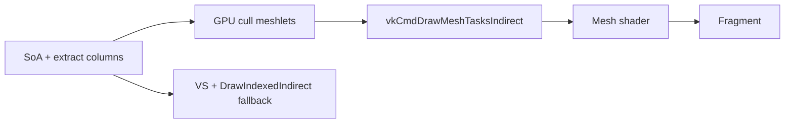

| Decision | v1 choice |
|----------|-----------|
| Vulkan | 1.2 + `VK_EXT_mesh_shader` |
| Task shader | Defer |
| Geometry clusters | Offline meshlets |
| Scope | ~1k instances; no Nanite-scale occlusion |

Wishlist detail: [`Wishlist.md`](Wishlist.md).

---

## 9. Rendering lab (design hook)

Features (shadows, IBL, MSAA, tonemap) attach via:

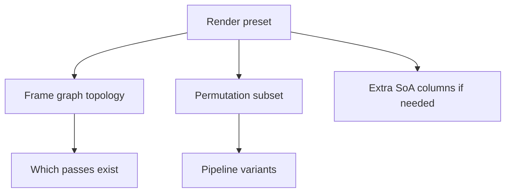

Not via scattered `if (feature)` in per-entity virtual calls. Benchmark methodology → [`Archived/plans/ci-verification_Plan.md`](Archived/plans/ci-verification_Plan.md).

---

## 10. Risks & non-goals

### Risks

| Risk | Guard |
|------|-------|
| Fake data-oriented (maps, smart pointers in hot loop) | Profile extract/sort/record |
| Monolith `Vk_Core` | Ownership peeled; context slices + smaller orchestrator — further split optional |
| GPU path without parity | Automated CPU vs GPU compare before drop fallback |
| Permutation explosion | Preset maps to small offline subset |
| Sim ↔ render coupling | Sim writes SoA only |
| Per-draw allocations in record | Fixed buffers / optional debug labels |

### Anti-patterns (hot path)

- Scene graph traversal inside `vkCmd` recording
- Mixing transparent draws into opaque sort without separate pass
- Implicit global mutable state without phase owner

### Non-goals (v1)

**Supported platform (locked):** Windows 10+ x64, MSVC, MSBuild only — inventory: [`Platform.md`](Platform.md). No editor/networking/streaming · no navmesh/full BT · no Task shader until needed · DDGI until Stage 2 gate · audio deferred — full list: [`Wishlist.md`](Wishlist.md)

---

## 11. Where implementation detail lives

| Topic | Source of truth |
|-------|-----------------|
| Completed peel / S1 / S2 tasks | [`Archived-Plan.md`](Archived-Plan.md) |
| Open work | [`Active-Plan.md`](Active-Plan.md) |
| Large refactors in flight | `Docs/*_Plan.md` when vibe task starts |
| SPIR-V / binding drift | MSBuild + `DescriptorContract_*.json` |
| Runtime contracts | Comments in `VulkanDesktop/` per `cpp-comments.mdc` |

*Diagram-first architecture doc. Agent doc boundaries: `.cursor/rules/docs-roadmap-arch-sync.mdc`, vibe skill § Documentation map. Policy edits here → matching Active-Plan task when behavior must change.*
