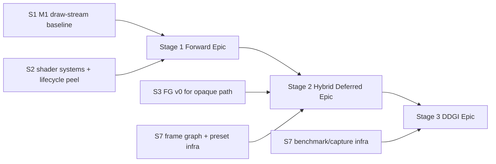
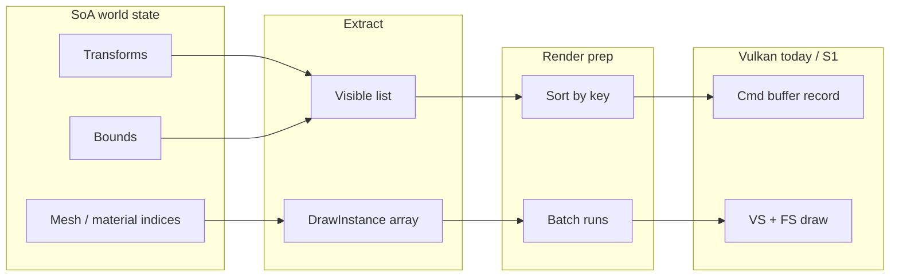
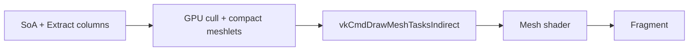
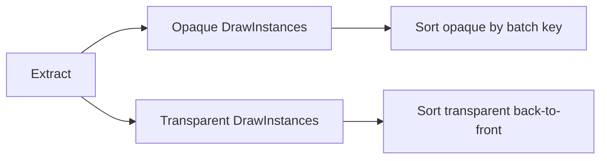
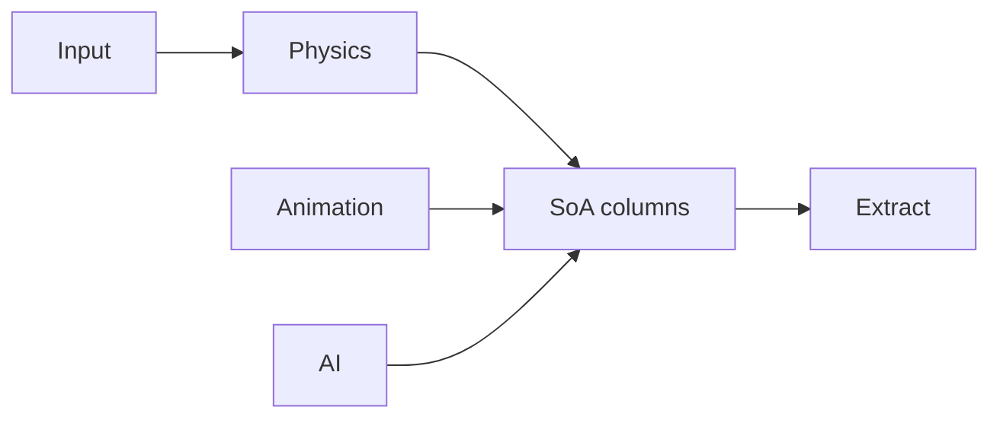
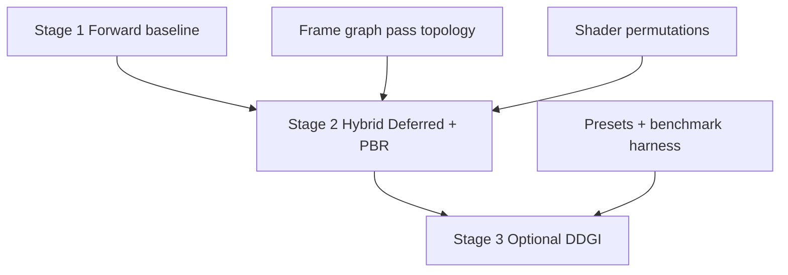

# Engine Architecture — Design Notes

This document captures **architecture intent and reasoning** for the SiriusEngine / VulkanDesktop reboot. Executable **sprint checklists** live in `Docs/SprintPlan.md`; keep this file for **structure, invariants, and tradeoffs**.

---

## 1. Purpose and scope

**Goal**: A **small but credible** engine foundation: a **runnable gameplay loop** in a coherent scene, plus a **rendering lab** where features can be toggled and their **quality vs performance** impact measured.

**Scope of this document**:

- How major subsystems relate (runtime, scene data, render extract, Vulkan).
- **Data-oriented** constraints on the **data side** (simulation, scene state, render-facing extracts).
- How the **rendering path** should be shaped so it consumes flat buffers, not pointer-heavy scene graphs.
- Known **risks** and **anti-patterns**.

Out of scope here: exact class names in the repo, shader code, or step-by-step build instructions (those belong in code comments, `README.md`, or `SprintPlan.md`).

---

## 2. North star (engineering outcomes)

Summarized from the roadmap; these are **acceptance criteria** for “engine, not demo only”:

| Outcome | Meaning |
|--------|---------|
| **Deterministic tooling** | Shaders and assets resolve predictably; CI can compile shaders and catch breakage early. |
| **Layered runtime** | Window/input, simulation, scene data, render extract, and Vulkan record/submit are **conceptually separated** even if some live in the same process today. |
| **Playable slice** | One scene + one simple objective/loop + restart; failures are logged, not silent black screens. |
| **Rendering lab** | Presets/flags, timing (CPU + GPU where possible), optional screenshots for A/B. |
| **Evidence** | Benchmark scenes + a short runbook so numbers are reproducible on a fresh machine within a stated variance band. |
| **Data-oriented data plane** | Hot paths use **SoA / columnar** storage, **stable indices**, **sequential scans**, and **explicit buffers** for GPU upload — not deep OO graphs as the primary per-frame execution model. |
| **Mesh-shader GPU-driven renderer** | Long-term raster path: **GPU** cull/compact → **mesh shader** (optional Task later) → fragment; **VS + indexed indirect** fallback when extensions missing. CPU SoA + extract remain **source of truth** until GPU path is parity-tested. |
| **Hybrid lighting evolution** | Stage 1 full forward baseline → Stage 2 full PBR with **opaque deferred/clustered + transparent forward** → Stage 3 **optional DDGI**. Epic docs: `forward-rendering-epic_Plan.md`, `hybrid-deferred-epic_Plan.md`, `ddgi-lighting-epic_Plan.md`. |

---

## 3. High-level system map

Intended **dependency direction** (higher layers may depend on lower; not the reverse):

```text
┌─────────────────────────────────────────────────────────────┐
│  Application (lifecycle, config, modes, scheduler)         │
├─────────────────────────────────────────────────────────────┤
│  Gameplay / rules (objectives, modes — parallel slice)      │
├─────────────────────────────────────────────────────────────┤
│  Simulation (S8): Physics → Animation → AI → SoA columns   │  ← no Vulkan
├─────────────────────────────────────────────────────────────┤
│  Input → camera / player controllers                        │
├─────────────────────────────────────────────────────────────┤
│  Scene / world store (SoA, handles, resource tables)       │
├─────────────────────────────────────────────────────────────┤
│  Render extract (per-view visible sets, draw instances)     │  ← no Vulkan
├─────────────────────────────────────────────────────────────┤
│  Render prep (cull/LOD, opaque + transparent sorts, batch)   │
├─────────────────────────────────────────────────────────────┤
│  Render backend: frame graph → passes → Vulkan record       │  ← consumes prep only
└─────────────────────────────────────────────────────────────┘
```

**Rule of thumb**: `Vk_Core` (or its successor) should sit in the **render backend** box. It should **not** own high-level game rules or physics; it **should** own swap chains, **frame-graph orchestration**, pipelines, and command recording driven by **already prepared** draw streams.

**S8 (simulation)** runs in parallel after application scheduler exists (**S2**): fixed-step physics and animation write SoA; AI writes intent columns. None of these call Vulkan. See **§4.6** and `SprintPlan.md` S8.

**Multi-view**: one world SoA, multiple **RenderView** configs (camera, viewport, masks). Extract may run per view or filter a shared visible set. Each view carries its own frame UBO (view/proj). Details: **§5.9**.

### 3.1 VulkanDesktop today (incremental)

**Application lifecycle (2026-05-27):** `VulkanDesktop::main` → `Application::Run`: **`UtilEngineConfig::Initialize`** (CLI + `Config/engine.json`) → `UtilLogger::Init` → `LoadSceneDesc` + `Util_VerifyManifest` → `Vk_Core::InitWindow` → **`InitRenderDevice`** → **`LoadSceneResources`** → loop **`Update`** / **`Render`** → **`UnloadScene`** → **`Shutdown`**. See `Docs/application-lifecycle_Plan.md`, `Docs/central-config_Plan.md`.

**Central config (2026-05-27):** `Util_EngineConfig` loads window size, vsync, `assetRoot`, default `scene`, `logLevel`, `enableValidationLayers`, and `features` (`demoRotate`, `runtimeMipmap`). CLI overrides win. `Vk_Core::ChooseSwapPresentMode` respects `vsync`; demo rotate and runtime mipmaps read feature flags.

**Input (2026-05-27):** `Application` owns `InputSystem` (persistent `Util_InputState`, per-frame `Util_InputSnapshot`). Loop: `Vk_Core::BeginPlatformFrame` (poll, Δt, ImGui `NewFrame`) → `InputSystem::Sample` → `Vk_Core::ApplyCameraInput` → `Gfx_TickDemoSceneTransforms` → `Render`. GLFW sampling stays in `UtilInput::Sample`; RenderCore has no GLFW. Future gameplay reads the same snapshot. See `Docs/input-abstraction_Plan.md`.

1. **`InputSystem::Sample`** — ImGui capture gate → `UtilInput::Sample` → device-neutral snapshot.
2. **`Vk_Camera::ApplyInput`** — view/projection/eye for UBOs and lighting (no GLFW in `Vk_Camera`).

**Shaders (today):** **GLSL → glslc** — sources in `Shader/` (`TriangleVertex.vert`, `TriangleFrag_Lit.frag`), SPIR-V in `Shader_Generated/`, raster entry `main` on a **vertex + fragment** pipeline. Pitfalls: `.cursor/rules/shader-build.mdc`, `Docs/Archived/notes-2026-05-22-shader-debug.md`.

**Render path (today):** `Gfx_TickDemoSceneTransforms` → `Vk_Core::DrawFrame`: acquire → `UpdateUniformBuffer` → `Vk_FrameDrawPrep::Build` (`Gfx_BuildFrameDrawStream` + instance slab) → `RecordScenePass` → ImGui → submit/present. **Set 0** / **Set 1** / **Set 2** as before; LOD in extract path. [`vk-core-decomposition_Plan.md`](vk-core-decomposition_Plan.md).

**RHI peel (2026-05-27, M1–M3 done):** `Vk_ResourceContext` for table load; Gfx CPU draw list; `Vk_Core` hot path is acquire/record/present.

**RHI peel phase 2 (2026-05-28, step #1 done):** `Vk_ResourceContext v2` now owns load-time buffer/image/upload helper operations consumed by `Util_Loader` and `Gfx_Mesh::BuildBuffers` through explicit context injection.

**RHI peel phase 2 (next planned):** `Vk_RenderDevice`, `Vk_SwapchainHost`, `Vk_DescriptorSystem`, scene pass modules (`Vk_GBufferPass` / `Vk_DeferredLightingPass` / `Vk_ForwardTransparentPass` or equivalent), scene host, platform frame — ordered tasks in `SprintPlan.md` § phase 2; code `TODO(vk-core-peel)`.

**Phase 2 doc tracking:** phase 2 task design/progress is consolidated in `Docs/vk-core-decomposition_Plan.md` and `Docs/vk-core-decomposition_Progress.md` (SprintPlan keeps checklist-level status only).

**Render path (target):** See **§5.5–§5.10** and `Docs/SprintPlan.md` (S1→S7). Target: cull → sort → batch → record (minimal binds) → GPU indirect → mesh tasks + mesh shader, with **frame graph** pass chain `GBufferOpaque -> ClusterBuild -> DeferredLighting -> ForwardTransparent -> Post` (Stage 2+) and `ForwardLit` baseline retained for parity.

**Shader tooling (target):** SPIR-V reflection → permutation registry → `VkPipelineCache` + disk cache (**§5.7**). Executable tasks: S2 shader systems, S7 presets.

---

## 4. Data-oriented architecture (data plane)

### 4.1 What “data-oriented” means here

It is **not** mandatory to use a particular ECS library. The invariant is **mechanical**:

- **Columnar hot state**: transforms, bounds, mesh/material **indices**, masks/tags — each in its own contiguous array (SoA).
- **Stable handles**: `(index, generation)` or slot maps so recycled indices cannot revive stale references silently.
- **Sequential work**: systems update **ranges** of columns with predictable read/write sets (friendly to jobs later).
- **No pointer chasing on the hot path** for core per-frame work: avoid virtual `Update()` per entity, deep inheritance trees, and `unordered_map` in inner loops.

Editor-facing or tooling code may stay more object-oriented; the **frame-critical path** should not.

### 4.2 Entity and resource indirection

- **Entities** refer to meshes/materials via **small integer indices** into **tables**.
- **Tables** map stable resource ids to GPU-facing data: buffer handles, descriptor indices, pipeline layout compatibility groups, etc.
- **Draw records** store indices only; **resolution** to Vulkan handles happens at **batch boundaries** or in a dedicated “resolve” pass — keeps the draw array trivially serializable and sortable.

**Implemented (S1 v0):**

- **Manifest → tables:** `Gfx_SceneDesc` (disk) → `Gfx_BuildResourceManifestFromSceneDesc` → `Vk_ResourceTables::LoadFromManifest` in **`LoadSceneResources`**. Boot verify: `Util_VerifyManifest` before `vkCreateInstance`. SoA/LOD: `Gfx_PopulateSceneSoAFromSceneDesc` / `Gfx_BuildLodTableFromSceneDesc` (`logicalMeshes` in JSON). Orchestrated by `Application` (`Docs/application-lifecycle_Plan.md`).
- **Record resolve:** `RecordScenePass` maps `Gfx_DrawInstance.myMeshId` / `myMaterialId` to GPU buffers and pipeline handles (see `Docs/Archived/plans/resource-tables_Plan.md`).
- **Per-draw transform (demo):** optional Z spin applied to **SoA** each frame before extract (`ApplyDemoTransformAnimation`; see [`demo-transform-sync_Plan.md`](demo-transform-sync_Plan.md)). `FillInstanceSlab` copies that matrix into **Set 2** dynamic UBO slices (`GpuObjectData`); `RecordScenePass` binds set 2 with `dynamicOffset` per draw (no model push constant on demo pipeline).
- **Instance slab overflow:** if visible draw count exceeds `kMaxInstanceSlabEntries`, slab fill fails and scene record is skipped (logged) — [`instance-slab-overflow_Plan.md`](instance-slab-overflow_Plan.md).
- **Instance slab:** per in-flight frame, CPU-mapped `myObjectBuffer` with stride `PadUniformBufferSize(sizeof(GpuObjectData))`, capacity `VkDescriptorPolicy::kMaxInstanceSlabEntries` — see `Docs/Archived/plans/instance-slab_Plan.md`.

**S1 / M1 (2026-05-26):** CPU draw stream complete — multi-mesh demo, opaque batch runs, Set 1 binds ≤ batch runs (batch path), frame ms in ImGui + `[PERF]` warmup log ([`m1-acceptance_Plan.md`](m1-acceptance_Plan.md)).

**LOD v0 (2026-05-26):** SoA stores **logical** mesh id + optional `lodBias`; `Gfx_LodTable` maps logical → physical mesh chain; after cull, `Gfx_ApplyLodToFrameExtract` writes **resolved** `myMeshId` on draws and refreshes opaque sort keys (15% distance hysteresis). Sample chain: `Data/LOD.md`, [`lod-v0_Plan.md`](lod-v0_Plan.md).

### 4.3 Extract step (render-facing boundary)

Each frame (or sub-step), a dedicated **extract** phase:

1. Reads SoA (transforms, bounds, visibility/layer masks, render flags).
2. Outputs **flat arrays**: visible entity indices; **`DrawInstance`** structs (sort key, resolved mesh id after LOD, material id, per-instance data offset, pipeline permutation id when used).
3. Splits **opaque** and **transparent** instance lists when transparency is enabled (**§5.8**).
4. **Does not** call Vulkan.

Per **RenderView**, extract uses that view’s camera frustum and masks. Multiple views share the same SoA and resource tables.

This isolates **game/scene semantics** from **GPU API** and makes unit testing and profiling easier.

### 4.4 GPU upload strategy

- Prefer **ring buffers** or **large slab UBO/SSBO** regions written **sequentially** each frame for per-object/instance data.
- Struct layouts must match shader expectations (**std140/std430** rules, padding explicit in code comments where non-obvious).
- Avoid per-object `malloc`/`new` on the hot path; reuse scratch arenas reset per frame.

### 4.5 Transform hierarchy (if present)

Hierarchy complicates pure SoA updates. Practical options:

- **Flat world matrices** in SoA with a separate “dirty propagation” pass in deterministic order (e.g. sorted by hierarchy depth), or
- **Limited depth** with explicit parent index column + iterative propagation.

Recursive virtual calls per node are a poor fit for the stated data-plane goals.

### 4.6 Simulation layer (S8)

Simulation is **not** part of the render extract path but **feeds** it:

| System | Writes (SoA / buffers) | Reads | Sprint home |
|--------|------------------------|-------|-------------|
| **Physics** | `transform`, `bounds` | Prior transform, collision layers | S8 |
| **Animation** | Deformed vertices or skin palette / attachment transforms | Skeleton clips, mesh handles | S8 |
| **AI** | Steering, state flags, target handles | Player position, perception | S8 |

**Order (CPU, same frame):** `Input → Simulation (physics step, animation, AI) → Transform resolve → Extract → …`

Physics uses a **fixed dt** step under the application scheduler; render may interpolate for display later. Simulation code must not include Vulkan headers.

---

## 5. Rendering pipeline alignment (submission model)

### 5.1 Draw stream

After extract:

1. **Cull** (frustum + layer masks per view).
2. **LOD** (CPU v0, **shipped**): eye-distance to bounds center → `lodLevel` → resolved **mesh id** via `Gfx_LodTable`; 15% threshold hysteresis (`Gfx_LodState` per slot). Runs after frustum cull, before sort. GPU path (**S3**) and meshlet path (**S4**) reuse the same LOD table.
3. **Assign sort keys** for **opaque**: e.g. `(pipelinePermutationId, materialId, meshId, depthBucket)` with documented tie-break.
4. **Sort** opaque `DrawInstance` array; **transparent** list sorted **back-to-front** (eye-space Z), separate pass (**§5.8**).
5. **Batch**: run lengths for contiguous draws sharing bind state (material table generation must match batch boundaries).
6. **Record** (or hand off to **frame graph** §5.9): forward opaque, then transparent; minimal `vkCmdBind*` churn.

### 5.2 Vulkan recording principles

- **Bind once per batch**, not once per logical object when shareable.
- Prefer **instancing** or **multi-draw** when many instances share the same mesh/material.
- **Push constants** or **dynamic uniform offsets** for small per-draw variation (e.g. material index) when bindless is not used.

### 5.3 Descriptor policy (locked S0)

**Decision:** use a **hybrid by update frequency** — static `UNIFORM_BUFFER` for frame/batch data, `UNIFORM_BUFFER_DYNAMIC` for per-instance slices in a ring/slab, and **push constants** only for very small per-draw fields. This is **not** “choose static *or* dynamic globally.”

| Set | Role | Typical bindings | Descriptor type | Bind frequency |
|-----|------|------------------|-----------------|----------------|
| **0 — Frame** | Camera **view/proj**, environment | `eVk_CameraBinding`, `eVk_EnvBinding` | `UNIFORM_BUFFER` | Once per **in-flight frame** |
| **1 — Material** | Albedo texture (demo: per `materialId` descriptor set) | `eVk_MaterialTextureBinding` | `COMBINED_IMAGE_SAMPLER` | Once per **material batch** |
| **2 — Object** | Per-instance / per-draw data | Instance struct in slab | `UNIFORM_BUFFER_DYNAMIC` (+ optional push) | Set bound per batch; **`dynamicOffset`** per draw |

**`UNIFORM_BUFFER` vs `UNIFORM_BUFFER_DYNAMIC`**

| Data | Type | Why |
|------|------|-----|
| Frame camera (view, proj), env, material constants | `UNIFORM_BUFFER` | Offset fixed at alloc or batch; rare `vkCmdBindDescriptorSets` |
| Many instances in one GPU buffer | `UNIFORM_BUFFER_DYNAMIC` | One descriptor points at whole slab; only offset changes per draw |
| Single `mat4` model matrix (VS path) | **Push constants** or **dynamic UBO** (demo uses Set 2) | 64 B; policy allows either; **do not** put full 192 B `GpuCameraData` in push constants without checking `maxPushConstantsSize` (minimum is often 128 B) |

**Alignment:** slab stride and dynamic offsets are multiples of `minUniformBufferOffsetAlignment` (`Vk_Core::PadUniformBufferSize`).

**Implemented on desktop (2026-05-26):** `TriangleVertex.vert` — Set 0 `GpuCameraData` (`view`, `proj`); Set 2 `GpuObjectData` (`model`) via **`UNIFORM_BUFFER_DYNAMIC`** and per-draw `dynamicOffset` into the instance slab. Do not patch `model` through the camera UBO between draws. Push constants remain valid per policy for other pipelines; demo forward path uses Set 2 only.

**VulkanDesktop today (demo):** binds **set 0** once per pass; **set 1** once per batch (`myMaterialDescriptorSets`); **set 2** per draw with `dynamicOffset`. Environment uses frame-indexed **static** offsets in Set 0 at init. Code contract: `Vk_DescriptorPolicy.h`, `Vk_Enum.h`.

**Bindless vs traditional (S1 fork)**

| Approach | Pros for DoD | Cons |
|----------|----------------|------|
| **Traditional** + batching + push/dynamic | Portable, easier validation/debug | More CPU sorting; more binds if batches are poor |
| **Bindless** (descriptor indexing / descriptor buffers) | Natural “material index → table lookup” in shader | Extension matrix, harder debug, stricter layout discipline |

**Bindless v0 (S1, locked 2026-05-26):** **Hybrid** — when `VK_EXT_descriptor_indexing` + required features are present, **Set 1** is one bindless set (`sampler2D[]` + material SSBO table); **`materialIndex`** in **Set 2** `GpuObjectData` selects the row; fragment uses `nonuniformEXT` texture fetch (`TriangleFrag_Lit_Bindless.frag`). **Fallback:** `Vk_RenderMaterialPath::Batch` — per-material descriptor sets + batch bind (unchanged). Override: env `FORCE_MATERIAL_BATCH=1`. Opaque sort key packs **`materialTableGeneration`** in `pipelinePermutationId` (v0 bumps on manifest load). Sets 0/2 unchanged. See [`bindless-v0_Plan.md`](bindless-v0_Plan.md).

### 5.4 Phase graph (CPU side)

Recommended explicit order (names illustrative):

```text
Input → Simulation (physics, animation, AI) → Transform resolve
     → Extract (per RenderView) → Cull/LOD → Sort (opaque + transparent)
     → Batch → FrameGraph/Record → Present
```

Each phase declares **inputs/outputs** as buffers. Hidden cross-talk between phases (globals, singletons mutating unknown columns) undermines reasoning and parallelization.

**Threading (backlog):** parallelize cull/LOD/column updates via job system only after frame SoA sync rules exist; render-thread submission is optional and comes after frame graph stabilizes (`SprintPlan.md` backlog MT v1–v3).

### 5.5 GPU-driven path (staged)

**GPU culling / indirect draws** reduce CPU record cost but complicate debugging. **Policy**: keep **CPU SoA + extract** as the **source of truth** until a GPU path is **proven equivalent** (golden frame or statistical comparison on fixed camera paths). Implemented in **`SprintPlan.md` S3** (indexed indirect, VS/FS) before mesh shaders.

### 5.6 Mesh shader + GPU-driven target (decisions)

Long-term **production** raster path for scene geometry:

```text
SoA → Extract → [GPU: cull meshlets → compact list] → vkCmdDrawMeshTasksIndirect*
     → Task? (deferred) → Mesh → Fragment
```

| Decision | Choice (v1) | Notes |
|----------|---------------|--------|
| Vulkan baseline | 1.2 + `VK_EXT_mesh_shader` | Matches vendored SDK; revisit 1.3 later. |
| Task shader | **Deferred** | Add only if meshlet count/thread pressure requires it. |
| Geometry | **Meshlets** (offline cluster) | e.g. meshoptimizer; bounds per meshlet for GPU cull. |
| Materials | **Bindless or large SSBO tables** (decide in S1) | Mesh/fragment shaders index tables by `materialId`. |
| Fallback | **S3 path**: VS + `DrawIndexedIndirect` | Required when mesh shader unsupported; same instance/meshlet buffers where possible. |
| Scope | 1k+ instances, single-digit cascades later | No Nanite-scale occlusion/clip in v1. |

**Milestones** (checklists in `SprintPlan.md`):

| Milestone | Sprint | Outcome (summary) |
|-----------|--------|-------------------|
| **M1** | S1 | CPU draw stream; LOD v0; transparency; bindless v0 or batch path signed off |
| **M2** | S3 | GPU frustum cull + indirect; LOD GPU parity subset |
| **M3** | S4 | Meshlet assets + debug viz |
| **M4** | S5 | Mesh shader geometry/pass-contract parity vs VS (forward baseline + hybrid-compatible path) |
| **M5** | S6 | GPU mesh tasks + preset fallbacks |
| **M6** | S7 | Frame graph + multi-view + presets/permutations + benchmarks |

**S8** has no render milestone; acceptance is physics + skinned clip + one AI agent in play scene.

**Anti-pattern**: jumping to mesh shaders before **draw stream**, **descriptor policy**, **meshlet buffers**, and **material tables** exist — yields a non-extensible demo draw.

### 5.7 Shader systems (reflection, permutation, cache)

| Layer | Role | Policy |
|-------|------|--------|
| **Reflection** | Offline SPIR-V → binding metadata JSON | Validate against `Vk_DescriptorPolicy.h`; reduces layout drift (S2) |
| **Permutation** | Feature flags → limited shader/pipeline variants | Registry with explicit key bits; sort key includes `pipelinePermutationId`; avoid combinatorial explosion |
| **Cache** | `VkPipelineCache` + versioned disk blob | Invalidate on shader timestamp or driver change; benchmark cold/warm in S7 |

Feature experiments (shadows, IBL, MSAA) add permutations and **frame-graph passes**, not per-object virtual branches.

### 5.8 Transparency

- **Flags:** `Gfx_RenderFlags` on SoA entity (`Gfx_RenderOpaque` / `Gfx_RenderTransparent`); material manifest `myIsTransparent` + `myAlpha` selects pipeline and shader alpha.
- **Extract:** `Gfx_FrameExtract` — separate opaque and transparent `Gfx_ExtractResult` lists (no Vulkan in Gfx).
- **Transparent sort:** back-to-front by ascending **eye-space Z** (`Gfx_ComputeEyeSpaceZ`); tie-break: lower `materialId`, then lower `entityIndex`.
- **Record (demo):** same render pass — opaque batches (`myBasicPipeline`, depth write on) then transparent (`myTransparentPipeline`, alpha blend, depth write off).
- **Frame graph (S7):** transparent pass becomes a separate FG node that **reads** depth from opaque pass.

### 5.9 Multi-view and frame graph

**RenderView** (conceptual): `cameraId`, viewport, render target handle, layer/cull masks. Scene JSON may define multiple cameras; application picks active views.

**Frame graph (S7):** declarative pass/resource DAG for a frame (or per view):

- **Pass node**: reads/writes transient or imported resources (color, depth, shadow map).
- **Resource lifetime** managed per frame (and **import** for TAA/history later).
- Replaces ad-hoc barrier chains in `Vk_Core` for multi-pass features.

Dependency: stable **sort/batch** from S1; **permutations** from S2; optional **multi-view** from S2 before shadow/post FG in S7.

```text
[Shadow pass] ─writes→ shadow map
       └─reads→ [GBufferOpaque] ─writes→ gbuffer+depth
                     └─reads→ [ClusterBuild]
                              └─reads→ [DeferredLighting] ─writes→ hdrColor
                                           └─reads→ [ForwardTransparent]
                                                    └─reads→ [Post]
```

### 5.10 Lighting evolution plan (forward → hybrid deferred → DDGI)

Lighting roadmap is staged to reduce risk while keeping GPU-driven geometry work intact.

**Naming (canonical):**

- **Stage:** `Stage 1 (Forward Baseline)`, `Stage 2 (Hybrid Deferred + PBR)`, `Stage 3 (Optional DDGI)`
- **Preset:** `ForwardLit`, `HybridDeferred`
- **Pass chain (Stage 2+):** `GBufferOpaque -> ClusterBuild -> DeferredLighting -> ForwardTransparent -> Post`

| Stage | Baseline | Opaque path | Transparent path | GI scope |
|------|----------|-------------|------------------|----------|
| **Stage 1** | Full forward baseline | Forward lit | Forward lit (sorted) | None (direct + environment baseline only) |
| **Stage 2** | Hybrid renderer | `GBufferOpaque + DeferredLighting` (clustered, full PBR) | `ForwardTransparent` over deferred depth/color | IBL/environment in hybrid lighting pass |
| **Stage 3** | Optional GI enhancement | Hybrid deferred + DDGI contribution | Forward policy unchanged (documented interaction rules) | **DDGI optional** (preset-gated) |

**Compatibility rule:** mesh-shader / GPU-driven milestones (`S3`–`S6`) stay focused on geometry submission and visibility. Lighting architecture evolves through pass topology and shading contracts, not by coupling gameplay/simulation logic to renderer internals.

**Parity rule:** keep `ForwardLit` as a baseline preset for A/B validation while Stage 2 lands, then preserve non-DDGI hybrid behavior when Stage 3 is enabled.

#### 5.10.1 Lighting dependency graph



#### 5.10.2 Stage dependency contracts

| Stage | Depends on | Unblocks | Main policy |
|------|------------|----------|-------------|
| **Stage 1 — Forward baseline** | S1 draw stream and transparent policy, S2 shader/permutation scaffolding | Stage 2 migration with stable parity baseline | Keep forward opaque/transparent explicit and measurable |
| **Stage 2 — Hybrid Deferred + PBR** | Stage 1 handoff, S3 FG v0 + frame-graph pass topology, permutation path | Stage 3 DDGI optional integration | `GBufferOpaque + DeferredLighting` for opaque, `ForwardTransparent` for transparent, full PBR |
| **Stage 3 — DDGI optional** | Stage 2 gate accepted, S7 preset/benchmark tooling | Optional GI quality tiers and rollout presets | DDGI must be preset-gated and non-mandatory |

---

## 6. Data-flow diagrams

### 6.1 Current target (CPU extract → batch record)



### 6.2 End state (GPU-driven mesh shader)



### 6.3 Opaque + transparent extract



### 6.4 Simulation → extract (S8)



### 6.5 Lighting evolution dependencies



---

## 7. Rendering feature lab (architectural hooks)

Features (MSAA, shadows, IBL, tonemap, etc.) should map to:

- **Preset bundles** (Low/Base/High/Custom) that flip **concrete flags** and a **permutation subset** (§5.7).
- **Frame graph topology** (which passes exist), not scattered per-draw branches.
- **Pipeline variants** keyed consistently so the **draw sort key** remains coherent when toggling features.
- **Measurement**: same scene + camera path + warmup + p50/p95 frame time; optional GPU timestamps; pipeline cache cold vs warm documented in runbook.

Architecturally: **feature code** should not scatter “if (feature)” inside per-object virtual calls; it should change **which FG passes/pipelines exist** and **which columns** extract reads — still fed by the same draw-stream machinery.

**M6 acceptance (summary):** frame graph drives hybrid-capable path (opaque deferred/clustered + transparent forward) + at least one extra pass; multi-view or multi-target documented; `ForwardLit`/`HybridDeferred` preset permutation switches pass validation cleanly (`SprintPlan.md` S7).

---

## 8. Risks and mitigations

| Risk | Mitigation |
|------|------------|
| **Fake DoD** (arrays of smart pointers, maps in hot loops) | Code review checklist; perf profiles on extract + sort + record. |
| **Unstable draw order** | Explicit tie-break in sort key; document transparency policy. |
| **GPU resource lifetime vs SoA edits** | Generations / frame-delayed free lists; version counters on tables. |
| **Layout mismatch CPU/GPU** | Single header or code-generated struct metadata; assert sizes in debug. |
| **Monolith `Vk_Core`** | Incrementally peel “world” and “extract” out; **S2** in `SprintPlan.md`. |
| **Premature GPU-driven / mesh shader** | Follow S1→S6 order; presets + parity tests before dropping fallback. |
| **Descriptor strategy churn** | Lock policy in **S0**; reflected in mesh/fragment table layouts. |
| **Mesh shader portability** | Always ship **S3 fallback** preset; probe features at startup. |
| **Permutation explosion** | Cap feature key bits; offline variant list; preset maps to subset only. |
| **Frame graph complexity** | Introduce FG only when ≥2 passes (shadow/post); keep forward path working without FG until S7. |
| **Bindless debugging** | Keep batch+fallback preset; validation-friendly non-bindless path for captures. |
| **Multi-threaded SoA races** | Frame double-buffer or phase barriers before parallel cull (backlog MT). |
| **Physics ↔ render coupling** | Physics in S8 module only; bounds/transform written to SoA for Extract. |
| **Cull vs final matrix** | Extract/cull/sort must see the same transform written to the instance slab; demo spin lives in SoA update, not record-only. |
| **Opaque depth key quality** | `depthBucket` today uses entity-origin NDC Z; backlog: bounds-center eye-space Z + tighter world AABB for rotation (`SprintPlan.md` backlog). |

### Anti-patterns (discouraged on the hot path)

- Per-entity virtual `Update()` that walks inheritance.
- Scene graph traversal from inside `vkCmd` recording.
- Per-draw heap allocations or string operations.
- Implicit global mutable state without a named owner phase.
- Mixing transparent instances into opaque sort without a separate pass/policy.
- Building shadow/post passes before permutation registry and sort keys are stable.

### Explicit non-goals (v1)

Aligned with `SprintPlan.md` backlog / parking lot: full editor, networking, cross-platform RHI, world streaming, navmesh, Task shader (until needed), Nanite-scale occlusion. Audio subsystem deferred.

---

## 9. Relation to the current codebase (VulkanDesktop)

Today, **`VulkanDesktop`** still routes through **`Vk_Core`** for windowing and Vulkan device lifecycle, but the per-frame path is split: **Gfx** draw-stream prep, **Application** demo sim tick, **`Vk_FrameDrawPrep`** instance slab, **`Vk_Core`** acquire/record/present.

**Incremental alignment** (suggested direction):

1. Introduce a **plain-data** scene or object list that `Vk_Core` **reads** each frame (even if small). **Done (v0):** `Gfx_SceneSoA` column store + stable `(index, generation)` slots in `Vk_Core`.
2. Add an **extract** function that fills a `std::vector<DrawInstance>` (or equivalent) before any `vkCmd*` for scene objects. **Done (v0):** `Gfx_ExtractDrawInstances` → `myExtractResult`; Vulkan record still uses `RecordScenePass` until cull/sort/batch.
3. Move sort/batch assumptions into that path; shrink direct coupling from gameplay-ish state to Vulkan structs.
4. Peel **extract** and **draw-list build** before **frame graph** wrapper around record. **Done (S2, 2026-05-27):** [`vk-core-decomposition_Plan.md`](vk-core-decomposition_Plan.md) — `Gfx_BuildFrameDrawStream`, `Vk_FrameDrawPrep`, `DrawFrame` record/submit surface.
5. Add **simulation** module stub (S8) writing transforms only, before physics library integration. **Partial:** demo Z-spin in `Gfx_DemoSceneSim` (Application tick); full sim module deferred to S8.

---

## 10. Document maintenance

- **Pairwise sync:** editing this file or `Docs/SprintPlan.md` requires updating the other in the same change set — see `.cursor/rules/docs-roadmap-arch-sync.mdc`.
- When **binding model**, **bindless decision**, or **extract layout** changes, update **§5** and matching sprint tasks / acceptance.
- When **north star**, **milestones**, or **epic dependencies** change, update **§2** / **§5.6** table and `SprintPlan.md` § Task dependency graph.
- When **frame graph**, **multi-view**, **shader stack**, or **S8** boundaries change, update **§3**, **§5.7–§5.9**, **§6**, and S7/S8 sections in the sprint plan.
- Bump the footer line below on every aligned edit.

---

*Last aligned with `Docs/SprintPlan.md` (S2 phase-2 doc consolidation convention + checklist alignment; 2026-05-28).*
