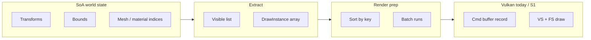

# Engine Architecture — Design Notes

This document captures **architecture intent and reasoning** for the SiriusEngine / VulkanDesktop reboot. Executable **sprint checklists** live in `Docs/SprintPlan.md`; keep this file for **structure, invariants, and tradeoffs**.

---

## 1. Purpose and scope

**Goal**: A **small but credible** engine foundation: a **runnable gameplay loop** in a coherent scene, plus a **rendering lab** where features can be toggled and their **quality vs performance** impact measured.

**Scope of this document**:

- How major subsystems relate (runtime, scene data, render extract, Vulkan).
- **Data-oriented** constraints on the **data side** (simulation, scene state, render-facing extracts).
- How the **rendering path** should be shaped so it consumes flat buffers, not pointer-heavy scene graphs.
- Known **risks** and **anti-patterns**.

Out of scope here: exact class names in the repo, shader code, or step-by-step build instructions (those belong in code comments, `README.md`, or `SprintPlan.md`).

---

## 2. North star (engineering outcomes)

Summarized from the roadmap; these are **acceptance criteria** for “engine, not demo only”:

| Outcome | Meaning |
|--------|---------|
| **Deterministic tooling** | Shaders and assets resolve predictably; CI can compile shaders and catch breakage early. |
| **Layered runtime** | Window/input, simulation, scene data, render extract, and Vulkan record/submit are **conceptually separated** even if some live in the same process today. |
| **Playable slice** | One scene + one simple objective/loop + restart; failures are logged, not silent black screens. |
| **Rendering lab** | Presets/flags, timing (CPU + GPU where possible), optional screenshots for A/B. |
| **Evidence** | Benchmark scenes + a short runbook so numbers are reproducible on a fresh machine within a stated variance band. |
| **Data-oriented data plane** | Hot paths use **SoA / columnar** storage, **stable indices**, **sequential scans**, and **explicit buffers** for GPU upload — not deep OO graphs as the primary per-frame execution model. |
| **Mesh-shader GPU-driven renderer** | Long-term raster path: **GPU** cull/compact → **mesh shader** (optional Task later) → fragment; **VS + indexed indirect** fallback when extensions missing. CPU SoA + extract remain **source of truth** until GPU path is parity-tested. |

---

## 3. High-level system map

Intended **dependency direction** (higher layers may depend on lower; not the reverse):

```text
┌─────────────────────────────────────────────────────────────┐
│  Application (lifecycle, config, modes)                    │
├─────────────────────────────────────────────────────────────┤
│  Gameplay / rules (optional thin layer on top of world)     │
├─────────────────────────────────────────────────────────────┤
│  Simulation & input → writes SoA / columns                  │
├─────────────────────────────────────────────────────────────┤
│  Scene / world store (SoA, handles, resource tables)       │
├─────────────────────────────────────────────────────────────┤
│  Render extract (visibility, draw instances, sort keys)      │  ← no Vulkan
├─────────────────────────────────────────────────────────────┤
│  Render backend (Vulkan: passes, pipelines, cmd buffers)   │  ← consumes extract only
└─────────────────────────────────────────────────────────────┘
```

**Rule of thumb**: `Vk_Core` (or its successor) should sit in the **bottom** box. It should **not** own high-level game rules; it **should** own swap chains, pipelines, and command recording driven by **already prepared** draw streams.

### 3.1 VulkanDesktop today (incremental)

The desktop app is not fully layered yet, but the **debug camera path** follows the intended direction:

1. **`Vk_Core::BeginFrame`** — `glfwPollEvents` → frame Δt → ImGui `NewFrame` → `UtilInput::Sample` → `Vk_Camera::ApplyInput`.
2. **`Util_InputSnapshot`** — device-neutral movement flags and mouse deltas (no GLFW in `Vk_Camera`).
3. **`Vk_Camera`** — consumes snapshot + `Util_CameraSettings`; writes `myView` / `myProj` / `myEye` for UBOs and lighting.

Next step toward the map above: move `UtilInput::Sample` (and persistent `Util_InputState`) out of `Vk_Core` into an application or simulation/input module; keep `ApplyInput` as the render-facing consumer.

**Shaders (today):** **GLSL → glslc** — sources in `Shader/` (`TriangleVertex.vert`, `TriangleFrag_Lit.frag`), SPIR-V in `Shader_Generated/`, raster entry `main` on a **vertex + fragment** pipeline. Pitfalls: `.cursor/rules/shader-build.mdc`, `Docs/Archived/notes-2026-05-22-shader-debug.md`.

**Render path (target):** See **§5.6** and `Docs/SprintPlan.md` (S1→S6). Today: indexed draw from `Vk_Core`; target: draw stream → GPU indirect → mesh tasks + mesh shader.

---

## 4. Data-oriented architecture (data plane)

### 4.1 What “data-oriented” means here

It is **not** mandatory to use a particular ECS library. The invariant is **mechanical**:

- **Columnar hot state**: transforms, bounds, mesh/material **indices**, masks/tags — each in its own contiguous array (SoA).
- **Stable handles**: `(index, generation)` or slot maps so recycled indices cannot revive stale references silently.
- **Sequential work**: systems update **ranges** of columns with predictable read/write sets (friendly to jobs later).
- **No pointer chasing on the hot path** for core per-frame work: avoid virtual `Update()` per entity, deep inheritance trees, and `unordered_map` in inner loops.

Editor-facing or tooling code may stay more object-oriented; the **frame-critical path** should not.

### 4.2 Entity and resource indirection

- **Entities** refer to meshes/materials via **small integer indices** into **tables**.
- **Tables** map stable resource ids to GPU-facing data: buffer handles, descriptor indices, pipeline layout compatibility groups, etc.
- **Draw records** store indices only; **resolution** to Vulkan handles happens at **batch boundaries** or in a dedicated “resolve” pass — keeps the draw array trivially serializable and sortable.

### 4.3 Extract step (render-facing boundary)

Each frame (or sub-step), a dedicated **extract** phase:

1. Reads SoA (transforms, bounds, visibility masks).
2. Outputs **flat arrays**: visible entity indices, `DrawInstance` structs (sort key, mesh id, material id, per-instance data offset, etc.).
3. **Does not** call Vulkan.

This isolates **game/scene semantics** from **GPU API** and makes unit testing and profiling easier.

### 4.4 GPU upload strategy

- Prefer **ring buffers** or **large slab UBO/SSBO** regions written **sequentially** each frame for per-object/instance data.
- Struct layouts must match shader expectations (**std140/std430** rules, padding explicit in code comments where non-obvious).
- Avoid per-object `malloc`/`new` on the hot path; reuse scratch arenas reset per frame.

### 4.5 Transform hierarchy (if present)

Hierarchy complicates pure SoA updates. Practical options:

- **Flat world matrices** in SoA with a separate “dirty propagation” pass in deterministic order (e.g. sorted by hierarchy depth), or
- **Limited depth** with explicit parent index column + iterative propagation.

Recursive virtual calls per node are a poor fit for the stated data-plane goals.

---

## 5. Rendering pipeline alignment (submission model)

### 5.1 Draw stream

After extract:

1. **Cull / LOD** (CPU first): produce candidate draw indices or instances.
2. **Assign sort keys**: e.g. `(pipelineId, materialId, meshId, depthBucket)` packed into a `uint64` or struct with documented tie-break for stability (transparency, UI).
3. **Sort** `DrawInstance` array by key.
4. **Batch**: compute run lengths or secondary `Batch` array for contiguous draws sharing bind state.
5. **Record** command buffer: single forward scan over batches; minimal `vkCmdBind*` churn.

### 5.2 Vulkan recording principles

- **Bind once per batch**, not once per logical object when shareable.
- Prefer **instancing** or **multi-draw** when many instances share the same mesh/material.
- **Push constants** or **dynamic uniform offsets** for small per-draw variation (e.g. material index) when bindless is not used.

### 5.3 Bindless vs traditional descriptors

| Approach | Pros for DoD | Cons |
|----------|----------------|------|
| **Traditional** + heavy batching | Portable, easier validation/debug | More CPU sorting; more binds if batches are poor |
| **Bindless** (descriptor indexing / descriptor buffers) | Natural “material index → table lookup” in shader | Extension matrix, harder debug, stricter layout discipline |

Decision should be **explicit**, documented here when made, and reflected in shader tables and the extract format.

### 5.4 Phase graph (CPU side)

Recommended explicit order (names illustrative):

```text
Input → Simulation → Transform resolve → Extract → Cull/LOD → Sort → Record → Present
```

Each phase declares **inputs/outputs** as buffers. Hidden cross-talk between phases (globals, singletons mutating unknown columns) undermines reasoning and parallelization.

### 5.5 GPU-driven path (staged)

**GPU culling / indirect draws** reduce CPU record cost but complicate debugging. **Policy**: keep **CPU SoA + extract** as the **source of truth** until a GPU path is **proven equivalent** (golden frame or statistical comparison on fixed camera paths). Implemented in **`SprintPlan.md` S3** (indexed indirect, VS/FS) before mesh shaders.

### 5.6 Mesh shader + GPU-driven target (decisions)

Long-term **production** raster path for scene geometry:

```text
SoA → Extract → [GPU: cull meshlets → compact list] → vkCmdDrawMeshTasksIndirect*
     → Task? (deferred) → Mesh → Fragment
```

| Decision | Choice (v1) | Notes |
|----------|---------------|--------|
| Vulkan baseline | 1.2 + `VK_EXT_mesh_shader` | Matches vendored SDK; revisit 1.3 later. |
| Task shader | **Deferred** | Add only if meshlet count/thread pressure requires it. |
| Geometry | **Meshlets** (offline cluster) | e.g. meshoptimizer; bounds per meshlet for GPU cull. |
| Materials | **Bindless or large SSBO tables** (decide in S1) | Mesh/fragment shaders index tables by `materialId`. |
| Fallback | **S3 path**: VS + `DrawIndexedIndirect` | Required when mesh shader unsupported; same instance/meshlet buffers where possible. |
| Scope | 1k+ instances, single-digit cascades later | No Nanite-scale occlusion/clip in v1. |

**Milestones** (detail in `SprintPlan.md`): **M1** CPU draw stream → **M2** GPU indirect → **M3** meshlet assets → **M4** mesh shader → **M5** GPU mesh tasks + fallback → **M6** rendering lab on new path.

**Anti-pattern**: jumping to mesh shaders before **draw stream**, **descriptor policy**, and **meshlet buffers** exist — yields a non-extensible demo draw.

---

## 6. Data-flow diagrams

### 6.1 Current target (CPU extract → batch record)



### 6.2 End state (GPU-driven mesh shader)


---

## 7. Rendering feature lab (architectural hooks)

Features (MSAA, shadows, IBL, tonemap, etc.) should map to:

- **Preset bundles** (Low/Base/High/Custom) that flip concrete flags.
- **Pipeline variants** keyed consistently so the **draw sort key** remains coherent when toggling features.
- **Measurement**: same scene + camera path + warmup + p50/p95 frame time; optional GPU timestamps.

Architecturally: **feature code** should not scatter “if (feature)” inside per-object virtual calls; it should change **which passes/pipelines exist** and **which columns** extract reads — still fed by the same draw-stream machinery.

---

## 8. Risks and mitigations

| Risk | Mitigation |
|------|------------|
| **Fake DoD** (arrays of smart pointers, maps in hot loops) | Code review checklist; perf profiles on extract + sort + record. |
| **Unstable draw order** | Explicit tie-break in sort key; document transparency policy. |
| **GPU resource lifetime vs SoA edits** | Generations / frame-delayed free lists; version counters on tables. |
| **Layout mismatch CPU/GPU** | Single header or code-generated struct metadata; assert sizes in debug. |
| **Monolith `Vk_Core`** | Incrementally peel “world” and “extract” out; **S2** in `SprintPlan.md`. |
| **Premature GPU-driven / mesh shader** | Follow S1→S6 order; presets + parity tests before dropping fallback. |
| **Descriptor strategy churn** | Lock policy in **S0**; reflected in mesh/fragment table layouts. |
| **Mesh shader portability** | Always ship **S3 fallback** preset; probe features at startup. |

### Anti-patterns (discouraged on the hot path)

- Per-entity virtual `Update()` that walks inheritance.
- Scene graph traversal from inside `vkCmd` recording.
- Per-draw heap allocations or string operations.
- Implicit global mutable state without a named owner phase.

---

## 9. Relation to the current codebase (VulkanDesktop)

Today, **`VulkanDesktop`** centers on **`Vk_Core`**: windowing, Vulkan init, resources, and draw loop in one place. This document describes **target boundaries**, not a claim that the repo fully implements them yet.

**Incremental alignment** (suggested direction):

1. Introduce a **plain-data** scene or object list that `Vk_Core` **reads** each frame (even if small).
2. Add an **extract** function that fills a `std::vector<DrawInstance>` (or equivalent) before any `vkCmd*` for scene objects.
3. Move sort/batch assumptions into that path; shrink direct coupling from gameplay-ish state to Vulkan structs.

---

## 10. Document maintenance

- When **binding model** or **extract layout** changes, update **§5** and note in preset/benchmark changelog (**S7**).
- When **north star** or sprint order changes, update **§2** / **§5.6** and `Docs/SprintPlan.md`.

---

*Last aligned with `Docs/SprintPlan.md` (S0–S7 + parallel vertical slice).*
