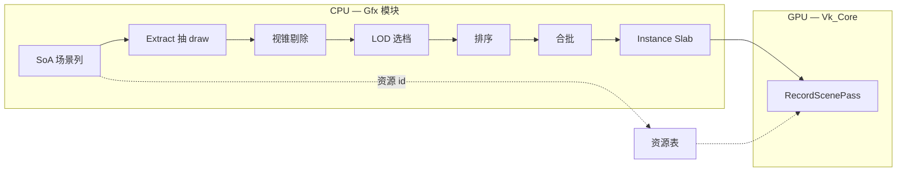

# S1 回顾总结 — CPU 绘制流（里程碑 M1）

> **时间：** 2026-05-25 ~ 2026-05-26  
> **状态：** ✅ S1 / M1 已完成（详见 [`SprintPlan.md`](SprintPlan.md) → Archived）  
> **细节任务：** 各 `Docs/*_Plan.md` / `*_Progress.md`

---

## 一句话

S1 把引擎从「能画一两个物体」推进到「**多物体、可排序、可合批、descriptor 有章可循**」的 **CPU 端绘制流水线**，为后面的 GPU 剔除、Mesh Shader、帧图多 Pass 打地基。

---

## 🎯 要解决什么问题？为什么要做？

早期 demo 往往是：**场景逻辑、剔除、排序、Vulkan 录制** 缠在一起，物体一多就：

| 痛点 | 后果 |
|------|------|
| 🔀 逻辑与 GPU API 耦合 | Gfx 里调 Vulkan，难测、难换后端 |
| 🐌 每个物体重复 `vkCmdBind*` | CPU 录制成为瓶颈 |
| 🧩 每 draw 改共享 UBO | 校验层报错、画面错乱 |
| 🌫️ 透明与不透明混在一起 | 排序错误、深度打架 |
| 📦 资源只有路径没有稳定 id | 无法做 SoA、无法做批处理键 |

**S1 的目标（M1）** 不是「画面多炫」，而是证明一条 **可扩展的数据流**：

```text
场景列数据 (SoA) → 抽离绘制列表 → 剔除/LOD → 排序 → 合批 → 录制 (Set 0/1/2)
```

这条链路与终局（GPU-driven、Mesh Shader、帧图）**数据结构一致**，只是录制端暂时还是传统 `vkCmdDrawIndexed`。

---

## 🛠️ 做了什么？（按数据流通俗说明）

### 1️⃣ 场景怎么存 — SoA + 稳定实体

- **做了什么：** `Gfx_SceneSoA` 用列式数组存变换、包围盒、mesh/material id、层掩码等；实体用 **槽位 + generation** 避免野指针。
- **为什么：** 热路径要顺序扫数组，不要每个实体虚函数 `Update()`；和以后多线程 Job 友好。
- **你现在能看到：** Kenney 营地等多实体 demo，每个物体有独立 transform。

📎 任务：[`scene-soa_Plan.md`](scene-soa_Plan.md)

---

### 2️⃣ 资源怎么查 — Manifest → 资源表

- **做了什么：** CPU 侧 `Gfx_ResourceManifest` 描述 mesh/材质/纹理路径；启动时载入 `Vk_ResourceTables`，得到稳定的 **数字 id**。
- **为什么：** Draw 记录里只带小整数，真正 `VkBuffer` / 纹理在 **录制边界** 再解析，列表可排序、可序列化。
- **你现在能看到：** 维京房、猴子、树 LOD 链、营地道具等多 mesh、多材质同屏。

📎 任务：[`resource-tables_Plan.md`](resource-tables_Plan.md)

---

### 3️⃣ 渲染前抽一层 — Extract（Gfx 不碰 Vulkan）

- **做了什么：** `Gfx_ExtractDrawInstances` 从 SoA 生成扁平 `Gfx_DrawInstance`（排序键、mesh/material、实例偏移等）。
- **为什么：** **游戏语义** 与 **GPU API** 分界；以后多相机、多 View 只换 Extract 参数。
- **你现在能看到：** 日志里 `EXTRACT entities=9 draws=9` 一类信息。

📎 任务：[`draw-extract_Plan.md`](draw-extract_Plan.md)

---

### 4️⃣ 看不见的不画 — CPU 视锥剔除

- **做了什么：** `Gfx_CullDrawInstancesInPlace` 按视锥 + layer 掩码裁掉实例。
- **为什么：** 先在小规模 CPU 上验证数据流，S3 再换 GPU compute 剔除，**接口形状不变**。
- **你现在能看到：** `CULL opaque=8 transparent=1` 等日志。

📎 任务：[`draw-cull-sort_Plan.md`](draw-cull-sort_Plan.md)

---

### 5️⃣ 远一点换模型 — LOD v0（CPU）

- **做了什么：** 逻辑 mesh id + `Gfx_LodTable` 距离选档，**15% 滞后** 防抖动；解析后的物理 `meshId` 写回 draw。
- **为什么：** 大场景必备；先 CPU 版与 draw 列表对齐，GPU LOD 以后对齐同一张表。
- **你现在能看到：** 远处树切到 `kenney_tree_simple`，`[LOD]` 日志。

📎 任务：[`lod-v0_Plan.md`](lod-v0_Plan.md)、[`Data/LOD.md`](../Data/LOD.md)

---

### 6️⃣ 怎么画才对 — 不透明排序 + 透明分离

- **做了什么：**
  - 不透明：按 `mySortKey`（材质 / mesh / 深度桶）排序；
  - 透明：单独列表，**由远到近**（眼空间 Z）；
  - 录制：**先 opaque（深度写入开）→ 再 transparent（混合开、深度写入关）**。
- **为什么：** 透明必须后画且不能乱序；与 S7 帧图「透明 Pass 读深度」同思路。
- **你现在能看到：** 半透明猴子叠在场景上，背后物体仍可见（M1 目视签收）。

📎 任务：[`transparency_Plan.md`](transparency_Plan.md)

---

### 7️⃣ 少绑几次 — Batch Runs

- **做了什么：** 排序后扫描相同「批键」，得到 `Gfx_BatchRun`；`RecordScenePass` **每个 batch 绑一次 pipeline + Set 1**，batch 内多 draw 只绑 VB/IB + Set 2。
- **为什么：** Vulkan CPU 录制贵在 **状态切换**；合批让 `materialSetBinds ≤ batchRuns`，而不是每物体一次。
- **你现在能看到：** ImGui「Batch runs: 9」、PERF 里 `materialSetBinds=9`（9 个 draw、9 个 batch，demo 尚未出现「多 draw 同 batch」的极端情况，但机制已就绪）。

📎 任务：[`draw-batch_Plan.md`](draw-batch_Plan.md)

---

### 8️⃣ 每物体矩阵怎么传 — Instance Slab + Set 2

- **做了什么：** 每帧把可见物体的 `model` 写入 **ring UBO**；Set 2 用 `UNIFORM_BUFFER_DYNAMIC` + **每 draw 不同 `dynamicOffset`**。
- **为什么：** ❌ 禁止在共享 frame UBO 里每 draw 改 `model`（会互相覆盖）；这是 Vulkan 经典坑。
- **溢出：** 超过 `kMaxInstanceSlabEntries` **整帧跳过场景录制** 并打日志（fail-closed）。

📎 任务：[`instance-slab_Plan.md`](instance-slab_Plan.md)、[`instance-slab-overflow_Plan.md`](instance-slab-overflow_Plan.md)、[`descriptor-set2-verify_Plan.md`](descriptor-set2-verify_Plan.md)

---

### 9️⃣ Descriptor 分工 — Set 0 / 1 / 2

| Set | 绑什么 | 频率 |
|-----|--------|------|
| **0** Frame | 相机、环境光 | 每 Pass 一次 |
| **1** Material | 纹理 + alpha（batch 路径）或 bindless 数组 | 每 **batch** 一次（或 bindless 每 pass 一次） |
| **2** Object | 每实例 `model` + `materialIndex` | 每 **draw** 一次（dynamic offset） |

📎 策略：[`descriptor-strategy_Plan.md`](descriptor-strategy_Plan.md)、[`descriptor-set1-verify_Plan.md`](descriptor-set1-verify_Plan.md)

---

### 🔟 材质两条路 — Bindless v0（可选）

- **做了什么：** 探测 `VK_EXT_descriptor_indexing`；支持则用 **纹理数组 + material SSBO**，否则回退 **Set 1 batch**；`FORCE_MATERIAL_BATCH=1` 可强制 batch。
- **为什么：** 为 S5/S6 大量材质铺路，但 **不阻塞** 当前 demo（很多集显 `runtimeArray=no` 仍走 batch）。
- **你现在能看到：** 启动日志 `materialPath=Batch` 或 `Bindless`。

📎 任务：[`bindless-v0_Plan.md`](bindless-v0_Plan.md)

---

### 1️⃣1️⃣ 动画与剔除一致 — Demo Transform Sync

- **做了什么：** 旋转等 demo 动画 **先写 SoA**，再 Extract / Cull；slab 拷贝 **同一份** 矩阵。
- **为什么：** 否则「看得见但被剔掉」或「矩阵和包围盒不一致」。

📎 任务：[`demo-transform-sync_Plan.md`](demo-transform-sync_Plan.md)

---

### 1️⃣2️⃣ 工程化与验收 — 性能可见 + 窗口缩放修复

| 项 | 说明 |
|----|------|
| 📊 **M1 指标** | ImGui：实体数、batch runs、draw/bind 计数；第 60 帧后一次性 `[PERF]` 日志 |
| 🪟 **Resize 崩溃修复** | Swapchain 重建后刷新 `Gfx_Material` 里缓存的 `VkPipeline` 句柄 |

📎 任务：[`m1-acceptance_Plan.md`](m1-acceptance_Plan.md)；resize 修复见 commit `7944779`。

---

## 🔁 整帧数据流（一图流）



---

## ✅ M1 里程碑验收了什么？

| 验收项 | 结果 |
|--------|------|
| 多 mesh 场景 | ✅ 9 实体、多 mesh/材质（Kenney + 维京房 + 猴） |
| Draw 随 batch 扩展、非逐物体绑 Set 1 | ✅ batch 路径 `materialSetBinds ≤ batchRuns` |
| 帧时记录 | ✅ ImGui 曲线 + `[PERF]`  warmup 日志 |
| 透明叠 opaque | ✅ 目视签收 |

---

## 💡 还能做得更好的地方（诚实复盘）

### 架构 / 分层

| 现状 | 可改进 |
|------|--------|
| 🔧 Demo 场景、资源路径仍硬编码在 `Vk_Core::InitVulkan` | **S2 scene-load**：JSON 场景 + 生命周期，去掉 Init 里的资产列表 |
| 🔧 `Vk_Core` 仍偏大（窗口 + Vulkan + 循环 + 录制） | 渐进剥离：resource load / draw-list build / record-submit |
| 🔧 输入采样仍在 `Vk_Core::BeginFrame` | 迁到 Application / Input 模块 |

### 渲染与性能

| 现状 | 可改进 |
|------|--------|
| 📐 深度桶用实体原点 NDC，旋转物体 AABB 偏松 | SprintPlan  backlog：**更紧的 eye-Z / 世界 AABB** |
| 🎨 透明物体仍用「每 draw 一 pipeline」的 batch 模型 | 透明也可按材质合批；或 S7 **帧图独立透明 Pass** |
| 📦 Demo 9 draw = 9 batch，未展示「多 draw 同 batch」 | 加 **同材质多实例** 场景更有说服力 |
| ⏱️ `[PERF]` 只打一次、第 60 帧 | 可配置间隔 / CSV；GPU timestamp（S7） |
| 🖥️ Bindless 在部分 GPU 上回退 batch | 文档化硬件表；或 WSL/独显测试矩阵 |

### 健壮性

| 现状 | 可改进 |
|------|--------|
| 🪟 Resize：已修 pipeline 句柄；`OUT_OF_DATE` 帧仍可能跳过 PERF | 可选：resize 当帧不录制、先 recreate 再 draw |
| 📏 Slab 溢出直接跳过整帧 | 可分级：截断 + 警告，或 GPU 间接（S3） |

### 测试与文档

| 现状 | 可改进 |
|------|--------|
| ✅ 以 smoke + 日志 + ImGui 为主 | 固定相机 **golden / 统计 parity**（S3 GPU cull 需要） |
| 📚 任务计划分散在多个 `*_Plan.md` | 本文 + `EngineArchitecture.md` 已互补；benchmark runbook 留 S7 |

---

## ➡️ S1 之后建议往哪走？

```text
S2  scene-load + 生命周期 + Vk_Core 瘦身
S3  GPU frustum cull + indirect draw（复用同套 draw 列表）
S4+ Meshlet / Mesh Shader / 帧图（SprintPlan S4–S7）
```

S1 的价值在于：**数据形状已经对齐终局**；后面主要是换「谁来做剔除/提交」以及「Pass 怎么组织」，而不是推倒重来。

---

## 📎 相关文档索引

- 路线图：[`SprintPlan.md`](SprintPlan.md)
- 架构意图：[`EngineArchitecture.md`](EngineArchitecture.md)
- 文档索引：[`README.md`](README.md)
