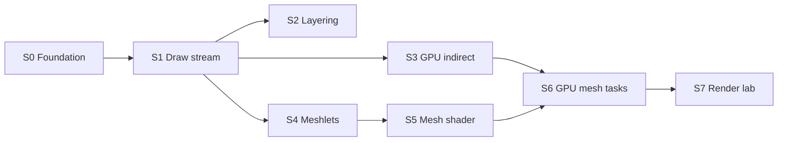

# Sprint Plan — SiriusEngine / VulkanDesktop

Executable roadmap for a **small but real engine foundation** and a **mesh-shader, GPU-driven** render path. Architecture intent and tradeoffs: [`EngineArchitecture.md`](EngineArchitecture.md). Per-task design logs: `Docs/{TaskName}_Plan.md` / `_Progress.md`.

**Hygiene:** Active sprints list only open `[ ]` tasks. When done, **move the line to [Archived](#archived)** (keep sprint tag + completion note). Do not leave `[x]` in active sections.

---

## North star

| Pillar | Done when |
|--------|-----------|
| **Engine** | Deterministic startup; stable shader/asset pipeline; clear module boundaries; config + data on disk. |
| **Data plane** | SoA columns, stable handles, render **extract** → flat draw/meshlet buffers (no hot-path scene-graph walks). |
| **Render target** | **GPU-driven** visibility/draw generation + **mesh shader** raster (Task optional); VS+indirect **fallback** when unsupported. |
| **Product slice** | One playable scene + simple loop + fail-soft logging (no silent black screen). |
| **Rendering lab** | Presets, CPU/GPU timing, optional captures; features toggle without breaking sort keys. |
| **Evidence** | Benchmark scene + runbook; reproducible numbers on a fresh machine. |

---

## Sprint map

| Sprint | Milestone | Primary outcome |
|--------|-----------|-----------------|
| **S0** | — | Toolchain + resources trustworthy (P0 blockers cleared). |
| **S1** | **M1** | CPU **draw stream**: SoA → extract → sort → batch → record (VS/FS). |
| **S2** | — | Layering: lifecycle, config, `Vk_Core` peel; multi-object draw path clean. |
| **S3** | **M2** | **GPU-driven** frustum cull → **indexed indirect** (still VS/FS). |
| **S4** | **M3** | **Meshlet** offline build + GPU tables + debug viz. |
| **S5** | **M4** | **Mesh shader** pipeline (Mesh + Fragment; Task deferred). |
| **S6** | **M5** | **GPU-driven mesh tasks** + VS/indirect fallback. |
| **S7** | **M6** | Rendering presets, benchmarks, feature experiments on new path. |

**Parallel track** (any time after S1): [Vertical slice](#parallel-vertical-slice) — does not block render architecture spikes.

---

## S0 — Foundation & tooling

*Blocks all experiments. Maps to old §1 P0/P1.*

### Must complete

- [ ] Validation layers: install guide, startup layer discovery log, optional runtime on/off flag.
- [ ] Fix `VkInit::Pipeline_DynamicStateCreateInfo()` (no pointers to temporaries).

### Should complete in S0

- [ ] Expand `README.md` + **new-machine bootstrap** (toolchain versions, verify commands).
- [ ] **Debug messenger** (validation utils) or document intentional omission.
- [ ] Unify extension/layer probes: `UtilLogger` instead of `std::cout` in `CheckExtensionSupport` / `CheckValidationLayerSupport`.

---

## S1 — CPU draw stream (milestone M1)

*Traditional VS/FS; architecture matches end-state data flow. Old §2 SoA extract + §4 draw stream.*

### Data plane

- [ ] SoA columns: transform, bounds, mesh/material indices, layer/mask.
- [ ] Stable entity id (index + generation or slot map).
- [ ] **Extract** phase: visible indices + `DrawInstance` (sort key, mesh id, material id, instance data offset) — **no Vulkan**.
- [ ] Resource tables: mesh/material → GPU descriptor/buffer indices; draw records store indices only — populated from scene manifest ([`scene-load_Plan.md`](scene-load_Plan.md) Phase C).
- [ ] Per-frame instance slab (ring UBO/SSBO); no per-object heap allocs on hot path.
- [ ] **Verify descriptor policy (Set 2):** wire `UNIFORM_BUFFER_DYNAMIC` on instance slab; 2+ draws with distinct `vkCmdBindDescriptorSets` `dynamicOffset` — see `Docs/descriptor-strategy_Plan.md`, `EngineArchitecture.md` §5.3, `Vk_DescriptorPolicy.h`.

### Submission

- [ ] CPU frustum cull + LOD (simple) → sort by `(pipeline, material, mesh, depth bucket)`.
- [ ] Batch runs; `RecordCommandBuffer` scans batches only (remove hard-coded `myMeshMap[0]` draw).
- [ ] **Verify descriptor policy (Set 0/1 + push):** split `model` out of `GpuCameraData` (push `mat4` or Set 2); Set 1 material bind once per batch; validation layers clean on multi-mesh path.
- [ ] **Bindless vs batch+push decision** — document in `EngineArchitecture.md`; implement tables + shader `materialIndex` (must not contradict §5.3 hybrid policy).
- [ ] Finish or delete **`DrawObjects` stub**; single documented render path.

### Milestone M1 acceptance

- [ ] Multi-mesh scene; draw calls scale with batches not naive per-object binds; frame time logged.
- [ ] **Descriptor policy signed off:** Set 0 per-frame UBO + (Set 1 batch **or** bindless table) + (Set 2 dynamic slab **or** push `mat4`) exercised on fixed test scene; no demo-only `model` in camera UBO.

---

## S2 — Engine layering & hygiene

*Parallel with late S1 / early S3. Old §2 core runtime + §7 structure.*

- [ ] Application **lifecycle** (init → load scene → update → render → shutdown) separate from Vulkan bootstrap — see [`scene-load_Plan.md`](scene-load_Plan.md) Phase C.
- [ ] Thin **scheduler** (update vs render step).
- [ ] Central **config** (window, vsync, asset root, log level, feature flags).
- [ ] Move `UtilInput::Sample` out of `Vk_Core`; input abstraction for gameplay + camera.
- [ ] **`Vk_Core` decomposition (incremental)**: resource tables, draw-list build, record/submit only.
- [ ] Remove temp init hacks (`CreateMaterial`, `InitScene`, env buffer) or finish wiring.
- [ ] **Image queue sharing** when transfer ≠ graphics family.
- [ ] Wire or remove dynamic pipeline state in `Vk_PipelineBuilder`.
- [ ] Reduce `GetInstance()` in `Util_Loader` / `Gfx_Mesh::BuildBuffers` (slim `Vk_ResourceContext`).
- [ ] Move `ENABLE_ROTATE`, shader paths, mip toggles into config.

### Scene (minimal for M1+)

*Design and phased rollout: [`scene-load_Plan.md`](scene-load_Plan.md). Replaces hard-coded `Util_DemoAssets` / `UtilStartupChecks` list with scene-derived `AssetManifest`.*

- [ ] **Scene-load Phase A:** `Data/Scenes/demo.json` + `LoadSceneDesc` + `CollectDependencies` + CLI `--scene` (parse only; no GPU behavior change).
- [ ] **Scene-load Phase B:** `VerifyManifest` before Vulkan; retire `Util_DemoAssets::kRequiredFiles` (manifest-driven `[STARTUP]` checks).
- [ ] **Scene-load Phase C:** `LoadSceneResources` in lifecycle; remove demo mesh/texture/shader paths from `Vk_Core::InitVulkan`; entities use resource table ids.
- [ ] **Scene-load Phase D:** `UnloadScene`, strict/warn asset policy, optional `Data/Scenes/smoke.json` smoke scene.
- [ ] Scene description on disk (JSON v1 per plan); entities = transform + mesh + material + flags.
- [ ] Flat world matrices first; hierarchy upgrade path documented (`scene-load_Plan.md` non-goals).
- [ ] GPU resource lifetime rules when scene edits (descriptor/pipeline rebuild policy) — plan Phase D1.
- [ ] **Verify descriptor policy (layout):** `VkPipelineLayout` lists Set 0/1/2 per `Vk_DescriptorPolicy.h`; rebuild path documented when materials change.

---

## S3 — GPU-driven indirect (milestone M2)

*Prove GPU visibility before mesh shaders. Old §4 “GPU culling / indirect”.*

- [ ] Per-instance AABB + draw template in SSBO (sync with SoA).
- [ ] Compute: frustum cull → visible indices + `VkDrawIndexedIndirectCommand` buffer.
- [ ] `vkCmdDrawIndexedIndirect` / multi-draw indirect; CPU record cost ~flat.
- [ ] Optional GPU compaction pass for dense visible list.
- [ ] **Parity test**: GPU path vs CPU cull on fixed camera (golden or statistical) per `EngineArchitecture.md` §5.5.

### M2 acceptance

- [ ] Flying camera; GPU decides draw count; CPU does not loop per-object `vkCmdDraw*`.

---

## S4 — Meshlet geometry (milestone M3)

*Data prerequisite for mesh shaders.*

- [ ] Choose meshlet builder (e.g. meshoptimizer) + documented cluster params.
- [ ] Asset format: meshlet table + vertex/index views + per-meshlet bounds (import or offline step).
- [ ] Upload global vertex/index + meshlet metadata buffers.
- [ ] Debug draw: meshlet bounds (VS or compute viz) on test mesh.

### M3 acceptance

- [ ] At least one production mesh displays correct meshlet segmentation.

---

## S5 — Mesh shader pipeline (milestone M4)

*Raster path switch. Vulkan 1.2 + `VK_EXT_mesh_shader`; **no Task shader** in v1.*

- [ ] Device capability probe: mesh shader features; log + graceful disable.
- [ ] Enable extensions; mesh + fragment pipeline layout aligned with material tables.
- [ ] Shaders: `Mesh` (+ reuse/adapt `TriangleFrag_Lit.frag`) → `Shader_Generated/`.
- [ ] `vkCreateGraphicsPipeline` mesh stages; payload reads meshlet + instance from SSBO.
- [ ] RenderDoc / validation capture checklist in docs.

### M4 acceptance

- [ ] Single-object mesh-shader forward lit matches VS path within agreed tolerance.

---

## S6 — GPU-driven mesh tasks (milestone M5)

*End-state core: GPU cull **meshlets** + `vkCmdDrawMeshTasksIndirectEXT`.*

- [ ] Compute: meshlet frustum cull (+ optional backface cone later).
- [ ] Compact visible meshlet list → indirect mesh-task buffer.
- [ ] `vkCmdDrawMeshTasksIndirectEXT`; mesh shader consumes compact list + instance table.
- [ ] **Fallback preset**: S3 VS + indirect when mesh shader unsupported.
- [ ] Preset enum: `Traditional` / `GpuIndirect` / `MeshShader` / `FullGpuMesh`.

### M5 acceptance

- [ ] Multi-object scene; primary submission GPU-driven; CPU record stable across instance count.

---

## S7 — Rendering lab & hardening (milestone M6)

*Old §4 experiments + §5 measurement + §6 docs — on top of S6 path.*

### Infrastructure

- [ ] Presets `Low / Base / High / Custom` wired to concrete flags.
- [ ] GPU timestamp queries + CPU p50/p95 logging.
- [ ] Standard benchmark procedure (scene, camera path, warmup, CSV/JSON).
- [ ] Screenshot capture keyed to preset + pose.
- [ ] RenderDoc expectations per preset; preset changelog.

### Feature experiments (order flexible)

- [ ] MSAA vs post AA vs none.
- [ ] Shadow map (single cascade).
- [ ] IBL / environment upgrade.
- [ ] Tonemap / exposure modes.
- [ ] Bloom (optional).
- [ ] Validation-friendly toggles; graceful GPU feature degradation.

### Documentation

- [ ] Engine overview diagram (modules + data flow) in `README.md` or `Docs/`.
- [ ] “How to add a rendering experiment” checklist.
- [ ] Troubleshooting matrix (seed: `Docs/Archived/notes-2026-05-22-shader-debug.md`).
- [ ] Third-party / SDK license inventory.

---

## Parallel — Vertical slice

*Prove “for games” without blocking S3–S6. Start after **M1** recommended.*

### Scene & content

- [ ] Primary play/benchmark scene in `Data/` (layout, lighting, camera spawn).
- [ ] All referenced assets present or substitute with logged warnings — manifest strict at boot, optional runtime warn (`scene-load_Plan.md` Phase D2).
- [ ] Optional second tiny scene for load smoke tests.

### Gameplay

- [ ] One **objective** (reach marker / collect / survive / toggle lights).
- [ ] Win/lose or completion feedback (HUD or log).
- [ ] **Restart** without process exit.

### Presentation

- [ ] HUD: FPS, frame time, **active render preset** name.
- [ ] Pause + frame advance (dev).

### Engine hooks (tie to S2)

- [ ] Player controller contract (move, look, interact hook).
- [ ] Simple game state / mode stack (Play, Pause, Dev overlay).
- [ ] Event channel gameplay ↔ UI ↔ debug.

---

## Backlog (deferred / unscheduled)

- [ ] GitHub Actions: `CompileShader_Glslc.bat` CI (deferred; local VS build sufficient).
- [ ] CI smoke: init + one frame headless/offscreen.
- [ ] Document or eliminate runtime **working-directory** dependency.
- [ ] Log rotation; domain-split logs; crash summary on failure.
- [ ] `LNK4098` linker warning; safe `size_t`→`uint32_t` casts.
- [ ] **Task shader** for mesh amplification (post-M5).
- [ ] GPU occlusion / hierarchical Z (post-M5).
- [ ] Deferred vs forward decision (only if G-buffer committed).
- [ ] Job system / parallel column updates (SoA write sets).
- [ ] Editor, networking, physics, non-Windows — see parking lot.

### Parking lot

- In-engine property editor (post slice).
- Cross-platform windowing (on product request).

---

## Archived

*Completed work. Format: `[x] [Sx] description — date/notes`.*

### Toolchain & stability

- [x] **[S0]** Pipeline creation diagnostics (`VkResult` + stage/layout summary) — 2026-05-22; `Util_VulkanResult`, `Vk_PipelineDiagnostics`, `Docs/pipeline-diagnostics_Plan.md`.
- [x] **[S0]** Startup checks: required `Shader_Generated/*.spv`, demo models/textures exist before Vulkan init — 2026-05-22; `Util_StartupChecks`, `Util_DemoAssets.h` (temporary; migrate per `Docs/scene-load_Plan.md`), `Docs/startup-checks_Plan.md`.
- [x] **[S0]** Asset root configuration (`Config/engine.json` + `--asset-root` / `--config` CLI); repo-relative paths; heuristic `BuildCandidateBases` removed — 2026-05-22; `Docs/asset-root_Plan.md`.
- [x] **[S0]** Deterministic glslc compile + VS Custom Build — 2026-05-22; `Docs/Archived/notes-2026-05-22-shader-debug.md`.
- [x] **[S0]** Repo-root `Logs/shader_compile_log.txt` + `engine_runtime_log.txt` — `ShaderBuild_Common.bat`, `UtilLogger`.
- [x] **[S0]** Shader scripts split; MSBuild stdout pitfall documented — `.cursor/rules/shader-build.mdc`.
- [x] **[S0]** Single GLSL source path (`TriangleVertex.vert` + `TriangleFrag_Lit.frag`); HLSL/dxc removed — 2026-05-22.
- [x] **[S0]** SPIR-V outputs under `Shader_Generated/` — 2026-05-22.

### Engine / hygiene

- [x] **[S0]** Descriptor strategy locked (static + dynamic UBO + push hybrid by frequency) — 2026-05-22; `Docs/descriptor-strategy_Plan.md`, `EngineArchitecture.md` §5.3, `Vk_DescriptorPolicy.h`. Set 0 demo verified; Set 1/2 + push verification tracked in **S1** / **S2** tasks.
- [x] **[S2]** Debug fly camera — `Docs/fps-camera_Plan.md`; sampling still in `Vk_Core` until input module.
- [x] **[S0]** `Gfx_Mesh::LoadMesh` UV guard — `Vk_Types.cpp`.
- [x] **[S0]** `UtilLoader::LoadTexture` fail-fast — `Util_Loader.cpp`.
- [x] **[S0]** Queue family graphics-as-transfer fallback — `Vk_DataStruct.h`, `Vk_Core.cpp`.
- [x] **[S0]** Comment conventions — `.cursor/rules/cpp-comments.mdc`.

---

*When closing a task: move here, tag sprint (`[S0]`…`[S7]`, `[parallel]`), note verification. Update `EngineArchitecture.md` when boundaries or render target change.*
