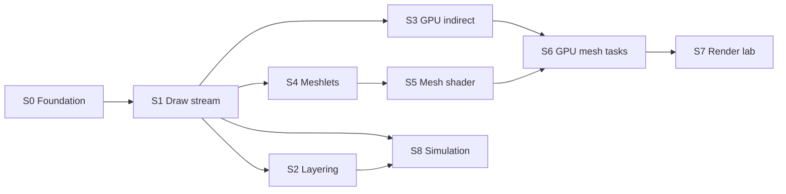
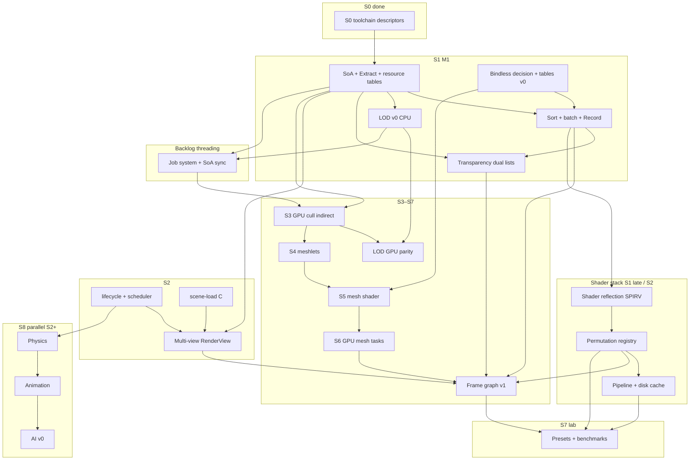

# Sprint Plan — SiriusEngine / VulkanDesktop

Executable roadmap for a **small but real engine foundation** and a **mesh-shader, GPU-driven** render path. Architecture intent and tradeoffs: [`EngineArchitecture.md`](EngineArchitecture.md). Doc index: [`README.md`](README.md). Active task logs: `Docs/{TaskName}_Plan.md` / `_Progress.md` (completed → [`Archived/plans/`](Archived/plans/)).

**Hygiene:** Active sprints list only open `[ ]` tasks. When done, **move the line to [Archived](#archived)** (keep sprint tag + completion note). Do not leave `[x]` in active sections.

---

## North star

| Pillar | Done when |
|--------|-----------|
| **Engine** | Deterministic startup; stable shader/asset pipeline; clear module boundaries; config + data on disk. |
| **Data plane** | SoA columns, stable handles, render **extract** → flat draw/meshlet buffers (no hot-path scene-graph walks). |
| **Render target** | **GPU-driven** visibility/draw generation + **mesh shader** raster (Task optional); VS+indirect **fallback** when unsupported. |
| **Product slice** | One playable scene + simple loop + fail-soft logging (no silent black screen). |
| **Rendering lab** | Presets, CPU/GPU timing, optional captures; features toggle without breaking sort keys. |
| **Evidence** | Benchmark scene + runbook; reproducible numbers on a fresh machine. |

---

## Sprint map

| Sprint | Milestone | Primary outcome |
|--------|-----------|-----------------|
| **S0** | — | Toolchain + resources trustworthy (P0 blockers cleared). |
| **S1** | **M1** | CPU **draw stream**: SoA → extract → sort → batch → record (VS/FS). |
| **S2** | — | Layering: lifecycle, config, `Vk_Core` peel; multi-object draw path clean. |
| **S3** | **M2** | **GPU-driven** frustum cull → **indexed indirect** (still VS/FS). |
| **S4** | **M3** | **Meshlet** offline build + GPU tables + debug viz. |
| **S5** | **M4** | **Mesh shader** pipeline (Mesh + Fragment; Task deferred). |
| **S6** | **M5** | **GPU-driven mesh tasks** + VS/indirect fallback. |
| **S7** | **M6** | Frame graph, multi-view, presets, benchmarks, feature experiments. |
| **S8** | — | Simulation: Physics → Animation → AI (parallel after S2). |

**Parallel tracks** (see [dependency graph](#task-dependency-graph)):

- After **M1**: [Vertical slice](#parallel-vertical-slice) — does not block render spikes.
- After **S2 scheduler**: [S8 — Simulation](#s8--simulation-physics--animation--ai) (Physics → Animation → AI).
- **Shader stack** (reflection → permutation → cache): [S1](#s1--cpu-draw-stream-milestone-m1) late / [S2](#s2--engine-layering--hygiene) — blocks heavy S7 feature permutations.
- **Frame graph + multi-view**: [S7](#s7--rendering-lab--hardening-milestone-m6) — after M1 sort/batch; shadow pass benefits from FG.

---

## Task dependency graph

*Epics added 2026-05-25. Arrows = **must complete first** (or sign off decision doc). Tasks in a sprint are not strictly serial unless noted.*

| Epic | Depends on | Unblocks | Primary home |
|------|------------|----------|--------------|
| **SoA / Extract / batch** | S0, scene-load B/C | Everything render + sim | S1 |
| **LOD v0 (CPU)** | SoA, resource tables, cull | GPU LOD, meshlet LOD | S1, S3, S4 |
| **Transparency** | Extract, sort key policy | FG transparent pass, alpha perm | S1, S7 |
| **Bindless** | M1 Set 1 path, decision doc | Mesh shader materials, S6 fallback | S1, S5, S6 |
| **Shader reflection** | SPIR-V pipeline (S0), Set layout policy | Permutation, layout codegen, bindless debug | S1 late / S2 |
| **Shader permutation** | Reflection, material flags | S7 presets, shadows/IBL variants | S2, S7 |
| **Shader / pipeline cache** | Permutation registry, `VkDevice` | Fast restarts, CI benchmarks | S2, S7 |
| **Multi-camera** | M1 extract, S2 lifecycle | FG per-view, debug minimap | S2, S7 |
| **Frame graph** | M1 record path, ≥2 passes worth | Shadows, post, multi-view RT | S7 (spike after M2 optional) |
| **GPU cull / mesh** | M1 buffers | GPU LOD, M5 | S3–S6 |
| **Multi-threading** | M1 SoA columns, S2 scheduler | Parallel cull/LOD/anim | Backlog → promote after M2 |
| **Physics → Animation → AI** | S2 scheduler, SoA writes | Vertical slice enemies, moving props | S8 |

**Parallel track** (any time after S1): [Vertical slice](#parallel-vertical-slice) — gameplay hooks; **S8 AI** enhances enemies but does not block S3–S6.

---

## S0 — Foundation & tooling

*Blocks all experiments. Maps to old §1 P0/P1.*

### Must complete

*(none — S0 must-complete queue cleared 2026-05-22.)*

### Should complete in S0

*(none — S0 should-complete queue cleared 2026-05-23.)*

---

## S1 — CPU draw stream (milestone M1)

*Traditional VS/FS; architecture matches end-state data flow. Old §2 SoA extract + §4 draw stream.*

### S1 — implementation notes *(living; trim rows when follow-up tasks close)*

| Topic | State | Next / owner task |
|-------|--------|-------------------|
| Resource tables | Done — `Gfx_ResourceManifest`, `Vk_ResourceTables`, `RecordScenePass` resolves mesh/material ids | `scene-load` Phase C replaces demo manifest |
| Per-draw `model` | **Push constant** (vertex); removed from `GpuCameraData` UBO (2026-05-26) | Set 2 slab may share or supersede push path — descriptor verify task |
| Record ↔ transforms | **Debt:** `RecordScenePass` reads `Gfx_SceneSoA::GetTransform(myEntityIndex)` | **Instance slab** — use `DrawInstance.myInstanceDataOffset` |
| Set 0 texture | Demo: `GetTextureIdForMaterial(0)` at init only | **Verify Set 1** — bind per material batch |
| Draw submission | Cull + opaque sort done; no batch yet; `vkCmdBindDescriptorSets` per draw | **Batch** task below |

**Pitfall (2026-05-26):** Do not patch `model` in a shared per-frame camera UBO between draws on the same descriptor set — use push constants or dynamic offsets (`.cursor/rules/vulkan-descriptor-per-draw.mdc`, `EngineArchitecture.md` §5.3).

### Data plane

- [ ] Per-frame instance slab (ring UBO/SSBO); no per-object heap allocs on hot path.
- [ ] **Verify descriptor policy (Set 2):** wire `UNIFORM_BUFFER_DYNAMIC` on instance slab; 2+ draws with distinct `vkCmdBindDescriptorSets` `dynamicOffset` — see `Docs/descriptor-strategy_Plan.md`, `EngineArchitecture.md` §5.3, `Vk_DescriptorPolicy.h`.

### Submission

- [ ] Batch runs; `RecordScenePass` scans batch runs only (minimal `vkCmdBind*` per batch).
- [ ] **Verify descriptor policy (Set 0/1 + push):** `mat4` model via **push constant** (done 2026-05-26); remaining — Set 1 texture/material per batch, bind Set 0 once per batch, optional Set 2 slab vs push; validation layers clean on multi-mesh path — see § S1 implementation notes.

### LOD v0 (CPU) — *deps: SoA, resource tables, cull; unblocks S3 GPU LOD*

- [ ] Asset: mesh **LOD chain** (per-LOD mesh id or geometry path) + import doc sample in `Data/`.
- [ ] SoA: `lodBias` / resolved `meshLodIndex` → resource table `meshId`.
- [ ] Distance (or screen-size) → `lodLevel` in cull; hysteresis doc to avoid flicker.
- [ ] Sort/batch uses **resolved** `meshId` (not logical mesh handle).

### Transparency — *deps: Extract, opaque sort; unblocks S7 FG pass*

- [ ] Render flags on entity/material: opaque vs transparent.
- [ ] Extract → **opaque** + **transparent** `DrawInstance` lists (still no Vulkan).
- [ ] Transparent sort: back-to-front eye-space Z; documented tie-break (`EngineArchitecture.md` §8).
- [ ] Record: opaque pass then transparent pass (blend state); ≥1 test object in scene.

### Bindless v0 — *deps: Set 1 verification; unblocks S5/S6 materials*

- [ ] **Bindless vs batch+push decision** — document in `EngineArchitecture.md` (indexing vs SSBO table vs hybrid).
- [ ] Extension probe: `VK_EXT_descriptor_indexing` (or SSBO-only path); log + fallback preset hook.
- [ ] GPU **material/texture table** + shader `materialIndex` (must not contradict §5.3 hybrid policy).
- [ ] Draw sort key includes table generation / compatibility group if needed for batching.

### Milestone M1 acceptance

- [ ] Multi-mesh scene; draw calls scale with batches not naive per-object binds; frame time logged.
- [ ] **Descriptor policy signed off:** Set 0 per-frame UBO (`view`/`proj` only) + (Set 1 batch **or** bindless table v0) + (Set 2 dynamic slab **or** push `mat4` — push path live 2026-05-26) exercised on fixed test scene.
- [ ] At least one **transparent** object draws correctly over opaque (order + blend).
- [ ] **LOD v0:** camera distance change swaps LOD on a test mesh (logged `meshId`).

---

## S2 — Engine layering & hygiene

*Parallel with late S1 / early S3. Old §2 core runtime + §7 structure.*

- [ ] Application **lifecycle** (init → load scene → update → render → shutdown) separate from Vulkan bootstrap — see [`scene-load_Plan.md`](scene-load_Plan.md) Phase C.
- [ ] Thin **scheduler** (update vs render step).
- [ ] Central **config** (window, vsync, asset root, log level, feature flags).
- [ ] Move `UtilInput::Sample` out of `Vk_Core`; input abstraction for gameplay + camera.
- [ ] **`Vk_Core` decomposition (incremental)**: resource tables, draw-list build, record/submit only.
- [ ] Remove temp init hacks (`CreateMaterial`, `InitScene`, env buffer) or finish wiring.
- [ ] **Image queue sharing** when transfer ≠ graphics family.
- [ ] Wire or remove dynamic pipeline state in `Vk_PipelineBuilder`.
- [ ] Reduce `GetInstance()` in `Util_Loader` / `Gfx_Mesh::BuildBuffers` (slim `Vk_ResourceContext`).
- [ ] Move `ENABLE_ROTATE`, shader paths, mip toggles into config.

### Scene (minimal for M1+)

*Design and phased rollout: [`scene-load_Plan.md`](scene-load_Plan.md). Replaces hard-coded `Util_DemoAssets` / `UtilStartupChecks` list with scene-derived `AssetManifest`.*

- [ ] **Scene-load Phase A:** `Data/Scenes/demo.json` + `LoadSceneDesc` + `CollectDependencies` + CLI `--scene` (parse only; no GPU behavior change).
- [ ] **Scene-load Phase B:** `VerifyManifest` before Vulkan; retire `Util_DemoAssets::kRequiredFiles` (manifest-driven `[STARTUP]` checks).
- [ ] **Scene-load Phase C:** `LoadSceneResources` in lifecycle; remove demo mesh/texture/shader paths from `Vk_Core::InitVulkan`; entities use resource table ids.
- [ ] **Scene-load Phase D:** `UnloadScene`, strict/warn asset policy, optional `Data/Scenes/smoke.json` smoke scene.
- [ ] Scene description on disk (JSON v1 per plan); entities = transform + mesh + material + flags.
- [ ] Flat world matrices first; hierarchy upgrade path documented (`scene-load_Plan.md` non-goals).
- [ ] GPU resource lifetime rules when scene edits (descriptor/pipeline rebuild policy) — plan Phase D1.
- [ ] **Verify descriptor policy (layout):** `VkPipelineLayout` lists Set 0/1/2 per `Vk_DescriptorPolicy.h`; rebuild path documented when materials change.

### Shader systems — *deps: S0 SPIR-V, M1 layout; unblocks S7 permutations*

- [ ] **Shader reflection:** offline SPIRV-Reflect (or equivalent) → JSON bindings (`set`/`binding`/types); validate against `Vk_DescriptorPolicy.h` — plan `shader-reflection_Plan.md`.
- [ ] **Permutation registry:** feature key bits (`SHADOWS`, `IBL`, `ALPHA_CLIP`, …) + offline glslc variants → `Shader_Generated/`; sort key carries `pipelinePermutationId`.
- [ ] **Pipeline cache:** `VkPipelineCache` + disk `Cache/pipeline_*.bin` (versioned); invalidate on shader timestamp / driver change.

### Multi-view — *deps: M1 Extract, lifecycle; unblocks S7 FG*

- [ ] `RenderView`: camera id, viewport, layer/cull masks, optional render target — plan `multi-view_Plan.md`.
- [ ] Extract per view (or shared visible set + per-view filter); per-view Set 0 (view/proj).
- [ ] Record loop: foreach active view; scene JSON `cameras[]` + default active.
- [ ] Debug: second view (minimap / picture-in-picture) or ImGui view switch.

---

## S3 — GPU-driven indirect (milestone M2)

*Prove GPU visibility before mesh shaders. Old §4 “GPU culling / indirect”.*

- [ ] Per-instance AABB + draw template in SSBO (sync with SoA).
- [ ] Compute: frustum cull → visible indices + `VkDrawIndexedIndirectCommand` buffer.
- [ ] `vkCmdDrawIndexedIndirect` / multi-draw indirect; CPU record cost ~flat.
- [ ] Optional GPU compaction pass for dense visible list.
- [ ] **Parity test**: GPU path vs CPU cull on fixed camera (golden or statistical) per `EngineArchitecture.md` §5.5.
- [ ] **LOD GPU:** cull/indirect uses same LOD table as S1; subset parity vs CPU on fixed camera — *deps: S1 LOD v0*.

### M2 acceptance

- [ ] Flying camera; GPU decides draw count; CPU does not loop per-object `vkCmdDraw*`.

---

## S4 — Meshlet geometry (milestone M3)

*Data prerequisite for mesh shaders.*

- [ ] Choose meshlet builder (e.g. meshoptimizer) + documented cluster params.
- [ ] Asset format: meshlet table + vertex/index views + per-meshlet bounds (import or offline step).
- [ ] Optional **meshlet LOD** cluster rules documented — *deps: S1 LOD asset chains*.
- [ ] Upload global vertex/index + meshlet metadata buffers.
- [ ] Debug draw: meshlet bounds (VS or compute viz) on test mesh.

### M3 acceptance

- [ ] At least one production mesh displays correct meshlet segmentation.

---

## S5 — Mesh shader pipeline (milestone M4)

*Raster path switch. Vulkan 1.2 + `VK_EXT_mesh_shader`; **no Task shader** in v1.*

- [ ] Device capability probe: mesh shader features; log + graceful disable.
- [ ] Enable extensions; mesh + fragment pipeline layout aligned with **bindless / material tables** (S1) — *deps: bindless v0 or documented fallback*.
- [ ] Shaders: `Mesh` (+ reuse/adapt `TriangleFrag_Lit.frag`) → `Shader_Generated/`; `materialIndex` from tables.
- [ ] `vkCreateGraphicsPipeline` mesh stages; payload reads meshlet + instance from SSBO.
- [ ] RenderDoc / validation capture checklist in docs.

### M4 acceptance

- [ ] Single-object mesh-shader forward lit matches VS path within agreed tolerance.

---

## S6 — GPU-driven mesh tasks (milestone M5)

*End-state core: GPU cull **meshlets** + `vkCmdDrawMeshTasksIndirectEXT`.*

- [ ] Compute: meshlet frustum cull (+ optional backface cone later).
- [ ] Compact visible meshlet list → indirect mesh-task buffer.
- [ ] `vkCmdDrawMeshTasksIndirectEXT`; mesh shader consumes compact list + instance table.
- [ ] **Fallback preset**: S3 VS + indirect when mesh shader unsupported; **bindless-off** uses Set 1 batch path (S1).
- [ ] Preset enum: `Traditional` / `GpuIndirect` / `MeshShader` / `FullGpuMesh`.

### M5 acceptance

- [ ] Multi-object scene; primary submission GPU-driven; CPU record stable across instance count.

---

## S7 — Rendering lab & hardening (milestone M6)

*Old §4 experiments + §5 measurement + §6 docs — on top of S6 path. Frame graph + multi-view land here after M1/M2 draw path is stable.*

### Frame graph — *deps: M1 Record, S2 multi-view optional, S2 permutation; unblocks shadow/post passes*

- [ ] `framegraph_Plan.md`: pass/resource nodes, transient RT pool, import/export rules.
- [ ] `FrameGraphBuilder`: topological sort + barrier emission; migrate **ForwardLit** to `addPass`.
- [ ] **Transparent pass** as FG node (reads depth) — *deps: S1 transparency*.
- [ ] Preset toggles FG topology (enable/disable shadow, post) without breaking sort keys.

### Infrastructure

- [ ] Presets `Low / Base / High / Custom` wired to concrete flags **and permutation subset** (S2 registry).
- [ ] GPU timestamp queries + CPU p50/p95 logging.
- [ ] Standard benchmark procedure (scene, camera path, warmup, CSV/JSON).
- [ ] Screenshot capture keyed to preset + pose.
- [ ] RenderDoc expectations per preset; preset changelog.
- [ ] Benchmark: cold vs warm **pipeline cache** load (S2 cache task).

### Feature experiments (order flexible; prefer after FG-2)

- [ ] MSAA vs post AA vs none.
- [ ] Shadow map (single cascade) — *deps: frame graph v1 + shadow permutation*.
- [ ] IBL / environment upgrade.
- [ ] Tonemap / exposure modes.
- [ ] Bloom (optional).
- [ ] Validation-friendly toggles; graceful GPU feature degradation.

### Documentation

- [ ] Engine overview diagram (modules + data flow) in `README.md` or `Docs/`.
- [ ] “How to add a rendering experiment” checklist.
- [ ] Troubleshooting matrix (seed: `Docs/Archived/notes-2026-05-22-shader-debug.md`).
- [ ] Third-party / SDK license inventory.

### M6 acceptance

- [ ] Frame graph drives forward + at least one extra pass (e.g. shadow or tonemap) on benchmark scene.
- [ ] Two **RenderView**s or FG multi-target documented in runbook; presets switch permutations without validation errors.

---

## S8 — Simulation (Physics → Animation → AI)

*Parallel after **S2 scheduler** + M1 SoA. Does not block S3–S6. Writes simulation columns only; Extract reads results.*

### Physics — *deps: S2 scheduler, SoA transform/bounds; unblocks gameplay + anim*

- [ ] `physics_Plan.md`: library choice (built-in AABB vs Jolt/PhysX) + collision layers.
- [ ] `PhysicsWorld::SimStep(fixed_dt)`; entity handle ↔ body mapping; no Vulkan includes in sim code.
- [ ] Write back SoA: `transform`, `bounds` (Extract uses for cull).
- [ ] Scene JSON physics components; debug draw AABB (debug pass or ImGui).

### Animation — *deps: Physics optional, resource tables, S4+ for GPU path later*

- [ ] Skeleton asset import (glTF or custom) + clip playback v0 (single clip).
- [ ] `AnimationSystem` before Extract: skin matrices → deform buffer or CPU skinned mesh path.
- [ ] Plan mesh-shader / GPU skinning alignment with S5 (non-blocking for v0 CPU path).

### AI — *deps: Animation optional, Parallel player controller*

- [ ] Agent SoA columns: state, target, perception radius.
- [ ] v0 state machine or minimal behavior tree (Idle / Chase / Flee); one enemy uses player position.
- [ ] Debug: ImGui agent state; optional tie to Parallel objective.

### S8 acceptance

- [ ] Dynamic props fall/settle (physics); one skinned mesh plays clip; one agent chases player in play scene.

---

## Parallel — Vertical slice

*Prove “for games” without blocking S3–S6. Start after **M1** recommended.*

### Scene & content

- [ ] Primary play/benchmark scene in `Data/` (layout, lighting, camera spawn).
- [ ] All referenced assets present or substitute with logged warnings — manifest strict at boot, optional runtime warn (`scene-load_Plan.md` Phase D2).
- [ ] Optional second tiny scene for load smoke tests.

### Gameplay

- [ ] One **objective** (reach marker / collect / survive / toggle lights).
- [ ] Win/lose or completion feedback (HUD or log).
- [ ] **Restart** without process exit.

### Presentation

- [ ] HUD: FPS, frame time, **active render preset** name.
- [ ] Pause + frame advance (dev).

### Engine hooks (tie to S2)

- [ ] Player controller contract (move, look, interact hook).
- [ ] Simple game state / mode stack (Play, Pause, Dev overlay).
- [ ] Event channel gameplay ↔ UI ↔ debug.

### Simulation hooks (tie to S8, after S8-Physics)

- [ ] Interact / damage hooks read physics overlap or ray — *deps: S8 Physics*.
- [ ] Enemy uses **S8 AI** for chase objective — *deps: S8 AI, Parallel objective*.

---

## Backlog (deferred / unscheduled)

- [ ] GitHub Actions: `CompileShader_Glslc.bat` CI (deferred; local VS build sufficient).
- [ ] CI smoke: init + one frame headless/offscreen.
- [ ] Document or eliminate runtime **working-directory** dependency.
- [ ] Log rotation; domain-split logs; crash summary on failure.
- [ ] `LNK4098` linker warning; safe `size_t`→`uint32_t` casts.
- [ ] **Task shader** for mesh amplification (post-M5).
- [ ] GPU occlusion / hierarchical Z (post-M5).
- [ ] Deferred vs forward decision (only if G-buffer committed).
- [ ] **Multi-threading v1:** thread model doc + frame SoA double-buffer — *deps: M1 SoA, S2 scheduler*.
- [ ] **Multi-threading v2:** job system parallel cull/LOD/transform — *deps: MT v1, S1 LOD*; unblocks faster M2 record prep.
- [ ] **Multi-threading v3 (optional):** render thread + command stream — *deps: S7 frame graph stable*.
- [ ] Shader reflection-driven **layout codegen** (full auto `VkPipelineLayout`) — *deps: S2 reflection JSON*.
- [ ] `VK_KHR_pipeline_binary` disk cache research — *deps: S2 pipeline cache*.
- [ ] Editor, networking, non-Windows — see parking lot.

### Parking lot

- In-engine property editor (post slice; benefits from shader reflection).
- Cross-platform windowing (on product request).
- Navmesh / full behavior trees (post S8 AI v0).

---

## Archived

*Completed work. Format: `[x] [Sx] description — date/notes`.*

### Toolchain & stability

- [x] **[S0]** Extension/layer probes via `UtilLogger` (instance discovery, device missing ext Warn, GPU alignment Debug) — 2026-05-23; `Docs/Archived/plans/extension-probes_Plan.md`.
- [x] **[S0]** Debug messenger (`VK_EXT_debug_utils` → `UtilLogger` `[VULKAN-VALIDATION]`) — 2026-05-23; `Docs/Archived/plans/debug-messenger_Plan.md`, `Util_DebugMessenger`.
- [x] **[S0]** Expand `README.md` + new-machine bootstrap (`Docs/bootstrap.md`, `Scripts/Verify-Bootstrap.ps1`) — 2026-05-23; `Docs/Archived/plans/bootstrap_Plan.md`.
- [x] **[S0]** Fix `VkInit::Pipeline_DynamicStateCreateInfo` dangling `pDynamicStates`; wire dynamic state in `Vk_PipelineBuilder` — 2026-05-22; `Docs/Archived/plans/pipeline-dynamic-state_Plan.md`.
- [x] **[S0]** Validation layers: install guide, startup layer discovery log, runtime on/off (`--validation`, `--no-validation`, `engine.json`) — 2026-05-22; `Docs/validation-layers.md`, `Util_ValidationConfig`, `Util_ValidationLayers`.
- [x] **[S0]** Pipeline creation diagnostics (`VkResult` + stage/layout summary) — 2026-05-22; `Util_VulkanResult`, `Vk_PipelineDiagnostics`, `Docs/Archived/plans/pipeline-diagnostics_Plan.md`.
- [x] **[S0]** Startup checks: required `Shader_Generated/*.spv`, demo models/textures exist before Vulkan init — 2026-05-22; `Util_StartupChecks`, `Util_DemoAssets.h` (temporary; migrate per `Docs/scene-load_Plan.md`), `Docs/Archived/plans/startup-checks_Plan.md`.
- [x] **[S0]** Asset root configuration (`Config/engine.json` + `--asset-root` / `--config` CLI); repo-relative paths; heuristic `BuildCandidateBases` removed — 2026-05-22; `Docs/Archived/plans/asset-root_Plan.md`.
- [x] **[S0]** Deterministic glslc compile + VS Custom Build — 2026-05-22; `Docs/Archived/notes-2026-05-22-shader-debug.md`.
- [x] **[S0]** Repo-root `Logs/shader_compile_log.txt` + `engine_runtime_log.txt` — `ShaderBuild_Common.bat`, `UtilLogger`.
- [x] **[S0]** Shader scripts split; MSBuild stdout pitfall documented — `.cursor/rules/shader-build.mdc`.
- [x] **[S0]** Single GLSL source path (`TriangleVertex.vert` + `TriangleFrag_Lit.frag`); HLSL/dxc removed — 2026-05-22.
- [x] **[S0]** SPIR-V outputs under `Shader_Generated/` — 2026-05-22.

### Engine / hygiene

- [x] **[S0]** Descriptor strategy locked (static + dynamic UBO + push hybrid by frequency) — 2026-05-22; `Docs/descriptor-strategy_Plan.md`, `EngineArchitecture.md` §5.3, `Vk_DescriptorPolicy.h`. Set 0 demo verified; Set 1/2 + push verification tracked in **S1** / **S2** tasks.
- [x] **[S2]** Debug fly camera — `Docs/Archived/plans/fps-camera_Plan.md`; sampling still in `Vk_Core` until input module.
- [x] **[S0]** `Gfx_Mesh::LoadMesh` UV guard — `Vk_Types.cpp`.
- [x] **[S0]** `UtilLoader::LoadTexture` fail-fast — `Util_Loader.cpp`.
- [x] **[S0]** Queue family graphics-as-transfer fallback — `Vk_DataStruct.h`, `Vk_Core.cpp`.
- [x] **[S0]** Comment conventions — `.cursor/rules/cpp-comments.mdc`.

### S1 — CPU draw stream (M1)

- [x] **[S1]** Resource tables: mesh/material/texture ids → `Vk_ResourceTables`; demo `Gfx_ResourceManifest`; `RecordScenePass` resolves `Gfx_DrawInstance` ids — 2026-05-26; `Docs/Archived/plans/resource-tables_Plan.md` (scene JSON manifest: `scene-load` Phase C).
- [x] **[S1]** Extract phase: `Gfx_DrawInstance` + `Gfx_ExtractDrawInstances` (sort key, mesh/material ids, instance offset); demo entities; no Vulkan in Gfx module — 2026-05-25; `Docs/Archived/plans/draw-extract_Plan.md`, `Gfx_DrawExtract.*`, `Vk_Core` frame hook; removed dead `DrawObjects` stub.
- [x] **[S1]** SoA columns + stable entity id: `Gfx_SceneSoA` (transform, bounds, mesh/material, layer mask; slot + generation); extract reads columns — 2026-05-25; `Docs/Archived/plans/scene-soa_Plan.md`, `Gfx_SceneSoA.*`.
- [x] **[S1]** Finish or delete `DrawObjects` stub; `RecordScenePass` documented as live Vulkan path — 2026-05-25 (with extract task).
- [x] **[S1]** CPU frustum cull + opaque sort by `mySortKey` — 2026-05-26; `Docs/Archived/plans/draw-cull-sort_Plan.md`, `Gfx_DrawCullSort.*`.

---

*When closing a task: move here, tag sprint (`[S0]`…`[S8]`, `[parallel]`), note verification. Update `EngineArchitecture.md` when boundaries or render target change.*
