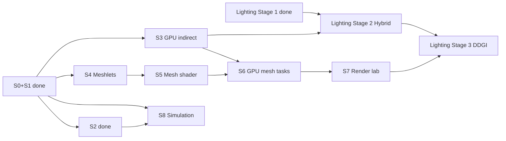
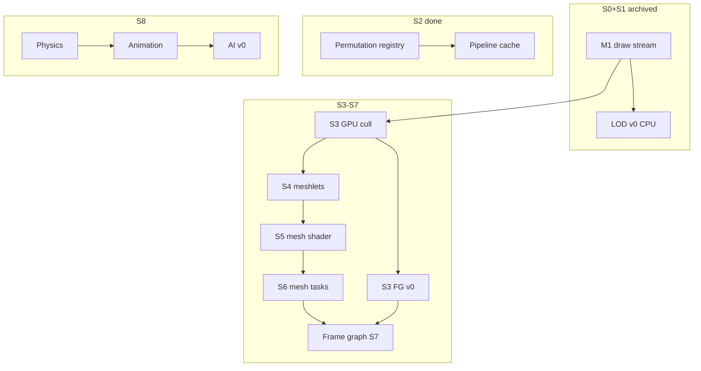

# Wishlist — sprint backlog (staged)

**Not the near-term execution queue.** Open **`[ ]`** sprint work for **S3–S8**, **Parallel**, and **Backlog** lives here until promoted via [`Active-Plan.md`](Active-Plan.md) [unlock gates](Active-Plan.md#unlock-gates).

**Near-term queue:** Active-Plan **P0–P4** (CI, peel, M2 prep, GPU cull, vertical slice). This file restores the **full sprint plans** removed in the 2026-06-02 roadmap trim (source: git `c1bf1a3:Docs/Active-Plan.md`).

**Hygiene:** when a Wishlist line ships, move it to [`Archived-Plan.md`](Archived-Plan.md) — do not duplicate `[x]` here and in Active-Plan.

---

## Relationship to Active-Plan P0–P4

| Active-Plan | Wishlist / sprint | Overlap |
|-------------|-------------------|---------|
| **P0** Verify & measure | S3 hygiene & CI | GHA, smoke, `assetRoot`, tests, perf JSONL |
| **P1** Engine hygiene | *(was S2 scope — closed)* | Peel, config, bindless decision |
| **P2** Render prep | S3 prep | CPU indirect, AABB, depth bucket, defaults |
| **P3** M2 GPU cull | S3 M2 core | GPU cull, indirect, **G1 parity** |
| **P4** Vertical slice | [Parallel](#parallel--vertical-slice) | Objective + restart (subset of full Parallel track) |
| *gate G1* | S3 FG v0, then S7 | Hybrid deferred / frame graph |
| *gate G2* | S8 | Simulation after slice |
| *gate G3* | S4 | Meshlets after MeshImport |
| *gate G4* | S7 Stage 3 | DDGI after Stage 2 |

---

## Two axes — do not confuse them

| Axis | Symbol | What it is | Example |
|------|--------|------------|---------|
| **Sprint** | **S0–S8** | Time-boxed engineering milestones (M1–M6). **S0/S1/S2** done → [`Archived-Plan.md`](Archived-Plan.md). | **S2** = lifecycle, scene, multi-view — **not** deferred lighting. |
| **Lighting stage** | **Stage 1–3** | Cross-sprint **lighting epics** (forward → hybrid deferred → DDGI). | **Stage 2** = Hybrid Deferred epic — primary window **S3–S7**, **not** “do it all in S2”. |

**Rule:** **Stage 2** = lighting epic, not sprint **S2**. Archives use `[S2]`; lighting docs say **Stage 2 (Hybrid Deferred)**.

---

## Sprint index

| Sprint | Milestone | Open `[ ]` (summary) | Section |
|--------|-----------|----------------------|---------|
| **S0–S2** | — | *(closed — [Archived-Plan](Archived-Plan.md))* | — |
| **S3** | M2 | GPU cull/indirect + FG v0 spike; M2 acceptance | [S3](#s3--gpu-driven-indirect-milestone-m2) |
| **S4** | M3 | Meshlet pipeline (5); M3 acceptance | [S4](#s4--meshlet-geometry-milestone-m3) |
| **S5** | M4 | Mesh shader path (5); M4 acceptance | [S5](#s5--mesh-shader-pipeline-milestone-m4) |
| **S6** | M5 | GPU mesh tasks (5); M5 acceptance | [S6](#s6--gpu-driven-mesh-tasks-milestone-m5) |
| **S7** | M6 | FG, presets/bench, features, docs; **Lighting Stage 2/3 gates** | [S7](#s7--rendering-lab--hardening-milestone-m6) |
| **S8** | — | Physics → Animation → AI (10); S8 acceptance | [S8](#s8--simulation-physics--animation--ai) |
| **Parallel** | — | Vertical slice (gameplay/content) | [Parallel](#parallel--vertical-slice) |
| **Backlog** | — | Threading, polish, parking lot | [Backlog](#backlog-deferred--unscheduled) |

---

## North star

| Pillar | Done when |
|--------|-----------|
| **Engine** | Deterministic startup; stable shader/asset pipeline; clear module boundaries; config + data on disk. |
| **Data plane** | SoA columns, stable handles, render **extract** → flat draw/meshlet buffers (no hot-path scene-graph walks). |
| **Render target** | **GPU-driven** visibility/draw generation + **mesh shader** raster (Task optional); VS+indirect **fallback** when unsupported. |
| **Lighting path** | **Stage 1** forward baseline → **Stage 2** full PBR (opaque deferred/clustered + transparent forward) → **Stage 3** optional DDGI. |
| **Product slice** | One playable scene + simple loop + fail-soft logging (no silent black screen). |
| **Rendering lab** | Presets, CPU/GPU timing, optional captures; features toggle without breaking sort keys. |
| **Evidence** | Benchmark scene + runbook; reproducible numbers on a fresh machine. |

---

## Sprint map

| Sprint | Milestone | Primary outcome |
|--------|-----------|-----------------|
| **S0** | — | *(done)* Toolchain + resources |
| **S1** | **M1** | *(done)* CPU draw stream |
| **S2** | — | Layering: lifecycle, config, peel; scene JSON; multi-view; shader stack |
| **S3** | **M2** | GPU frustum cull → indexed indirect; optional Lighting Stage 2 FG v0 spike |
| **S4** | **M3** | Meshlet offline build + GPU tables + debug viz |
| **S5** | **M4** | Mesh shader pipeline (Mesh + Fragment; Task deferred) |
| **S6** | **M5** | GPU-driven mesh tasks + VS/indirect fallback |
| **S7** | **M6** | Frame graph, presets, benchmarks; Lighting Stage 2/3 acceptance gates |
| **S8** | — | Simulation: Physics → Animation → AI |

**Parallel tracks:** [Vertical slice](#parallel--vertical-slice) · **S8** after S2 scheduler · **Shader stack** S2 done → S7 · **Multi-view** S2 done → S7 FG · **FG full** S7 (FG v0 spike S3 after **G1**).

---

## Unlock gates *(promote Wishlist → Active-Plan)*

| Gate | Criteria | Unlocks (from Wishlist) |
|------|----------|-------------------------|
| **G0** | P0 CI green | Safe M2 merges |
| **G1** | Automated CPU vs GPU cull parity | S3 FG v0; [`hybrid-deferred-epic_Plan.md`](hybrid-deferred-epic_Plan.md) §A |
| **G2** | P4 vertical slice v0 | [S8](#s8--simulation-physics--animation--ai) |
| **G3** | [`content-pipeline_Plan.md`](content-pipeline_Plan.md) § A | [S4](#s4--meshlet-geometry-milestone-m3) meshlets |
| **G4** | Stage 2 acceptance | Stage 3 DDGI — [`ddgi-lighting-epic_Plan.md`](ddgi-lighting-epic_Plan.md) |

Lighting pass topology: [`EngineArchitecture.md`](EngineArchitecture.md) §7.

---

## Lighting evolution (cross-sprint)

| Lighting stage | Epic doc | Status | Sprint home for **open** work |
|----------------|----------|--------|-------------------------------|
| **Stage 1** — Forward baseline | [`forward-rendering-epic_Plan.md`](forward-rendering-epic_Plan.md) | **Closed** 2026-06-02 | — ([`forward-stage1.md`](forward-stage1.md)) |
| **Stage 2** — Hybrid Deferred + PBR | [`hybrid-deferred-epic_Plan.md`](hybrid-deferred-epic_Plan.md) | Planned | **S3** FG v0 (post G1) · **S7** full body |
| **Stage 3** — Optional DDGI | [`ddgi-lighting-epic_Plan.md`](ddgi-lighting-epic_Plan.md) | Planned | **S7+** (after G4) |

**Pass chain (Stage 2+):** `GBufferOpaque -> ClusterBuild -> DeferredLighting -> ForwardTransparent -> Post`

| Epic work (hybrid-deferred §) | Filed under sprint |
|------------------------------|-------------------|
| A. Frame graph + pass topology (minimal) | [S3](#s3--gpu-driven-indirect-milestone-m2) — FG v0 |
| A–D. Full FG, G-buffer, clustered, PBR, parity | [S7](#s7--rendering-lab--hardening-milestone-m6) |
| Prerequisites (perm, Stage 1 contracts) | **S2** — done |

---

## Task dependency graph

*Arrows = must complete first (or sign-off decision doc).*

| Work stream | Depends on | Unblocks | Sprint home |
|-------------|------------|----------|-------------|
| GPU cull / indirect | M1 buffers | M2, mesh path | **S3** (+ Active-Plan P2–P3) |
| FG v0 (Stage 2 entry) | M1, S2 perm, **G1** | Full FG in S7 | **S3** |
| Frame graph (full) | M1 record, multi-view | Shadows, post, Stage 2 body | **S7** |
| Physics → Animation → AI | S2 scheduler, SoA | Vertical slice | **S8** |
| Multi-threading | M1 SoA, S2 scheduler | Parallel cull/LOD | [Backlog](#backlog-deferred--unscheduled) |

---

## S3 — GPU-driven indirect (milestone M2)

*Prove GPU visibility before mesh shaders.*

**Validation:** [`SprintOutcomeValidation.md`](SprintOutcomeValidation.md) (S3 section)

> **Active-Plan overlap:** geometry + parity → **P2–P3**; CI/hygiene → **P0**. Lines below are the **full S3 sprint scope**.

### Open tasks — M2 geometry

- [ ] Per-instance AABB + draw template in SSBO (sync with SoA). *(P2)*
- [ ] Compute: frustum cull → visible indices + `VkDrawIndexedIndirectCommand` buffer. *(P3)*
- [ ] `vkCmdDrawIndexedIndirect` / multi-draw indirect; CPU record cost ~flat. *(P3)*
- [ ] Optional GPU compaction pass for dense visible list. *(P3)*
- [ ] **Parity test:** GPU path vs CPU cull on fixed camera — gate **G1**; [`render-m2-prep_Plan.md`](render-m2-prep_Plan.md). *(P3)*
- [ ] **LOD GPU:** cull/indirect uses S1 LOD table; subset parity vs CPU — *deps: S1 LOD v0*. *(P3)*

### Open tasks — engineering hygiene & CI

- [ ] GitHub Actions: `CompileShader_Glslc.bat` CI. *(P0)*
- [ ] CI smoke: init + one frame headless/offscreen. *(P0)*
- [ ] Document or eliminate runtime **working-directory** dependency. *(P0)*
- [ ] `LNK4098` linker warning; safe `size_t`→`uint32_t` casts.
- [ ] **[S1+] Cull/sort depth metric:** opaque `depthBucket` from bounds eye-space Z; tighter world AABB. *(P2)*
- [ ] **Multi-threading v1:** thread model + frame SoA double-buffer — *deps: S1 SoA, S2 scheduler*.

### Open tasks — Lighting Stage 2 entry *(after G1)*

- [ ] **FG v0:** minimal path `GBufferOpaque -> ClusterBuild -> DeferredLighting` on opaque path (no full **S7** infra) — *deps: M1, S2 permutation (done)*.

### M2 acceptance

- [ ] Flying camera; GPU decides draw count; CPU does not loop per-object `vkCmdDraw*`.

---

## S4 — Meshlet geometry (milestone M3)

**Validation:** [`SprintOutcomeValidation.md`](SprintOutcomeValidation.md) (S4 section) · **Gate G3** (MeshImport v0)

### Open tasks

- [ ] Choose meshlet builder (e.g. meshoptimizer) + documented cluster params.
- [ ] Asset format: meshlet table + vertex/index views + per-meshlet bounds (import or offline step).
- [ ] Optional **meshlet LOD** cluster rules documented — *deps: S1 LOD asset chains*.
- [ ] Upload global vertex/index + meshlet metadata buffers.
- [ ] Debug draw: meshlet bounds (VS or compute viz) on test mesh.

### M3 acceptance

- [ ] At least one production mesh displays correct meshlet segmentation.

---

## S5 — Mesh shader pipeline (milestone M4)

*Vulkan 1.2 + `VK_EXT_mesh_shader`; no Task shader in v1.*

**Validation:** [`SprintOutcomeValidation.md`](SprintOutcomeValidation.md) (S5 section)

### Open tasks

- [ ] Device capability probe: mesh shader features; log + graceful disable.
- [ ] Enable extensions; mesh + fragment layout aligned with bindless / material tables (S1).
- [ ] Shaders: `Mesh` (+ adapt `TriangleFrag_Lit.frag`) → `Shader_Generated/`; `materialIndex` from tables.
- [ ] `vkCreateGraphicsPipeline` mesh stages; payload reads meshlet + instance from SSBO.
- [ ] RenderDoc / validation capture checklist in docs.

### M4 acceptance

- [ ] Single-object mesh-shader path matches VS path for geometry/pass-contract parity (forward + hybrid G-buffer within agreed tolerance).

---

## S6 — GPU-driven mesh tasks (milestone M5)

**Validation:** [`SprintOutcomeValidation.md`](SprintOutcomeValidation.md) (S6 section)

### Open tasks

- [ ] Compute: meshlet frustum cull (+ optional backface cone later).
- [ ] Compact visible meshlet list → indirect mesh-task buffer.
- [ ] `vkCmdDrawMeshTasksIndirectEXT`; mesh shader consumes compact list + instance table.
- [ ] **Fallback preset:** S3 VS + indirect when mesh shader unsupported; bindless-off → S1 batch path.
- [ ] Preset enum: `Traditional` / `GpuIndirect` / `MeshShader` / `FullGpuMesh`.
- [ ] **Multi-threading v2:** job system parallel cull/LOD/transform — *deps: MT v1, S1 LOD v0*.

### M5 acceptance

- [ ] Multi-object scene; primary submission GPU-driven; CPU record stable across instance count.

---

## S7 — Rendering lab & hardening (milestone M6)

*Frame graph (full), presets, benchmarks, experiments. **Lighting Stage 2** main body and **Stage 2/3 gates** live here.*

**Validation:** [`SprintOutcomeValidation.md`](SprintOutcomeValidation.md) (S7 section)

### Open tasks — Lighting acceptance gates

- [ ] **Lighting Stage 2 gate:** `GBufferOpaque + DeferredLighting` (clustered) opaque, `ForwardTransparent`, full PBR, `ForwardLit`/`HybridDeferred` parity — [`hybrid-deferred-epic_Plan.md`](hybrid-deferred-epic_Plan.md).
- [ ] **Lighting Stage 3 gate:** DDGI preset on/off parity, fallback, benchmark deltas — [`ddgi-lighting-epic_Plan.md`](ddgi-lighting-epic_Plan.md) — *after G4*.

### Open tasks — frame graph

*Deps: M1 Record, S2 multi-view, S2 permutation (done).*

- [ ] `framegraph_Plan.md`: pass/resource nodes, transient RT pool, import/export rules.
- [ ] `FrameGraphBuilder`: topological sort + barriers; hybrid chain + `ForwardLit` baseline.
- [ ] **Transparent pass** as FG node (reads depth) — *deps: S1 transparency (done)*.
- [ ] Preset toggles FG topology (shadow/post) without breaking sort keys.

### Open tasks — infrastructure

- [ ] Presets `Low / Base / High / Custom` + permutation subset (S2 registry).
- [ ] GPU timestamp queries + CPU p50/p95 logging.
- [ ] Standard benchmark procedure (scene, camera path, warmup, CSV/JSON).
- [ ] Screenshot capture keyed to preset + pose.
- [ ] RenderDoc expectations per preset; preset changelog.
- [ ] Benchmark: cold vs warm pipeline cache load (S2 cache, done).
- [ ] Shader reflection-driven **layout codegen** — follow-up to closed 2b JSON path.
- [ ] `VK_KHR_pipeline_binary` disk cache research — *deps: S2 pipeline cache (done)*.
- [ ] **[Multi-view] Instance slab dynamic partition:** per-frame pre-count + prefix-sum offsets; overlap/overflow guards per view.

### Open tasks — feature experiments *(prefer after FG)*

- [ ] MSAA vs post AA vs none.
- [ ] Shadow map (single cascade) — *deps: frame graph + shadow permutation*.
- [ ] IBL / environment upgrade.
- [ ] Tonemap / exposure modes.
- [ ] Bloom (optional).
- [ ] Validation-friendly toggles; graceful GPU feature degradation.
- [ ] GPU occlusion / hierarchical Z — *post-M5*.
- [ ] **Task shader** for mesh amplification — *post-M5*.

### Open tasks — documentation

- [ ] Engine overview diagram (modules + data flow).
- [ ] “How to add a rendering experiment” checklist.
- [ ] Troubleshooting matrix (seed: `Docs/Archived/notes-2026-05-22-shader-debug.md`).
- [ ] Third-party / SDK license inventory.
- [ ] Log rotation; domain-split logs; crash summary on failure.
- [ ] DDGI production tuning after **Lighting Stage 3** acceptance.

### M6 acceptance

- [ ] Frame graph drives hybrid path + at least one extra pass (shadow or tonemap) on benchmark scene.
- [ ] Two **RenderView**s or FG multi-target in runbook; `ForwardLit`/`HybridDeferred` switch without validation errors.

---

## S8 — Simulation (Physics → Animation → AI)

*Parallel after **S2** scheduler + M1 SoA. Does not block S3–S6. **Gate G2** (vertical slice v0).*

**Validation:** [`SprintOutcomeValidation.md`](SprintOutcomeValidation.md) (S8 section)

### Open tasks — physics

- [ ] `physics_Plan.md`: library choice + collision layers.
- [ ] `PhysicsWorld::SimStep(fixed_dt)`; entity ↔ body mapping; no Vulkan in sim code.
- [ ] Write back SoA: `transform`, `bounds`.
- [ ] Scene JSON physics components; debug draw AABB.

### Open tasks — animation

- [ ] Skeleton import + clip playback v0.
- [ ] `AnimationSystem` before Extract: skin matrices → deform or CPU skinned path.
- [ ] Plan GPU skinning alignment with S5 (non-blocking for v0).

### Open tasks — AI

- [ ] Agent SoA columns: state, target, perception radius.
- [ ] v0 state machine or minimal BT (Idle / Chase / Flee); one enemy uses player position.
- [ ] Debug: ImGui agent state; optional tie to Parallel objective.

### S8 acceptance

- [ ] Dynamic props (physics); one skinned clip; one agent chases player in play scene.
- [ ] **Multi-threading v3 (optional):** render thread + command stream — *deps: S7 FG*.

---

## Parallel — Vertical slice

*After S1 M1 (done). Does not block S3–S6. **Active-Plan P4** tracks the minimal subset.*

### Open tasks — scene & content

- [ ] Primary play/benchmark scene in `Data/`. *(P4)*
- [ ] All referenced assets present or substitute with logged warnings.
- [ ] Optional second tiny scene for load smoke tests.

### Open tasks — gameplay

- [ ] One **objective** (reach marker / collect / survive / toggle lights). *(P4)*
- [ ] Win/lose or completion feedback (HUD or log). *(P4)*
- [ ] **Restart** without process exit. *(P4)*

### Open tasks — presentation

- [ ] HUD: FPS, frame time, **active render preset** name.
- [ ] Pause + frame advance (dev).

### Open tasks — engine hooks

- [ ] Player controller contract (move, look, interact).
- [ ] Simple game state / mode stack (Play, Pause, Dev overlay).
- [ ] Event channel gameplay ↔ UI ↔ debug.

### Open tasks — simulation hooks *(tie to S8)*

- [ ] Interact / damage via physics overlap or ray — *deps: S8 Physics*.
- [ ] Enemy chase via **S8 AI** — *deps: S8 AI, Parallel objective*.

---

## Backlog (deferred / unscheduled)

- [ ] Editor, networking, non-Windows — see parking lot below.

### Parking lot

- In-engine property editor (post slice; benefits from shader reflection).
- Cross-platform windowing / CMake — [`config-platform-hardening_Plan.md`](config-platform-hardening_Plan.md).
- Navmesh / full behavior trees (post S8 AI v0).
- Material hot reload at runtime — [`content-pipeline_Plan.md`](content-pipeline_Plan.md) § B.
- MeshImport v0 — [`content-pipeline_Plan.md`](content-pipeline_Plan.md) § A (gate **G3**).

### Maintenance (non-blocking)

- `LNK4098` linker warning *(also S3 hygiene)*.
- Log rotation; domain-split logs.
- Third-party license inventory.
- Engine overview diagram; “how to add a rendering experiment” checklist.
- `VK_KHR_pipeline_binary` research *(also S7 infra)*.

---

*Restored 2026-06-02 from pre-trim Active-Plan. Promote lines to Active-Plan when gates open; archive completed lines to Archived-Plan.*
