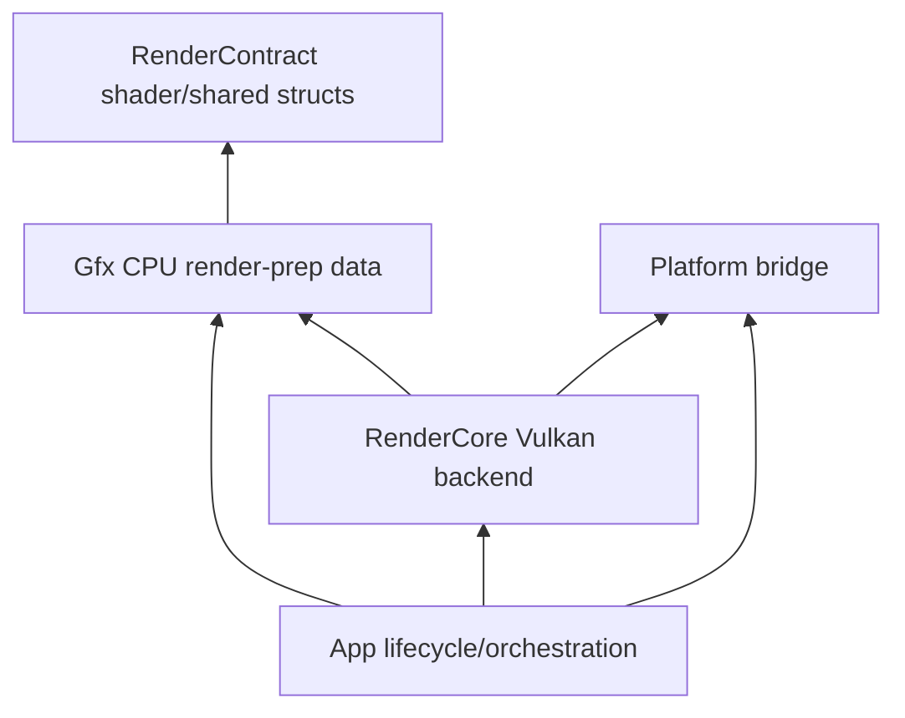

# Plan: architecture-boundary-hardening

**Status:** Planned (architecture debt paydown; supports S9–S10 delivery stability)  
**Scope:** `VulkanDesktop/App`, `VulkanDesktop/Gfx`, `VulkanDesktop/RenderCore`, `VulkanDesktop/RenderContract`  
**Related:** [`EngineArchitecture.md`](EngineArchitecture.md) · [`Active-Plan.md`](Active-Plan.md) · [`Wishlist.md`](Wishlist.md)

## Goal

Reduce cross-layer coupling that currently slows feature landing (S9 temporal polish, S10 content pipeline) and raises refactor risk.

Primary outcomes:

1. Enforce one-way dependency flow (`App` orchestration, `Gfx` CPU render prep, `RenderCore` Vulkan backend, `RenderContract` shader contract-only).
2. Move misplaced responsibilities to clearer folders/types with minimal runtime behavior change.
3. Add verification + rollout gates so changes are safe and incremental.

---

## Problem summary (from current code)

| ID | Problem | Current evidence | Impact |
|----|---------|------------------|--------|
| ABH-1 | `RenderCore` reverse-depends on `App` | `RenderCore/Vk_Renderer.cpp`, `Vk_RenderDevice.cpp` include `../App/App_PlatformHost.h` | Breaks layering; blocks renderer reuse/headless |
| ABH-2 | `RenderContract` depends on `Gfx` | `RenderContract/GpuLightingGlobals.h` includes `../Gfx/Gfx_LightingMath.h` | Contract layer not independent |
| ABH-3 | `RenderContract` headers not visible in VS project/filter | no entries in `VulkanDesktop.vcxproj(.filters)` | discoverability + maintenance risk |
| ABH-4 | `Vk_Camera.h` mixes API-agnostic camera + GPU contract + input | `GpuCameraData`, `GpuObjectData`, `Vk_Camera` co-located | unclear ownership; unnecessary `Vk_*` spread |
| ABH-5 | App builds Vulkan view structs directly | `App/ActiveViewsBuild.cpp` uses `VkViewport`, `VkRect2D`, `VkExtent2D` | App leaks backend details |
| ABH-6 | Demo simulation logic sits in `Gfx` with `Util_EngineConfig` dependency | `Gfx/Gfx_DemoSceneSim.h` | weakens Gfx purity |
| ABH-7 | Shader permutation module mixes type contract + config/IO init | `Gfx/Gfx_ShaderPermutation.*` | harder testing and boundary clarity |

---

## Non-goals

- No renderer feature expansion (no new lighting/temporal algorithms in this plan).
- No broad folder rename across the entire repo in one PR.
- No immediate ABI break for scene JSON or material schema.
- No test framework migration.

---

## Dependency target (after plan)

Rules:

- `RenderContract` must not include `App/`, `Gfx/`, `RenderCore/`, `Util/`.
- `RenderCore` must not include `App/*` concrete types.
- `App` may call `RenderCore` public API but should avoid direct Vulkan primitive composition.

---

## Track A — Break `RenderCore` ↔ `App` reverse dependency (ABH-1)

### Design

Introduce a thin platform surface/time interface and move concrete GLFW host out of `App` ownership semantics.

### Touch

- New: `VulkanDesktop/Platform/PlatformHost.h` (interface or neutral host contract)
- New: `VulkanDesktop/Platform/GlfwPlatformHost.*` (concrete implementation, migrated from `App_PlatformHost`)
- Modify: `RenderCore/Vk_Renderer.cpp`, `RenderCore/Vk_RenderDevice.cpp` (depend on interface only)
- Modify: `App/Application.cpp` (wire concrete platform host instance)

### Steps

| Step | Detail |
|------|--------|
| A.1 | Extract minimum methods used by RenderCore: `CreateSurface`, `RecreateSurface`, `GetWindow`, frame timing hooks |
| A.2 | Create interface and adapter implementation; keep behavior identical |
| A.3 | Replace `#include "../App/App_PlatformHost.h"` in RenderCore with platform interface include |
| A.4 | Keep old App host as shim (1 sprint) or remove directly if compile impact is small |
| A.5 | Update EngineArchitecture module map text if folder/module role changes |

### Acceptance

- `RenderCore` has zero includes of `../App/*`.
- Window/surface lifecycle behavior unchanged (init, resize, recreate, shutdown).
- Debug+Release build green.

---

## Track B — Make `RenderContract` independent (ABH-2, ABH-3)

### Design

`RenderContract` keeps plain structs/enums and pure helpers only. Any decision logic requiring Gfx math moves up to `Gfx` (or RenderCore call site).

### Touch

- Modify: `RenderContract/GpuLightingGlobals.h`
- Modify: `Gfx/Gfx_LightingGlobals.h`
- Modify: call sites if function signature changes
- Modify: `VulkanDesktop.vcxproj`, `VulkanDesktop.vcxproj.filters`, optionally `GfxTests.vcxproj`

### Steps

| Step | Detail |
|------|--------|
| B.1 | Remove `#include "../Gfx/Gfx_LightingMath.h"` from `GpuLightingGlobals.h` |
| B.2 | Move `Gfx_ShouldCompareDirectionalShadows` decision to `Gfx_BuildLightingGlobals` wrapper or call site |
| B.3 | Keep GPU struct layout/static_assert unchanged |
| B.4 | Add `RenderContract/*.h` to VS project + filters for visibility |
| B.5 | Ensure tests and app still include through stable aliases (`Gfx_*` wrappers) |

### Acceptance

- `RenderContract` contains no project-local upward include.
- Contract memory layout unchanged.
- Project explorer shows `RenderContract` headers clearly.

---

## Track C — Split mixed ownership in camera/data contracts (ABH-4)

### Design

Separate API-agnostic camera logic from shader UBO contracts.

### Touch

- New: `RenderContract/GpuCameraData.h` (from `Vk_Camera.h`)
- New: `RenderContract/GpuObjectData.h` (from `Vk_Camera.h`)
- Modify: `RenderCore/Vk_Camera.h`, `Vk_FrameUniformUploader.*`, shader-facing include points
- Optional New: `Gfx/Gfx_Camera.h` or `App/App_Camera.h` if renaming from `Vk_Camera` is chosen

### Steps

| Step | Detail |
|------|--------|
| C.1 | Move `GpuCameraData` + `GpuObjectData` to `RenderContract` |
| C.2 | Keep `static_assert(sizeof(...))` in new contract files |
| C.3 | Update includes in RenderCore and shaders upload code |
| C.4 | Decide whether class rename (`Vk_Camera` -> neutral name) occurs now or deferred |

### Acceptance

- UBO structs no longer live in `Vk_Camera.h`.
- No behavior change in camera control/projection.
- Multi-view and temporal camera matrices still pass smoke.

---

## Track D — Remove Vulkan primitive composition from App view-building (ABH-5)

### Design

App produces API-agnostic view descriptors only; RenderCore resolves to Vulkan viewport/scissor.

### Touch

- Modify: `App/ActiveViewsBuild.*`
- Modify: `Gfx/Gfx_RenderView.h` (optional add resolved rect struct)
- Modify: `RenderCore/Vk_ActiveRenderView.h` and prep path where conversion happens

### Steps

| Step | Detail |
|------|--------|
| D.1 | Change App output from `Vk_ActiveRenderView` to Gfx-level descriptors (camera source/index, normalized viewport, layer mask) |
| D.2 | Move `VkViewport`/`VkRect2D` conversion into RenderCore with swapchain extent |
| D.3 | Keep PiP camera selection logic in App (scene semantics remain App-owned) |
| D.4 | Preserve current scissor clamp behavior and edge-case guards |

### Acceptance

- App no longer includes or constructs Vulkan viewport/scissor types.
- PiP behavior unchanged.
- No render regression in single-view/multi-view.

---

## Track E — Clean up Gfx scope for demo/runtime glue (ABH-6, ABH-7)

### Design

Keep `Gfx` focused on render-prep data/algorithms; move app policy/config glue outward.

### Touch

- Modify or move: `Gfx/Gfx_DemoSceneSim.*`
- Modify: `App/Application.cpp` call site
- Split: `Gfx/Gfx_ShaderPermutation.*` into type contract vs runtime loader (optional phase)

### Steps

| Step | Detail |
|------|--------|
| E.1 | Change `Gfx_TickDemoSceneTransforms` inputs to pure params (e.g., `bool demoRotateEnabled`) or move module into App |
| E.2 | Keep transform math implementation reusable and deterministic |
| E.3 | Optional: split permutation type defs (`feature bits`, `sort key`) from config-dependent initialization |
| E.4 | Add unit-level checks for split functions if practical |

### Acceptance

- `Gfx_DemoSceneSim` no longer requires `Util_EngineConfig` directly (or is moved out of Gfx).
- Shader permutation core types compile without config/IO dependencies.

---

## Rollout strategy

| Phase | Scope | Risk control |
|------|-------|--------------|
| R1 | Track B (contract decouple + project visibility) | smallest runtime risk; validates boundary direction |
| R2 | Track A (platform boundary) | compile-time break risk; keep adapter shim |
| R3 | Track C + D (camera/view boundary) | visual regression risk; run multi-view + temporal smoke |
| R4 | Track E cleanup | optional/deferred if S10 pressure is high |

Suggested PR slicing:

1. PR-1: ABH-2/3 only.
2. PR-2: ABH-1 only.
3. PR-3: ABH-4/5 together.
4. PR-4: ABH-6/7 (optional hardening).

---

## Verification matrix

| ID | Command / check | Expectation |
|----|------------------|-------------|
| V-1 | Build `VulkanDesktop.sln` Debug x64 | 0 errors |
| V-2 | Build Release x64 | 0 errors |
| V-3 | Run `x64/Debug/GfxTests.exe` | all passed |
| V-4 | Runtime smoke (default scene + PiP on/off) | no crash, no viewport/scissor regressions |
| V-5 | Validation run (`--validation`) | no new validation Errors |
| V-6 | Grep/lint include rules | no `RenderCore -> ../App/*`; no `RenderContract -> ../Gfx/*` |

---

## Docs updates required when landing

- Update `EngineArchitecture.md` module map + forbidden rules if folder responsibilities change.
- Add this plan to `Docs/README.md` "Open roadmap plans" while in progress.
- If entered queue, add a hardening entry in `Active-Plan.md` with landing reference.

---

## Decisions locked (confirmed)

1. **Module placement for platform host:** **A**
   - Create a new `VulkanDesktop/Platform/` folder.

2. **Camera class rename scope:** **B**
   - Include neutral camera rename in this plan (not only `Gpu*Data` extraction).

3. **Execution mode:** **B**
   - Execute full ABH-1..7 continuously (with phased PR slices for risk control).

4. **Project-file policy:** **A**
   - Keep explicit VS project listing; add `RenderContract/*.h` to project/filter files.

## Baseline execution order (per locked decisions)

1. Track B (ABH-2/3) — RenderContract decouple + project/filter visibility.
2. Track A (ABH-1) — Platform abstraction + move host to `Platform/`.
3. Track C + D (ABH-4/5) — camera contract split + neutral camera rename + move Vulkan viewport/scissor conversion to RenderCore.
4. Track E (ABH-6/7) — Gfx scope cleanup for demo sim and shader permutation split.

This order keeps behavior stable while still honoring the full-scope refactor choice.