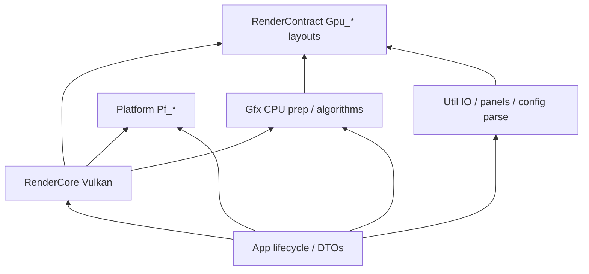
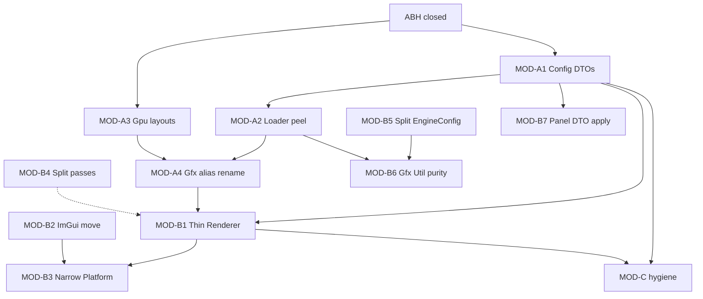

# Epic Plan: architecture-modularity-peel

**Status:** In Progress (2026-07-21; next MOD-B7; Track A + B1–B3 done)  
**Scope:** `VulkanDesktop/{App,Gfx,RenderCore,RenderContract,Util,Platform}`  
**Related:** [`EngineArchitecture.md`](EngineArchitecture.md) · [`Active-Plan.md`](Active-Plan.md) · [`Wishlist.md`](Wishlist.md) · closed [`architecture-boundary-hardening_Plan.md`](Archived/plans/architecture-boundary-hardening_Plan.md) · [`vulkan-rhi-hardening-epic_Plan.md`](vulkan-rhi-hardening-epic_Plan.md)

## Naming

- **Epic ID:** `MOD-*` task codes below (e.g. `MOD-A1`).
- **Vibe kickoff:** one track (or one MOD item) at a time → optional child `Docs/{track-name}_Plan.md` + `_Progress.md` when scope > ~1 PR. This epic stays the **design reference**; do not duplicate full checklists into Active-Plan.

## Goal

Maximize **one-way layering**, **module readability**, and **safe incremental refactors** so S10+ feature work (content pipeline, particles, water, …) does not fight Util↔RenderCore cycles, god modules, or misplaced GPU contracts.

Primary outcomes:

1. Hot-path and init-path dependencies respect folder roles locked in `EngineArchitecture.md` §1.
2. Remaining shader-facing layouts live in `RenderContract/Gpu_*.h`; Gfx owns CPU algorithms only.
3. Fat translation units and fake `Gfx_*` Vulkan aliases are peeled without behavior change.
4. Each track ships with G0 (+ smoke when GPU/runtime touched) so peel never blocks the main queue.

---

## Baseline (already landed)

| Area | State |
|------|--------|
| ABH-1..7 | Closed 2026-07-21 — Platform host, RenderContract independence, `Gfx_RenderCamera`, App view descriptors, demo/permutation split |
| Material / cluster SSBO | Landed — `Gpu_MaterialParams.h`, `Gpu_ClusterLight.h` in RenderContract; Gfx keeps surface + cluster grid/push |
| Hard greps | Green: RenderCore↛`App/*`, RenderContract↛Gfx/App/Util/RenderCore, Gfx↛Vulkan |

This epic **does not re-open** ABH; it continues from the residual debt list.

---

## Problem inventory

| ID | Problem | Evidence | Impact |
|----|---------|----------|--------|
| MOD-1 | Record / pass hot paths read `Util_EngineConfig` directly | `Vk_FrameGraph.cpp`, `Vk_ScenePasses.cpp`, `Vk_GBufferPass.cpp`, `Vk_PostProcessPass.cpp`, `Vk_GpuCull.cpp`, `Vk_DescriptorSystem.cpp`; `Vk_Renderer::BindEngineConfig` | Config/policy leaks into GPU record; hard to test / mock; CLI vs ImGui precedence opaque |
| MOD-2 | `Util_Loader` owns Vulkan image/cubemap upload | `Util_Loader.h` includes `Vk_Types.h` / takes `VkFormat`; ~14 RenderCore includes + `Gfx_SceneLoader` | Util↔RenderCore cycle; Util no longer “config/load/UI helpers” only |
| MOD-3 | Remaining GPU layouts still in Gfx | `Gfx_ClusterLighting.h` push structs; `Gfx_GpuCull.h` push; `Gfx_DrawTemplate.h` / `Gfx_EntityGpuRecord.h` std430 | Incomplete RenderContract; drift risk vs shaders |
| MOD-4 | `Gfx_Texture` / `Gfx_Mesh` aliases are Vulkan resources | `Vk_SceneResourceTypes.h` `using Gfx_Texture = Vk_TextureResource` etc.; used in passes, loader, IBL | Names imply API-agnostic CPU types; confuses ownership |
| MOD-5 | `Vk_Renderer` still a god facade | `Vk_Renderer.cpp` ~1k LOC; owns device leftovers, scene GPU, frame, ImGui hooks, fly camera, config | Hard to reuse / headless; slows every touch |
| MOD-6 | Vulkan ImGui backend lives in Util | `Util_ImGuiLayer.*` includes `<vulkan/vulkan.h>`; embedded in `Vk_PlatformContext` | Util owns render-pass/FB lifecycle |
| MOD-7 | `Pf_PlatformHost` takes full `Vk_Renderer&` | `Pf_PlatformHost.h` `BeginFrame` / `BeginImGuiFrame(Vk_Renderer&)` | Platform knows too much; harder to stub |
| MOD-8 | Fat pass / subsystem TUs | `Vk_PostProcessPass.cpp` ~874, `Vk_AoPass.cpp` ~810, `Vk_DeferredLightingPass.cpp` ~662, `Vk_SwapchainHost.cpp` ~522, `Util_EngineConfig.cpp` ~642 | Review/diff cost; merge conflict magnets |
| MOD-9 | Gfx still depends on Util config/IO | `Gfx_SceneLoader` → EngineConfig; `Gfx_ShaderPermutation` → config/logger/path; `Gfx_RenderCamera` → `Util_InputSnapshot` | Weakens “Gfx = no Vulkan + minimal infra” story |
| MOD-10 | Util panels include `Vk_Renderer` / mutate policy types | `Util_LightingPanel`, `Util_TuningPrefs`, `Util_PostProcessPanel`, `Util_TemporalPanel`, `Util_TuningPanel` | UI becomes source-of-truth / backend-coupled |
| MOD-11 | `Application.cpp` is cross-layer conductor | Includes Gfx + RenderCore + Util panels + Platform (~269 LOC) | Acceptable today; grows with S10+ |
| MOD-12 | Naming / umbrella leftovers | `ShaderEffectMeta` types; fat `Vk_Types.h` umbrella | Discoverability |
| MOD-13 | `Gfx_DebugViewMode` parked in material header | `Gfx_MaterialTypes.h` | Wrong neighbor for debug viz enum |
| MOD-14 | Ubiquitous `Util_Logger` / `Util_VulkanResult` from RenderCore | ~28 Logger + ~7 VulkanResult includes | Shared infra forever (accepted unless peeled) |
| MOD-15 | Descriptor binding enums are informal second contract | `Vk_Enum.h` + `Vk_DescriptorPolicy.h` vs shaders / reflection | Drift / duplicate knowledge |

---

## Non-goals (epic-wide)

- No new lighting / temporal / particle / water features in this epic.
- No Linux / cross-platform windowing (Wishlist / S21 RHI-D).
- No full dynamic-rendering migration.
- No wholesale folder rename (`RenderCore/` → `Vk/`).
- No scene JSON / material schema ABI break.
- No forced Logger peel in the same PR as Loader/Config (MOD-14 optional).
- Do not block **S10 Content pipeline** — MOD tracks run in parallel when touch sets do not collide.

---

## Target dependency shape

**Rules (reinforce / extend Architecture §1):**

- `RenderContract` — plain GPU structs + pure packing only.
- `Gfx` — no Vulkan; no GPU upload; prefer no `Util_EngineConfig` on hot algorithms.
- `Util` — file/path/config parse + ImGui **widgets**; no `vk*` create/upload; panels should not `#include Vk_Renderer`.
- `RenderCore` — Vulkan only; frame policy via DTOs, not live config queries on record.
- `Platform` — window/surface/timing (+ narrow ImGui frame hooks); no pass ownership.

---

## Tracks

### Track A — Hot-path & ownership (P0)

| Code | Title | Detail | Risk |
|------|-------|--------|------|
| **MOD-A1** | Config → frame / init DTOs | Snapshot `gpuCull`, `legacyDirectDraw`, render preset, asset-root (init), validation flags into `Gfx_FrameDebugToggles` and/or `Vk_RenderFeatures` built by App each frame / at init. Replace `EngineConfig()` reads in FrameGraph / ScenePasses / GBuffer / GpuCull / Post (record). Keep EngineConfig as App-owned source for CLI/JSON. | med |
| **MOD-A2** | `Util_Loader` GPU upload → RenderCore | Move `LoadTexture` / cubemap / image upload to `Vk_TextureLoader` (or `Vk_ResourceContext` helpers). Leave `ResolvePath` + `ReadFile` in Util (or `Util_FileIo`). Update all RenderCore + Gfx_SceneLoader call sites. | med |
| **MOD-A3** | Remaining Gpu layouts → RenderContract | Move `Gfx_ClusterBuildPushConstants`, `Gfx_DeferredLightingPushConstants` → `Gpu_ClusterPush.h` (names `Gpu_*`); `Gfx_GpuCullPushConstants` → `Gpu_CullPush.h`; draw-template / entity-record std430 → `Gpu_DrawTemplate.h` / `Gpu_EntityRecord.h`. Keep cluster index helpers + visibility predicates in Gfx. | med |
| **MOD-A4** | Drop fake `Gfx_*` Vulkan aliases | Prefer `Vk_TextureResource` / `Vk_MeshResource` / `Vk_MaterialResource` in RenderCore + loaders. Narrow or delete `using Gfx_Texture = …` after call-site sweep. Keep true CPU types in Gfx (`Gfx_MeshCpu`, surfaces). | med |

**Track A acceptance**

- Record path: no new `EngineConfig().Get*` for per-draw policy (grep gate).
- Util headers used by Gfx/RenderCore for upload do not include Vulkan types.
- New layouts live under `RenderContract/Gpu_*.h` and are listed in `.vcxproj(.filters)`.
- `Verify-CI` + `Verify-Smoke` green after each MOD-A* land.

---

### Track B — Module peel (P1)

| Code | Title | Detail | Risk |
|------|-------|--------|------|
| **MOD-B1** | Thin `Vk_Renderer` | Move fly-camera session ownership toward App (or keep `Gfx_RenderCamera` on App stack; Renderer only consumes matrices). Finish device bootstrap leftovers into `Vk_RhiDevice` / `Vk_RenderDevice`. Renderer = facade: bind host/config, load scene GPU, prepare/draw. | med–high |
| **MOD-B2** | ImGui Vulkan layer → RenderCore | Rename/move `Util_ImGuiLayer` → `Vk_ImGuiLayer` (or Platform UI bridge). Util panels remain widget-only. Update `Vk_PlatformContext`. | med |
| **MOD-B3** | Narrow `Pf_PlatformHost` | Replace `Vk_Renderer&` on BeginFrame/ImGui with minimal callbacks or a small `Pf_FrameHooks` / `Vk_RhiDevice&` surface API. Behavior identical. | low–med |
| **MOD-B4** | Split fat passes | Mechanical split: `Vk_PostProcessPass`, `Vk_AoPass`, `Vk_DeferredLightingPass` (± bloom/TAA/tonemap files); optional Create vs Record `.cpp`. No algorithm change. | low |
| **MOD-B5** | Split `Util_EngineConfig` | Peel `Paths` / `FeatureFlags` / `LightingDefaults` / CLI parse into focused types; Application still owns the aggregate. | med |
| **MOD-B6** | Gfx ⟂ Util config/IO | App initializes `Gfx_ShaderPermutation` from config; Gfx registry API takes defs or path string without EngineConfig type. Reduce logger includes in hot Gfx paths where practical. Clarify `Gfx_RenderCamera` + input snapshot ownership (App samples → camera). | low–med |
| **MOD-B7** | Panels without `Vk_Renderer` | Panels edit App-owned `DebugUIState` / tuning structs / `Gpu_*` settings copies; Application applies to Renderer. Remove RenderCore includes from Util panel headers. | low |

**Track B acceptance**

- Platform / ImGui / Renderer responsibilities match Architecture module map text (update if locked narrative changes).
- Panel headers compile without Vulkan / `Vk_Renderer`.
- Per-split: `Verify-CI`; smoke when pass record or swapchain touched.

---

### Track C — Hygiene (P2)

| Code | Title | Detail | Risk |
|------|-------|--------|------|
| **MOD-C1** | Optional `App_FramePipeline` | Extract frame loop body from `Application.cpp` into a dedicated App module; Application keeps lifecycle only. | low |
| **MOD-C2** | Naming / umbrella | Rename loose `ShaderEffectMeta` types to `Vk_*` if needed; slim `Vk_Types.h` (explicit includes preferred). | low |
| **MOD-C3** | Move `Gfx_DebugViewMode` | Out of `Gfx_MaterialTypes.h` into `Gfx_DebugView.h` (or next to `Gfx_FrameDebugToggles`). | low |
| **MOD-C4** | Logger / VulkanResult policy | Decide: accept Util as shared infra **or** introduce thin `Core/Log` + `Vk_Result` facade. Document choice in Architecture; no drive-by rewrite. | low |
| **MOD-C5** | Binding enum vs reflection | Prefer single source: keep `Vk_Enum.h` as code source of truth + reflection verify, **or** generate constants from contracts. Do not duplicate into Gfx. | low |

---

## Dependency graph

**Suggested sequential order (default):**  
`A1 → A2 → A3 → A4 → B2 → B3 → B1 → B7 → B6 → B5 → B4 → C*`

**Parallel-OK with S10:** A3, B4, C3 (low collision). Avoid A2/A4 during MeshImport upload rewrites unless coordinated.

---

## PR slicing

| PR | Scope |
|----|--------|
| PR-1 | MOD-A1 only |
| PR-2 | MOD-A2 only |
| PR-3 | MOD-A3 only |
| PR-4 | MOD-A4 only |
| PR-5 | MOD-B2 (+ B3 if small) |
| PR-6 | MOD-B1 |
| PR-7 | MOD-B7 |
| PR-8 | MOD-B6 / B5 (config purity) |
| PR-9+ | MOD-B4 pass splits (one pass family per PR) |
| PR-N | MOD-C* as drive-bys or dedicated tiny PRs |

---

## Verification matrix

| ID | Check | Expectation |
|----|-------|-------------|
| V-1 | `powershell -File Scripts/Verify-CI.ps1` | exit 0 |
| V-2 | `powershell -File Scripts/Verify-Smoke.ps1` | exit 0 when GPU/runtime/loader/pass touched |
| V-3 | G0-validation (`--validation` stress smoke) | Required for pass/barrier/descriptor/loader GPU changes — see `vulkan-smoke-test.mdc` |
| V-4 | Include greps | No RenderCore→`../App/*`; no RenderContract→Gfx/App/Util/RenderCore; Gfx no `vulkan.h`; after A1: no record-path `EngineConfig().GetGpuCull` / `GetLegacyDirectDraw` |
| V-5 | GfxTests | Still green (cluster sizes, lighting globals, material table asserts) |

---

## Docs updates when landing

| Event | Edit |
|-------|------|
| Track kickoff | README **Active now** WIP; child Plan+Progress if needed |
| Locked boundary text change | `EngineArchitecture.md` §1 (Loader role, Platform hooks, Util must-not) |
| Track close | Progress closeout → `Archived/plans/`; Archived-Plan stub; clear README WIP |
| Epic complete | Move this file → `Archived/plans/`; drop from README open roadmap list |

---

## Risks

| Risk | Mitigation |
|------|------------|
| S10 MeshImport touches loader simultaneously | Prefer A2 before or after S10 §A MeshImport; coordinate owners |
| Config DTO misses a toggle | Explicit checklist of `EngineConfig` getters used under `VulkanDesktop/RenderCore`; GfxTests + stress smoke |
| Alias rename churn | Mechanical PR; keep temporary typedef one sprint max |
| Pass split merge conflicts | One family per PR; no behavior edits in same PR |
| Platform narrow breaks ImGui order | Preserve poll → ImGui NewFrame → sample → camera order (fps-camera contract) |

---

## Decisions (defaults — confirm at kickoff)

1. **Execution mode:** Full epic continuously in MOD order above, sliced as PRs; pause only if S10 conflicts on Loader.
2. **MOD-C4 Logger:** Default **accept Util as shared infra** unless a later decision promotes `Core/Log`.
3. **MOD-A4 aliases:** Prefer delete `Gfx_Texture` aliases after rename (no long-lived dual names).
4. **Child Plans:** Required when a single MOD item is expected >2 days or >~15 files; otherwise Progress on a thin track Plan is enough.

---

## Kickoff checklist

- [x] User confirms Decisions (or overrides) — defaults via vibe kickoff 2026-07-21.
- [x] Add README open-roadmap pointer (done with this file) / set **Active now** when starting MOD-A1.
- [ ] Optional: hardening-index row in `Active-Plan.md` if this epic enters the formal queue.
- [ ] Start MOD-A1 with `Verify-CI` baseline green.
