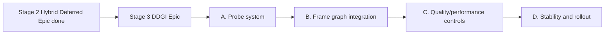

# Epic Plan: ddgi-lighting

**Status:** In Progress  
**Scope:** Stage 3 of lighting evolution (optional feature set)  
**Related:** [`hybrid-deferred-epic_Plan.md`](hybrid-deferred-epic_Plan.md), [`Active-Plan.md`](Active-Plan.md), [`EngineArchitecture.md`](EngineArchitecture.md)

## Naming conventions

- **Stage:** `Stage 1 (Forward Baseline)`, `Stage 2 (Hybrid Deferred + PBR)`, `Stage 3 (Optional DDGI)`.
- **Preset:** `ForwardLit`, `HybridDeferred`.
- **Pass chain base:** `GBufferOpaque -> ClusterBuild -> DeferredLighting -> ForwardTransparent -> Post`.

## Goal

Add DDGI as an optional global illumination layer on top of the hybrid renderer without destabilizing baseline presets.

## Non-goals

- Making DDGI mandatory for all presets/platforms.
- Replacing direct lighting, shadowing, or IBL systems.
- Path-traced GI pipeline.

## Deliverables

- DDGI probe data model and update scheduling policy.
- Frame graph passes for probe update and sampling.
- Integration path in deferred opaque lighting, with optional transparent interaction policy documented.
- Preset-level feature toggle (`DDGI On/Off`) with performance guardrails.

## Dependency graph

## Work breakdown

### A. Probe system

**Deps:** Stage 2 hybrid deferred accepted; frame graph and deferred lighting contracts stable.

- [ ] Land temporal AO stability baseline (motion vectors + AO history/reprojection) to provide a stable pre-DDGI lighting baseline and debug comparison path.
- [ ] Define probe volume placement, resolution tiers, and scene binding policy.
- [ ] Define probe textures/buffers and versioning for runtime updates.
- [ ] Define update budget model (full update vs staggered update).

#### A execution detail

1. Temporal AO baseline: add AO history ping-pong resource, reprojection compute pass, and debug controls (`enabled`, `blend`) in lighting panel.
2. Probe volume v0 data model: lock one volume-per-scene contract (origin, extents, probe counts, spacing) and define runtime ownership (`RenderCore` state + settings contract).
3. Probe storage contract: define irradiance / visibility textures and probe metadata buffer layout with explicit versioning marker for future migration.
4. Update budget policy: define `full update` and `staggered update` modes with per-frame probe quota and deterministic probe index traversal.

### B. Frame graph integration

**Deps:** A complete; requires Stage 2 pass topology (`GBufferOpaque -> DeferredLighting`) in production shape.

- [ ] Add probe update pass(es) and dependencies in frame graph.
- [ ] Add lighting resolve hook to sample DDGI contributions in deferred opaque pass.
- [ ] Document resource barriers/import-export contracts for DDGI history/state.

#### B execution detail

1. Add `ProbeUpdate` compute pass in FG between cluster/depth-driven context and deferred resolve.
2. Add DDGI sample input path in deferred lighting shader with explicit feature toggle branch.
3. Add barrier/layout contract notes for probe textures and history resources, including resize/recreate path.

### C. Quality/performance controls

**Deps:** B complete; benchmark and preset infra from S7 available.

- [ ] Add quality levels and fallback behavior for unsupported/slow hardware.
- [ ] Add debug visualization (probe occupancy/contribution overlays).
- [ ] Add benchmark script/checklist for DDGI on/off deltas.

#### C execution detail

1. Preset controls: `DDGI Off/On` plus budget tiers (`Low/Balanced/High`) with fixed probe update quotas.
2. Debug views: probe occupancy, indirect-only, and DDGI contribution heat overlay.
3. Benchmark path: add scripted `DDGI Off` vs `DDGI On` runbook (Sponza first; San Miguel optional later) with frame-time deltas.

### D. Stability and rollout

**Deps:** C complete; parity baselines from Stage 1 and Stage 2 retained for regression checks.

- [ ] Keep non-DDGI presets behaviorally unchanged.
- [ ] Define acceptance scenes for interior/exterior validation.
- [ ] Record known artifacts and mitigation policy in docs.

#### D execution detail

1. Regression guard: non-DDGI path byte-for-byte resource wiring unchanged in FG and deferred pass.
2. Acceptance scenes: Sponza interior mandatory, plus one exterior sanity scene for leak/noise checks.
3. Artifact registry: ghosting/light leaking/noise cases with mitigation switches and default-safe values.

## Acceptance

- [ ] DDGI is selectable per preset and disabled by default unless explicitly chosen.
- [ ] Hybrid deferred remains stable and visually correct with DDGI off.
- [ ] DDGI on-path passes validation and documented perf thresholds on benchmark scenes (Sponza; see [`SprintOutcomeValidation.md`](SprintOutcomeValidation.md) §S8 after **G4**).

## Exit criteria

DDGI is treated as an optional lighting enhancement layer with clear operational limits, not a mandatory baseline requirement for engine bring-up.

