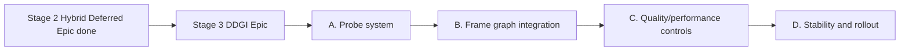

# Epic Plan: ddgi-lighting

**Status:** Closed (2026-06-16, DDGI gap-fill pass)  
**Scope:** Stage 3 of lighting evolution (optional feature set)  
**Related:** [`hybrid-deferred-epic_Plan.md`](hybrid-deferred-epic_Plan.md), [`Active-Plan.md`](Active-Plan.md), [`EngineArchitecture.md`](EngineArchitecture.md)

## Naming conventions

- **Stage:** `Stage 1 (Forward Baseline)`, `Stage 2 (Hybrid Deferred + PBR)`, `Stage 3 (Optional DDGI)`.
- **Preset:** `ForwardLit`, `HybridDeferred`.
- **Pass chain base:** `GBufferOpaque -> ClusterBuild -> DeferredLighting -> ForwardTransparent -> Post`.

## Goal

Add DDGI as an optional global illumination layer on top of the hybrid renderer without destabilizing baseline presets.

## Non-goals

- Making DDGI mandatory for all presets/platforms.
- Replacing direct lighting, shadowing, or IBL systems.
- Path-traced GI pipeline.

## Deliverables

- DDGI probe data model and update scheduling policy.
- Frame graph passes for probe update and sampling.
- Integration path in deferred opaque lighting, with optional transparent interaction policy documented.
- Preset-level feature toggle (`DDGI On/Off`) with performance guardrails.

## Dependency graph

## Work breakdown

### A. Probe system

**Deps:** Stage 2 hybrid deferred accepted; frame graph and deferred lighting contracts stable.

- [x] Land temporal AO stability baseline (motion vectors + AO history/reprojection) to provide a stable pre-DDGI lighting baseline and debug comparison path.
- [x] Define probe volume placement, resolution tiers, and scene binding policy.
- [x] Define probe textures/buffers and versioning for runtime updates.
- [x] Define update budget model (full update vs staggered update).

#### A execution detail

1. Temporal AO baseline: add AO history ping-pong resource, reprojection compute pass, and debug controls (`enabled`, `blend`) in lighting panel.
2. Probe volume v0 data model: lock one volume-per-scene contract (origin, extents, probe counts, spacing) and define runtime ownership (`RenderCore` state + settings contract).
3. Probe storage contract: define irradiance / visibility textures and probe metadata buffer layout with explicit versioning marker for future migration.
4. Update budget policy: define `full update` and `staggered update` modes with per-frame probe quota and deterministic probe index traversal.

### B. Frame graph integration

**Deps:** A complete; requires Stage 2 pass topology (`GBufferOpaque -> DeferredLighting`) in production shape.

- [x] Add probe update pass(es) and dependencies in frame graph.
- [x] Add lighting resolve hook to sample DDGI contributions in deferred opaque pass.
- [x] Document resource barriers/import-export contracts for DDGI history/state.

#### B execution detail

1. Add `ProbeUpdate` compute pass in FG between cluster/depth-driven context and deferred resolve.
2. Add DDGI sample input path in deferred lighting shader with explicit feature toggle branch.
3. Add barrier/layout contract notes for probe textures and history resources, including resize/recreate path.

### C. Quality/performance controls

**Deps:** B complete; benchmark and preset infra from S7 available.

- [x] Add quality levels and fallback behavior for unsupported/slow hardware.
- [x] Add debug visualization (probe occupancy/contribution overlays).
- [x] Add benchmark script/checklist for DDGI on/off deltas.

#### C execution detail

1. Preset controls: `DDGI Off/On` plus budget tiers (`Low/Balanced/High`) with fixed probe update quotas.
2. Debug views: probe occupancy, indirect-only, and DDGI contribution heat overlay.
3. Benchmark path: add scripted `DDGI Off` vs `DDGI On` runbook (Sponza first; San Miguel optional later) with frame-time deltas.

### D. Stability and rollout

**Deps:** C complete; parity baselines from Stage 1 and Stage 2 retained for regression checks.

- [x] Keep non-DDGI presets behaviorally unchanged.
- [x] Define acceptance scenes for interior/exterior validation.
- [x] Record known artifacts and mitigation policy in docs.

#### D execution detail

1. Regression guard: non-DDGI path byte-for-byte resource wiring unchanged in FG and deferred pass.
2. Acceptance scenes: Sponza interior mandatory, plus one exterior sanity scene for leak/noise checks.
3. Artifact registry: ghosting/light leaking/noise cases with mitigation switches and default-safe values.

## Acceptance

- [x] DDGI is selectable per preset and disabled by default unless explicitly chosen.
- [x] Hybrid deferred remains stable and visually correct with DDGI off.
- [x] DDGI on-path passes validation and documented perf thresholds on benchmark scenes (Sponza; see [`SprintOutcomeValidation.md`](SprintOutcomeValidation.md) §S8 after **G4**).

## 2026-06-16 gap-fill addendum (missing-parts closure)

### Scope

- [x] Add probe visibility channel alongside irradiance atlas.
- [x] Replace DDGI sampling placeholder with minimal 8-probe trilinear sampling plus normal-facing and visibility attenuation.
- [x] Add probe history blending (EMA-style) for update stability.
- [x] Parameterize DDGI volume bounds (center/extents) instead of fixed mapping.

### Touch list

- `VulkanDesktop/RenderCore/Vk_DeferredLightingPass.h`
- `VulkanDesktop/RenderCore/Vk_DeferredLightingPass.cpp`
- `VulkanDesktop/RenderContract/GpuLightingGlobals.h`
- `VulkanDesktop/Gfx/Gfx_ClusterLighting.h`
- `VulkanDesktop/Shader/DeferredLighting.frag`
- `VulkanDesktop/Shader/DdgiProbeUpdate.comp`
- `VulkanDesktop/Util/Util_LightingPanel.cpp`
- `VulkanDesktop/Util/Util_EngineConfig.cpp`

### Verification plan

1. `powershell -File Scripts/Verify-CI.ps1` (expect shader drift for updated SPIR-V artifacts).
2. `powershell -File Scripts/Verify-Smoke.ps1` (track known gpu-cull token issue separately).
3. `x64/Debug/VulkanDesktop.exe --asset-root . --scene Data/Scenes/sponza.json --validation --smoke-frames 120 --smoke-seconds 6 --ddgi`.

### Risks / limits

- Probe update is still non-raytraced synthetic lighting data; this pass closes sampling/visibility/history plumbing, not full ray-traced GI.
- Validation availability depends on local Vulkan layer install (`VK_LAYER_KHRONOS_validation`).

## 2026-06-16 P2 addendum (scene-aware probe integration)

### Scope

- [x] Upgrade `DdgiProbeUpdate` from synthetic stripe-only write to scene-aware probe integration.
- [x] Reuse existing GBuffer data (`world position`, `normal`) as the first non-RT sampling source.
- [x] Preserve existing budget/staggered/history framework and DDGI atlas contracts.

### Implementation steps

1. Expand DDGI probe compute descriptor set with read bindings for `gbufferWorldPosition` and `gbufferNormalRoughness`.
2. Add probe integration push params (volume bounds + integration params) and keep budget cursor traversal unchanged.
3. Implement multi-sample integration in `DdgiProbeUpdate.comp`: sample screen-space scene points, evaluate normal-facing + distance attenuation, accumulate irradiance/visibility, then apply history blend.
4. Re-run CI/smoke/validation gates and record residual limitations.

### Risks / limits

- This is still a non-RT approximation (screen-space driven), so off-screen geometry is not represented in probe integration.
- Quality is constrained by screen sample count and current GBuffer availability; intended as P2 bridge before full RT/voxel/scene-ray backend.

## 2026-06-16 P3 addendum (stability + debug usability)

### Scope

- [x] Add explicit DDGI-only debug view path in Render Debug panel.
- [x] Add probe history reset strategy for significant camera jump / volume parameter changes.
- [x] Keep current single-volume architecture but improve operability and diagnosis for runtime tuning.

### Implementation steps

1. Extend `Gfx_DebugViewMode` with `Ddgi` mode and wire corresponding UI option in `Util_RenderDebugPanel`.
2. Track previous DDGI volume and camera position in deferred-lighting runtime state.
3. In DDGI probe update record path, invalidate history blend when volume changes or camera jump exceeds threshold.
4. Re-run CI/smoke/validation checks and document remaining limitations.

### Risks / limits

- Reset thresholds are heuristic and may need scene-specific tuning.
- Multi-volume DDGI architecture remains out of this pass; this phase focuses on stability and debuggability of the existing single-volume path.

## Exit criteria

DDGI is treated as an optional lighting enhancement layer with clear operational limits, not a mandatory baseline requirement for engine bring-up.

