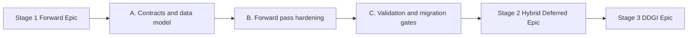

# Epic Plan: forward-rendering

**Status:** Stage 1 complete (2026-06-02); Stage 2+ planned  
**Scope:** Stage 1 of lighting evolution (closed); Stages 2–3 open  
**Related:** [`Active-Plan.md`](Active-Plan.md), [`EngineArchitecture.md`](EngineArchitecture.md), [`hybrid-deferred-epic_Plan.md`](hybrid-deferred-epic_Plan.md)

## Naming conventions

- **Stage:** `Stage 1 (Forward Baseline)`, `Stage 2 (Hybrid Deferred + PBR)`, `Stage 3 (Optional DDGI)`.
- **Preset:** `ForwardLit`, `HybridDeferred`.
- **Pass chain target (Stage 2+):** `GBufferOpaque -> ClusterBuild -> DeferredLighting -> ForwardTransparent -> Post`.

## Goal

Stabilize a complete forward rendering baseline before deferred migration:

1. PBR-ready material/lighting data contracts in CPU and shader interfaces.
2. Reliable opaque + transparent forward path with clear pass boundaries.
3. Feature toggles and verification hooks that make deferred migration low risk.

## Non-goals

- Full deferred or clustered deferred lighting.
- DDGI probe update/integration.
- Replacing GPU-driven and mesh-shader roadmap milestones.

## Deliverables

- Forward path supports production-oriented controls (opaque + transparent).
- Material schema and descriptor contracts support later PBR upgrade without breaking compatibility.
- Render preset includes a stable `ForwardLit` baseline for parity checks.
- Benchmark and capture checklist for baseline visual/perf comparisons.

## Dependency graph

## Work breakdown

### A. Contracts and data model

**Deps:** `S1 M1` draw stream done, `S2` shader reflection/permutation scaffolding in progress.

- [x] Freeze per-material data layout for forward path (`baseColor`, roughness/metallic factors, alpha mode contract) — 2026-06-01 `forward-stage1-contracts`.
- [x] Keep transparent policy explicit (`opaque` vs `transparent`) and document sorting contract — SceneJSON + `EngineArchitecture.md` §5.2.
- [x] Define shader feature bits that will carry into deferred (`SHADOWS`, `IBL`, `ALPHA_CLIP`, `PBR`) — `Gfx_ShaderFeatureBit` + `PermutationRegistry.json` comment.

### B. Forward pass hardening

**Deps:** A complete; requires current transparent policy from S1 and descriptor contracts (`Set 0/1/2`) locked in docs.

- [x] Separate forward opaque and forward transparent record flow clearly in pass-level docs — 2026-06-02 `forward-pass-hardening`.
- [x] Ensure transparent pass policy stays compatible with later deferred depth consumption — `EngineArchitecture.md` §5.2 Stage 2 depth contract.
- [x] Add debug views/preset switches required for future parity checks — `Util_RenderDebugPanel`, depth/normal modes, skip-pass toggles.

### C. Validation and migration gates

**Deps:** A and B complete; benchmark/preset infra from `Active-Plan.md` S7 can be reused for parity captures.

- [x] Capture golden screenshots and perf baseline in one benchmark scene — 2026-06-02 `forward-stage1-validation`; [`forward-stage1.md`](forward-stage1.md) §1, [`Assets/golden/forward-stage1/`](Assets/golden/forward-stage1/).
- [x] Add acceptance checklist for deferred migration handoff — [`forward-stage1.md`](forward-stage1.md) §2.
- [x] Document known gaps that are intentionally deferred to Stage 2 — [`forward-stage1.md`](forward-stage1.md) §3.

## Acceptance

- [x] Default scene renders correctly with forward opaque + transparent policy — `demo.json` + baseline runbook (2026-06-02).
- [x] Material and permutation contracts are documented and reused by Stage 2 plan — Architecture §7, handoff checklist, `hybrid-deferred-epic` deps.
- [x] `ForwardLit` baseline can be selected for A/B comparison after deferred path lands — `Config/engine.benchmark.json`, `--render-preset ForwardLit`.

## Exit criteria for Stage 2

Forward remains a working fallback/reference path while Stage 2 introduces opaque deferred. No hard dependency from gameplay/simulation code into forward-only shader behavior.

