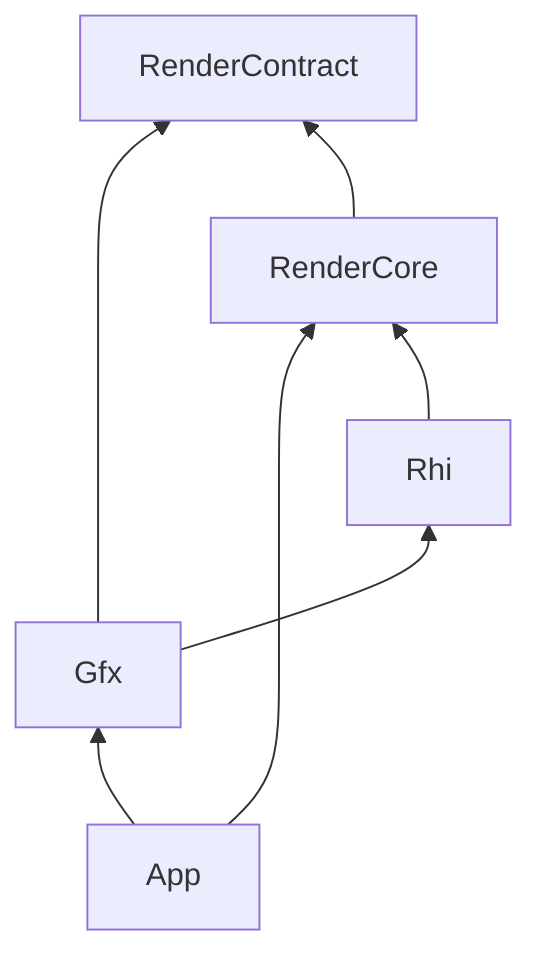

# Plan: gfx-rhi-pass-migration (E0–E1 kickoff)

**Status:** In progress (2026-07-21)  
**Branch:** `feat/gfx-rhi-pass-migration`  
**Progress:** [`gfx-rhi-pass-migration_Progress.md`](gfx-rhi-pass-migration_Progress.md)  
**Related:** [`EngineArchitecture.md`](EngineArchitecture.md) · [`Active-Plan.md`](Active-Plan.md) · Wishlist S21 · closed [`rhi-independence_Plan.md`](Archived/plans/rhi-independence_Plan.md)

## Goal

Introduce an opaque **`Rhi/`** GPU dialogue layer so **Gfx** can own modular rendering passes without including Vulkan or `RenderCore`. RenderCore becomes the Vulkan backend that implements `Rhi_*`.

This kickoff covers **E0 (policy)** + **E1 (minimal Rhi surface + backend + tests)** only. Pass migration (E2+) is follow-up on the same branch/epic.

## Non-goals (this kickoff)

- Moving any `Vk_*Pass` into Gfx
- Full descriptor / graphics-pipeline / render-pass API surface
- Second backend (D3D12/Metal)
- Blocking S10 content pipeline

## Target dependency (locked after E0)

- **Gfx** may `#include` `Rhi/*`; must not `#include` `vulkan.h` or `RenderCore/*`.
- **Rhi** public headers must not `#include` `vulkan.h`.
- **`Vk_RhiDevice`** remains the low-level Vulkan device factory inside RenderCore (implements Rhi backend).

## Steps

| Step | Detail | Verify |
|------|--------|--------|
| E0.1 | Update `EngineArchitecture.md` §1 module map + must-not + §9 lab hook | Doc review |
| E0.2 | Index epic in Active-Plan / README / Wishlist S21 | Doc review |
| E1.1 | Add `VulkanDesktop/Rhi/` opaque handles + Device + CommandList API | Compile |
| E1.2 | Add `RenderCore/Vk_RhiBackend.*` implementing Rhi via `Vk_RhiDevice` | Compile |
| E1.3 | Wire `.vcxproj` / `.filters` / GfxTests; headless Rhi create + CommandList smoke | `Verify-CI.ps1` |

## Touch list

- `Docs/EngineArchitecture.md`, `Docs/Active-Plan.md`, `Docs/README.md`, `Docs/Wishlist.md`
- `VulkanDesktop/Rhi/*.h`
- `VulkanDesktop/RenderCore/Vk_RhiBackend.{h,cpp}`
- `VulkanDesktop/VulkanDesktop.vcxproj(.filters)`, `VulkanDesktop/GfxTests.vcxproj`
- `VulkanDesktop/GfxTests/GfxTests_Main.cpp`
- `.cursor/rules/vulkan-desktop-layout.mdc` (folder map)

## Risks

| Risk | Guard |
|------|-------|
| Rhi headers leak Vulkan | Grep gate in Progress; GfxTests include only `Rhi/` for new test |
| Scope creep into full Pass API | E1 = device + command-list lifecycle only; resource create stubs deferred to E2 needs |

## Verification

- `powershell -File Scripts/Verify-CI.ps1` (G0)
- Smoke / G0-validation: **N/A** for E0/E1 (no GPU pass/runtime change)
