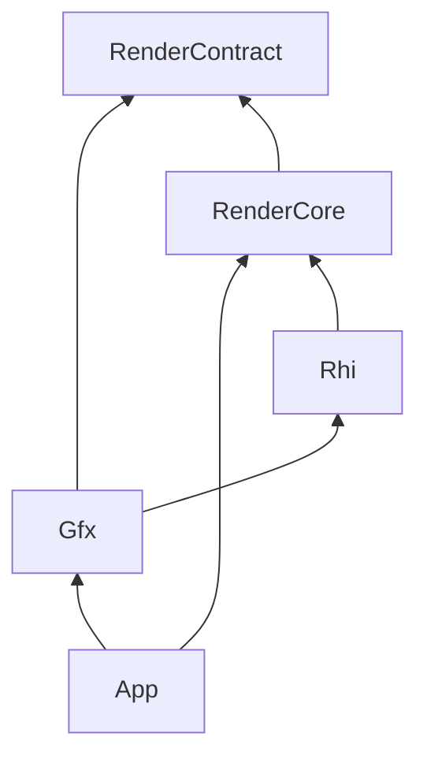

# Plan: gfx-rhi-pass-migration (E0–E5)

**Status:** In progress (2026-07-21)  
**Branch:** `feat/gfx-rhi-pass-migration`  
**Progress:** [`gfx-rhi-pass-migration_Progress.md`](gfx-rhi-pass-migration_Progress.md)  
**Related:** [`EngineArchitecture.md`](EngineArchitecture.md) · [`Active-Plan.md`](Active-Plan.md) · Wishlist S21 · Cursor plan `gfx_renderpipeline_peel_c2a49d85` · closed [`rhi-independence_Plan.md`](Archived/plans/rhi-independence_Plan.md)

## Goal

Introduce an opaque **`Rhi/`** GPU dialogue layer so **Gfx** can own modular rendering passes without including Vulkan or `RenderCore`. RenderCore becomes the Vulkan backend that implements `Rhi_*`.

## Status by phase

| Phase | Status |
|-------|--------|
| E0 policy | Done |
| E1 Rhi surface (+ E1b) | Done |
| E2 AO Record pilot | Done (Init still RenderCore; thin `Vk_AoPass_Record` facade) |
| E3 `Gfx_RenderPipeline` + FramePlan | **In progress** — topology + enable policy in Gfx; RC fills readiness + Record |
| E4 migrate remaining passes | Pending |
| E5 cleanup / docs archive | Pending |

## Steps (E3)

| Step | Detail | Verify |
|------|--------|--------|
| E3.1 | `Gfx_PassId` / `Gfx_FramePlan` / `Gfx_PipelineEnableFlags` | Compile |
| E3.2 | `Gfx_RenderPipeline::BuildHybridDeferred` owns topology + topo-sort | GfxTests |
| E3.3 | `Vk_FrameGraph::Execute` consumes Plan; Record switch stays in RC | Smoke |
| E3.4 | Enable policy in Gfx via `Gfx_PipelineBuildInput` + `ResolveEnableFlags`; RC only fills readiness bools | GfxTests + smoke |

## Non-goals (this epic)

- Second backend (D3D12/Metal)
- Full descriptor / graphics-pipeline / render-pass API in one PR
- Blocking S10 content pipeline
- Deleting all `Vk_*Pass` facades before E4/E5

## Target dependency (locked after E0)

- **Gfx** may `#include` `Rhi/*`; must not `#include` `vulkan.h` or `RenderCore/*`.
- **Rhi** public headers must not `#include` `vulkan.h`.
- **`Vk_RhiDevice`** remains the low-level Vulkan device factory inside RenderCore (implements Rhi backend).

## Verification

- `powershell -File Scripts/Verify-CI.ps1` (G0)
- GPU: `Verify-Smoke.ps1`; pass/barrier work: G0-validation on sponza
