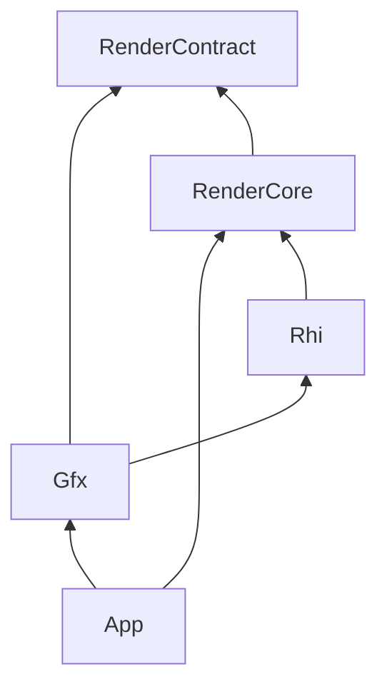

# Plan: gfx-rhi-pass-migration (E0–E5)

**Status:** In progress (2026-07-22)  
**Branch:** `feat/gfx-rhi-pass-migration`  
**Progress:** [`gfx-rhi-pass-migration_Progress.md`](gfx-rhi-pass-migration_Progress.md)  
**Related:** [`EngineArchitecture.md`](EngineArchitecture.md) · [`Active-Plan.md`](Active-Plan.md) · Wishlist S21 · Cursor plan `gfx_renderpipeline_peel_c2a49d85` · closed [`rhi-independence_Plan.md`](Archived/plans/rhi-independence_Plan.md)

## Goal

Introduce an opaque **`Rhi/`** GPU dialogue layer so **Gfx** can own modular rendering passes without including Vulkan or `RenderCore`. RenderCore becomes the Vulkan backend that implements `Rhi_*`.

## Status by phase

| Phase | Status |
|-------|--------|
| E0 policy | Done |
| E1 Rhi surface (+ E1b) | Done |
| E2 AO Record pilot | Done (Init still RenderCore; thin `Vk_AoPass_Record` facade) |
| E3 `Gfx_RenderPipeline` + FramePlan | Done (topology + enable policy in Gfx; RC fills readiness + Record) |
| E4 migrate remaining passes | **In progress** — E4.1–E4.5 + **E4.6a done**; next E4.6b Deferred draw |
| E5 cleanup / docs archive | Pending |

## Steps (E4)

| Step | Detail | Verify | Status |
|------|--------|--------|--------|
| E4.1 | `Gfx_DepthPyramidPass::Record` + thin `Vk_DepthPyramidPass_Record` | Smoke | Done |
| E4.2 | ClusterBuild Record → Gfx (+ Rhi buffer barrier / HostWrite) | Smoke | Done |
| E4.3 | ShadowAoSoft Record → Gfx | Smoke + validation | Done |
| E4.4 | SSR RecordTrace + RecordHistoryUpdate → Gfx | Smoke + validation | Done |
| E4.5 | DDGI ProbeUpdate Record → Gfx (facade stays in DeferredLighting_Record) | Smoke + validation | Done |
| E4.6 | ShadowMap / DeferredLighting draw / PostProcess Record | Smoke + validation | **Next — peels E4.6b–e** |
| E4.6a | Rhi graphics recording surface (RP/FB adopt, Begin/End, viewport/scissor/bias, VB/IB, dynamic offsets, MemoryBarrierDesc, Early/LateFragmentTests) | Verify-CI | **Done** |

## Steps (E3)

| Step | Detail | Verify |
|------|--------|--------|
| E3.1 | `Gfx_PassId` / `Gfx_FramePlan` / `Gfx_PipelineEnableFlags` | Compile |
| E3.2 | `Gfx_RenderPipeline::BuildHybridDeferred` owns topology + topo-sort | GfxTests |
| E3.3 | `Vk_FrameGraph::Execute` consumes Plan; Record switch stays in RC | Smoke |
| E3.4 | Enable policy in Gfx via `Gfx_PipelineBuildInput` + `ResolveEnableFlags`; RC only fills readiness bools | GfxTests + smoke |

## E4.6 — Graphics / Post Record migration (gap analysis + plan)

### Why compute peels worked and these do not (yet)

E4.1–E4.5 only needed: bind compute pipeline / set / push, `Dispatch`, image+buffer barriers, `CopyImage`, debug labels. Those already exist on `Rhi_CommandList`.

ShadowMap / DeferredLighting fullscreen draw / PostProcess **tonemap** additionally need **render-pass scope**, **graphics raster state**, and (ShadowMap) **mesh draw binding**. Today those paths still call `vkCmd*` directly from RenderCore (`Vk_ShadowMapPass::RecordDraw`, `Vk_DeferredLightingPass::RecordDraw`, `Vk_PostProcessPass::RecordPost` + Bloom/TAA helpers).

### Current Rhi inventory (what Gfx can already use)

| Capability | Status |
|------------|--------|
| Bind pipeline (graphics + compute) | Yes |
| Bind descriptor set (single set, **no dynamic offsets**) | Yes |
| Push constants | Yes |
| Dispatch / Draw / DrawIndexed | Yes (Draw* unused by Gfx yet) |
| Image / buffer barriers | Yes |
| CopyImage | Yes |
| Debug labels | Yes |
| Begin/End render pass (or dynamic rendering) | **No** |
| Set viewport / scissor | **No** |
| Set depth bias | **No** |
| Bind vertex / index buffers | **No** |
| Bind descriptor set **with dynamic offsets** | **No** |
| Global `VkMemoryBarrier` (no resource) | **No** (Bloom blur CS→CS uses one today) |
| Early/Late fragment-test pipeline stages | **No** (Shadow depth transitions use them) |
| Opaque `Rhi_RenderPass` / `Rhi_Framebuffer` handles + adopt | **No** |
| Clear-value / render-area begin info | **No** |

Depth aspect on image barriers is already inferred in `Vk_RhiBackend` from `D32_SFLOAT` format when textures are adopted — usable once Shadow depth is adopted with that format.

### How HybridDeferred owns RP today (important ownership rule)

```text
Vk_FrameGraph::Execute
  ├─ ShadowMap::RecordDraw          ← owns Begin/End its own depth-only RP
  ├─ (other compute: Cluster / Soft / SSR / DDGI / Hi-Z / AO)
  ├─ Begin GBuffer RP  … End        ← FG owns scope; GBuffer draws inside
  ├─ Begin Hybrid RP                ← PostProcess hybrid FB; FG owns scope
  │    ├─ DeferredLighting::RecordDraw   ← fullscreen triangle only (no Begin/End)
  │    └─ ScenePasses hybrid / PiP
  └─ End Hybrid RP
  └─ PostProcess::RecordPost
       ├─ TAA resolve (compute)
       ├─ Bloom (compute)
       └─ Begin swapchain RP … tonemap Draw … End   ← Post owns tonemap RP
```

**Policy for E4.6:** keep **who begins/ends** the same until E5. Gfx Records may assume “already inside an RP” (Deferred) or “own Begin/End via Rhi” (ShadowMap, tonemap). Do **not** move hybrid/GBuffer RP begin into Gfx in the same slice as pass peel.

### Per-target gap matrix

#### A. DeferredLighting fullscreen `RecordDraw` (smallest graphics peel)

**Today:** `UpdateAoDescriptorBinding` (Vulkan descriptor write) → bind graphics pipeline/set → push → `vkCmdDraw(3)`. Called **inside** FG-owned hybrid RP.

**Already enough in Rhi:** `BindPipeline(Graphics)`, `BindDescriptorSet`, `PushConstants`, `Draw`.

**Still missing / stay in facade:**

- Per-frame AO contact-map descriptor write (`UpdateAoDescriptorBinding`) — keep in RC (same pattern as SSR `UpdateDescriptorSet`).
- Building `Gpu_DeferredLightingPushConstants` from `Vk_Renderer` / lighting settings — keep in facade DTO fill (or move push assembly to Gfx with a plain DTO input).

**Rhi work required:** none for a minimal peel (optional: document that Draw must be called only while a graphics RP is active).

**Deliverable:** `Gfx_DeferredLightingPass::RecordDraw` + thin `Vk_DeferredLightingPass_Record` body for draw; Init stays RC.

#### B. PostProcess — split compute vs graphics

| Subpath | Vulkan today | Can peel with current Rhi? |
|---------|--------------|----------------------------|
| `RecordTaaResolve` | CS bind/dispatch + image barriers + history bookkeeping | **Yes** (same pattern as Soft/SSR) |
| `RecordBloom` | CS threshold + H/V blur + **global memory barrier** between blur passes | **Almost** — need `CommandListMemoryBarrier` (or encode blur sync as image barriers on ping/pong) |
| Tonemap in `RecordPost` | Begin swapchain RP → graphics bind/draw → End | **Needs** Begin/End RP + clears + adopt swapchain FB/RP |

**Recommended order:** B1 TAA → B2 Bloom (+ memory barrier or image-barrier substitute) → B3 tonemap after Rhi RP surface.

**Stay in facade:** `UpdateTonemapDescriptorSet`, layout trackers (`gSceneColorLayout` / bloom layouts), swapchain image index → framebuffer pick.

#### C. ShadowMap `RecordDraw` (largest)

**Today (single function does CPU + GPU):**

1. CPU: sun enable check, Khronos light VP / bias from scene bounds, update lighting globals UBO.
2. Transition shadow depth → `DEPTH_STENCIL_ATTACHMENT` (early/late fragment-test stages).
3. `vkCmdBeginRenderPass` (depth-only RP/FB, clear depth).
4. Bind pipeline; `SetViewport` / `SetScissor` / `SetDepthBias`.
5. Per draw: bind VB/IB, bind object set with **dynamic offset**, `DrawIndexed`.
6. `vkCmdEndRenderPass` (layout becomes depth-read for later deferred).
7. `UpdateLightingGlobals` with light VP.

**Rhi gaps (blocking):**

1. `Rhi_RenderPass` / `Rhi_Framebuffer` (+ `RhiVulkan::*Adopt`) and  
   `CommandListBeginRenderPass` / `EndRenderPass` (render area, clear depth).
2. `CommandListSetViewport` / `SetScissor` / `SetDepthBias`.
3. `CommandListBindVertexBuffer` / `BindIndexBuffer` (index type uint32).
4. `CommandListBindDescriptorSet` overload with `dynamicOffsetCount` / offsets (Shadow object UBO).
5. Pipeline stages: `EarlyFragmentTests` | `LateFragmentTests` (or map depth transitions via a coarser stage intentionally documented).
6. Optional: mesh draw loop input as Gfx DTO (`Gfx_PassDrawPacket` already lives in Gfx — good) while mesh GPU handles are adopted buffers from RC.

**Stay in facade (CPU / Vulkan glue):**

- Bounds → `Gfx_LightingMath` setup (can stay RC or move math-only to Gfx — already mostly Gfx).
- `CmdBarrierForDeferredRead` and depth-layout tracker on `Vk_ShadowMapState`.
- Creating/destroying shadow RP/FB/pipeline (Init) until a later Init peel.

### Recommended Rhi surface slice (E4.6a) before peels

Add to `Rhi/` (headers still Vulkan-free) and implement in `Vk_RhiBackend`:

1. **Handles:** `Rhi_RenderPass`, `Rhi_Framebuffer` (id-style like pipeline).
2. **Enums:** clear kinds; extend `Rhi_PipelineStage` with early/late fragment tests; optionally `Rhi_IndexType`.
3. **CommandList:**
   - `BeginRenderPass(RenderPassBeginInfo)` / `EndRenderPass`
   - `SetViewport` / `SetScissor` / `SetDepthBias`
   - `BindVertexBuffer` / `BindIndexBuffer`
   - `BindDescriptorSet(..., dynamicOffsets)`
   - `MemoryBarrierDesc` / `CommandListMemoryBarrier` for Bloom (named to avoid Win32 `MemoryBarrier` macro)
4. **Adopt helpers:** `RenderPassAdopt`, `FramebufferAdopt` (swapchain + shadow + hybrid remain created in RC).

**Non-goal for E4.6a:** creating render passes from Gfx, dynamic rendering migration, secondary CBs, inheritance.

**Optional later (E5):** move hybrid/GBuffer Begin/End from `Vk_FrameGraph` into Gfx orchestration once RP handles are first-class on the FramePlan.

### Ordered implementation steps (E4.6b+)

| Step | Work | Depends on | Verify |
|------|------|------------|--------|
| E4.6a | Rhi graphics recording surface (above) + GfxTests smoke for Begin/Draw/End on a tiny adopted RP if feasible | — | Verify-CI |
| E4.6b | `Gfx_DeferredLightingPass::RecordDraw` + facade (descriptor update stays RC) | Draw only (a minimal) | Smoke + validation |
| E4.6c | `Gfx_PostProcessPass::RecordTaa` / `RecordBloom` | MemoryBarrier or image-barrier rewrite | Smoke + validation |
| E4.6d | `Gfx_PostProcessPass::RecordTonemap` | E4.6a Begin/End | Smoke + validation |
| E4.6e | `Gfx_ShadowMapPass::Record` (draws + RP) | Full E4.6a | Smoke + validation (shadow on/off) |
| E4.6f | (Optional) peel GBuffer/hybrid RP begin out of FG into Gfx plan executor | E4.6a + FramePlan RP nodes | Smoke + validation |

### Risks

- **Dynamic offsets:** forgetting the Shadow bind overload silently draws with wrong instance data.
- **RP scope:** calling Deferred Gfx Record outside hybrid Begin/End will validation-fail; facade must not reorder FG.
- **Swapchain FB:** tonemap Begin must use the **current** `aImageIndex` framebuffer — facade picks handle each frame.
- **Depth layout tracker:** Shadow EndRenderPass implies layout change; Gfx must write back via inout layout pointer (same Soft/SSR pattern).
- **Bloom memory barrier:** replacing with wrong image barriers can race H/V blur.

### Acceptance for closing E4

- All HybridDeferred **pass Records** used on sponza smoke path either live in Gfx (Rhi-only) or are explicitly listed as Init/descriptor/CPU facades.
- E4.6a surface documented in Architecture only if the locked Rhi policy grows (graphics RP is an additive surface, not a dependency flip).
- G0 + G0-smoke + G0-validation (sponza) clean aside from known benign `enabledLayerCount` device warning.

## Non-goals (this epic)

- Second backend (D3D12/Metal)
- Full descriptor / graphics-pipeline **create** API from Gfx in one PR (adopt + record first)
- Blocking S10 content pipeline
- Deleting all `Vk_*Pass` facades before E4/E5
- Moving hybrid/GBuffer RP creation into Gfx during E4.6a–e

## Target dependency (locked after E0)



- **Gfx** may `#include` `Rhi/*`; must not `#include` `vulkan.h` or `RenderCore/*`.
- **Rhi** public headers must not `#include` `vulkan.h`.
- **`Vk_RhiDevice`** remains the low-level Vulkan device factory inside RenderCore (implements Rhi backend).

## Verification

- `powershell -File Scripts/Verify-CI.ps1` (G0)
- GPU: `Verify-Smoke.ps1`; pass/barrier work: G0-validation on sponza
