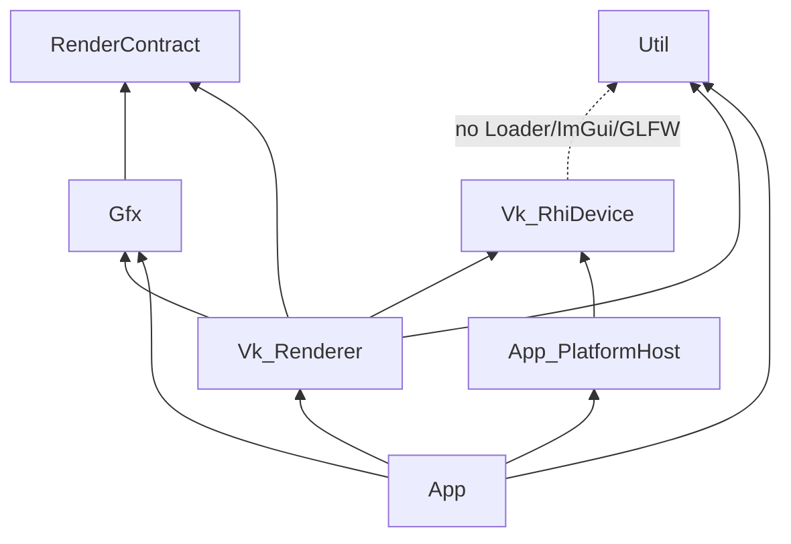

# Plan: rhi-independence — RHI 拆分 + 层间数据流 + FG v2 + 平台剥离

**Status:** In progress  
**Progress:** [`rhi-independence_Progress.md`](rhi-independence_Progress.md)

## Problem

`Vk_Core` 是 singleton God Object，同时承担：低级 RHI 工厂、WSI、全部 pass 状态、ImGui/GLFW、会话调参、以及 **在 RenderCore 内调用 `Gfx_BuildViewFramePacket`**。与 `EngineArchitecture.md` §1–3 的层间数据流和 Wishlist **RHI-E4**（可注入 render device）系统性偏离。

## Goals (user-confirmed one-shot)

1. **永久拆分：** `Vk_RhiDevice`（纯 Vulkan 资源层）+ `Vk_Renderer`（pass/FG/场景 GPU）+ `App_PlatformHost`（GLFW/ImGui/输入表面）。
2. **数据流对齐文档：** App 每 view 调用 `Gfx_BuildViewFramePacket`；RenderCore 只消费 `Gfx_FrameRenderPacket[]` + GPU upload（slab/template/entity SSBO）。
3. **FG v2 完整：** 命名资源注册表 + pass read/write 声明 + 拓扑排序后自动 barrier 插入。
4. **去 singleton：** `Application` 拥有 `Vk_RhiDevice` + `Vk_Renderer` + `App_PlatformHost`；删除 `Vk_Core::GetInstance()`。
5. **契约层：** `RenderContract/` 存放 `Gpu*` UBO 与 render settings（从 Gfx 迁出误放类型）。
6. **CI 全绿：** `Verify-CI` + `Verify-Smoke` + G0-validation；GfxTests 新增 headless `Vk_RhiDevice` 构造测试。

## Non-goals

- Dynamic rendering (`VK_KHR_dynamic_rendering`) 迁移
- Linux / 跨平台窗口
- DDGI / S8 新特性
- Timeline semaphores（RHI-E2）
- 删除 `ForwardLit` 回退路径
- 每个 pass 改成纯虚 `IRenderPass` 类层次（保留 free-function + state struct 风格）

## Design decisions

| Decision | Choice | Alternative rejected |
|----------|--------|----------------------|
| 契约目录 | `VulkanDesktop/RenderContract/` | 扩 `Vk_Types.h` only — 难与 Gfx 解耦 |
| Renderer 访问模式 | `Vk_Renderer&` + 内嵌 context 成员；pass 通过 `Vk_RendererContexts` 聚合 struct 访问子状态 | 继续 `Vk_Core&` 换名 — 无实质解耦 |
| FG v2 | `Vk_FrameGraph` + `Vk_FgResourceRegistry` + `Vk_FgBarrierCompiler` | FG v1.5 手写 barrier — 用户要求一步到位 |
| 平台 | `App_PlatformHost` 创建 surface/window；`Vk_Renderer` 只接收 `VkSurfaceKHR` | 部分剥离 — 用户要求 full |
| Scene load API | `LoadSceneGpuResources(Gfx_SceneGpuLoadParams)` — 无 `WorldState&` | 保留 WorldState 适配层在 App |
| `Vk_Core` | **删除**（非 facade 保留） | 薄 wrapper — 永久技术债 |
| Shader SPIR-V 路径 | Pass 通过 `Vk_ShaderLibrary`（注入 logical path resolver）| Pass 直接 `Util_Loader` |

### Target dependency graph



### Target frame loop (CPU)

```
PlatformHost.Poll → Input.Sample(window)
→ sim / transforms (Gfx)
→ BuildActiveRenderViews
→ for each view: Gfx_BuildViewFramePacket → packets[]
→ Renderer.UploadFrameGpu(packets, views)   // slab + templates + entity SSBO
→ DebugOverlay (patches Renderer session settings)
→ Renderer.DrawFrameGpu() → acquire / record FG / present
→ PlatformHost.SubmitImGui (record pass 内或后)
```

## Touch list (expected)

### New

- `VulkanDesktop/RenderContract/` — `GpuLightingGlobals`, `GpuAoSettings`, `GpuPostSettings`, `GpuEnvironmentData`, builders
- `VulkanDesktop/RenderCore/Vk_RhiDevice.{h,cpp}`
- `VulkanDesktop/RenderCore/Vk_Renderer.{h,cpp}`
- `VulkanDesktop/RenderCore/Vk_RendererContexts.h` — pass state bundle for pass modules
- `VulkanDesktop/RenderCore/Vk_SwapchainPresenter.{h,cpp}` — peel from SwapchainHost
- `VulkanDesktop/RenderCore/Vk_FrameGraph.{h,cpp}`, `Vk_FgResourceRegistry.{h,cpp}`, `Vk_FgBarrierCompiler.{h,cpp}`
- `VulkanDesktop/RenderCore/Vk_ShaderLibrary.{h,cpp}`
- `VulkanDesktop/App/App_PlatformHost.{h,cpp}`
- `VulkanDesktop/Gfx/Gfx_SceneGpuLoadParams.h`
- `VulkanDesktop/Gfx/Gfx_FrameGpuUpload.h` — upload-only prep API

### Major modify

- All `Vk_*Pass.*`, `Vk_ScenePasses.*`, `Vk_FrameUniformUploader.*`, `Vk_DescriptorSystem.*`, `Vk_GfxPipelineCache.*`, `Vk_GpuCull.*`
- `App/Application.{h,cpp}`, `App/DebugOverlay.*`, `App/ActiveViewsBuild.*`, `App/SceneCpuLoad.*`
- `Util/*Panel*` — settings types → RenderContract
- `Gfx/Gfx_AoSettings.h` etc. → thin aliases or delete
- `VulkanDesktop.vcxproj` + `.filters`
- `GfxTests/GfxTests_Main.cpp` — headless RhiDevice test
- `Docs/EngineArchitecture.md` §1, §3, §10 — locked policy update at closeout

### Delete

- `VulkanDesktop/RenderCore/Vk_Core.{h,cpp}`
- `VulkanDesktop/RenderCore/Vk_PlatformFrame.{h,cpp}` (logic → App_PlatformHost)
- `VulkanDesktop/RenderCore/Vk_FrameGraphBuilder.{h,cpp}` (replaced by FG v2)
- `VulkanDesktop/RenderCore/Vk_RenderBackend.{h,cpp}` (packet validate → GfxTests / Gfx)

## Implementation plan (ordered)

### Step 1 — RenderContract + Gfx 清理

- [ ] 1.1 创建 `RenderContract/`；迁移 `GpuLightingGlobals`, `GpuEnvironmentData`, `GpuAoSettings`, `GpuPostSettings` 及 builder 函数
- [ ] 1.2 Gfx 侧保留 `using` 别名或删除旧头；更新 Util panels / passes includes
- [ ] 1.3 `Gfx_SceneGpuLoadParams` DTO（manifest + SoA + permutation + paths）

### Step 2 — Vk_RhiDevice 抽离

- [ ] 2.1 从 `Vk_Core` 迁出 device/queue/VMA/CreateBuffer/CreateImage/shader module/barrier helpers → `Vk_RhiDevice`
- [ ] 2.2 `Vk_ResourceContext` 改为持有 `Vk_RhiDevice&`（非 Vk_Core）
- [ ] 2.3 GfxTests: `TestRhiDeviceHeadlessConstruct`（instance+device 无 surface，或 mock surface skip）

### Step 3 — App_PlatformHost

- [x] 3.1 `App_PlatformHost`: GLFW window, resize callback, `CreateSurface(Vk_RhiDevice&)`, poll, ShouldClose
- [x] 3.2 ImGui init/shutdown/frame begin 移入 PlatformHost 或 `Util_ImGuiLayer` 由 App 驱动
- [x] 3.3 删除 `Vk_Core` 内 ImGui/GLFW 逻辑（现等价为从 `Vk_Renderer`/`Vk_PlatformFrame` 剥离到 App）

### Step 4 — Vk_Renderer 骨架 + 去 WorldState

- [x] 4.1 `Vk_Renderer` 拥有：swapchain ctx, frame ctx, scene ctx, 全部 pass states, session settings
- [x] 4.2 `LoadSceneGpuResources(Gfx_SceneGpuLoadParams)`；App 从 WorldState 填 DTO
- [x] 4.3 `Vk_RendererContexts` 供 pass 模块访问；开始将 `Vk_Core&` 替换为 `Vk_Renderer&`

### Step 5 — CPU prep 上移

- [ ] 5.1 App `RunMainLoop`: per-view `Gfx_BuildViewFramePacket` → `std::array<Gfx_FrameRenderPacket, kGfxMaxRenderViews>`
- [ ] 5.2 `Vk_FrameDrawPrep::Build` 删除 packet 构建；重命名 API `UploadFromPacket`
- [ ] 5.3 `Vk_Renderer::UploadFrameGpu` 替代 `PrepareFrameCpu` 的 upload 部分；acquire 仍在 DrawFrameGpu 或拆 `BeginFrame`/`EndFrame`

### Step 6 — Pass 全量迁移

- [ ] 6.1 所有 pass `Vk_Core&` → `Vk_Renderer&`（或 `Vk_RendererContexts&`）
- [ ] 6.2 `Vk_SwapchainHost` → `Vk_SwapchainPresenter` 只依赖 RhiDevice + surface
- [ ] 6.3 `Vk_FrameUniformUploader`, `Vk_DescriptorSystem`, `Vk_GfxPipelineCache` 迁移
- [ ] 6.4 `Application` / `DebugOverlay` / `ActiveViewsBuild` 改用 `Vk_Renderer&`

### Step 7 — FG v2

- [ ] 7.1 `Vk_FgResourceId` 枚举 + `Vk_FgResourceRegistry`（注册 GBuffer/HDR/AO/Shadow/DepthPyramid/Swapchain）
- [ ] 7.2 `Vk_FgPassNode`: reads[], writes[], record callback, IsEnabled
- [ ] 7.3 `Vk_FgBarrierCompiler`: 根据 layout transition 表插入 image/memory barriers
- [ ] 7.4 `Vk_FrameGraph::Execute` 替代 `Vk_FrameGraphBuilder::RecordHybridDeferred`
- [ ] 7.5 Preset toggles（shadow/AO/bloom）→ FG 拓扑子集

### Step 8 — 删除 Vk_Core + 收尾

- [ ] 8.1 删除 `Vk_Core.*`；`VulkanDesktop.cpp` / tests 无 GetInstance
- [ ] 8.2 删除 `Vk_RenderBackend`, `Vk_PlatformFrame`, `Vk_FrameGraphBuilder`
- [ ] 8.3 全局 `vertShaderPath`/`fragShaderPath` → `Vk_ShaderLibrary` 或 renderer session
- [ ] 8.4 更新 `EngineArchitecture.md` 层图 + 帧循环 + glossary
- [ ] 8.5 Active-Plan / Archived-Plan / Wishlist RHI-E4 关闭

## Verification

| ID | Command / check |
|----|-----------------|
| V1 | `powershell -File Scripts/Verify-CI.ps1` exit 0 |
| V2 | `powershell -File Scripts/Verify-Smoke.ps1` exit 0 |
| V3 | G0-validation: `--validation --smoke-frames 120 --smoke-seconds 6` stress.json → 0 validation ERROR |
| V4 | GfxTests `TestRhiDeviceHeadlessConstruct` pass |
| V5 | Manual Sponza HybridDeferred: shadow/AO/post toggles; ForwardLit switch |
| V6 | Resize window 10s — no crash (WSI path via PlatformHost) |
| V7 | grep: no `Vk_Core::GetInstance` in `VulkanDesktop/` |
| V8 | grep: `Gfx_BuildViewFramePacket` only in Gfx/ + App/ (not RenderCore) |

## Risks

| Risk | Mitigation |
|------|------------|
| 超大 diff 难 review | Progress 按 step 记录；每 step 后 CI |
| FG v2 barrier 回归 | G0-validation 必跑；保留旧 barrier 表对照 Sponza |
| ImGui/swapchain 生命周期 | PlatformHost 与 Presenter 文档化 recreate 顺序 |
| 中途编译断裂 | Step 2–4 保留 Vk_Core 作 delegating shim 直至 Step 8（**本计划选择直接迁移，Step 4 后尽快可编译**） |

## Rollback

- 按 step 在 Progress 记录 commit hash；任一步 V1 失败则停止并修复，不跳步。
