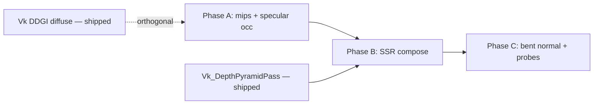

# Plan: specular-ibl-stack — Industry-aligned indirect specular (IBL + occlusion + reflection layers)

**Status:** In progress — **Phase A–B shipped**; **Phase C v0** (cones + ImGui local probe); closeout pending  
**Progress:** [`specular-ibl-stack_Progress.md`](specular-ibl-stack_Progress.md)  
**Commits:** `3a044a9` (A), `87be12f` (B), `087b38f` (B+ temporal + C1/C2 v0)  
**Related:** [`Archived/plans/s5-ibl-shadows_Plan.md`](Archived/plans/s5-ibl-shadows_Plan.md), [`Archived/plans/shadow-audit-fix_Plan.md`](Archived/plans/shadow-audit-fix_Plan.md), [`hybrid-deferred-epic_Plan.md`](hybrid-deferred-epic_Plan.md), [`Wishlist.md`](Wishlist.md) §S13 experiments, [`EngineArchitecture.md`](EngineArchitecture.md) §7

---

## Problem statement

HybridDeferred shows **sky / distant environment cubemap content on surfaces that should be locally occluded** (e.g. under eaves, in corners, shadowed alcoves). Investigation shows this is **not primarily a wrong `skyMap` binding**, but an **incomplete indirect-specular stack**:

| Gap | Symptom |
|-----|---------|
| **Single distant cubemap** with no nearer reflection sources | Distant HDRI is the only answer for all pixels |
| **Prefilter mip chain missing** (`maxMip = 0`) | All roughness samples mip0 → sharp sky-like reflections everywhere |
| **`d454d15` decoupled specular IBL from AO entirely** | HBAO darkens diffuse IBL + DDGI but **not** specular IBL |
| **No specular occlusion** (Lagarde / bent-normal cones) | Industry-standard fix for cubemap visibility separation is absent |
| **SSR / local probes not wired** | Hi-Z exists; reflection ray pass does not |

`shadow-audit-fix` correctly **decoupled diffuse IBL from the directional shadow map** and left **prefilter mip0** as explicit follow-up. `d454d15` over-corrected AO by removing specular attenuation completely. This plan lands the **Frostbite / UE / Filament** pattern: split-sum + roughness mips + **specular occlusion** + layered reflections.

---

## Goals

1. **Phase A (ship first):** Correct specular IBL *content* (GGX prefilter mips) and *occlusion* (roughness-aware specular occlusion from SSAO visibility). Fix the “sky leaking in corners” regression without re-coupling diffuse IBL to shadow map.
2. **Phase B:** Add **SSR → distant prefilter** composition (Frostbite §4.9.5 alpha stack, v0: SSR + distant only).
3. **Phase C (optional quality):** Bent-normal specular occlusion, parallax-corrected local probes, baked micro-occlusion.

### Acceptance criteria

**Phase A — required to close**

- [x] `Data/Environments/default/prefilter/` contains **offline GGX-prefiltered mips** (not GPU box-filter mips); runtime `iblParams.z` = `log2(faceSize)`.
- [x] Deferred: `specularIbl *= Pbr_SpecularOcclusion(NdotV, ao, roughness)` (Lagarde/Gotanda, Frostbite Listing 26). **Forward lit:** still `specularOcc = 1.0` (D4 parity gap).
- [x] Diffuse IBL + DDGI still use `ao`; specular IBL uses **specular occlusion**, not raw `ao` and not `1.0`.
- [ ] **Sponza** (`Data/Scenes/sponza.json`): visibly reduced sky cubemap leak under arches / inward-facing corners vs baseline `d454d15` (documented before/after).
- [x] `iblSpecularShadowMin` behaviour unchanged (attenuates baked sun in prefilter under **direct** shadow only — orthogonal to specular occlusion).
- [x] `powershell -File Scripts/Verify-CI.ps1` exit 0; shader SPIR-V regen committed; **G0-validation** manual pass (deferred lighting / barriers touched).

**Phase B — required to close phase**

- [x] Hi-Z SSR pass produces `rgba` (rgb = reflected radiance, a = confidence). **B+:** rgb = previous-frame **lit HDR** via temporal reprojection (albedo fallback when history invalid).
- [x] Deferred resolve: `specularIndirect = mix(prefilterIbl, ssr, confidence) * specularOcclusion` (stack: prefilter → local probe → SSR → specularOcc).
- [x] SSR miss → falls back to prefilter only (distant probe layer).
- [x] G0-validation clean on stress config (`87be12f`); B+ stress smoke 120 frames exit 0 (`087b38f`).

**Phase C — stretch**

- [x] Bent-normal cone specular occlusion (Jimenez 2016 / Filament `SpecularAO_Cones`) behind toggle — **requires GTAO** AO method; half-res RG8 bent export.
- [x] Parallax-corrected box probe v0 — ImGui volume + prefilter as probe content when DDGI off.
- [ ] Scene JSON box probe component + dedicated probe cubemap.
- [ ] Micro-occlusion / cavity (C3) — deferred to content pipeline.

---

## Non-goals

- Replacing split-sum with split-sum + ray tracing (Lumen/RTGI).
- CSM / multi-cascade shadow changes.
- DDGI as specular replacement (DDGI remains **diffuse indirect** per [`ddgi-lighting-epic_Plan.md`](ddgi-lighting-epic_Plan.md)).
- Re-coupling **diffuse IBL** to directional shadow map (`shadow-audit-fix` contract stands).
- Disney `roughness = (r+1)²/8` remapping on IBL samples (Karis: use only for analytic lights).
- Committing multi-GB HDRI sources; baked PNG mips in repo only.

---

## Industry references (target behaviour)

| Source | Takeaway for Sirius |
|--------|---------------------|
| **Karis SIGGRAPH 2013** (UE4 PBR) | Split-sum + **GGX-convolved prefilter mip chain**; one sample per env layer; blend multiple probes per pixel. |
| **Lagarde & de Rousiers 2014** (Frostbite PBR §4.9–4.10) | Reflection stack: **SSR → local probes → distant probe**; **diffuse occlusion ≠ specular occlusion**; Lagarde specular occlusion formula. |
| **UE5 docs — Bent normals** | Cone intersection for reflection occlusion when SSR unavailable. |
| **Filament `surface_ambient_occlusion.fs`** | `SpecularAO_Lagarde` default; `SpecularAO_Cones` quality; SSR applied **after** IBL specular exposure. |

### Target per-pixel indirect specular (steady state)

```text
specularOcc = SpecularOcclusion(NdotV, aoVisibility, roughness)   // Lagarde; Cones when GTAO + toggle
specularEnv = PrefilterSplitSum(R, roughness, iblIntensity)
// Optional local box probe (Phase C v0): mix(prefilter, parallaxBoxProbe, weight)
specularIndirect = mix(specularEnv, ssrRgb, ssrConfidence)          // SSR after env layers
specularIndirect *= specularOcc
```

**SSR radiance (as-built):** `Vk_SsrPass` runs **before** deferred; hit color samples **previous-frame lit HDR** (ping-pong `myLitHdrHistory`, reprojected with `prevViewProj`). First frame / invalid history → G-buffer albedo at hit UV. History copied from `mySceneColor` at end of hybrid deferred render pass (`RecordHistoryUpdate`).

**Do not:** `specularIndirect = specularEnv` (current after d454d15).  
**Do not:** `specularIndirect = specularEnv * ao` (diffuse AO on specular — wrong lobe width).  
**Do not:** `specularIndirect = specularEnv * sunShadow` for geometric occlusion (shadow map is for **direct** sun only).

---

## Shipped state (2026-06-30)

| Component | Location | Notes |
|-----------|----------|-------|
| GGX prefilter mips | `Data/Environments/default/prefilter/mip00..07/` | manifest v3; `Vk_IblResources` loads per-mip files |
| Lagarde specular occ | `PbrIbl.glsl`, `DeferredLighting.frag` | `shadowParams.y` toggle; `lit = (diffuseIbl+ddgi)*ao + specularIbl*specularOcc` |
| Cone specular occ | `Pbr_SpecularOcclusionCones`, GTAO bent RG8 | `ddgiProbeCounts.w` bit0; AO method must be GTAO |
| Hi-Z SSR | `Vk_SsrPass`, `SsrTrace.comp` | FG: after DepthPyramid, before AO; binding 17 in deferred |
| Temporal lit HDR | `Vk_SsrPass::RecordHistoryUpdate` | 1-frame lag; `PostProcess` init before `SsrPass` |
| Local box probe v0 | `Pbr_SampleParallaxBoxProbe`, ImGui volume | `ddgiProbeCounts.w` bit2; reuses prefilter cubemap; off when DDGI on |
| Forward parity gap | `TriangleFrag_Lit.frag` | `specularOcc = 1.0` — see D4 |

## Baseline (pre-plan — `d454d15`)

| Component | Location | Notes |
|-----------|----------|-------|
| Split-sum shader | `VulkanDesktop/Shader/PbrIbl.glsl` | `Pbr_SamplePrefilter` uses `lod = roughness * maxMipLevel` |
| Prefilter upload | `Vk_IblResources.cpp` | was `kPrefilterMipLevels = 1` → `maxMip = 0` |
| Deferred combine | `DeferredLighting.frag` | specular bypassed AO entirely |
| Hi-Z | `Vk_DepthPyramidPass` | built; not used for reflections |

---

## Design decisions

### D1 — Specular occlusion function (Phase A)

**Chosen:** Frostbite Listing 26 / Filament `SpecularAO_Lagarde`:

```glsl
// PbrIbl.glsl — new export
float Pbr_SpecularOcclusion(float aNdotV, float aVisibility, float aRoughness)
{
    const float clampedRoughness = clamp(aRoughness, 0.0, 1.0);
    return clamp(
        pow(clamp(aNdotV, 0.0, 1.0) + clamp(aVisibility, 0.0, 1.0),
            exp2(-16.0 * clampedRoughness - 1.0)) - 1.0 + clamp(aVisibility, 0.0, 1.0),
        0.0, 1.0);
}
```

- `aVisibility` = SSAO `ao` (after intensity/power), **before** contact-soft pack overrides if dual-channel — use **occlusion channel only** (`.r`).
- **Alternative rejected:** `specularIbl *= ao` — treats glossy like diffuse hemisphere (Frostbite §4.10.2).
- **Alternative rejected:** leave specular unoccluded — causes current leak; Frostbite notes SSR still needs specular occlusion when cubemap fallback exists.

**Phase C upgrade:** Replace with `Pbr_SpecularOcclusionCones(bentNormal, R, visibility, roughness)` when bent normals available.

### D2 — Prefilter mip authoring (Phase A)

**Chosen:** Offline GGX mips on disk; runtime uploads **each mip level from files** without `GenerateCubemapMipmaps`.

Directory layout (v0):

```text
Data/Environments/default/prefilter/
  mip00/posx.png … negz.png   # roughness 0.0, 128×128
  mip01/…                     # roughness ≈ 0.09
  …
  mip07/…                     # roughness 1.0, 1×1
```

- **Mip count:** 8 levels for 128×128 base (128→64→…→1). Document `kPrefilterMipCount = 8` in bake script + `Vk_IblResources`.
- **Roughness per mip:** `roughness = mipIndex / (mipCount - 1)` during bake (match Karis / LearnOpenGL convention).
- **Manifest `schemaVersion`:** bump to **3** with optional block:

```json
"prefilter": {
  "layout": "per-mip-faces",
  "baseSize": 128,
  "mipCount": 8
}
```

Loader remains backward compatible: if `mipCount` absent, treat as 1 (current behaviour).

**Alternative rejected:** `LoadCubemapFromFaceDirectory(..., mipLevels=8)` + GPU box mips — not GGX-prefiltered (`shadow-audit-fix` explicit non-goal).

### D3 — Revert partial d454d15 specular/AO split

**Chosen:** Keep **split evaluation** (`diffuseIbl` / `specularIbl` separate for AO vs specular occlusion), but apply:

```glsl
vec3 lit = (diffuseIbl + ddgi) * ao + specularIbl * specularOcc;
```

**Not** `lit = (diffuseIbl + ddgi) * ao + specularIbl`.

### D4 — Forward path parity (Phase A)

Forward lit has no SSAO texture today. Options:

| Option | Decision |
|--------|----------|
| A — `specularOcc = 1.0` forward | **Reject** — parity break |
| B — Bind white AO / disable occlusion forward | **Reject** |
| C — **Sample nothing; use `visibility = 1.0` only when `HybridDeferred` off** | **Accept for Phase A** with documented parity gap |
| D — Forward reads SSAO after composite | **Phase B+** if forward-opaque returns |

**Phase A:** Deferred gets specular occlusion; forward keeps `specularOcc = 1.0` with `// TODO(specular-ibl-stack): forward SSAO bind`. Document in Progress + `SprintOutcomeValidation.md` note.

### D5 — Reflection layer composition (Phase B)

Frostbite alpha accumulation (simplified v0 — no local probes yet):

```glsl
vec3 specularLayer = prefilterSpec;
float layerAlpha = 0.0;
if (ssrConfidence > 0.0) {
    specularLayer = mix(specularLayer, ssrRgb, ssrConfidence);
    layerAlpha = ssrConfidence;
}
// Phase C: while (localProbe && layerAlpha < 1.0) { … }
vec3 specularIndirect = specularLayer * specularOcc;
```

SSR pass: Hi-Z cone trace (reference: Uludag Hi-Z SSR, Frostbite §4.9.4). Start **glossy-threshold** (roughness < 0.3) if full glossy SSR too costly — document in Progress.

### D6 — ImGui / config toggles

| Toggle | Default | Phase |
|--------|---------|-------|
| `specularOcclusionEnabled` | `true` | A |
| `specularOcclusionUseCones` | `false` | C (GTAO required) |
| `ssrEnabled` | `false` (stress config) | B |
| `ssrHistoryDepthReject` | `0.15` | B+ |
| `localReflectionProbeEnabled` | `false` | C |

Wire in `Gfx_LightingSettings` + `Util_LightingPanel` (Shadow/IBL tab). Persist via `Util_TuningPrefs` if tuning prefs task lands.

---

## File / module touch list

### Phase A

| File | Change |
|------|--------|
| `Scripts/bake_default_ibl.py` | Multi-roughness `bake_prefilter_mips`; manifest v3; regen committed assets |
| `Data/Environments/default/manifest.json` | schema v3 prefilter block |
| `Data/Environments/default/prefilter/mip**/` | New baked PNGs (commit) |
| `VulkanDesktop/Util/Util_Loader.h/.cpp` | `LoadCubemapMipChainFromFaceDirectories` (per-mip upload) |
| `VulkanDesktop/RenderCore/Vk_ResourceContext.h/.cpp` | `CopyBufferToCubemapFace(..., mipLevel)` overload |
| `VulkanDesktop/RenderCore/Vk_IblResources.cpp/.h` | Load mip chain; set `myPrefilterMaxMipLevel` from image |
| `VulkanDesktop/Shader/PbrIbl.glsl` | `Pbr_SpecularOcclusion`; apply in `Pbr_EvalIbl` optional param OR caller-side only |
| `VulkanDesktop/Shader/DeferredLighting.frag` | `specularOcc`; multiply specularIbl |
| `VulkanDesktop/Shader/LightingBindings.glsl` | Forward: document `visibility=1` until SSAO bind |
| `VulkanDesktop/Gfx/Gfx_LightingGlobals.h` | Optional `mySpecularOcclusionEnabled` |
| `VulkanDesktop/Util/Util_LightingPanel.cpp` | Toggle + tooltip (Frostbite ref) |
| `VulkanDesktop/Shader_Generated/*.spv` | Regen via VS custom build |
| `Docs/Archived/plans/shadow-audit-fix_Plan.md` | Cross-link follow-up **done** note only when closing A |

### Phase B

| File | Change |
|------|--------|
| `VulkanDesktop/Shader/SsrTrace.comp` or `.frag` | New — Hi-Z trace |
| `VulkanDesktop/RenderCore/Vk_SsrPass.cpp/.h` | Pass init/record; FG node |
| `VulkanDesktop/RenderCore/Vk_FrameGraph.cpp` | Insert after Hi-Z / before DeferredLighting |
| `VulkanDesktop/RenderCore/Vk_DeferredLightingPass.cpp` | SSR texture binding |
| `VulkanDesktop/Shader/DeferredLighting.frag` | mix(prefilter, ssr) |
| `VulkanDesktop/VulkanDesktop.vcxproj` + `.filters` | New pass sources |
| `Docs/EngineArchitecture.md` | §7 pass chain update **on Phase B close** (policy: new pass) |

### Phase C

| File | Change |
|------|--------|
| `VulkanDesktop/Shader/PbrIbl.glsl` | `Pbr_SpecularOcclusionCones` |
| `VulkanDesktop/Shader/AoCommon.glsl` or SSAO output | Bent normal encode (optional) |
| `VulkanDesktop/RenderCore/Vk_LocalProbePass.*` | Box projection v0 |
| Material / G-buffer | Cavity in reflectance (Frostbite micro-occlusion) — **defer** until content pipeline |

---

## Implementation plan

### Phase A — Prefilter mips + specular occlusion (estimated 2–4 sessions)

#### A0 — Prep / kickoff

- [x] Create `Docs/specular-ibl-stack_Progress.md`.
- [x] Update `Docs/README.md` **Active now** → WIP pointer (on kickoff only).
- [ ] Capture **before** screenshots: Sponza arch interior, corner floor, Debug AO view.

#### A1 — Offline bake pipeline

- [x] Extend `bake_prefilter` to loop `mipIndex in 0..mipCount-1`, `roughness = mipIndex / (mipCount - 1)`.
- [x] Write faces to `prefilter/mipNN/{posx,negx,posy,negy,posz,negz}.png`.
- [x] Add CLI `--prefilter-mips 8` (default 8); keep `--prefilter-size 128`.
- [x] Bump manifest `schemaVersion: 3`; add `prefilter: { layout, baseSize, mipCount }`.
- [x] Run bake; commit PNGs + manifest (repo size check: 8 mips × 6 faces × ~128² ≈ acceptable).
- [x] Document regen command in plan Progress Closeout:

  ```powershell
  python Scripts/bake_default_ibl.py --repo-root <repo> --prefilter-mips 8
  ```

#### A2 — Runtime load (no GPU box mips)

- [x] Add `CopyBufferToCubemapFace(..., uint32_t aMipLevel)` — set `imageSubresource.mipLevel`.
- [x] Implement `UtilLoader::LoadCubemapMipChainFromFaceDirectories(config, rootDir, mipCount, …)`:
  - Create cubemap image with `mipCount` levels, sizes `baseSize >> mip`.
  - For each mip, load 6 faces, upload to correct mip/face.
  - Transition whole image to `SHADER_READ_ONLY_OPTIMAL` once at end.
- [x] `Vk_IblResources::Init`: parse manifest v3; call new loader for prefilter; set `myPrefilterMaxMipLevel = float(mipCount - 1)`.
- [x] Verify cubemap sampler `maxLod` covers full chain (`Vk_IblResources::CreateCubemapSampler` — already `VK_LOD_CLAMP_NONE`).

#### A3 — Shader: specular occlusion

- [x] Add `Pbr_SpecularOcclusion` to `PbrIbl.glsl` (formula above).
- [x] `DeferredLighting.frag`:
  - Compute `NdotV`, `specularOcc` after `ao` finalized (respect `aoEnabled`).
  - `lit = (diffuseIbl + ddgi) * ao + specularIbl * specularOcc`.
  - When `specularOcclusionEnabled == false` (push constant or lighting global flag), `specularOcc = 1.0`.
- [x] `Pbr_SpecularOcclusionCones` + toggle (shipped in C1).

#### A4 — CPU / UI contract

- [x] `Gfx_LightingSettings::mySpecularOcclusionEnabled` (default `true`).
- [x] Pass to deferred via `GpuLightingGlobals.shadowParams.y`.
- [x] `Util_LightingPanel`: checkbox “Specular occlusion (IBL)” + short help text.

#### A5 — Build / verify

- [x] Rebuild shaders (`Verify-CI` runs drift check).
- [x] `powershell -File Scripts/Verify-CI.ps1`
- [ ] Manual Sponza: compare corners / arches; toggle specular occlusion off/on.
- [x] G0-validation (stress / Sponza — see Progress).
- [x] Debug views: AO view still correct; no new validation errors.

---

### Phase B — SSR + distant probe composition (estimated 3–5 sessions)

**Deps:** Phase A closed; Hi-Z stable (`Vk_DepthPyramidPass`).

#### B1 — SSR pass scaffold

- [x] `Vk_SsrPass` with compute shader sampling `hiZPyramid`, G-buffer depth/normal/worldPos.
- [x] Output `RGBA16F` texture: rgb = reflected color, a = confidence. **B+:** rgb from temporal lit HDR history.
- [x] FG edge: `DepthPyramid → SSR → AO → … → Deferred` (`Vk_FrameGraph.cpp`).

#### B2 — Trace algorithm v0

- [x] Hi-Z ray march in view space; max steps / max distance tunables in ImGui.
- [x] Roughness gate: skip SSR when `roughness > ssrMaxRoughness` (default 0.35).
- [x] Confidence: hit = 1 (or depth-reject weight for history); miss = 0.

#### B3 — Deferred composite

- [x] Bind SSR texture in `Vk_DeferredLightingPass` (binding 17).
- [x] `DeferredLighting.frag`: `mix(prefilterSpec, ssr.rgb, ssr.a)` before `* specularOcc`.
- [x] When `ssrEnabled == false`, SSR outputs black / zero confidence.

#### B+ — Temporal lit HDR (follow-up to B2 radiance)

- [x] Ping-pong `myLitHdrHistory[2]`; `RecordHistoryUpdate` after hybrid deferred resolve.
- [x] `Ssr_SampleLitHdrHistory` reprojection + world-position reject (`ssrHistoryDepthReject`).
- [x] `Vk_PostProcessPass`: scene color `TRANSFER_SRC` for history copy.
- [x] Init order: `PostProcessPass` before `SsrPass`.

#### B4 — Verify

- [ ] Sponza floor reflects columns when SSR hits; cubemap only where SSR misses.
- [x] G0-validation / stress smoke (see Progress).
- [ ] Perf note in Progress (ms SSR @ 1080p).

---

### Phase C — Quality ceiling (backlog-friendly)

#### C1 — Bent-normal cone occlusion

- [x] GTAO exports bent normal in half-res RG8 (`myBentNormalHalf`); deferred binding 18.
- [x] `Pbr_SpecularOcclusionCones(bentN, R, visibility, roughness)` per Jimenez 2016.
- [x] Panel: `Lagarde` vs `Cones` (`mySpecularOcclusionUseCones`).

#### C2 — Local reflection probes

- [ ] Volume component in scene JSON; one box probe for interior test.
- [x] Parallax-corrected sampling (`Pbr_SampleParallaxBoxProbe`); ImGui volume when DDGI off.
- [ ] Dedicated probe cubemap (currently reuses prefilter).

#### C3 — Micro-occlusion

- [ ] Cavity in material reflectance path (Frostbite §4.10.3 small-scale) — coordinate with `content-pipeline_Plan.md`.

---

## Test / verification plan

| Gate | When | Command / check |
|------|------|-----------------|
| **G0** | Every commit | `powershell -File Scripts/Verify-CI.ps1` |
| **G0-smoke** | Runtime change | `powershell -File Scripts/Verify-Smoke.ps1` |
| **G0-validation** | Phase A & B | Manual `--validation` on `sponza.json` + stress |
| **Visual** | Phase A | Sponza arches: specular leak reduced; rough floor less mirror-like |
| **Visual** | Phase B | Floor shows scene SSR; sky only in SSR miss regions |
| **Debug** | Phase A | Specular occlusion toggle off restores pre-fix look (confirms code path) |
| **Asset** | Phase A | `Assert` manifest mipCount matches image view mip levels at load |

**Regression guards:**

- Diffuse IBL still full in sun shadow (no return of `PBR_SHADOWED_IBL_SCALE`).
- Sky pixels (`depth >= 0.999`) still `Pbr_SampleSky` only — unchanged.
- `iblSpecularShadowMin` still affects prefilter under sun shadow only.

---

## Risks and rollback

| Risk | Mitigation |
|------|------------|
| Specular occlusion too dark on metals | Lagarde formula + `smoothstep` roughness fade (Filament); tune via enable toggle |
| Repo size from 8×mips PNGs | 128 base OK; optional 64 base for CI env |
| Loader complexity | Isolate `LoadCubemapMipChain*`; unit log mip sizes at load |
| SSR cost | Roughness gate; half-res trace; default off in stress config |
| Push constant / UBO space | Plan binding extension before coding A4 |
| Forward/deferred parity | Document; Phase B optional SSAO bind for forward |

**Rollback Phase A:** revert shader multiply + load mip1 only; keep manifest v2 path.  
**Rollback Phase B:** `ssrEnabled=false`; deferred uses Phase A path only.

---

## Policy / doc sync (on close)

| Close phase | Update |
|-------------|--------|
| **A** | Note in `Archived-Plan.md`; optional `SprintOutcomeValidation` row; **no** `EngineArchitecture.md` unless UBO binding added to Set 0 |
| **B** | `EngineArchitecture.md` §7 pass diagram + FG chain; `Wishlist` SSR line → shipped note |
| **C** | Material policy if bent normals become required; scene JSON probe schema |

---

## Dependency graph



---

## Ordered checklist (single-page)

**Phase A**

1. [x] A0 kickoff + Progress + before shots *(screenshots pending)*  
2. [x] A1 bake script + manifest v3 + commit PNGs  
3. [x] A2 loader + `CopyBufferToCubemapFace` mip + `Vk_IblResources`  
4. [x] A3 `Pbr_SpecularOcclusion` + `DeferredLighting.frag`  
5. [x] A4 ImGui toggle + settings  
6. [x] A5 Verify-CI + G0-validation → Closeout A *(Sponza visual doc pending)*  

**Phase B**

7. [x] B1 `Vk_SsrPass` + FG  
8. [x] B2 Hi-Z trace v0  
9. [x] B3 deferred mix + bindings  
10. [x] B+ temporal lit HDR history  
11. [ ] B4 Sponza visual + perf → Closeout B  

**Phase C** — v0 shipped (`087b38f`); remaining: scene JSON probe, dedicated cubemap, C3 cavity, forward SSAO bind.

---

## References (URLs)

- [Karis — Real Shading in UE4 (2013)](https://blog.selfshadow.com/publications/s2013-shading-course/karis/s2013_pbs_epic_notes_v2.pdf)
- [Lagarde — Moving Frostbite to PBR (2014)](https://media.contentapi.ea.com/content/dam/eacom/frostbite/files/course-notes-moving-frostbite-to-pbr-v2.pdf) — §4.9 IBL composition, §4.10 specular occlusion
- [UE5 — Bent normal / reflection occlusion](https://dev.epicgames.com/documentation/en-us/unreal-engine/bent-normal-maps-in-unreal-engine)
- [Filament — `surface_ambient_occlusion.fs`](https://github.com/google/filament/blob/main/shaders/src/surface_ambient_occlusion.fs)
