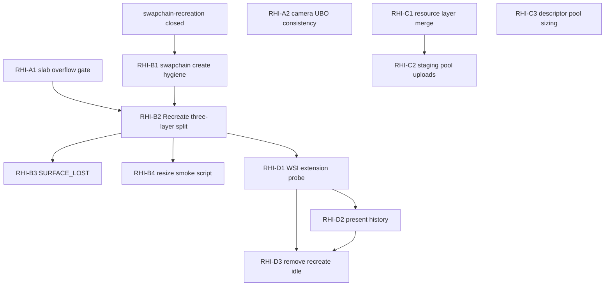

# Epic Plan: vulkan-rhi-hardening

**Status:** Planned  
**Scope:** VulkanDesktop / `RenderCore` low-level RHI — WSI, sync, upload, descriptors, resize  
**Related:** [`Active-Plan.md`](Active-Plan.md) · [`Wishlist.md`](Wishlist.md) · [`Archived/plans/swapchain-recreation_Plan.md`](Archived/plans/swapchain-recreation_Plan.md) (closed 2026-06-08)

## Naming

- **Epic ID:** `RHI-*` task codes below (e.g. `RHI-A1`).
- **Vibe kickoff:** one track at a time → `Docs/{track-name}_Plan.md` + `_Progress.md` (e.g. `rhi-slab-overflow_Plan.md`). This epic stays the **design reference**; do not duplicate full steps in Active-Plan.

## Executive summary

Audit (2026-06-08) vs [Khronos swapchain_recreation sample](https://docs.vulkan.org/samples/latest/samples/api/swapchain_recreation/README.html), [Vulkan Tutorial — Swap chain recreation](https://vulkan-tutorial.com/Drawing_a_triangle/Swap_chain_recreation), and [Vulkan Guide — Synchronization](https://vulkan.lunarg.com/doc/view/latest/linux/guide/latest/chapters/synchronization.html):

| Maturity | Assessment |
|----------|------------|
| **Correctness (desktop)** | B+ — frames-in-flight, descriptor policy, `Vk_FrameResult` solid |
| **WSI** | B — acquire-retry + `oldSwapchain` done; still `vkDeviceWaitIdle` on recreate |
| **Upload / memory** | C+ — VMA OK; per-upload `vkQueueWaitIdle` |
| **Production WSI** | C — no present history / `VK_EXT_swapchain_maintenance1` |

**Closed prerequisite:** [swapchain-recreation](Archived/plans/swapchain-recreation_Plan.md) (Khronos L2 acquire-retry).

## Non-goals (epic-wide)

- Replacing forward renderer or lighting epics.
- Full dynamic rendering migration in one PR (spike only in E3).
- `EngineArchitecture.md` policy edits unless frame-error or descriptor **policy narrative** changes (`docs-roadmap-arch-sync.mdc`).
- Linux / cross-platform windowing (see Wishlist backlog).

## Dependency graph



## References (bookmark for cold start)

| Topic | Link |
|-------|------|
| Swapchain recreation (Khronos best practice) | https://docs.vulkan.org/samples/latest/samples/api/swapchain_recreation/README.html |
| Swapchain recreation (tutorial) | https://vulkan-tutorial.com/Drawing_a_triangle/Swap_chain_recreation |
| Frames in flight | https://vulkan.lunarg.com/doc/view/latest/linux/guide/latest/chapters/synchronization.html |
| Descriptors | https://vulkan.lunarg.com/doc/view/latest/linux/guide/latest/chapters/descriptors.html |
| VMA | https://gpuopen-librariesandsdks.github.io/VulkanMemoryAllocator/html/index.html |
| `VK_EXT_swapchain_maintenance1` | https://registry.khronos.org/vulkan/specs/latest/man/html/VK_EXT_swapchain_maintenance1.html |
| LunarG cube (SURFACE_LOST) | `lib/VulkanSDK/*/Demos/cube.cpp` `resize()` / `create_surface()` |

---

## Track A — Correctness fixes *(Active-Plan P1)*

**Why first:** Silent wrong rendering; small diffs; no architecture change.

### RHI-A1 — Instance slab overflow must skip GPU frame

**Problem:** `Vk_FrameDrawPrep::Build()` returns `false` on slab overflow and logs *"Skipping RecordScenePass"*, but `Vk_Core::PrepareFrameCpu()` **ignores** the return value and sets `aOut.myOk = true`. GPU still records with stale/wrong dynamic offsets.

**Touch:**

- `VulkanDesktop/RenderCore/Vk_Core.cpp` — `PrepareFrameCpu`
- `VulkanDesktop/RenderCore/Vk_FrameDrawPrep.cpp` — `Build` (verify only)
- Optional: `VulkanDesktop/GfxTests/` or extend smoke if overflow injectable

**Steps:**

1. In the per-view loop in `PrepareFrameCpu`, capture `bool slabOk = mySceneGpuCtx.myDrawPrep.Build(prepParams)`.
2. If any view returns `false`, set `aOut.myOk = false` and `return false` **after** acquire (fence already waited — same contract as acquire failure: no `vkResetFences`).
3. Do **not** advance frame index (unchanged — only `DrawFrameGpu` advances).
4. Log once per session: `[RESOURCE] PrepareFrameCpu aborted: instance slab overflow`.

**Acceptance:**

| ID | Criterion |
|----|-----------|
| A1-V1 | `Verify-CI.ps1` exit 0 |
| A1-V2 | Code: `PrepareFrameCpu` checks `Build()` return |
| A1-V3 | Manual/dev: force overflow (lower `kMaxInstanceSlabEntries` temporarily) → no `vkCmdDraw*` that frame; no crash |

**Refs:** `Vk_DescriptorPolicy.h` (`kMaxInstanceSlabEntries`); locked per-draw policy in `EngineArchitecture.md` §6.

---

### RHI-A2 — Multi-view camera UBO: stop overwriting view 0 in `Update`

**Problem:** `PrepareFrameCpu` calls `Vk_FrameUniformUploader::UpdateForView` per view. `DrawFrameGpu` then calls `Vk_FrameUniformUploader::Update`, which **re-writes view 0** from `aCore.myCamera` (fly camera), potentially diverging from `aViews[0].myCamera` used during prep.

**Touch:**

- `VulkanDesktop/RenderCore/Vk_FrameUniformUploader.cpp`
- `VulkanDesktop/RenderCore/Vk_Core.cpp` — `DrawFrameGpu`

**Steps:**

1. Split responsibilities:
   - **Camera views:** only `UpdateForView` in `PrepareFrameCpu` (all views).
   - **Environment:** `UpdateEnvironment` (new) or `Update` renamed to upload **only** `GpuEnvironmentData` slice for `myCurrentFrame`.
2. Remove `UpdateForView(..., 0, myCamera)` from `Update`.
3. `env.myViewWorldPos` still uses `myCamera.myEye` (document: env uses primary fly camera eye).

**Acceptance:**

| ID | Criterion |
|----|-----------|
| A2-V1 | `Verify-CI.ps1` + `Verify-Smoke.ps1` exit 0 |
| A2-V2 | Multi-view demo (`Data/Scenes/demo.json` PiP): view 0 stable when fly camera ≠ scene overview camera |

**Refs:** [`Archived/plans/multi-view_Plan.md`](Archived/plans/multi-view_Plan.md).

---

## Track B — WSI & resize *(Active-Plan P1–P2)*

**Prerequisite:** [swapchain-recreation](Archived/plans/swapchain-recreation_Plan.md) merged.

### RHI-B1 — Swapchain create hygiene

**Problem:** Suboptimal create defaults vs Khronos `init_swapchain()`: hardcoded `compositeAlpha`, `minImageCount+1` only, no extent precheck before full rebuild.

**Touch:**

- `VulkanDesktop/RenderCore/Vk_Core.cpp` — `ChooseSwapPresentMode` (unchanged unless vsync toggle)
- `VulkanDesktop/RenderCore/Vk_SwapchainHost.cpp` — `CreateSwapChain`
- `VulkanDesktop/RenderCore/Vk_SwapchainHost.cpp` — new `NeedsSwapchainRebuild()` helper

**Steps:**

1. **compositeAlpha:** pick first supported in order: `OPAQUE` → `INHERIT` → `PRE_MULTIPLIED` → `POST_MULTIPLIED` (Khronos sample order).
2. **Image count:** `desired = max(capabilities.minImageCount, 3u)` clamped to `maxImageCount`.
3. **Precheck:** before `Recreate()` body does heavy work, query `vkGetPhysicalDeviceSurfaceCapabilitiesKHR`; if extent unchanged and only SUBOPTIMAL from present (not OUT_OF_DATE / resize flag), optionally skip **pipeline** rebuild (feeds B2; minimal B1 can log and still recreate).
4. Document invariant: `MAX_FRAMES_IN_FLIGHT (2) <= swapchainImageCount` in `Vk_SwapchainHost.h` comment.

**Acceptance:**

| ID | Criterion |
|----|-----------|
| B1-V1 | Log at create: `imageCount=`, `compositeAlpha=` |
| B1-V2 | Resize smoke manual 10s — no `vkCreateSwapchainKHR` failure on Windows |
| B1-V3 | G0 + G0-smoke green |

**Refs:** Khronos `init_swapchain()` in [sample source](https://github.com/KhronosGroup/Vulkan-Samples/blob/main/samples/api/swapchain_recreation/swapchain_recreation.cpp).

---

### RHI-B2 — `Recreate()` three-layer split

**Problem:** Every resize calls `vkDeviceWaitIdle` and rebuilds render pass, MSAA targets, depth, **all scene pipelines**, ImGui WSI — far heavier than Khronos sample (swapchain + per-image FB only).

**Touch:**

- `VulkanDesktop/RenderCore/Vk_SwapchainHost.{h,cpp}`
- `VulkanDesktop/Util/Util_ImGuiLayer.cpp`
- `VulkanDesktop/RenderCore/Vk_GfxPipelineCache.cpp`
- `VulkanDesktop/RenderCore/Vk_Core.cpp` — `RefreshMaterialPipelinesAfterSwapchainRecreate`

**Target API (static methods on `Vk_SwapchainHost`):**

```cpp
static void RecreateWsiOnly( Vk_Core& aCore, VkSwapchainKHR aSuperseded );
static void RebuildExtentDependentResources( Vk_Core& aCore );  // depth, MSAA color, framebuffers
static void RebuildScenePipelinesIfNeeded( Vk_Core& aCore );    // viewport/extent change
static void Recreate( Vk_Core& aCore );  // orchestrator calling above
```

**Steps:**

1. **RecreateWsiOnly:** minimize wait; `oldSwapchain`; image views; keep deletion-queue `popFront` pattern from swapchain-recreation.
2. **RebuildExtentDependent:** depth + MSAA color + framebuffers; **reuse render pass** if format/MSAA/sample count unchanged.
3. **RebuildScenePipelinesIfNeeded:** only when `Vk_PipelineBuilder` viewport/extent or render pass handle changes; call `Vk_GfxPipelineCache::InitScenePipelines` + `RefreshMaterialPipelinesAfterSwapchainRecreate`.
4. ImGui: `CreateSwapchainResources` only in WSI layer; avoid full `Destroy` of ImGui device objects if extent-only change (stretch goal — OK to partial in v1).
5. Keep `vkDeviceWaitIdle` in v1 orchestrator if unsure; measure stall in Progress; remove in D3.

**Acceptance:**

| ID | Criterion |
|----|-----------|
| B2-V1 | Resize 10s: log shows which layers ran (`[SWAPCHAIN] rebuild layer=wsi|extent|pipeline`) |
| B2-V2 | G0 + G0-smoke green |
| B2-V3 | No regression: fence late-reset contract unchanged |

**Refs:** Tutorial [recreateSwapChain cleanup scope](https://vulkan-tutorial.com/Drawing_a_triangle/Swap_chain_recreation); Khronos deferred `swapchain_garbage`.

---

### RHI-B3 — `VK_ERROR_SURFACE_LOST_KHR` recovery

**Problem:** Not handled; falls through `ClassifyQueueResult` as generic skip.

**Touch:**

- `VulkanDesktop/RenderCore/Vk_SwapchainHost.cpp` — acquire/present paths
- `VulkanDesktop/RenderCore/Vk_Core.cpp` — `CreateSurface`, `Clear`

**Steps:**

1. On `VK_ERROR_SURFACE_LOST_KHR` from acquire or present:
   - `vkDestroySurfaceKHR`
   - `glfwCreateWindowSurface` (or `Vk_PlatformFrame` helper)
   - `Recreate(aCore)` (full)
2. Mirror LunarG `cube.cpp` pattern (destroy surface → recreate surface → resize).
3. Return `SkipFrame` for that frame; do not throw.

**Acceptance:**

| ID | Criterion |
|----|-----------|
| B3-V1 | Code review: both acquire and present branches handle SURFACE_LOST |
| B3-V2 | G0 green (no automated test — document manual: lock/sleep display on Windows optional) |

---

### RHI-B4 — `Scripts/Verify-ResizeSmoke.ps1` (optional automation)

**Problem:** `config-platform-hardening` deferred resize CI; manual soak only.

**Touch:**

- `Scripts/Verify-ResizeSmoke.ps1` (new)
- `Docs/CLI.md` — one paragraph
- `.github/workflows/vulkan-desktop.yml` — soft optional job

**Steps:**

1. Launch `VulkanDesktop.exe --asset-root <repo> --no-validation --scene Data/Scenes/demo.json` with fixed duration.
2. Script sends Win32 resize messages or documents **manual** gate for CI skip.
3. `Assert-SmokeLog.ps1` extended or second assert: `[SWAPCHAIN]` recreate line present; exit 0; no `[ERROR]`.

**Acceptance:** Script exists; documented in epic closeout or README; CI soft-fail OK.

**Note:** If automation infeasible, keep manual steps from swapchain-recreation Plan P3-V1.

---

## Track C — Upload & resource layer *(Active-Plan P2)*

### RHI-C1 — Consolidate `Vk_ResourceContext` and `Vk_Core` resource helpers

**Problem:** Duplicate `CreateBuffer`, `CreateImage`, `TransitionImageLayout`, `Begin/EndSingleTimeCommands` in `Vk_Core.cpp` and `Vk_ResourceContext.cpp` — drift risk (already diverged on queue sharing).

**Touch:**

- `VulkanDesktop/RenderCore/Vk_ResourceContext.{h,cpp}`
- `VulkanDesktop/RenderCore/Vk_Core.cpp` — delegate or delete duplicates
- `VulkanDesktop/Util/Util_Loader.cpp`
- `VulkanDesktop/RenderCore/Vk_Types.cpp` — `Gfx_Mesh::BuildBuffers`

**Steps:**

1. **Single owner:** `Vk_ResourceContext` holds all upload/barrier/alloc helpers.
2. `Vk_Core` exposes `GetResourceContext()` or thin forwards used by swapchain depth/color only.
3. Delete duplicated methods from `Vk_Core` after call sites migrated.
4. Grep gate: one implementation of `EndSingleTimeCommands`.

**Acceptance:** `Verify-CI.ps1` exit 0; scene load + smoke unchanged.

---

### RHI-C2 — Staging pool + batched uploads (remove per-asset `vkQueueWaitIdle`)

**Problem:**

```cpp
// Vk_Core::EndSingleTimeCommands / Vk_ResourceContext equivalent
vkQueueSubmit(..., VK_NULL_HANDLE);
vkQueueWaitIdle(aQueue);
```

Every texture and mesh upload blocks the queue ([Vulkan Guide — staging](https://vulkan.lunarg.com/doc/view/latest/linux/guide/latest/chapters/staging.html) recommends pipelining).

**Touch:**

- `VulkanDesktop/RenderCore/Vk_ResourceContext.{h,cpp}` — new `Vk_StagingAllocator` or ring in context
- `VulkanDesktop/Util/Util_Loader.cpp`
- `VulkanDesktop/RenderCore/Vk_ResourceTables.cpp` — batch flush at end of `LoadFromManifest`

**Steps:**

1. Persistent staging buffer pool (e.g. 64MB ring) or per-load slab allocator.
2. `LoadFromManifest`: record all copies into one command buffer (or few), one fence wait at end.
3. Transfer queue when `graphicsFamily != transferFamily`; use ownership barriers if needed ([VMA transfer guide](https://gpuopen-librariesandsdks.github.io/VulkanMemoryAllocator/html usage.html)).
4. Log: `LoadSceneResources upload waitMs=`.

**Acceptance:**

| ID | Criterion |
|----|-----------|
| C2-V1 | Load demo scene: single queue idle (or transfer+graphics fence pair) at end of manifest, not per texture |
| C2-V2 | Smoke + scene reload (`TryProcessSceneReload`) still works |

---

### RHI-C3 — Descriptor pool sizing from scene manifest

**Problem:** Hard-coded `maxSets` and descriptor counts in `Vk_DescriptorSystem::CreateDescriptorPool` — large scenes may fail allocate.

**Touch:**

- `VulkanDesktop/RenderCore/Vk_DescriptorSystem.cpp`
- `VulkanDesktop/Gfx/Gfx_ResourceManifest.h` — material/texture counts

**Steps:**

1. Compute pool sizes from manifest: `materialCount`, `textureCount`, `kGfxMaxRenderViews`, bindless path constants.
2. Add 20% headroom; log computed sizes at scene load.
3. Fail scene load with clear error if counts exceed policy max (don't crash at first draw).

**Acceptance:** Load `demo.json` + synthetic manifest stress test (GfxTests or dev-only) — pool create succeeds.

**Refs:** [Descriptor pool best practices](https://vulkan.lunarg.com/doc/view/latest/linux/guide/latest/chapters/descriptors.html#pools).

---

## Track D — Khronos production WSI *(Wishlist S7 infra)*

**Gate:** B2 complete; prefer **G1** or S7 promotion (resize-heavy FG work).

### RHI-D1 — `Vk_ProbeWsiCaps` + enable `VK_EXT_swapchain_maintenance1`

**Pattern:** Copy `Vk_Bindless.cpp` probe style (`ExtensionAvailable`, `AppendExtensionIfMissing`, Features2 chain).

**Touch:**

- New `VulkanDesktop/RenderCore/Vk_WsiCaps.{h,cpp}`
- `VulkanDesktop/VulkanDesktop.cpp` or `Vk_RenderDevice.cpp` — append device extensions
- `VulkanDesktop/RenderCore/Vk_DeviceContext.h` — `Vk_WsiCaps myWsiCaps`

**Steps:**

1. Probe `VK_EXT_swapchain_maintenance1` + required dependencies.
2. Enable `VkDeviceSwapchainMaintenanceFeaturesEXT` in `CreateLogicalDevice` when present.
3. Log: `swapchainMaintenance1=yes|no`.
4. Dual code paths in swapchain host (D2/D3).

**Refs:** [Khronos sample — has_maintenance1 branches](https://github.com/KhronosGroup/Vulkan-Samples/blob/main/samples/api/swapchain_recreation/swapchain_recreation.cpp).

---

### RHI-D2 — Present history + deferred old-swapchain destroy (fallback path)

**When:** `!has_maintenance1`.

**Touch:**

- `VulkanDesktop/RenderCore/Vk_SwapchainHost.cpp` — new `Vk_PresentHistory` struct (deque)
- Per Khronos: `associate_fence_with_present_history`, `cleanup_present_history`, `schedule_old_swapchain_for_destruction`

**Steps:**

1. Acquire with optional fence (no maintenance): link fence to last present on same image index.
2. Present history entries: `present_semaphore`, `cleanup_fence`, `image_index`, `old_swapchains[]`.
3. Recycle semaphores only when `vkGetFenceStatus` signals cleanup fence.
4. Fence/semaphore pools (fixed arrays, no heap in hot path).

**Acceptance:** Rapid resize 30s — no validation errors (layers on); memory stable (no runaway swapchain count).

**Refs:** [Sample README — deferred destruction](https://docs.vulkan.org/samples/latest/samples/api/swapchain_recreation/README.html).

---

### RHI-D3 — Remove `vkDeviceWaitIdle` from hot recreate path

**Depends:** D1 or D2 complete.

**Steps:**

1. Maintenance path: `VkSwapchainPresentFenceInfoEXT` on present; destroy old swapchain when fence signals.
2. Remove idle from `RecreateWsiOnly`; keep idle only on shutdown/scene unload.
3. Benchmark: resize drag FPS vs B2 baseline (Progress notes).

---

## Track E — Long-term RHI *(Wishlist backlog)*

| ID | Task | Notes |
|----|------|-------|
| **RHI-E1** | Bump `apiVersion` to 1.2 in `CreateInstance` | Reduces extension name noise; aligns with descriptor indexing |
| **RHI-E2** | Timeline semaphores for frame graph | *Deps: S7 FG* |
| **RHI-E3** | Dynamic rendering spike (`VK_KHR_dynamic_rendering`) | Reduce render-pass coupling on resize; evaluate vs B2 |
| **RHI-E4** | `Vk_Core` de-singleton / injectable `Vk_RenderDevice` | Headless tests, multi-config CI |
| **RHI-E5** | MSAA: enable dynamic sample count or delete dead MSAA branches | `PickPhysicalDevice` pins `1_BIT` today |

---

## Cross-refs to existing Active-Plan items

| Existing | Epic overlap |
|----------|----------------|
| P2 render-m2-prep § C — RenderDoc tags no `std::string` in record | Same hot-path rule; implement with RHI-A or render-m2-prep (fixed buffer tags) |
| P2 § B `myIndexCount` | Independent |
| Hardening #11 per-draw string | `Vk_ScenePasses.cpp` `drawTag` — include in vibe task for A or render-m2-prep |

---

## Verification defaults (all tracks)

From repo root:

```powershell
powershell -File Scripts/Verify-CI.ps1
powershell -File Scripts/Verify-Smoke.ps1
```

Manual resize (when WSI touched):

```powershell
.\x64\Debug\VulkanDesktop.exe --asset-root (Get-Location) --no-validation --scene Data/Scenes/demo.json
```

---

## Task index (quick lookup)

| ID | Title | Active-Plan | Wishlist |
|----|-------|-------------|----------|
| RHI-A1 | Slab overflow GPU gate | P1 | — |
| RHI-A2 | Camera UBO multi-view fix | P1 | — |
| RHI-B1 | Swapchain create hygiene | P1 | — |
| RHI-B2 | Recreate three-layer split | P2 | — |
| RHI-B3 | SURFACE_LOST recovery | P2 | — |
| RHI-B4 | Resize smoke script | P2 | S3 hygiene optional |
| RHI-C1 | Resource layer merge | P2 | — |
| RHI-C2 | Staging pool uploads | P2 | — |
| RHI-C3 | Descriptor pool sizing | P2 | — |
| RHI-D1 | WSI extension probe | — | S7 infra |
| RHI-D2 | Present history | — | S7 infra |
| RHI-D3 | Remove recreate idle | — | S7 infra |
| RHI-E1–E5 | Long-term | — | Backlog |

---

## Suggested vibe kickoff order

1. `rhi-slab-overflow` (A1) — 1 PR  
2. `rhi-camera-ubo` (A2) — 1 PR  
3. `rhi-swapchain-hygiene` (B1) — 1 PR  
4. `rhi-recreate-split` (B2) — 1–2 PRs  
5. Parallel P2: C1 then C2  

Track D only after B2 + S7 gate or explicit promotion from Wishlist.
